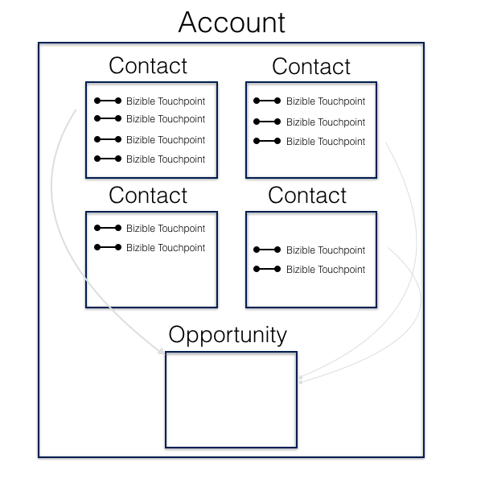
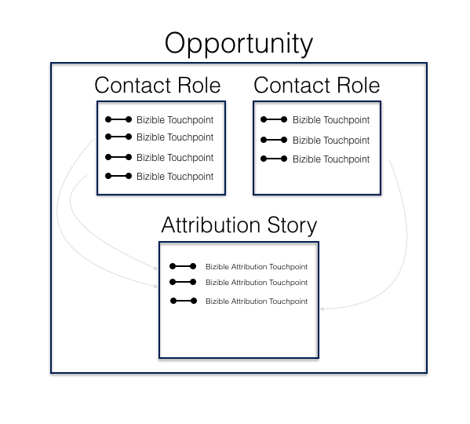
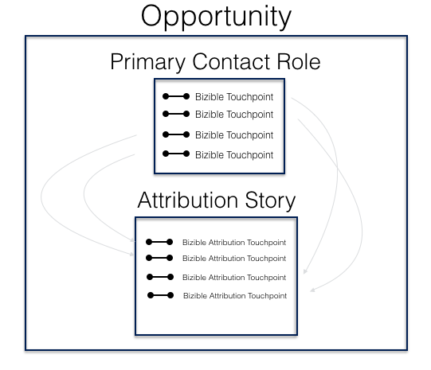

# アトリビューションマッピング手法 {#attribution-mapping-methodology}

アトリビューションマッピング手法とは、CRM内の特定のオブジェクト（コンタクト、機会、アカウント）を検索し、関連する機会にアトリビューションのタッチポイントを作成するプロセスです。 つまり、[!DNL Marketo Measure]の方法で、現在のCRMのプロセスにもとづいて、アトリビューションモデルにどのタッチポイントを含めるかを決定します。

## アカウント ID マッピング {#account-id-mapping}

[!DNL Marketo Measure]はアカウント ID マッピングを提供します。 これは、[!DNL Marketo Measure]がアカウントとその取引先責任者のマーケティング情報を参照して、商談に関連付けられたアトリビューション タッチポイントを作成することを意味します。 ここでは、そのプロセスを簡潔に解説します。

連絡先の&#x200B;**すべての** タッチポイントがアトリビューション タッチポイントとして商談にプッシュされるわけではありません。 商談のタイムライン（最初のタッチ日 – 成約日）は、タッチポイントが商談のインフルエンサーとしてカウントされるかどうかを決定します。 したがって、商談がクローズされた後に連絡先Aのタッチポイントが発生した場合、[!DNL Marketo Measure]はそのタッチポイントを商談にプッシュしません。 このタイムライン手順は、他のすべてのアトリビューションオブジェクトマッピングで実行されます。

長所：この帰属方法は、ほとんどの企業に非常に効果的です。 マーケティング部門は、あらゆるコンタクトを特定の商談に関連付けるために営業部門に頼る必要はありません（多くの場合、これは問題となります）。 また、営業部門が連絡先の役割を関連付けている場合でも、その他の多くの連絡先とのマーケティング資料のやり取りを見落とす可能性があります。 最後に、この方法は、特定のインフルエンサーではなく、アカウントの全体像に影響を与えようとするABM戦略に役立ちます。

短所：マーケティングおよびセールスに関するSLAにおいて、誰が何に対してクレジットを獲得するのかを定義する必要がある場合、この方法には問題がある可能性があります。 さらに、アカウント階層を使用して、より大きなアカウント（例：IBM）内の特定の事業部を定義しない場合、ある事業部に特化したマーケティング活動が他の事業部に広がる可能性があります。

## 商談コンタクトの役割のマッピング {#opportunity-contact-role-mapping}

>[!NOTE]
>
>連絡先ロールのマッピング方法は、SalesforceをCRMとして使用している場合にのみ使用できます。 Microsoft Dynamics ユーザーは、CRM内に取引先責任者ロール オブジェクトがないため、使用できません。

ほとんどのクライアントはアカウント ID マッピングを使用していますが、[!DNL Marketo Measure]は商談内の連絡先の役割（商談に関連付けられた連絡先）を参照して、アトリビューションプロセスを分類できます。 つまり、[!DNL Marketo Measure]は、商談の取引先責任者の役割に関連付けられているマーケティングのインタラクションのみを購入者アトリビューションのタッチポイントとしてプッシュします。 以下は、そのプロセスの一例です。

長所：チームの担当者割り当てプロセスが明確に定義されている場合、このタイプのアトリビューションマッピングが最適かもしれません。 アトリビューションの分断を包括的に把握できるため、営業部門とマーケティング部門の連携をさらに強化することができます。 このプロセスは、組織が大企業の複数の事業部門をターゲットにしている場合や、異なる製品を同時に販売する場合にも役立ちます。

短所：しかし、コンタクトの役割プロセスが実施されていないと、マーケティング部門は多くのマーケティングデータを失い、商談に影響を与えているマーケティング活動に対する貢献度が大幅に低くなります。

## 商談プライマリの連絡先の役割のマッピング {#opportunity-primary-contact-role-mapping}

[!DNL Marketo Measure]は、商談の取引先責任者を単に見るだけでなく、商談のプライマリ取引先責任者のみを見ることに集中できます。 この設定を念頭に置いて、[!DNL Marketo Measure]は、商談の主要な連絡先に関連付けられたマーケティングのタッチポイントのみを取得し、その情報をその特定の商談のアトリビューションストーリーにプッシュします。 以下の画像を参照してください。

長所：チームが、商談で「メイン」に設定されたコンタクトに対するマーケティングの影響のみを把握したい場合、このタイプのマッピングはチームに最も適しています。

短所：これは確かに最も利用されていないマッピングプロセスであり、オポチュニティの他のコンタクトに針を動かすマーケティングの影響を大きく損なう可能性があります。
