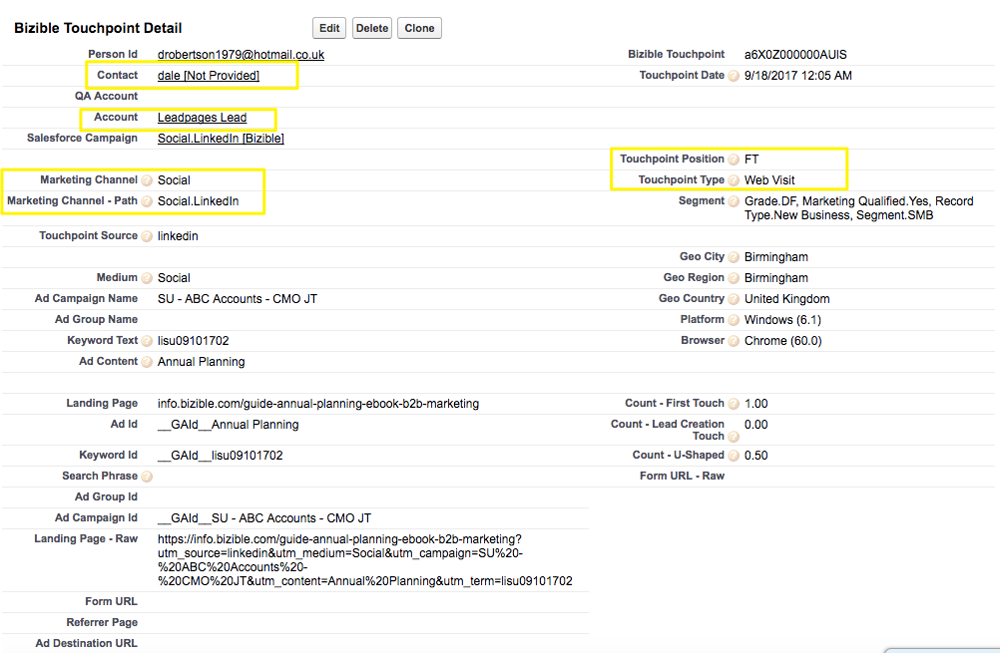

# 購入者タッチポイントと購入者属性タッチポイントの違い {#difference-between-buyer-touchpoints-and-buyer-attribution-touchpoints}

バイヤータッチポイント (BT) とバイヤー属性タッチポイント (BAT) の定義、2 つの違い、およびよくある質問に答える方法について説明します。

購入者タッチポイントと購入者アトリビューションタッチポイントを区別する鍵は、タッチポイントとの関係です [!DNL Salesforce] オブジェクト。 BT は、Opportunity オブジェクトではなく、リード、連絡先、事例の各オブジェクトに関連しています。 つまり、購入者タッチポイントに関連する売上高は決してありません。

Buyer Attribution タッチポイントオブジェクトは連絡先、アカウント、商談の各オブジェクトに関連していますが、リードオブジェクトには関連していません。 つまり、リードに結び付けられた購入者属性タッチポイントは存在しません。 BAT オブジェクトを使用すると、特定のマーケティングインタラクションに結び付けられた売上高を確認できます。

BT と BAT の違い：

<table> 
 <colgroup> 
  <col> 
  <col> 
 </colgroup> 
 <tbody> 
  <tr> 
   <td>購入者タッチポイント (BT)</td> 
   <td>購入者の属性タッチポイント (BAT)</td> 
  </tr> 
  <tr> 
   <td> 
    <ul> 
     <li>リード、連絡先、および事例の各オブジェクトに関連します</li> 
     <li>オポチュニティオブジェクトに関連していません</li> 
     <li>売上高は購入者タッチポイントに関連付けられていません</li> 
    </ul></td> 
   <td> 
    <ul> 
     <li>連絡先、アカウント、商談の各オブジェクトに関連します</li> 
     <li>リードオブジェクトに関連していません</li> 
     <li>購入者の属性タッチポイントは商談に関連付けられているので、すべての BAT には売上高が関連付けられています</li> 
    </ul></td> 
  </tr> 
 </tbody> 
</table>

## よくある質問 {#faq}

**購入者のタッチポイントが購入者の属性のタッチポイントになるのはいつですか？**

BT は、この BT が Opportunity を関連付けた連絡先に関連付けられると、BAT になります。 重要な点の 1 つは、1 つの特定のマーケティングインタラクションが BT と BAT になることです。

**購入者タッチポイントに商談作成 (OC) のタッチポイントポジションを設定できますか。**

購入者タッチポイントには、ファーストタッチ (FT)、リード作成 (LC) またはフォーム送信（中間タッチポイント）のタッチポイントのみが割り当てられます。 BT は商談と関係がないので、BT が商談の作成またはクローズのタッチポイントポジションを持つことはできません。

**購入者のタッチポイントデータはどのように利用されますか？**

通常、顧客は購入者タッチポイントデータを活用して、ファネルの上位やファネルエンゲージメントの中間を把握します。 意味 [!DNL Marketo Measure] ユーザーは、誰がフォームを送信し、誰がサイトを閲覧し、どのブログ投稿のパフォーマンスが高いか、どの AdWords 広告がコンバージョンに導いているかなどを把握します。 購入者タッチポイントデータは、リードと連絡先のエンゲージメントを把握するのに最適です。

**Salesforce での購入者タッチポイントはどのように表示されますか？**

BT のスクリーンショットを次に示します。 [!DNL Salesforce]:

**Salesforce での購入者属性タッチポイントはどのように表示されますか？**

次に、の BAT のスクリーンショットを示します。 [!DNL Salesforce]:

