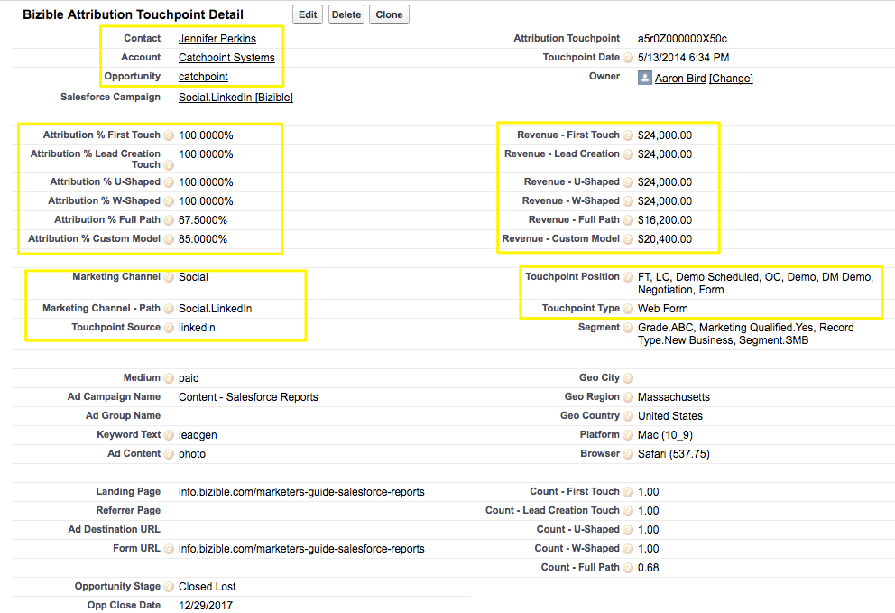

# Buyer Touchpoints と Buyer Attribution Touchpoints の違い {#difference-between-buyer-touchpoints-and-buyer-attribution-touchpoints}

Buyer Touchpoint（BT）と Buyer Attribution Touchpoint（BAT）の定義、両者の違い、よくある質問について説明します。

Buyer Touchpoints と Buyer Attribution Touchpoints を区別する主なものは、[!DNL Salesforce] オブジェクトとの関係です。BT は、リード、連絡先および事例オブジェクトに関連しますが、商談オブジェクトには関連しません。つまり、Buyer Touchpoints に関連付けられた収益はありません。

Buyer Attribution Touchpoint オブジェクトは、取引先責任者、アカウント、商談の各オブジェクトに関連していますが、リードオブジェクトには関連していません。Buyer Attribution Touchpoints はリードに関連付けられていません。BAT オブジェクトは、特定のマーケティングインタラクションに関連付けられた収益を確認する場所です。

BT と BAT の違い：

<table> 
 <colgroup> 
  <col> 
  <col> 
 </colgroup> 
 <tbody> 
  <tr> 
   <td>Buyer Touchpoint（BT）</td> 
   <td>Buyer Attribution Touchpoint（BAT）</td> 
  </tr> 
  <tr> 
   <td> 
    <ul> 
     <li>リード、連絡先、事例オブジェクトに関連する</li> 
     <li>商談オブジェクトに関連しない</li> 
     <li>収益は Buyer Touchpoint には関連付けられない</li> 
    </ul></td> 
   <td> 
    <ul> 
     <li>連絡先、アカウント、商談オブジェクトに関連する</li> 
     <li>リードオブジェクトに関連しない</li> 
     <li>Buyer Attribution Touchpoint は、商談に関連付けられているので、すべての BAT には、それらに関連付けられた収益がある</li> 
    </ul></td> 
  </tr> 
 </tbody> 
</table>

## よくある質問 {#faq}

**Buyer Touchpoint は、いつ Buyer Attribution Touchpoint になりますか？**

BT は、関連した商談を含む連絡先にこの BT が関連付けられると、BAT になります。ひとつ理解しておくべき重要なことは、1 つの特定のマーケティングインタラクションは、BT にも BAT にもなり得るということです。

**Buyer Touchpoint は、Touchpoint の位置として商談作成（OC）を取ることはできますか？**

Buyer Touchpoint は、Touchpoint の位置として、ファーストタッチ（FT）、リード作成（LC）またはフォーム申請（中間のタッチポイント）のいずれかのみを取ることができます。BT は、商談に関連しないので、BT が Touchpoint の位置として商談作成やクローズを取ることはできません。

**Buyer Touchpoint データはどのように使用されますか？**

通常、お客様は、ファネルの上部およびファネルの中央のエンゲージメントを把握するために、Buyer Touchpoint データを使用します。つまり、[!DNL Marketo Measure] ユーザは、誰がフォームを送信しているか、誰がサイトを閲覧しているか、どのブログ投稿のパフォーマンスが高いか、どの AdWords 広告がリードのコンバージョンを推進しているかなどを把握します。Buyer Touchpoint データは、リードおよび連絡先のエンゲージメントを把握するのに最適です。

**Buyer Touchpoint は、Salesforce ではどのように見えますか？**

以下に、[!DNL Salesforce] での BT のスクリーンショットを示します。

{width="600" zoomable="yes"}

**Buyer Attribution Touchpoint は、Salesforce ではどのように見えますか？**

以下に、[!DNL Salesforce] での BAT のスクリーンショットを示します。

{width="600" zoomable="yes"}
