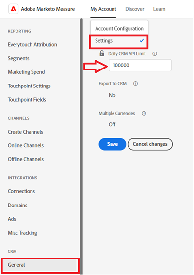

# エラー通知 {#error-notifications}

以下は、アプリ内通知またはメールで受信する可能性のあるエラーのリストです。 これらのいずれかが発生した場合は、対応するトラブルシューティング手順に従ってください。 このトラブルシューティング手順で問題が解決しない場合は、[Marketo サポート](https://nation.marketo.com/t5/support/ct-p/Support)にお問い合わせください。

通知メッセージ全体を [!DNL Marketo Measure] で表示するには、「通知」タブの下部にある **すべて表示** をクリックします。

<table>
  <tbody>
    <tr>
      <th style="width:31%">エラーコード</th>
      <th style="width:23%">通知の例</th>
      <th style="width:23%">説明</th>
      <th style="width:23%">トラブルシューティング手順</th>
    </tr>
    <tr>
      <td>API_DISABLED</td>
      <td>CRM の読み込み中に発生したエラー：API_DISABLED：このユーザの API 呼び出しが無効になっています</td>
      <td>Marketo Measure ユーザの API 権限が無効になっています。</td>
      <td>Salesforce ドキュメントの <a href="https://help.salesforce.com/s/articleView?language=en_US&id=sf.branded_apps_commun_api_permset.htm&type=5">API アクセスを有効にする方法</a>を参照してください。</td>
    </tr>
    <tr>
      <td>API_LIMIT_EXCEEDED</td>
      <td>CRM の書き出し中に発生したエラー：PI_LIMIT_EXCEEDED</td>
      <td>CRM の API 制限（24 時間）を超えました。</td>
      <td>API クレジット割り当ての調整については、CRM に関する次のドキュメントを参照してください。

          <ul>
            <li><a href="https://learn.microsoft.com/ja-jp/dynamics365/fin-ops-core/dev-itpro/data-entities/service-protection-monitoring">Dynamics</a>
            </li>
            <li><a href="https://developer.salesforce.com/docs/atlas.en-us.salesforce_app_limits_cheatsheet.meta/salesforce_app_limits_cheatsheet/salesforce_app_limits_platform_api.htm">Salesforce</a>
            </li>
          </ul>
          
また、次の手順に従って、Marketo Measure で使用する CRM クレジットを調整できます。

          <ul>
            <li><b>設定</b>／<b>CRM</b>／<b>一般</b>に移動します。</li>
            <li>1 日の CRM API 制限を更新します 
              <ul>
                <li><b>メモ：デフォルトは 100,000 です。</b></li>
              </ul>
            </li>
          </ul>
          

           
          

      </td>
    </tr>
    <tr>
      <td>CANNOT_EXECUTE_FLOW_SYSTEMトリガー</td>
      <td>Crm のエクスポート中にエラーが発生しました：CANNOT_EXECUTE_FLOW_ENTITY : トリガータイプ「連絡先」 Salesforce管理者に次の詳細を伝えてください。
制限を超えています
ユーザーまたは組織が、この機能の上限を超えています。 エラー ID : 123456</td>
      <td>Salesforce組織で設定されたトリガーフロールールを満たしていないため、レコードを保存できません。</td>
      <td>通知メッセージの詳細を確認し、Salesforce組織のフロートリガーを確認します。
フロートリガーに関するSalesforceのドキュメント <a href="https://admin.salesforce.com/blog/2023/what-is-a-record-triggered-flow#:~:text=A%20record%2Dtriggered%20flow%20allows,is%20created%20and%2For%20updated"> こちらを参照 </a>。
      </td>
    </tr>
    <tr>
      <td>CANNOT_INSERT_UPDATE_ACTIVATE_ENTITY</td>
      <td>Crm エクスポート中にエラーが発生しました：CANNOT_INSERT_UPDATE_ACTIVATE_ENTITY : エンティティタイプ「Lead」 : CRM エラーコード : CANNOT_INSERT_UPDATE_ACTIVATE_ENTITY、CRM エラーメッセージ : System.LimitException : Apex CPUの制限時間を超えました。RecordId : 0123456
      

      Crm エクスポート中にエラーが発生しました：CANNOT_INSERT_UPDATE_ACTIVATE_ENTITY : エンティティタイプ「アカウント」 : CRM エラーコード : CANNOT_INSERT_UPDATE_ACTIVATE_ENTITY、CRM エラーメッセージ : エンティティタイプを更新できません：アカウント、レコード ID : 0123456</td>
      <td>トリガーにより、更新またはオブジェクトを挿入できません。
      

      または
      

      オブジェクトに対する権限がありません。</td>
      <td>挿入/更新が失敗する原因となるトリガーコードを確認します。 トリガーについて詳しくは、次のSalesforce ドキュメントを参照してください。
        <ul>
          <li><a href="https://help.salesforce.com/s/articleView?id=sf.code_manage_triggers.htm&type=5"> 頂点トリガー</a>
          </li>
          <li><a href="https://admin.salesforce.com/blog/2023/what-is-a-record-triggered-flow#:~:text=A%20record%2Dtriggered%20flow%20allows,is%20created%20and%2For%20updated"> フロートリガー</a>
          </li>
        </ul>
        

        <a href="/help/configuration-and-setup/marketo-measure-and-salesforce/how-marketo-measure-and-salesforce-interact.md">Marketo Measure ユーザー </a> に必要な権限をすべて付与します。
      </td>
    </tr>
    <tr>
      <td>DUPLICATES_DETECTED</td>
      <td>Crm エクスポート中にエラーが発生しました：重複_検出済み：エンティティタイプ「連絡先」 : CRM エラーコード : DUPLICATES_DETECTED, CRM エラーメッセージ：重複するレコードを作成中です。 代わりに、既存のレコードを使用することをお勧めします。RecordId: 0123456</td>
      <td>Salesforce組織にインポートされているレコードは既に存在します。</td>
      <td><a href="https://help.salesforce.com/s/articleView?id=000390009&type=1"> 「ルールを複製」設定を無効にする </a>、重複を許可します。
          

          Marketo Measure専用ユーザーを <a href="https://trailhead.salesforce.com/content/learn/modules/validation-rules/bypass-your-validation-rules"> カスタム検証ルール </a> から除外します。</td>
    </tr>
    <tr>
      <td>DUPLICATE_VALUE</td>
      <td>Crm エクスポート中にエラーが発生しました：DUPLICATE_VALUE : エンティティタイプ「Lead」 : CRM エラーコード : DUPLICATE_VALUE、CRM エラーメッセージ：重複した値が見つかりました：Email_Unique__c 重複した値が、ID : 123、RecordId : 456 のレコードに含まれています</td>
      <td>Salesforce組織に読み込まれるフィールドの値の重複は許可されていません。</td>
      <td>Salesforceで <a href="https://help.salesforce.com/s/articleView?id=000390009&type=1"> 「一意のチェックボックス」 </a> のチェックを外します。
          

          Marketo Measure専用ユーザーを <a href="https://trailhead.salesforce.com/content/learn/modules/validation-rules/bypass-your-validation-rules"> カスタム検証ルール </a> から除外します。</td>
    </tr>
    <tr>
      <td>ENTITY_IS_LOCKED</td>
      <td>Crm エクスポート中にエラーが発生しました：ENTITY_IS_LOCKED：エンティティタイプ「Account」 : CRM エラーコード : ENTITY_IS_LOCKED、CRM エラーメッセージ：このレコードはロックされています。 編集が必要な場合は、管理者にお問い合わせください。RecordId: 0123456</td>
      <td>レコードが承認プロセスに入り、現在の承認者またはシステム管理者以外のユーザーがレコードを編集しようとする場合。</td>
      <td>
        <ul>
          <li>Salesforce組織のそのレコードに対する承認待ちプロセスを解決します。</li>
          <li>Marketo Measure専用ユーザーを <a href="https://trailhead.salesforce.com/content/learn/modules/validation-rules/bypass-your-validation-rules"> カスタム検証ルール </a> から除外します。
          </li>
        </ul>
      </td>
    </tr>
    <tr>
      <td>FIELD_FILTER_VALIDATION_EXCEPTION</td>
      <td>Crm エクスポート中にエラーが発生しました：FIELD_FILTER_VALIDATION_EXCEPTION : エンティティタイプ「リード」 : CRM エラーコード : FIELD_FILTER_VALIDATION_EXCEPTION、フィールド : User__C、CRM エラーメッセージ：値が存在しないか、フィルター条件に一致しません。 「Account Executive, Inside Sales」の役割を持つユーザーを選択してください。RecordId: 0123456</td>
      <td>変更されたレコードは、オブジェクトで定義された参照フィルターを満たさなくなりました。</td>
      <td>Marketo Measureが変更しようとしているオブジェクトのフィルターを確認します。 オブジェクトのフィルターを確認する方法については、<a href="https://help.salesforce.com/s/articleView?id=000384756&type=1"> このSalesforceの記事 </a> を参照してください。</td>
    </tr>
    <tr>
      <td>FIELD_INTEGRITY_EXCEPTION</td>
      <td>Crm エクスポート中にエラーが発生しました：FIELD_INTEGRITY_EXCEPTION : エンティティタイプ「リード」 : CRM エラーコード : FIELD_INTEGRITY_EXCEPTION, フィールド：国、CRM エラーメッセージ：この国には問題がありますが、正しく表示される場合があります。 有効な国の一覧から国/地域を選択してください。：国、レコード ID: 0123456</td>
      <td>レコードの予期されたタイプが一致しません。</td>
      <td>最も一般的なケースは、Salesforce組織で設定された州/国の命名基準に従っていません。州/国フィールドが標準化され、特定のピックリスト値のみを受け入れるようになっているからです。 この問題に対処するには、次のようにします。
        <ul>
          <li>そのフィールドに対する組織の許可値に従ってレコードを更新します。 使用可能な値のリストを取得するには、SFDC管理者にお問い合わせください。</li>
          <li><a href="https://help.salesforce.com/s/articleView?id=sf.admin_state_country_picklist_enable.htm&type=5"> 都道府県/国の選択リストを無効にします </a>。
          </li>
        </ul>
      </td>
    </tr>
    <tr>
      <td>INACTIVE_OWNER_OR_USER</td>
      <td>Crm エクスポート中にエラーが発生しました：INACTIVE_OWNER_OR_USER : エンティティタイプ「連絡先」 : CRM エラーコード : INACTIVE_OWNER_OR_USER、CRM エラーメッセージ：非アクティブなユーザー [1234] を連絡先の所有者として指定し、操作を実行しました。RecordId : 0123456</td>
      <td>Marketo Measureに「非アクティブな所有者でレコードを更新」権限がありません。</td>
      <td>Marketo Measureに「<a href="https://help.salesforce.com/s/articleView?id=000386699&type=1"> 非アクティブな所有者でレコードを更新 </a>」権限を付与します。</td>
    </tr>
    <tr>
      <td>INSUFFICIENT_ACCESS_OR_READONLY</td>
      <td>Crm エクスポート中にエラーが発生しました：INSUFFICIENT_ACCESS_OR_READONLY : エンティティタイプ「Account」 : CRM エラーコード : INSUFFICIENT_ACCESS_OR_READONLY、CRM エラーメッセージ : オブジェクト ID : [123] のアクセス権限が不十分です。RecordId : 456</td>
      <td>Marketo Measureにオブジェクト / フィールドに対する権限がないか、オブジェクトが読み取り専用です。</td>
      <td>Marketo Measureが必要とする権限のガイダンスについては、<a href="/help/configuration-and-setup/marketo-measure-and-salesforce/how-marketo-measure-and-salesforce-interact.md">0&rbrace;Experience Leagueの記事 &rbrace; を参照してください。</a></td>
    </tr>
    <tr>
      <td>INVALID_ADOBE_ANALYTICS_CONFIGURATION</td>
      <td>Adobe Analyticsの書き出し中にエラーが発生しました：INVALID_ADOBE_ANALYTICS_CONFIGURATION : エラー：アップロードは許可されていません。 アップロードする前に、データソーススキーマを確認します。 データソース ID：1234</td>
      <td>Adobe Analytics 統合が正しく設定されていません。</td>
      <td>次のヘルプ記事を参照して、正しい設定を確認します。
        <ul>
          <li>
            <a href="/help/marketo-measure-and-adobe/marketo-measure-integrations-with-adobe-analytics.md">Marketo Measure と Adobe Analytics の統合</a>
          </li>
          <li>
            <a href="https://experienceleague.adobe.com/docs/core-services/interface/services/customer-attributes/t-crs-usecase.html?lang=ja">顧客属性ソースの作成とデータファイルのアップロード</a>
          </li>
        </ul>
      </td>
    </tr>
    <tr>
      <td>INVALID_CURRENCY_ISO_CODE</td>
      <td>広告の読み込み中に発生したエラー：INVALID_CURRENCY_ISO_CODE：通貨 XXX は、Marketo Measure ではサポートされていません。
      

      広告の読み込み中に発生したエラー：INVALID_CURRENCY_ISO_CODE : 1234 のアカウントの通貨 XXX は、Marketo Measure ではサポートされていません。</td>
      <td>サポートしていない通貨が検出されました。</td>
      <td>通知に示されているソースシステム（Ad、Crm、Marketo）で、レコードに関連付けられている通貨がサポートされている有効な通貨であることを確認します。 サポートされる通貨は、ISO 通貨標準に基づいています。</td>
    </tr>
    <tr>
      <td>MISSING_BIZIBLE_CUSTOM_FIELDS_PERMISSIONS</td>
      <td>Crm エクスポート中にエラーが発生しました：MISSING_BIZIBLE_CUSTOM_FIELDS_PERMISSIONS : エンティティタイプ「キャンペーン」 : CRM エラーコード : INVALID_FIELD_FOR_INSERT_UPDATE, フィールド : bizible2__UniqueId__c, CRM エラーメッセージ : フィールドを作成/更新できません：bizible2__UniqueId__c.このフィールドのセキュリティ設定を確認し、プロファイルまたはアクセス許可セットに対して読み取り/書き込み可能であることを確認してください。</td>
      <td>Marketo Measureに bizible フィールドに対する権限がありません。</td>
      <td>先頭に「bizible2__」が付いたすべてのフィールドに対する読み取り権限と書き込み権限が必要です。 これらのフィールドの完全なリストは、<a href="/help/configuration-and-setup/marketo-measure-and-salesforce/how-marketo-measure-and-salesforce-interact.md"> この記事で </a> 確認できます。</td>
    </tr>
    <tr>
      <td>MISSING_CONVERTED_LEAD_PERMISSION</td>
      <td>CRM の書き出し中に発生したエラー：MISSING_CONVERTED_LEAD_PERMISSION</td>
      <td>Marketo Measure には変換済みリードの表示／編集権限がありません</td>
      <td>CRM でこの権限を有効にする方法については、次の Experience League ドキュメントを参照してください 
          <a href="/help/marketo-measure-salesforce-reporting/additional-functionality/enabling-the-permission-to-edit-converted-leads.md">変換済みリードを編集する権限の有効化</a></td>
    </tr>
    <tr>
      <td>MISSING_FIELD_READ_PERMISSION</td>
      <td>CRM の読み込み中に発生したエラー：MISSING_FIELD_READ_PERMISSION：エンティティタイプ「Event」：INVALID_FIELD： 
    SystemModstamp,IsDeleted,WhoId,bizible2__Bizible_Touchpoint_Date__c</td>
      <td>Marketo Measure には必須フィールドに対する読み取り権限がありません。</td>
      <td>Marketo Measure に必要な権限に関するガイダンスについては、次のヘルプ記事を参照してください。
        <ul>
          <li><a href="/help/marketo-measure-and-dynamics/marketo-measure-dynamics-schema.md">Dynamics</a>
          </li>
          <li><a href="/help/configuration-and-setup/marketo-measure-and-salesforce/how-marketo-measure-and-salesforce-interact.md">Salesforce</a>
          </li>
        </ul>
      </td>
    </tr>
    <tr>
      <td>MISSING_ISREPLICATABLE_PERMISSION</td>
      <td>CRM 読み込み中にエラーが発生しました：MISSING_REPLICATABLE_PERMISSION：Campaign に IsReplicatable 権限がありません</td>
      <td>この権限は、Salesforce オブジェクトで Marketo Measure と Salesforce の同期を維持するために必要です。</td>
      <td>オブジェクトに対する複製可能な権限の設定については、Salesforce のサポートにお問い合わせください。</td>
    </tr>
    <tr>
      <td>MISSING_OBJECT_READ_PERMISSION</td>
      <td>CRM 読み込み中にエラーが発生しました：MISSING_OBJECT_READ_PERMISSION：エンティティタイプキャンペーン：CRM エラーコード：MISSING_PERMISSION</td>
      <td>Marketo Measure には、必要なオブジェクトに対する読み取り権限がありません。</td>
      <td rowspan="2">Marketo Measure に必要な権限に関するガイダンスについては、次のヘルプ記事を参照してください。
          <ul>
            <li><a href="/help/marketo-measure-and-dynamics/marketo-measure-dynamics-schema.md">Dynamics</a>
            </li>
            <li><a href="/help/configuration-and-setup/marketo-measure-and-salesforce/how-marketo-measure-and-salesforce-interact.md">Salesforce</a>
            </li>
          </ul>
      </td>
    </tr>
    <tr>
      <td>MISSING_OBJECT_WRITE_PERMISSION</td>
      <td>CRM 書き出し中にエラーが発生しました：MISSING_OBJECT_WRITE_PERMISSION：エンティティタイプ 'bizible2_Bizible_Attribution_Touchpoint'：CRM エラーコード：MISSING_PERMISSION</td>
      <td>Marketo Measure には必要なオブジェクトに対する書き込み権限がありません。</td>
    </tr>
    <tr>
      <td>MISSING_RECORD_OBJECT_PERMISSIONS</td>
      <td>Crm エクスポート中にエラーが発生しました：MISSING_RECORD_OBJECT_PERMISSIONS : エンティティタイプ「bizible2__Bizible_Touchpoint__c」 : CRM エラーコード : INSUFFICIENT_ACCESS_ON_CROSS_REFERENCE_ENTITY, フィールド : アカウント，CRM エラーメッセージ：相互参照 ID 0123456 のアクセス権限が不十分です</td>
      <td>Marketo Measureに権限がありません。</td>
      <td>このエラーには、Salesforce組織に固有のいくつかの理由があります。 問題を解決できる一般的なトラブルシューティング手順を以下に示します。
        <ul>
          <li>各 <a href="/help/configuration-and-setup/marketo-measure-and-salesforce/how-marketo-measure-and-salesforce-interact.md"> オブジェクトとフィールド </a> に対して必要なすべての権限を確認します。</li>
          <li>Marketo Measure専用ユーザーを <a href="https://trailhead.salesforce.com/content/learn/modules/validation-rules/bypass-your-validation-rules"> カスタム検証ルール </a> から除外します。</li>
          <li>Marketo Measureに「すべて変更 <a href="https://developer.salesforce.com/docs/atlas.en-us.securityImplGuide.meta/securityImplGuide/users_profiles_view_all_mod_all.htm"> 権限を付与 </a> ます。</li>
        </ul>
      </td>
    </tr>
    <tr>
      <td>NULL_EMPTY_CURRENCY_ISO_CODE</td>
      <td>
        

          CRM 読み込み中にエラーが発生しました：NULL_EMPTY_CURRENCY_ISO_CODE：MultiCurrency が RecordId 1234 に対して有効になっている場合、通貨 ISO コードは NULL または空です
      </td>
      <td>通貨は、サポートされている ISO 通貨コードである必要があります。</td>
      <td>通知に示されているソースシステム（Ad、Crm、Marketo）で、レコードに関連付けられている通貨がサポートされている有効な通貨であることを確認します。 サポートされる通貨は、ISO 通貨標準に基づいています。</td>
    </tr>
    <tr>
      <td>OPERATION_TOO_LARGE</td>
      <td>CRM 読み込み中にエラーが発生しました：OPERATION_TOO_LARGE：アクティビティを正常にクエリするには、「すべてのデータを表示」権限が必要です。</td>
      <td>CRM 設定では、Marketo Measure が十分な量のデータセットをクエリすることができません</td>
      <td>Marketo Measure に、指定したオブジェクトに対する「すべてのデータを表示」権限を付与します。
      

      「すべてのデータを表示」権限の詳細については、<a href="https://developer.salesforce.com/docs/atlas.en-us.securityImplGuide.meta/securityImplGuide/users_profiles_view_all_mod_all.htm">こちらを参照してください</a>。</td>
    </tr>
    <tr>
      <td>RECORD_NONCOMPLIANT_WITH_VALIDATION_RULES</td>
      <td>Crm エクスポート中にエラーが発生しました：RECORD_NONCOMPLIANT_WITH_VALIDATION_RULES : エンティティタイプ「Lead」 : CRM エラーコード : FIELD_CUSTOM_VALIDATION_EXCEPTION、フィールド : Lead_Status_Reason__c、CRM エラーメッセージ : リードステータス理由、RecordId を選択する必要があります：0123456</td>
      <td>更新中のレコードがSalesforce組織に設定された検証ルールを満たしていません。</td>
      <td>Marketo Measure専用ユーザーを <a href="https://trailhead.salesforce.com/content/learn/modules/validation-rules/bypass-your-validation-rules"> カスタム検証ルール </a> から除外します。
      

      <a href="https://help.salesforce.com/s/articleView?id=sf.fields_about_field_validation.htm&type=5"> 検証ルール </a> を更新します。</td>
    </tr>
    <tr>
      <td>RESTRICT_PICKLIST_VALUES_ENABLED</td>
      <td>Crm エクスポート中にエラーが発生しました：RESTRICT_PICKLIST_VALUES_ENABLED : エンティティタイプ「Campaign」 : CRM エラーコード : INVALID_OR_NULL_FOR_RESTRICTED_PICKLIST, フィールド : Areas_of_Interest__c, CRM エラーメッセージ：制限付き選択リストフィールドに無効な値：不明</td>
      <td>選択リストフィールドの設定で「選択リストを値セットで定義された値に制限」が有効になっている場合や、フィールドに挿入される値がオブジェクトのレコードタイプで使用できない場合。</td>
      <td>Salesforce組織で選択リストを制限の設定を無効にします。
          

          Marketo Measure専用ユーザーを <a href="https://trailhead.salesforce.com/content/learn/modules/validation-rules/bypass-your-validation-rules"> カスタム検証ルール </a> から除外します。
      </td>
    </tr>
    <tr>
      <td>REQUIRED_FIELD_MISSING</td>
      <td>Crm エクスポート中にエラーが発生しました：MISSING_REQUIRED_FIELD : エンティティタイプ「リード」 : CRM エラーコード : REQUIRED_FIELD_MISSING, フィールド : Product_Type__c, CRM エラーメッセージ：必須フィールドが見つかりません：[Product_Type__c], RecordId : 0123456</td>
      <td>検証ルールでオブジェクトに必須フィールドが指定されている場合。</td>
      <td>Marketo Measure専用ユーザーを <a href="https://trailhead.salesforce.com/content/learn/modules/validation-rules/bypass-your-validation-rules"> カスタム検証ルール </a> から除外します。
      </td>
    </tr>
    <tr>
      <td>UNKNOWN_EXCEPTION</td>
      <td>Crm エクスポート中にエラーが発生しました：UNKNOWN_EXCEPTION : エンティティタイプ「連絡先」 : CRM エラーコード : UNKNOWN_EXCEPTION、CRM エラーメッセージ : ポータルユーザーがパートナーアカウントを所有できない、RecordId : 0123456</td>
      <td>Salesforceで未処理の例外が発生しました。</td>
      <td>問題が解決しない場合は、Salesforceでケースを報告し、エラーメッセージに数値をコピーします。</td>
    </tr>
    <tr>
      <td>UNSUPPORTED_CRM_PACKAGE_VERSION</td>
      <td>Crm のインポート中にエラーが発生しました：UNSUPPORTED_CRM_PACKAGE_VERSION :CRM パッケージを更新してください</td>
      <td>検出された現在のパッケージはサポートされなくなりました。</td>
      <td>パッケージを最新バージョンにアップグレードします。
        <ul>
          <li><a href="/help/configuration-and-setup/marketo-measure-and-salesforce/best-practices-for-marketo-measure-crm-package.md">ベストプラクティス</a>
          </li>
          <li><a href="/help/marketo-measure-and-dynamics/microsoft-dynamics-crm-installation-guide.md">Dynamics</a>
          </li>
          <li><a href="/help/configuration-and-setup/marketo-measure-and-salesforce/install-set-up.md">Salesforce</a>
          </li>
        </ul>
      </td>
    </tr>
  </tbody>
</table>
