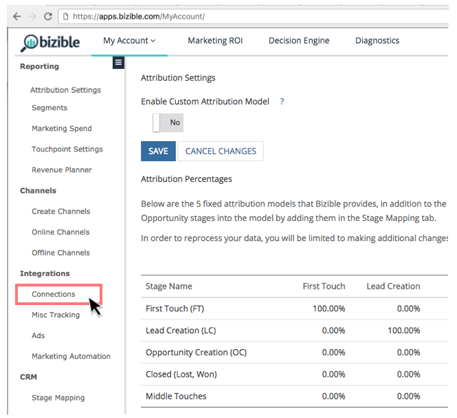
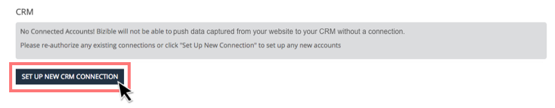
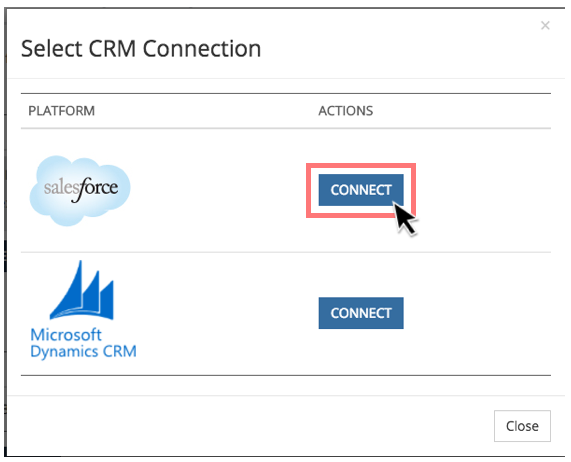
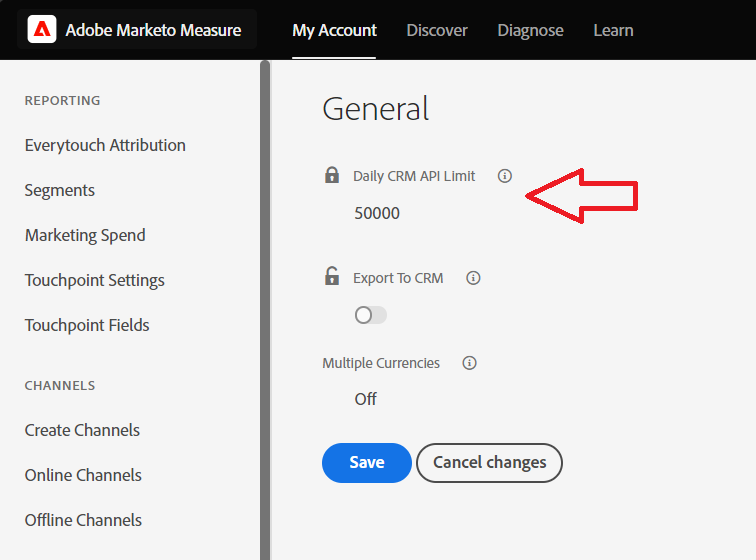
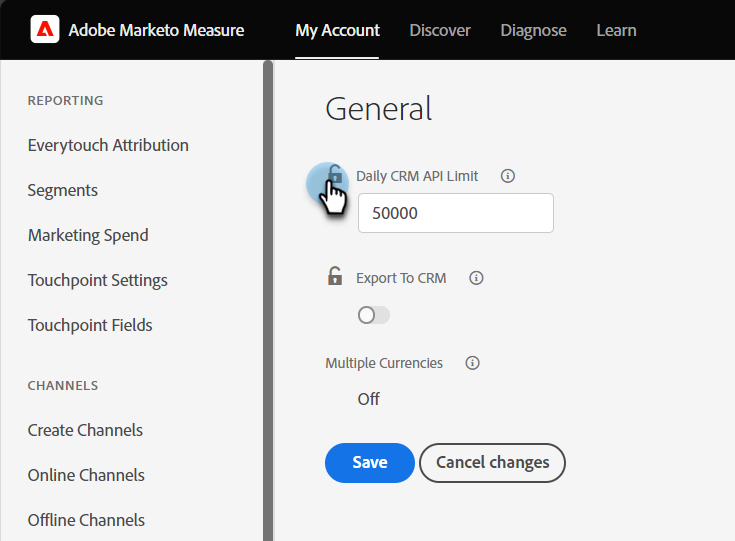
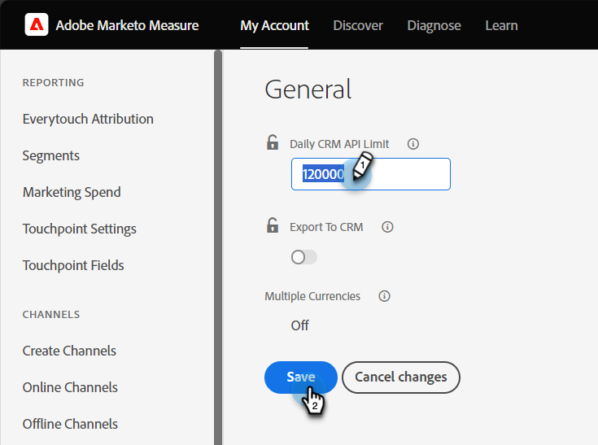

# Marketo MeasureとSalesforceの連携 {#connect-marketo-measure-to-salesforce}

この記事では、[!DNL Salesforce] アカウントを[!DNL Marketo Measure] アカウントに接続する方法の概要について説明します。

## [!DNL Marketo Measure]と[!DNL Salesforce]を接続しています {#connecting-marketo-measure-with-salesforce}

1. シークレットブラウザーを使用して[!DNL Marketo Measure]にログインします。

1. 画面上部のメニューバーで、**[!UICONTROL マイアカウント]**&#x200B;に移動し、**[!UICONTROL 設定]** オプションをクリックします。

1. 左側の設定オプションの列で、「[!UICONTROL 統合]」セクションの下にある「**[!UICONTROL 接続]**」をクリックします。

   

1. 「接続」の「CRM」セクションで、**[!UICONTROL 新しいCRM接続の設定]**&#x200B;をクリックします。

   

1. CRM接続を選択するよう求めるポップアップウィンドウが表示されます。 [!DNL Salesforce] ロゴの横にある&#x200B;**[!UICONTROL Connect]**&#x200B;をクリックします。

   

1. 最後のポップアップウィンドウが表示され、[!DNL Salesforce]資格情報、サンドボックス、または実稼動環境を求められます。 情報を入力し、**[!UICONTROL 認証]**&#x200B;をクリックして、アカウントを[!DNL Marketo Measure]に接続します。

>[!NOTE]
>
>[!DNL Marketo Measure]は、一度に1つの[!DNL Salesforce] インスタンスにのみ接続できます。
>
>* [!DNL Marketo Measure] インスタンスをSFDC サンドボックスインスタンスに接続して、SFDC実稼動インスタンスへの接続を切り替える前に統合をテストできます。
>* 最初にSFDC サンドボックスを使用してテストを行う場合は、リード、取引先責任者、アカウント、商談、Campaign、ケースオブジェクトのフィールドで、SFDC実稼動インスタンスの正確なレプリカを使用してテストすることを強くお勧めします。 実稼動環境にアクティブなAPEX トリガーがあり、リード、取引先責任者、アカウント、商談、Campaign、ケースオブジェクトの更新に対して実行される場合は、サンドボックスでアクティブにしてみてください。
>* テストが完了したら、[!DNL Marketo Measure] アカウントを更新して、実稼動[!DNL Salesforce]を指すようにします（サンドボックス [!DNL Salesforce]ではなく）。 統合の構築方法により、[!DNL Marketo Measure] アカウントが実稼動環境[!DNL Salesforce]に接続されると、「逆方向」に移動してサンドボックス [!DNL Salesforce]組織に接続することはできません。

## API クレジットの使用状況 {#api-credits-usage}

Marketo Measureでは、統合ユーザーを介してクライアントのSalesforceとインターフェイスするCRM統合タスクを使用します。 このユーザーを介するすべてのデータ交換では、Salesforce API クレジットを使用します。 統合ユーザーにクレジットクォータを割り当てる機能があり、過剰なAPI呼び出しを規制するのに役立ちます。 この割り当てまたは制限は、24時間ごとにリセットされます。

この制限は、**My Account** > **Settings** > **CRM** > **General** > **Daily CRM API limit**&#x200B;経由でMarketo Measureからアクセスでき、テナントに設定できます。

### API クレジットの制限の設定 {#setting-a-limit-for-api-credits}

1. **自分のアカウント** > **設定**&#x200B;に移動します。

1. CRMで、**一般**&#x200B;をクリックします。 「**日次CRM API制限**」オプションが表示されます。

1. 編集するには、「ロック」アイコンをクリックします。

   

1. 100,000以上の制限を入力します。 終了したら「**保存**」をクリックします。

   

>[!NOTE]
>
>接続ソリューションで利用可能なSalesforce API クレジットを増やすには、Salesforce管理者に連絡し、[このSalesforce ドキュメント ](https://developer.salesforce.com/docs/atlas.en-us.salesforce_app_limits_cheatsheet.meta/salesforce_app_limits_cheatsheet/salesforce_app_limits_platform_api.htm){target="_blank"}を参照してください。

>[!MORELIKETHIS]
>
>[エラー通知](/help/configuration-and-setup/getting-started-with-marketo-measure/error-notifications.md){target="_blank"}
