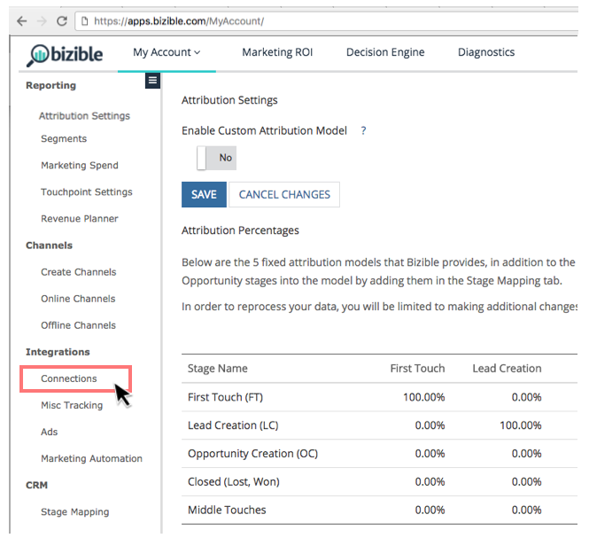

# Marketo Measureと Salesforce の接続 {#connect-marketo-measure-to-salesforce}

この記事では、[!DNL Salesforce] アカウントを [!DNL Marketo Measure] アカウントに接続する方法の概要を説明します。

## [!DNL Marketo Measure] と [!DNL Salesforce] の接続 {#connecting-marketo-measure-with-salesforce}

1. 匿名ブラウザーを使用して [!DNL Marketo Measure] にログインします。

1. 画面上部のメニューバーで、「**[!UICONTROL マイアカウント]**」に移動し、「**[!UICONTROL 設定]**」オプションをクリックします。

1. 左側の設定オプションの列で、「**[!UICONTROL 統合]** セクションの下にある [!UICONTROL &#x200B; 接続 &#x200B;] をクリックします。

   

1. 「接続」の「CRM」セクションで、「**[!UICONTROL 新しい CRM 接続の設定]**」をクリックします。

   

1. ポップアップウィンドウが表示され、「CRM 接続を選択」するように求められます。 [!DNL Salesforce] ロゴの横にある **[!UICONTROL 接続]** をクリックします。

   

1. 最終的なポップアップウィンドウが表示され、[!DNL Salesforce] 資格情報、サンドボックスまたは実稼働環境の入力を求められます。 情報を入力し、「**[!UICONTROL 認証]**」をクリックしてアカウントを [!DNL Marketo Measure] に接続します。

>[!NOTE]
>
>[!DNL Marketo Measure] は、一度に 1 つの [!DNL Salesforce] インスタンスにのみ接続できます。
>
>* [!DNL Marketo Measure] インスタンスを SFDC サンドボックスインスタンスに接続して、SFDC 実稼動インスタンスへの接続を切り替える前に統合をテストできます。
>* SFDC サンドボックスで最初にテストを行う場合は、リード、連絡先、アカウント、オポチュニティ、キャンペーン、およびケースの各オブジェクトのフィールドに関して、SFDC 実稼動インスタンスの正確なレプリカでテストを行うことを強くお勧めします。 実稼動環境にリード、連絡先、アカウント、オポチュニティ、キャンペーンおよびケースの各オブジェクトに対する更新で発生するアクティブな APEXトリガーがある場合は、サンドボックスにそれらのアクションをアクティブにする必要があります。
>* テストが完了したら、[!DNL Marketo Measure] アカウントを更新して、（サンドボックス [!DNL Salesforce] ではなく）実稼動 [!DNL Salesforce] ージを指すようにします。 統合の構築方法により、[!DNL Marketo Measure] アカウントが実稼動 [!DNL Salesforce] ーバーに接続されると、「遡って」サンドボックス [!DNL Salesforce] 組織に接続することはできません。

## API クレジットの使用状況 {#api-credits-usage}

Marketo Measureでは、統合ユーザーを通じてクライアントの Salesforce とインターフェイスを取る CRM 統合タスクを使用しています。 このユーザーを介したすべてのデータ交換は、Salesforce API クレジットを使用します。 統合ユーザーにクレジット割り当てを割り当てる機能があります。これは、過剰な API 呼び出しを規制する役割を果たします。 このクォータまたは制限は、24 時間ごとにリセットされます。

この制限には、Marketo Measureで **マイアカウント**/**設定**/**CRM**/**一般**/**1 日の CRM API 制限** からアクセスし、テナントに対して設定できます。

### API クレジットの制限の設定 {#setting-a-limit-for-api-credits}

1. **マイアカウント**/**設定** に移動します。

1. CRM で、「**一般**」をクリックします。 「**1 日あたりの CRM API 制限** オプションが表示されます。

1. 編集するには、鍵アイコンをクリックします。

   

1. 100,000 以上の上限を入力してください。 終了したら「**保存**」をクリックします。

   

>[!NOTE]
>
>接続ソリューションで利用可能な Salesforce API クレジットを増やすには、Salesforce 管理者に連絡して、[ この Salesforce ドキュメント ](https://developer.salesforce.com/docs/atlas.en-us.salesforce_app_limits_cheatsheet.meta/salesforce_app_limits_cheatsheet/salesforce_app_limits_platform_api.htm){target="_blank"} を参照してください。

>[!MORELIKETHIS]
>
>[エラー通知](/help/configuration-and-setup/getting-started-with-marketo-measure/error-notifications.md){target="_blank"}
