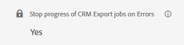
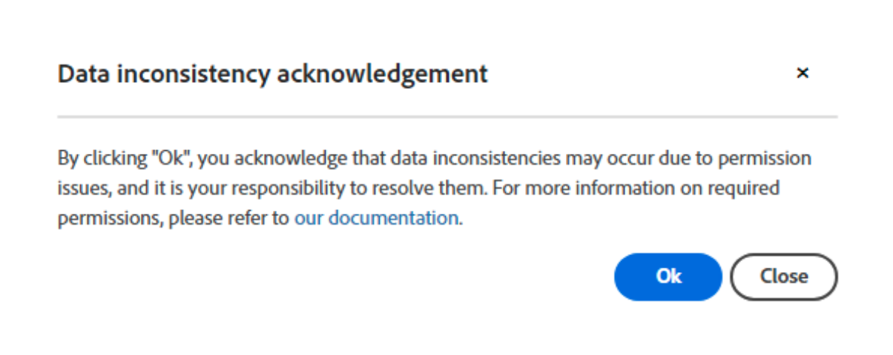

# CRM 書き出しのエラー処理

「書き出しエラーで一時停止」機能を使用すると、レコードレベルのエラーが発生したときにCRM書き出しジョブを一時停止するかどうかを制御できます。

設定は、**マイアカウント** > **設定** > **CRM** > **一般**&#x200B;の下にあります。

>[!NOTE]
>
>この機能は、「CRMに書き出し」機能が有効になっている場合にのみ表示されます。

この機能が有効になっている場合、書き出しジョブは進行を停止し、問題が解決されるまで、エラーが発生したレコードに残ります。 これらのエラーは通常、権限が欠落している、カスタム検証ルールが不適切に適用されている、またはワークフロー／トリガーの問題が原因で発生します。 ジョブはスケジュール通りに実行され続け、失敗したレコードの書き出しが成功するまで自動的に再試行されます。

この機能を無効にすると、警告ポップアップが表示され、データの不整合が発生する可能性があることを知らせます。 これらの不整合から生じる可能性のある問題に対処するのは、お客様の責任です。

いずれの場合も、機能がオンまたはオフに切り替えられているかどうかにかかわらず、発生したすべてのレコードレベルのエラーは`ExportErrors` テーブルに記録され、`CRMExport_ExportError` ジョブはこれらのレコードを毎日自動的に再書き出ししようとします。 これにより、開発者の介入なしで自動的に行われるため、サポートリクエストを送信して再書き出しを開始する必要がなくなります。

`ExportErrors`機能でジョブを停止する動作が必要なのはなぜですか？ 特定のレコードで通常のCRM書き出しジョブを停止することで、トラブルシューティングがはるかに簡単になります。 これにより、ジョブをローカルで実行し、再書き出し中に取得および処理する必要がある多数のExportErrorsが作成されるのを防ぐことができます。

この機能は、好みの動作に基づいてオンまたはオフに切り替えることができます。 例えば、特に難しいエラーコードが発生し、「不完全な」データを一時的に受け入れることを希望する場合、この機能をオフに切り替えることができます。 問題が解決したら、この機能を再度オンにして、今後の書き出しが完全で正確であることを確認できます。
