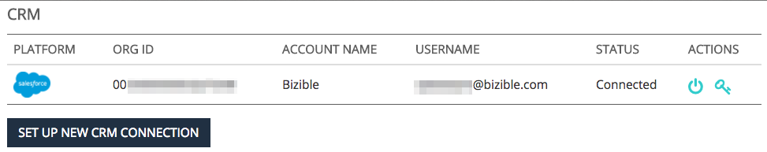

# [!DNL Marketo Measure] と [!DNL Salesforce] の相互作用 {#how-marketo-measure-and-salesforce-interact}

>[!NOTE]
>
>アドビのドキュメント内に「[!DNL Marketo Measure]」を指定する手順が記載されている場合がありますが、CRM には「Bizible」と表示されます。アドビは現在、その更新を行っており、ブランディングの変更がまもなく CRM に反映される予定です。

[!DNL Marketo Measure] と Salesforce の関係を大まかに見てみましょう。

## Salesforce と [!DNL Marketo Measure] {#salesforce-and-marketo-measure}

[!DNL Marketo Measure] アカウントが作成され、[!DNL Salesforce] が接続されると、[!DNL Marketo Measure] 管理パッケージがインストールされ、[!DNL Marketo Measure] Salesforce ユーザが編集権限を持っている限り、[!DNL Marketo Measure] はマーケティングデータを CRM インスタンスにプッシュし始めます。

[!DNL Marketo Measure] Salesforce パッケージをインストールしていない場合、[!DNL Marketo Measure] は Salesforce インスタンスにデータを書き込みません。

デフォルトでは、ジョブが CRM にデータを送信するたびに、[!DNL Marketo Measure] は API クレジットごとに 200 件のレコードを書き出します。これにより、ほとんどの顧客に、[!DNL Marketo Measure] が消費する API クレジットと CRM の CPU リソース要件との間の最適なバランスが提供されます。ただし、ワークフローやトリガーなど複雑な CRM 設定を持つ顧客の場合は、バッチサイズを小さくすると CRM のパフォーマンスの向上に役立つ場合があります。この目的のために、[!DNL Marketo Measure] では顧客が CRM 書き出しのバッチサイズを設定できます。これは、[!DNL Marketo Measure] web アプリケーションの[!UICONTROL 設定]／[!UICONTROL CRM]／[!UICONTROL 一般]ページで設定でき、顧客は 200（デフォルト）、100、50、25 のバッチサイズから選択できます。

この設定を変更する場合、バッチサイズが小さいほど CRM からの API クレジットをより多く消費することに注意してください。CRM で CPU タイムアウトまたは高い CPU 負荷が発生している場合のみ、バッチサイズを小さくすることをお勧めします。

## Salesforce 標準オブジェクトとアクセス {#salesforce-standard-objects-and-access}

これには、[!DNL Marketo Measure] がやり取りする [!DNL Salesforce] 標準オブジェクトと、接続が確立され [!DNL Marketo Measure] パッケージがインストールされた後にこれらのオブジェクトに追加するカスタムフィールドが一覧表示されます。そのままでは、[!DNL Marketo Measure] は標準の [!DNL Salesforce] オブジェクトフィールドに書き込みません。

**リード**

<table> 
 <tbody> 
  <tr> 
   <th>
フィールド
</th> 
   <th>
標準／カスタム
</th> 
   <th>
読み取り
</th> 
   <th>
書き込み
</th> 
  </tr> 
  <tr> 
   <td>
ID
</td> 
   <td>
標準
</td> 
   <td>
x
</td> 
   <td> </td> 
  </tr> 
  <tr> 
   <td>
メール
</td> 
   <td>
標準
</td> 
   <td>
x
</td> 
   <td> </td> 
  </tr> 
  <tr> 
   <td>
ステータス
</td> 
   <td>
標準
</td> 
   <td>
x
</td> 
   <td> </td> 
  </tr> 
  <tr> 
   <td>
CreatedDate
</td> 
   <td>
標準
</td> 
   <td>
x
</td> 
   <td> </td> 
  </tr> 
  <tr> 
   <td>
LastModifiedDate
</td> 
   <td>
標準
</td> 
   <td>
x
</td> 
   <td> </td> 
  </tr> 
  <tr> 
   <td>
ConvertedDate
</td> 
   <td>
標準
</td> 
   <td>
x
</td> 
   <td> </td> 
  </tr> 
  <tr> 
   <td>
ConvertedContactId
</td> 
   <td>
標準
</td> 
   <td>
x
</td> 
   <td> </td> 
  </tr> 
  <tr> 
   <td>
ConvertedOpportunityId
</td> 
   <td>
標準
</td> 
   <td>
x
</td> 
   <td> </td> 
  </tr> 
  <tr> 
   <td>
IsConverted
</td> 
   <td>
標準
</td> 
   <td>
x
</td> 
   <td> </td> 
  </tr> 
  <tr> 
   <td>
IsDeleted
</td> 
   <td>
標準
</td> 
   <td>
x
</td> 
   <td> </td> 
  </tr> 
  <tr> 
   <td>
Web サイト
</td> 
   <td>
標準
</td> 
   <td>
x
</td> 
   <td> </td> 
  </tr> 
  <tr> 
   <td>
会社
</td> 
   <td>
標準
</td> 
   <td>
x
</td> 
   <td> </td> 
  </tr> 
  <tr> 
   <td>
bizible2__Account__c
</td> 
   <td>
カスタム
</td> 
   <td>
x
</td> 
   <td>
x
</td> 
  </tr> 
  <tr> 
   <td>
bizible2__Ad_Campaign_Name_FT__c
</td> 
   <td>
カスタム
</td> 
   <td>
x
</td> 
   <td>
x
</td> 
  </tr> 
  <tr> 
   <td>
bizible2__Ad_Campaign_Name_LC__c
</td> 
   <td>
カスタム
</td> 
   <td>
x
</td> 
   <td>
x
</td> 
  </tr> 
  <tr> 
   <td>
bizible2__Landing_Page_FT__c
</td> 
   <td>
カスタム
</td> 
   <td>
x
</td> 
   <td>
x
</td> 
  </tr> 
  <tr> 
   <td>
bizible2__Landing_Page_LC__c
</td> 
   <td>
カスタム
</td> 
   <td>
x
</td> 
   <td>
x
</td> 
  </tr> 
  <tr> 
   <td>
bizible2__Marketing_Channel_FT__c
</td> 
   <td>
カスタム
</td> 
   <td>
x
</td> 
   <td>
x
</td> 
  </tr> 
  <tr> 
   <td>
bizible2__Marketing_Channel_LC__c
</td> 
   <td>
カスタム
</td> 
   <td>
x
</td> 
   <td>
x
</td> 
  </tr> 
  <tr> 
   <td>
bizible2__Touchpoint_Date_FT__c
</td> 
   <td>
カスタム
</td> 
   <td>
x
</td> 
   <td>
x
</td> 
  </tr> 
  <tr> 
   <td>
bizible2__Touchpoint_Date_LC__c
</td> 
   <td>
カスタム
</td> 
   <td>
x
</td> 
   <td>
x
</td> 
  </tr> 
  <tr> 
   <td>
bizible2__Touchpoint_Source_FT__c
</td> 
   <td>
カスタム
</td> 
   <td>
x
</td> 
   <td>
x
</td> 
  </tr> 
  <tr> 
   <td>
bizible2__Touchpoint_Source_LC__c
</td> 
   <td>
カスタム
</td> 
   <td>
x
</td> 
   <td>
x 
</td> 
  </tr> 
 </tbody> 
</table>

**取引先責任者**

<table> 
 <tbody> 
  <tr> 
   <th>
フィールド
</th> 
   <th>
標準／カスタム
</th> 
   <th>
読み取り
</th> 
   <th>
書き込み
</th> 
  </tr> 
  <tr> 
   <td>
アカウント
</td> 
   <td>
標準
</td> 
   <td>x</td> 
   <td> </td> 
  </tr> 
  <tr> 
   <td>
ID
</td> 
   <td>
標準
</td> 
   <td>
x
</td> 
   <td> </td> 
  </tr> 
  <tr> 
   <td>
メール
</td> 
   <td>
標準
</td> 
   <td>
x
</td> 
   <td> </td> 
  </tr> 
  <tr> 
   <td>
作成日
</td> 
   <td>
標準
</td> 
   <td>
x
</td> 
   <td> </td> 
  </tr> 
  <tr> 
   <td>
IsDeleted
</td> 
   <td>
標準
</td> 
   <td>
x
</td> 
   <td> </td> 
  </tr> 
  <tr> 
   <td>
LastModifiedDate
</td> 
   <td>
標準
</td> 
   <td>
x
</td> 
   <td> </td> 
  </tr> 
  <tr> 
   <td>
bizible2__Ad_Campaign_Name_FT__c
</td> 
   <td>
カスタム
</td> 
   <td>
x
</td> 
   <td>
x
</td> 
  </tr> 
  <tr> 
   <td>
bizible2__Ad_Campaign_Name_LC__c
</td> 
   <td>
カスタム
</td> 
   <td>
x
</td> 
   <td>
x
</td> 
  </tr> 
  <tr> 
   <td>
bizible2__Landing_Page_FT__c
</td> 
   <td>
カスタム
</td> 
   <td>
x
</td> 
   <td>
x
</td> 
  </tr> 
  <tr> 
   <td>
bizible2__Landing_Page_LC__c
</td> 
   <td>
カスタム
</td> 
   <td>
x
</td> 
   <td>
x
</td> 
  </tr> 
  <tr> 
   <td>
bizible2__Marketing_Channel_FT__c
</td> 
   <td>
カスタム
</td> 
   <td>
x
</td> 
   <td>
x
</td> 
  </tr> 
  <tr> 
   <td>
bizible2__Marketing_Channel_LC__c
</td> 
   <td>
カスタム
</td> 
   <td>
x
</td> 
   <td>
x
</td> 
  </tr> 
  <tr> 
   <td>
bizible2__Touchpoint_Date_FT__c
</td> 
   <td>
カスタム
</td> 
   <td>
x
</td> 
   <td>
x
</td> 
  </tr> 
  <tr> 
   <td>
bizible2__Touchpoint_Date_LC__c
</td> 
   <td>
カスタム
</td> 
   <td>
x
</td> 
   <td>
x
</td> 
  </tr> 
  <tr> 
   <td>
bizible2__Touchpoint_Source_FT__c
</td> 
   <td>
カスタム
</td> 
   <td>
x
</td> 
   <td>
x
</td> 
  </tr> 
  <tr> 
   <td>
bizible2__Touchpoint_Source_LC__c
</td> 
   <td>
カスタム
</td> 
   <td>
x
</td> 
   <td>
x 
</td> 
  </tr> 
 </tbody> 
</table>

**事例**

<table> 
 <tbody> 
  <tr> 
   <th>
フィールド
</th> 
   <th>
標準／カスタム
</th> 
   <th>
読み取り
</th> 
   <th>
書き込み
</th> 
  </tr> 
  <tr> 
   <td>
ID
</td> 
   <td>
標準
</td> 
   <td>
x
</td> 
   <td> </td> 
  </tr> 
  <tr> 
   <td>
CreatedDate
</td> 
   <td>
標準
</td> 
   <td>
x
</td> 
   <td> </td> 
  </tr> 
  <tr> 
   <td>
LastModifiedDate
</td> 
   <td>
標準
</td> 
   <td>
x
</td> 
   <td> </td> 
  </tr> 
  <tr> 
   <td>
SuppliedEmail
</td> 
   <td>
標準
</td> 
   <td>
x
</td> 
   <td> </td> 
  </tr> 
  <tr> 
   <td>
IsDeleted
</td> 
   <td>
標準
</td> 
   <td>
x
</td> 
   <td> </td> 
  </tr> 
  <tr> 
   <td>
bizible2__Ad_Campaign_Name_FT__c
</td> 
   <td>
カスタム
</td> 
   <td>
x
</td> 
   <td>
x
</td> 
  </tr> 
  <tr> 
   <td>
bizible2__Ad_Campaign_Name_LC__c
</td> 
   <td>
カスタム
</td> 
   <td>
x
</td> 
   <td>
x
</td> 
  </tr> 
  <tr> 
   <td>
bizible2__Landing_Page_FT__c
</td> 
   <td>
カスタム
</td> 
   <td>
x
</td> 
   <td>
x
</td> 
  </tr> 
  <tr> 
   <td>
bizible2__Landing_Page_LC__c
</td> 
   <td>
カスタム
</td> 
   <td>
x
</td> 
   <td>
x
</td> 
  </tr> 
  <tr> 
   <td>
bizible2__Marketing_Channel_FT__c
</td> 
   <td>
カスタム
</td> 
   <td>
x
</td> 
   <td>
x
</td> 
  </tr> 
  <tr> 
   <td>
bizible2__Marketing_Channel_LC__c
</td> 
   <td>
カスタム
</td> 
   <td>
x
</td> 
   <td>
x
</td> 
  </tr> 
  <tr> 
   <td>
bizible2__Touchpoint_Date_FT__c
</td> 
   <td>
カスタム
</td> 
   <td>
x
</td> 
   <td>
x
</td> 
  </tr> 
  <tr> 
   <td>
bizible2__Touchpoint_Date_LC__c
</td> 
   <td>
カスタム
</td> 
   <td>
x
</td> 
   <td>
x
</td> 
  </tr> 
  <tr> 
   <td>
bizible2__Touchpoint_Source_FT__c
</td> 
   <td>
カスタム
</td> 
   <td>
x
</td> 
   <td>
x
</td> 
  </tr> 
  <tr> 
   <td>
bizible2__Touchpoint_Source_LC__c
</td> 
   <td>
カスタム
</td> 
   <td>
x
</td> 
   <td>
x 
</td> 
  </tr> 
 </tbody> 
</table>

**アカウント**

<table> 
 <tbody> 
  <tr> 
   <th>
フィールド
</th> 
   <th>
標準／カスタム
</th> 
   <th>
読み取り
</th> 
   <th>
書き込み
</th> 
  </tr> 
  <tr> 
   <td>
ID
</td> 
   <td>
標準
</td> 
   <td>
x
</td> 
   <td> </td> 
  </tr> 
  <tr> 
   <td>
Web サイト
</td> 
   <td>
標準
</td> 
   <td>
x
</td> 
   <td> </td> 
  </tr> 
  <tr> 
   <td>
LastModifiedDate
</td> 
   <td>
標準
</td> 
   <td>
x
</td> 
   <td> </td> 
  </tr> 
  <tr> 
   <td>
IsDeleted
</td> 
   <td>
標準
</td> 
   <td>
x
</td> 
   <td> </td> 
  </tr> 
  <tr> 
   <td>
bizible2__Engagement_Score__c
</td> 
   <td>
カスタム
</td> 
   <td>
x
</td> 
   <td>
x 
</td> 
  </tr> 
 </tbody> 
</table>

**商談**

<table> 
 <tbody> 
  <tr> 
   <th>
フィールド
</th> 
   <th>
標準／カスタム
</th> 
   <th>
読み取り
</th> 
   <th>
書き込み
</th> 
  </tr> 
  <tr> 
   <td>
アカウント
</td> 
   <td>
標準
</td> 
   <td>
x
</td> 
   <td> </td> 
  </tr> 
  <tr> 
   <td>
ID
</td> 
   <td>
標準
</td> 
   <td>
x
</td> 
   <td> </td> 
  </tr> 
  <tr> 
   <td>
CreatedDate
</td> 
   <td>
標準
</td> 
   <td>
x
</td> 
   <td> </td> 
  </tr> 
  <tr> 
   <td>
LastModifiedDate
</td> 
   <td>
標準
</td> 
   <td>
x
</td> 
   <td> </td> 
  </tr> 
  <tr> 
   <td>
IsWon
</td> 
   <td>
標準
</td> 
   <td>
x
</td> 
   <td> </td> 
  </tr> 
  <tr> 
   <td>
IsClosed
</td> 
   <td>
標準
</td> 
   <td>
x
</td> 
   <td> </td> 
  </tr> 
  <tr> 
   <td>
IsDeleted
</td> 
   <td>
標準
</td> 
   <td>
x
</td> 
   <td> </td> 
  </tr> 
  <tr> 
   <td>
CloseDate
</td> 
   <td>
標準
</td> 
   <td>
x
</td> 
   <td> </td> 
  </tr> 
  <tr> 
   <td>
StageName
</td> 
   <td>
標準
</td> 
   <td>
x
</td> 
   <td> </td> 
  </tr> 
  <tr> 
   <td>
金額
</td> 
   <td>
標準
</td> 
   <td>
x
</td> 
   <td> </td> 
  </tr> 
  <tr> 
   <td>
bizible2__Bizible_Opportunity_Amount__c
</td> 
   <td>
カスタム
</td> 
   <td>
x
</td> 
   <td>
x 
</td> 
  </tr> 
 </tbody> 
</table>

**キャンペーン**

<table> 
 <colgroup> 
  <col> 
  <col> 
  <col> 
  <col> 
 </colgroup> 
 <tbody> 
  <tr> 
   <th>
フィールド
</th> 
   <th>
標準／カスタム
</th> 
   <th>
読み取り
</th> 
   <th>
書き込み
</th> 
  </tr> 
  <tr> 
   <td>
ID
</td> 
   <td>
標準
</td> 
   <td>
x
</td> 
   <td> </td> 
  </tr> 
  <tr> 
   <td>
メール
</td> 
   <td>
標準
</td> 
   <td>
x
</td> 
   <td> </td> 
  </tr> 
  <tr> 
   <td>
ステータス
</td> 
   <td>
標準
</td> 
   <td>
x
</td> 
   <td> </td> 
  </tr> 
  <tr> 
   <td>
CreatedDate
</td> 
   <td>
標準
</td> 
   <td>
x
</td> 
   <td> </td> 
  </tr> 
  <tr> 
   <td>
LastModifiedDate
</td> 
   <td>
標準
</td> 
   <td>
x
</td> 
   <td> </td> 
  </tr> 
  <tr> 
   <td>
ConvertedDate
</td> 
   <td>
標準
</td> 
   <td>
x
</td> 
   <td> </td> 
  </tr> 
  <tr> 
   <td>
ConvertedContactId
</td> 
   <td>
標準
</td> 
   <td>
x
</td> 
   <td> </td> 
  </tr> 
  <tr> 
   <td>
ConvertedOpportunityId
</td> 
   <td>
標準
</td> 
   <td>
x
</td> 
   <td> </td> 
  </tr> 
  <tr> 
   <td>
IsConverted
</td> 
   <td>
標準
</td> 
   <td>
x
</td> 
   <td> </td> 
  </tr> 
  <tr> 
   <td>
IsDeleted
</td> 
   <td>
標準
</td> 
   <td>
x
</td> 
   <td> </td> 
  </tr> 
  <tr> 
   <td>
Web サイト
</td> 
   <td>
標準
</td> 
   <td>
x
</td> 
   <td> </td> 
  </tr> 
  <tr> 
   <td>
会社
</td> 
   <td>
標準
</td> 
   <td>
x
</td> 
   <td> </td> 
  </tr> 
  <tr> 
   <td>
タイプ
</td> 
   <td>
標準
</td> 
   <td>
x
</td> 
   <td> </td> 
  </tr> 
 </tbody> 
</table>

**キャンペーンメンバー**

<table> 
 <tbody> 
  <tr> 
   <th>
フィールド
</th> 
   <th>
標準／カスタム
</th> 
   <th>
読み取り
</th> 
   <th>
書き込み
</th> 
  </tr> 
  <tr> 
   <td>
ID
</td> 
   <td>
標準
</td> 
   <td>
x
</td> 
   <td> </td> 
  </tr> 
  <tr> 
   <td>
CreatedDate
</td> 
   <td>
標準
</td> 
   <td>
x
</td> 
   <td> </td> 
  </tr> 
  <tr> 
   <td>
LastModifiedDate
</td> 
   <td>
標準
</td> 
   <td>
x
</td> 
   <td> </td> 
  </tr> 
  <tr> 
   <td>
IsDeleted
</td> 
   <td>
標準
</td> 
   <td>
x
</td> 
   <td> </td> 
  </tr> 
  <tr> 
   <td>
FirstRespondedDate
</td> 
   <td>
標準
</td> 
   <td>
x
</td> 
   <td> </td> 
  </tr> 
  <tr> 
   <td>
HasRelponed
</td> 
   <td>
標準
</td> 
   <td>
x
</td> 
   <td> </td> 
  </tr> 
  <tr> 
   <td>
CONTACTID
</td> 
   <td>
標準
</td> 
   <td>
x
</td> 
   <td> </td> 
  </tr> 
  <tr> 
   <td>
leadId
</td> 
   <td>
標準
</td> 
   <td>
x
</td> 
   <td> </td> 
  </tr> 
  <tr> 
   <td>
IsConverted
</td> 
   <td>
標準
</td> 
   <td>
x
</td> 
   <td> </td> 
  </tr> 
  <tr> 
   <td>
CampaignId
</td> 
   <td>
標準
</td> 
   <td>
x
</td> 
   <td> </td> 
  </tr> 
  <tr> 
   <td>
bizible2__Bizible_Touchpoint_Date__c
</td> 
   <td>
カスタム
</td> 
   <td>
x
</td> 
   <td>
x
</td> 
  </tr> 
  <tr> 
   <td>
bizible2__Touchpoint_Status_Date__c
</td> 
   <td>
カスタム
</td> 
   <td>
x
</td> 
   <td>
x
</td> 
  </tr> 
  <tr> 
   <td>
bizible2__Touchpoint_Status_Contact__c
</td> 
   <td>
カスタム
</td> 
   <td>
x
</td> 
   <td>
x
</td> 
  </tr> 
  <tr> 
   <td>
bizible2__Touchpoint_Status_Leade__c
</td> 
   <td>
カスタム
</td> 
   <td>
x
</td> 
   <td>
x
</td> 
  </tr> 
  <tr> 
   <td>
bizible2__Touchpoint_Status_Opportunity__c
</td> 
   <td>
カスタム
</td> 
   <td>
x
</td> 
   <td>
x 
</td> 
  </tr> 
 </tbody> 
</table>

>[!NOTE]
>
>Salesforce アカウント内での削除イベントを Marketo Measure が確実にキャプチャするには、以下のオブジェクトに対する複製可能な権限が必要です。複製可能な権限は、次のオブジェクトに標準で付属しています。
>
>* アカウント
>* キャンペーン
>* キャンペーンメンバー
>* 取引先責任者
>* イベント
>* リード
>* 商談
>* タスク

## [!DNL Salesforce] の [!DNL Marketo Measure] カスタムオブジェクト {#marketo-measure-custom-objects-in-salesforce}

SFDC の標準オブジェクトでのカスタムフィールドの作成とは別に、[!DNL Marketo Measure] パッケージがインストールされ、カスタムオブジェクトがいくつか作成されます。以下に、これらのカスタムオブジェクトのリストと、[!DNL Marketo Measure] が書き込むフィールドを示す表を示します。

**Buyer Touchpoint**

Buyer Touchpoint は、取引先責任者、リード、事例のマーケティングインタラクションをカプセル化する [!DNL Marketo Measure] カスタムオブジェクトです。

<table> 
 <tbody> 
  <tr> 
   <th>
フィールド
</th> 
   <th>
標準／カスタム
</th> 
   <th>
読み取り
</th> 
   <th>
書き込み
</th> 
  </tr> 
  <tr> 
   <td>
bizible2__Bizible_Person__c
</td> 
   <td>
カスタム
</td> 
   <td>
x
</td> 
   <td>
x
</td> 
  </tr> 
  <tr> 
   <td>
bizible2__SF_Campaign__c
</td> 
   <td>
カスタム
</td> 
   <td>
x
</td> 
   <td>
x
</td> 
  </tr> 
  <tr> 
   <td>
bizible2__UniqueId__c
</td> 
   <td>
カスタム
</td> 
   <td>
x
</td> 
   <td>
x
</td> 
  </tr> 
  <tr> 
   <td>
bizible2__Marketing_Channel__c
</td> 
   <td>
カスタム
</td> 
   <td>
x
</td> 
   <td>
x
</td> 
  </tr> 
  <tr> 
   <td>
bizible2__Marketing_Channel_Path__c
</td> 
   <td>
カスタム
</td> 
   <td>
x
</td> 
   <td>
x
</td> 
  </tr> 
  <tr> 
   <td>
bizible2__Touchpoint_Type__c
</td> 
   <td>
カスタム
</td> 
   <td>
x
</td> 
   <td>
x
</td> 
  </tr> 
  <tr> 
   <td>
bizible2__Ad_Id__c
</td> 
   <td>
カスタム
</td> 
   <td>
x
</td> 
   <td>
x
</td> 
  </tr> 
  <tr> 
   <td>
bizible2__Ad_Content__c
</td> 
   <td>
カスタム
</td> 
   <td>
x
</td> 
   <td>
x
</td> 
  </tr> 
  <tr> 
   <td>
bizible2__Ad_Group_Id__c
</td> 
   <td>
カスタム
</td> 
   <td>
x
</td> 
   <td>
x
</td> 
  </tr> 
  <tr> 
   <td>
bizible2__Ad_Group_Name__c
</td> 
   <td>
カスタム
</td> 
   <td>
x
</td> 
   <td>
x
</td> 
  </tr> 
  <tr> 
   <td>
bizible2__Ad_Campaign_Id__c
</td> 
   <td>
カスタム
</td> 
   <td>
x
</td> 
   <td>
x
</td> 
  </tr> 
  <tr> 
   <td>
bizible2__Ad_Campaign_Name__c
</td> 
   <td>
カスタム
</td> 
   <td>
x
</td> 
   <td>
x
</td> 
  </tr> 
  <tr> 
   <td>
bizible2__Placement_Id__c
</td> 
   <td>
カスタム
</td> 
   <td>
x
</td> 
   <td>
x
</td> 
  </tr> 
  <tr> 
   <td>
bizible2__Placement_Name__c
</td> 
   <td>
カスタム
</td> 
   <td>
x
</td> 
   <td>
x
</td> 
  </tr> 
  <tr> 
   <td>
bizible2__Site_Id__c
</td> 
   <td>
カスタム
</td> 
   <td>
x
</td> 
   <td>
x
</td> 
  </tr> 
  <tr> 
   <td>
bizible2__Site_Name__c
</td> 
   <td>
カスタム
</td> 
   <td>
x
</td> 
   <td>
x
</td> 
  </tr> 
  <tr> 
   <td>
bizible2__Form_URL__c
</td> 
   <td>
カスタム
</td> 
   <td>
x
</td> 
   <td>
x
</td> 
  </tr> 
  <tr> 
   <td>
bizible2__Form_URL_Raw__c
</td> 
   <td>
カスタム
</td> 
   <td>
x
</td> 
   <td>
x
</td> 
  </tr> 
  <tr> 
   <td>
bizible2__Platform__c
</td> 
   <td>
カスタム
</td> 
   <td>
x
</td> 
   <td>
x
</td> 
  </tr> 
  <tr> 
   <td>
bizible2__Browser__c
</td> 
   <td>
カスタム
</td> 
   <td>
x
</td> 
   <td>
x
</td> 
  </tr> 
  <tr> 
   <td>
bizible2__Geo_City__c
</td> 
   <td>
カスタム
</td> 
   <td>
x
</td> 
   <td>
x
</td> 
  </tr> 
  <tr> 
   <td>
bizible2__Geo_Country__c
</td> 
   <td>
カスタム
</td> 
   <td>
x
</td> 
   <td>
x
</td> 
  </tr> 
  <tr> 
   <td>
bizible2__Geo_Region__c
</td> 
   <td>
カスタム
</td> 
   <td>
x
</td> 
   <td>
x
</td> 
  </tr> 
  <tr> 
   <td>
bizible2__Keyword_Id__c
</td> 
   <td>
カスタム
</td> 
   <td>
x
</td> 
   <td>
x
</td> 
  </tr> 
  <tr> 
   <td>
bizible2__Keyword_MatchType__c
</td> 
   <td>
カスタム
</td> 
   <td>
x
</td> 
   <td>
x
</td> 
  </tr> 
  <tr> 
   <td>
bizible2__Touchpoint_Position__c
</td> 
   <td>
カスタム
</td> 
   <td>
x
</td> 
   <td>
x
</td> 
  </tr> 
  <tr> 
   <td>
bizible2__Keyword_Text__c
</td> 
   <td>
カスタム
</td> 
   <td>
x
</td> 
   <td>
x
</td> 
  </tr> 
  <tr> 
   <td>
bizible2__Landing_Page__c
</td> 
   <td>
カスタム
</td> 
   <td>
x
</td> 
   <td>
x
</td> 
  </tr> 
  <tr> 
   <td>
bizible2__Landing_Page_Raw__c
</td> 
   <td>
カスタム
</td> 
   <td>
x
</td> 
   <td>
x
</td> 
  </tr> 
  <tr> 
   <td>
bizible2__Medium__c
</td> 
   <td>
カスタム
</td> 
   <td>
x
</td> 
   <td>
x
</td> 
  </tr> 
  <tr> 
   <td>
bizible2__Referrer_Page__c
</td> 
   <td>
カスタム
</td> 
   <td>
x
</td> 
   <td>
x
</td> 
  </tr> 
  <tr> 
   <td>
bizible2__Referrer_Page_Raw__c
</td> 
   <td>
カスタム
</td> 
   <td>
x
</td> 
   <td>
x
</td> 
  </tr> 
  <tr> 
   <td>
bizible2__Search_Phrase__c
</td> 
   <td>
カスタム
</td> 
   <td>
x
</td> 
   <td>
x
</td> 
  </tr> 
  <tr> 
   <td>
bizible2__Touchpoint_Date__c
</td> 
   <td>
カスタム
</td> 
   <td>
x
</td> 
   <td>
x
</td> 
  </tr> 
  <tr> 
   <td>
bizible2__Touchpoint_Source__c
</td> 
   <td>
カスタム
</td> 
   <td>
x
</td> 
   <td>
x
</td> 
  </tr> 
  <tr> 
   <td>
bizible2__Segment__c
</td> 
   <td>
カスタム
</td> 
   <td>
x
</td> 
   <td>
x
</td> 
  </tr> 
  <tr> 
   <td>
bizible2__Count_First_Touch__c
</td> 
   <td>
カスタム
</td> 
   <td>
x
</td> 
   <td>
x
</td> 
  </tr> 
  <tr> 
   <td>
bizible2__Count_Lead_Creation_Touch__c
</td> 
   <td>
カスタム
</td> 
   <td>
x
</td> 
   <td>
x
</td> 
  </tr> 
  <tr> 
   <td>
bizible2__Count_U_Shaped__c
</td> 
   <td>
カスタム
</td> 
   <td>
x
</td> 
   <td>
x
</td> 
  </tr> 
  <tr> 
   <td>
bizible2__Ad_Destination_URL__c
</td> 
   <td>
カスタム
</td> 
   <td>
x
</td> 
   <td>
x
</td> 
  </tr> 
  <tr> 
   <td>
bizible2__Case__c
</td> 
   <td>
カスタム
</td> 
   <td>
x
</td> 
   <td>
x
</td> 
  </tr> 
  <tr> 
   <td>
bizible2__Contact__c
</td> 
   <td>
カスタム
</td> 
   <td>
x
</td> 
   <td>
x
</td> 
  </tr> 
 </tbody> 
</table>

**[!DNL Marketo Measure]担当者**

[!DNL Marketo Measure] 担当者は、リードオブジェクト、取引先責任者オブジェクトおよび事例オブジェクトに関連する [!DNL Marketo Measure] カスタムオブジェクトです。

<table> 
 <tbody> 
  <tr> 
   <th>
フィールド
</th> 
   <th>
標準／カスタム
</th> 
   <th>
読み取り
</th> 
   <th>
書き込み
</th> 
  </tr> 
  <tr> 
   <td>
bizible2__UniqueId__c
</td> 
   <td>
カスタム
</td> 
   <td>
x
</td> 
   <td>
x
</td> 
  </tr> 
  <tr> 
   <td>
bizible2__Lead__c
</td> 
   <td>
カスタム
</td> 
   <td>
x
</td> 
   <td>
x
</td> 
  </tr> 
  <tr> 
   <td>
bizible2__Case__c
</td> 
   <td>
カスタム
</td> 
   <td>
x
</td> 
   <td>
x
</td> 
  </tr> 
  <tr> 
   <td>
bizible2__Contact__c
</td> 
   <td>
カスタム
</td> 
   <td>
x
</td> 
   <td>
x 
</td> 
  </tr> 
 </tbody> 
</table>

## Buyer Attribution Touchpoint {#buyer-attribution-touchpoint}

Buyer Attribution Touchpoint は、商談に対するマーケティングの影響をカプセル化する [!DNL Marketo Measure] カスタムオブジェクトです。

**Buyer Attribution Touchpoint**

<table> 
 <tbody> 
  <tr> 
   <th>
フィールド
</th> 
   <th>
標準／カスタム
</th> 
   <th>
読み取り
</th> 
   <th>
書き込み
</th> 
  </tr> 
  <tr> 
   <td>
bizible2__Account__c
</td> 
   <td>
カスタム
</td> 
   <td>
x
</td> 
   <td>
x
</td> 
  </tr> 
  <tr> 
   <td>
bizible2__SF_Campaign__c
</td> 
   <td>
カスタム
</td> 
   <td>
x
</td> 
   <td>
x
</td> 
  </tr> 
  <tr> 
   <td>
bizible2__Contact__c
</td> 
   <td>
カスタム
</td> 
   <td>
x
</td> 
   <td>
x
</td> 
  </tr> 
  <tr> 
   <td>
bizible2__Opportunity__c
</td> 
   <td>
カスタム
</td> 
   <td>
x
</td> 
   <td>
x
</td> 
  </tr> 
  <tr> 
   <td>
bizible2__UniqueId__c
</td> 
   <td>
カスタム
</td> 
   <td>
x
</td> 
   <td>
x
</td> 
  </tr> 
  <tr> 
   <td>
bizible2__Marketing_Channel__c
</td> 
   <td>
カスタム
</td> 
   <td>
x
</td> 
   <td>
x
</td> 
  </tr> 
  <tr> 
   <td>
bizible2__Marketing_Channel_Path__c
</td> 
   <td>
カスタム
</td> 
   <td>
x
</td> 
   <td>
x
</td> 
  </tr> 
  <tr> 
   <td>
bizible2__Touchpoint_Type__c
</td> 
   <td>
カスタム
</td> 
   <td>
x
</td> 
   <td>
x
</td> 
  </tr> 
  <tr> 
   <td>
bizible2__Ad_Id__c
</td> 
   <td>
カスタム
</td> 
   <td>
x
</td> 
   <td>
x
</td> 
  </tr> 
  <tr> 
   <td>
bizible2__Ad_Content__c
</td> 
   <td>
カスタム
</td> 
   <td>
x
</td> 
   <td>
x
</td> 
  </tr> 
  <tr> 
   <td>
bizible2__Ad_Group_Id__c
</td> 
   <td>
カスタム
</td> 
   <td>
x
</td> 
   <td>
x
</td> 
  </tr> 
  <tr> 
   <td>
bizible2__Ad_Group_Name__c
</td> 
   <td>
カスタム
</td> 
   <td>
x
</td> 
   <td>
x
</td> 
  </tr> 
  <tr> 
   <td>
bizible2__Ad_Campaign_Id__c
</td> 
   <td>
カスタム
</td> 
   <td>
x
</td> 
   <td>
x
</td> 
  </tr> 
  <tr> 
   <td>
bizible2__Ad_Campaign_Name__c
</td> 
   <td>
カスタム
</td> 
   <td>
x
</td> 
   <td>
x
</td> 
  </tr> 
  <tr> 
   <td>
bizible2__Placement_Id__c
</td> 
   <td>
カスタム
</td> 
   <td>
x
</td> 
   <td>
x
</td> 
  </tr> 
  <tr> 
   <td>
bizible2__Placement_Name__c
</td> 
   <td>
カスタム
</td> 
   <td>
x
</td> 
   <td>
x
</td> 
  </tr> 
  <tr> 
   <td>
bizible2__Site_Id__c
</td> 
   <td>
カスタム
</td> 
   <td>
x
</td> 
   <td>
x
</td> 
  </tr> 
  <tr> 
   <td>
bizible2__Site_Name__c
</td> 
   <td>
カスタム
</td> 
   <td>
x
</td> 
   <td>
x
</td> 
  </tr> 
  <tr> 
   <td>
bizible2__Form_URL__c
</td> 
   <td>
カスタム
</td> 
   <td>
x
</td> 
   <td>
x
</td> 
  </tr> 
  <tr> 
   <td>
bizible2__Form_URL_Raw__c
</td> 
   <td>
カスタム
</td> 
   <td>
x
</td> 
   <td>
x
</td> 
  </tr> 
  <tr> 
   <td>
bizible2__Platform__c
</td> 
   <td>
カスタム
</td> 
   <td>
x
</td> 
   <td>
x
</td> 
  </tr> 
  <tr> 
   <td>
bizible2__Browser__c
</td> 
   <td>
カスタム
</td> 
   <td>
x
</td> 
   <td>
x
</td> 
  </tr> 
  <tr> 
   <td>
bizible2__Geo_City__c
</td> 
   <td>
カスタム
</td> 
   <td>
x
</td> 
   <td>
x
</td> 
  </tr> 
  <tr> 
   <td>
bizible2__Geo_Country__c
</td> 
   <td>
カスタム
</td> 
   <td>
x
</td> 
   <td>
x
</td> 
  </tr> 
  <tr> 
   <td>
bizible2__Geo_Region__c
</td> 
   <td>
カスタム
</td> 
   <td>
x
</td> 
   <td>
x
</td> 
  </tr> 
  <tr> 
   <td>
bizible2__Keyword_Id__c
</td> 
   <td>
カスタム
</td> 
   <td>
x
</td> 
   <td>
x
</td> 
  </tr> 
  <tr> 
   <td>
bizible2__Keyword_MatchType__c
</td> 
   <td>
カスタム
</td> 
   <td>
x
</td> 
   <td>
x
</td> 
  </tr> 
  <tr> 
   <td>
bizible2__Touchpoint_Position__c
</td> 
   <td>
カスタム
</td> 
   <td>
x
</td> 
   <td>
x
</td> 
  </tr> 
  <tr> 
   <td>
bizible2__Keyword_Text__c
</td> 
   <td>
カスタム
</td> 
   <td>
x
</td> 
   <td>
x
</td> 
  </tr> 
  <tr> 
   <td>
bizible2__Landing_Page__c
</td> 
   <td>
カスタム
</td> 
   <td>
x
</td> 
   <td>
x
</td> 
  </tr> 
  <tr> 
   <td>
bizible2__Landing_Page_Raw__c
</td> 
   <td>
カスタム
</td> 
   <td>
x
</td> 
   <td>
x
</td> 
  </tr> 
  <tr> 
   <td>
bizible2__Medium__c
</td> 
   <td>
カスタム
</td> 
   <td>
x
</td> 
   <td>
x
</td> 
  </tr> 
  <tr> 
   <td>
bizible2__Referrer_Page__c
</td> 
   <td>
カスタム
</td> 
   <td>
x
</td> 
   <td>
x
</td> 
  </tr> 
  <tr> 
   <td>
bizible2__Referrer_Page_Raw__c
</td> 
   <td>
カスタム
</td> 
   <td>
x
</td> 
   <td>
x
</td> 
  </tr> 
  <tr> 
   <td>
bizible2__Search_Phrase__c
</td> 
   <td>
カスタム
</td> 
   <td>
x
</td> 
   <td>
x
</td> 
  </tr> 
  <tr> 
   <td>
bizible2__Touchpoint_Date__c
</td> 
   <td>
カスタム
</td> 
   <td>
x
</td> 
   <td>
x
</td> 
  </tr> 
  <tr> 
   <td>
bizible2__Touchpoint_Source__c
</td> 
   <td>
カスタム
</td> 
   <td>
x
</td> 
   <td>
x
</td> 
  </tr> 
  <tr> 
   <td>
bizible2__Segment__c
</td> 
   <td>
カスタム
</td> 
   <td>
x
</td> 
   <td>
x
</td> 
  </tr> 
  <tr> 
   <td>
bizible2__Attribution_First_Touch__c
</td> 
   <td>
カスタム
</td> 
   <td>
x
</td> 
   <td>
x
</td> 
  </tr> 
  <tr> 
   <td>
bizible2__Attribution_Lead_Conversion_Touch__c
</td> 
   <td>
カスタム
</td> 
   <td>
x
</td> 
   <td>
x
</td> 
  </tr> 
  <tr> 
   <td>
bizible2__Attribution_U_Shaped__c
</td> 
   <td>
カスタム
</td> 
   <td>
x
</td> 
   <td>
x
</td> 
  </tr> 
  <tr> 
   <td>
bizible2__Attribution_W_Shaped__c
</td> 
   <td>
カスタム
</td> 
   <td>
x
</td> 
   <td>
x
</td> 
  </tr> 
  <tr> 
   <td>
bizible2__Attribution_Custom_Model__c
</td> 
   <td>
カスタム
</td> 
   <td>
x
</td> 
   <td>
x
</td> 
  </tr> 
  <tr> 
   <td>
bizible2__Attribution_Custom_Model_2__c
</td> 
   <td>
カスタム
</td> 
   <td>
x
</td> 
   <td>
x
</td> 
  </tr> 
  <tr> 
   <td>
bizible2__Count_First_Touch__c
</td> 
   <td>
カスタム
</td> 
   <td>
x
</td> 
   <td>
x
</td> 
  </tr> 
  <tr> 
   <td>
bizible2__Count_Lead_Creation_Touch__c
</td> 
   <td>
カスタム
</td> 
   <td>
x
</td> 
   <td>
x
</td> 
  </tr> 
  <tr> 
   <td>
bizible2__Count_U_Shaped__c
</td> 
   <td>
カスタム
</td> 
   <td>
x
</td> 
   <td>
x
</td> 
  </tr> 
  <tr> 
   <td>
bizible2__Count_W_Shaped__c
</td> 
   <td>
カスタム
</td> 
   <td>
x
</td> 
   <td>
x
</td> 
  </tr> 
  <tr> 
   <td>
bizible2__Count_Custom_Model__c
</td> 
   <td>
カスタム
</td> 
   <td>
x
</td> 
   <td>
x
</td> 
  </tr> 
  <tr> 
   <td>
bizible2__Count_Custom_Model_2__c
</td> 
   <td>
カスタム
</td> 
   <td>
x
</td> 
   <td>
x
</td> 
  </tr> 
  <tr> 
   <td>
bizible2__Ad_Destination_URL__c
</td> 
   <td>
カスタム
</td> 
   <td>
x
</td> 
   <td>
x
</td> 
  </tr> 
  <tr> 
   <td>
bizible2__Revenue_First_Touch__c
</td> 
   <td>
カスタム
</td> 
   <td>
x
</td> 
   <td>
x
</td> 
  </tr> 
  <tr> 
   <td>
bizible2__Revenue_Lead_Creation_Touch__c
</td> 
   <td>
カスタム
</td> 
   <td>
x
</td> 
   <td>
x
</td> 
  </tr> 
  <tr> 
   <td>
bizible2__Revenue_U_Shaped__c
</td> 
   <td>
カスタム
</td> 
   <td>
x
</td> 
   <td>
x
</td> 
  </tr> 
  <tr> 
   <td>
bizible2__Revenue_W_Shaped__c
</td> 
   <td>
カスタム
</td> 
   <td>
x
</td> 
   <td>
x
</td> 
  </tr> 
  <tr> 
   <td>
bizible2__Revenue_Custom_Model__c
</td> 
   <td>
カスタム
</td> 
   <td>
x
</td> 
   <td>
x
</td> 
  </tr> 
  <tr> 
   <td>
bizible2__Revenue_Custom_Model_2__c
</td> 
   <td>
カスタム
</td> 
   <td>
x
</td> 
   <td>
x
</td> 
  </tr> 
 </tbody> 
</table>
