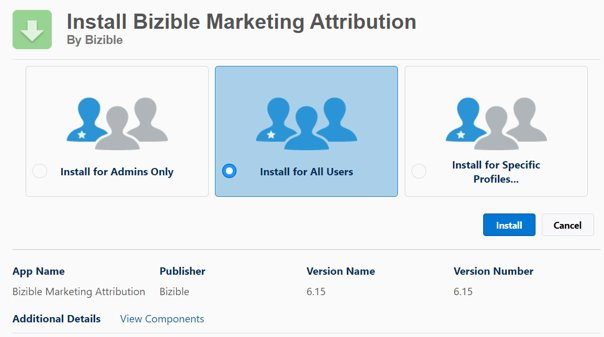

# [!DNL Marketo Measure] Salesforce パッケージのインストールと設定 {#marketo-measure-salesforce-package-installation-and-set-up}

[!DNL Marketo Measure][!DNL Salesforce] 基本パッケージをインストールする前に、まず [!DNL Salesforce] サンドボックスにインストールかどうかを特定してから、Salesforce 実稼動インスタンスに移動する必要があります。

>[!NOTE]
>[!DNL Marketo Measure] アカウントが [!DNL Salesforce] 実稼動インスタンスに接続されると、後方に移動してサンドボックスに接続することはできません。また、[!DNL Marketo Measure] アカウントは、1 つの [!DNL Salesforce] 実稼動インスタンスにのみ接続できます。

[!DNL Marketo Measure] 基本パッケージには、以下が含まれます。

* 7 つのカスタム [!DNL Marketo Measure] オブジェクト
* カスタム [!DNL Marketo Measure] フィールド
* 25 個の [!DNL Stock] レポート

[!DNL Marketo Measure] は、標準 [!DNL Salesforce] オブジェクト、フィールドおよびレコードを読み込むことができますが、[!DNL Marketo Measure] は、それらを更新したり、それらにデータをプッシュしたりすることはありません。[!DNL Marketo Measure] JavaScript で収集されたすべてのデータは、[!DNL Marketo Measure] カスタムオブジェクトおよびフィールドに表示されます。

以下の手順に従って、[!DNL Marketo Measure Salesforce] 基本パッケージをインストールします。

1. 匿名ブラウザーを使用して、[Salesforce AppExchange](https://appexchange.salesforce.com/appxListingDetail?listingId=a0N3000000B3KLuEAN){target="_blank"} に移動し、ログインします。

1. サンドボックスまたは実稼動で [!DNL Marketo Measure] パッケージにインストールします。

1. [!DNL Salesforce] に管理者としてログインします。

1. 「**[!UICONTROL すべてのユーザーにインストール]**」を選択します。

   

1. インストールが完了すると、表示できます。

   

インストールが完了したら、必要に応じて、[[!DNL Salesforce] ページレイアウト](/help/configuration-and-setup/marketo-measure-and-salesforce/page-layout-instructions.md){target="_blank"}を [!DNL Marketo Measure] フィールドで更新できます。

>[!NOTE]
>作成された [!DNL Marketo Measure] 権限セットおよび[使用方法](/help/configuration-and-setup/marketo-measure-and-salesforce/marketo-measure-permission-sets.md){target="_blank"}について参照してください。

## [!DNL Marketo Measure] プロファイルおよびユーザーの作成 {#creating-a-marketo-measure-profile-and-user}

[!DNL Marketo Measure] は、接続された [!DNL Salesforce] ユーザーを通じて [!DNL Marketo Measure] アプリ内でデータを送受信します。

タッチポイントデータを [!DNL Salesforce] インスタンスにプッシュするには、接続されたユーザが、[!DNL Marketo Measure] カスタムオブジェクト（例：Buyer Touchpoint および Buyer Attribution Touchpoint）および標準 [!DNL Salesforce] オブジェクト（例：リードおよび取引先責任者）へのアクセス権を持っている必要があります。

Salesforce にデータをプッシュする際に検証エラーが発生しないようにするために、[!DNL Marketo Measure] プロファイルを作成します。

手順 1：特定の [!DNL Marketo Measure] プロファイルを作成

1. 以下の権限を割り当てます。

* 「[!DNL Marketo Measure] 管理者権限セット」
   * 管理された権限セットは、SFDC 管理者に、[!DNL Marketo Measure] オブジェクトからレコードを作成、読み取り、書き込み、削除する権限を付与します。
* 「コンバート済みリードの表示および編集権限セット」
   * これにより、[!DNL Marketo Measure] は、リードが連絡先にコンバートされた後、リードを装飾できます。この権限セットが有効でない場合、大幅なデータトラッキングギャップが生じる可能性があります。

>[!NOTE]
>このプロファイルは、システム管理者プロファイルのクローンにすることができます。

手順 2：[!DNL Salesforce] インスタンス上の [!DNL Marketo Measure] の影響をトラッキングできるように、専用の [!DNL Marketo Measure] ユーザーを作成

1. 新しい [!DNL Marketo Measure] プロファイルをそのユーザーにを割り当てます。

1. 「マーケティングユーザー」をユーザーレベル権限として有効にします。

* 「[!UICONTROL マーケティングユーザー]」チェックボックスを使用すると、ユーザーは、キャンペーンを作成したり、キャンペーンインポートウィザードを使用したりできます。このオプションが選択されていない場合、そのユーザができるのは、キャンペーンおよび高度なキャンペーン設定の表示、単一のリードまたは取引先責任者のキャンペーン履歴の編集およびキャンペーンレポートの実行のみです。[!DNL Marketo Measure] には、キャンペーンオブジェクトに対する読み取りおよび書き込み権限が必要です。

手順 3：すべてのトリガー、ワークフローおよび処理からこのプロファイルを除外

手順 4：[!DNL Marketo Measure] アカウントにログインして、[!DNL Salesforce] 接続を新規ユーザーで再認証

1. apps.bizible.com に移動して、新規ユーザー実稼動 [!DNL Salesforce] 資格情報でログインします。

1. **[!UICONTROL マイアカウント]**&#x200B;ドロップダウンで、**[!UICONTROL 設定]**&#x200B;を選択します。

1. **[!UICONTROL 統合]**&#x200B;グループで&#x200B;**[!UICONTROL 接続]**&#x200B;を選択します。

1. 現在接続されている [!DNL Salesforce] 接続の右側にあるキーアイコンをクリックして、**実稼動で再認証**&#x200B;を選択します。新規ユーザ資格情報でもう一度ログインします（メッセージが表示された場合）。

>[!MORELIKETHIS]
> [統合権限の概要](/help/api-connections/integration-permissions-overview.md){target="_blank"}
> [Adobe Admin Consoleの設定 ](/help/configuration-and-setup/getting-started-with-marketo-measure/adobe-admin-console-setup.md){target="_blank"}
