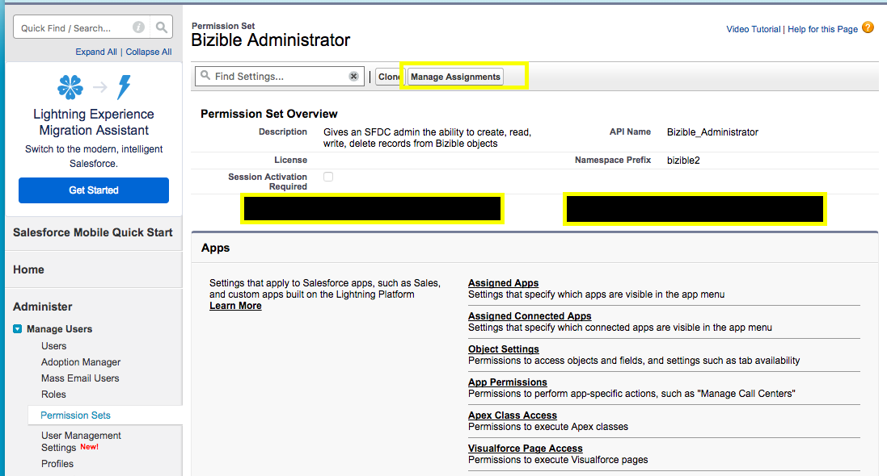

# [!DNL Marketo Measure] 権限セット {#marketo-measure-permission-sets}

Salesforceで[!DNL Marketo Measure]権限セットにアクセスして割り当てる方法について説明します。

## [!DNL Marketo Measure] 権限セット {#marketo-measure-permission-sets-1}

[!DNL Marketo Measure] Salesforce パッケージには、3つの権限セットが含まれています。 これらの権限セットは、管理者、マーケター、標準ユーザーに[!DNL Marketo Measure]へのアクセスを提供します。

Salesforceで権限セットにアクセスして割り当てるには：

1. 「**[!UICONTROL 設定]**」をクリックします。
1. 左マージンで、「**[!UICONTROL ユーザー]**」、「**[!UICONTROL 権限セット]**」の順にクリックします。
1. 割り当てる[!DNL Marketo Measure]権限セットを選択します。
1. 「**[!UICONTROL 割り当てを管理]**」をクリックし、「**[!UICONTROL 割り当てを追加]**」をクリックします。
1. 権限セットのユーザーを選択し、**[!UICONTROL 割り当て]**&#x200B;をクリックします。

   

## [!DNL Marketo Measure]権限セットの説明 {#marketo-measure-permission-sets-explained}

<table> 
 <tbody> 
  <tr> 
   <td><strong>[!DNL Marketo Measure] 管理者</strong></td> 
   <td>SFDC管理者に、[!DNL Marketo Measure] オブジェクトからレコードを作成、読み取り、書き込み、削除する機能を提供します。 [!DNL Marketo Measure]がデータをSFDCにプッシュするライセンスでは、この権限セットを有効にする必要があります。 また、このライセンスには、データをレコードに適用する[!DNL Marketo Measure]前にリードが変換されるシナリオで、コンバージョン済みリードを編集する機能があることをお勧めします。 これにより、Salesforceと[!DNL Marketo Measure]間のレポートの正確性が確保されます。 詳細は<a href="https://help.salesforce.com/articleView?id=release-notes.rn_sales_leads_view_converted.htm&amp;type=5&amp;release=206&amp;language=en_us">こちら</a>をご覧ください。</td> 
  </tr> 
  <tr> 
   <td><strong>[!DNL Marketo Measure] マーケティングユーザ</strong></td> 
   <td>マーケティングユーザーに、[!DNL Marketo Measure] オブジェクトからのレコードの読み取りと書き込みを許可します。 マーケティング チームのすべてのメンバーは、[!DNL Marketo Measure] マーケティングユーザー権限セットを有効にする必要があります。  </td> 
  </tr> 
  <tr> 
   <td><strong>[!DNL Marketo Measure] 標準ユーザー</strong></td> 
   <td>ユーザーに[!DNL Marketo Measure] オブジェクトからレコードを読み取る機能を提供します。</td> 
  </tr> 
 </tbody> 
</table>

インバウンドセールス開発チームとアカウントの上級管理職は、[!DNL Marketo Measure]件のデータから恩恵を受けることができます。 これらの役割がレポートで[!DNL Marketo Measure] データを使用する場合は、[!DNL Marketo Measure]標準ユーザー権限セットを有効にします。

>[!NOTE]
>
>さらに、接続しているユーザーがCampaign オブジェクトにアクセスするには、ユーザーレベルで「マーケティングユーザー」 [!DNL Salesforce] プロファイルを有効にする必要があります。 これを確認するには、**[!UICONTROL 設定]** > **[!UICONTROL ユーザーの管理]** > **[!UICONTROL プロファイル]** > **[!UICONTROL マーケティングユーザー]** > **割り当てユーザー**&#x200B;をクリックします。
