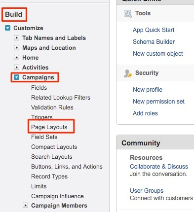
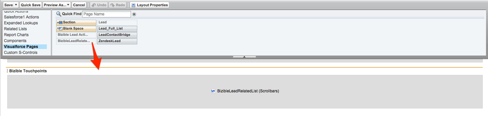

# ページレイアウトの手順 {#page-layout-instructions}

>[!NOTE]
>
>&quot;[!DNL Marketo Measure]」 （アドビのドキュメント内）。ただし、CRM には「Bizible」が表示されます。 アドビは現在、その更新をおこなっており、ブランディングの変更が CRM に反映される予定です。

簡単に見るには [!DNL Marketo Measure] データを更新する場合、 [!UICONTROL アカウント], [!UICONTROL 連絡先], [!UICONTROL リード], [!UICONTROL 商談]、および [!UICONTROL Campaign] オブジェクト。 手順は、以下の各オブジェクトページレイアウトで分類されます。

まず、 [!DNL Salesforce] 設定を行い、 [!UICONTROL カスタマイズ] タブをクリックします。

## Campaign オブジェクト {#campaign-object}

以下を追加することをお勧めします。 [!DNL Marketo Measure] フィールドを SFDC Campaign に追加し、サンドボックスにのみ使用できます。 このフィールドを使用して、タッチポイントの生成をテストできます。 実稼動環境では、 [!DNL Marketo Measure] タッチポイント日付の一括更新ボタン。 この [!DNL Marketo Measure] フィールドを実稼動環境に追加しました。

1. 「ビルド」オプションで、「 **[!UICONTROL キャンペーン]**.

1. 「**[!UICONTROL ページレイアウト]**」をクリックします。

   

1. クリック **[!UICONTROL 編集]** をクリックします。

   

1. 内 [!UICONTROL フィールド] オプションを選択し、 **[!UICONTROL 購入者タッチポイントの有効化]** 「 」フィールドをクリックし、ページ上の任意の場所にドラッグします。 次に、 **[!UICONTROL タッチポイントの開始日]** および **[!UICONTROL タッチポイント終了日]** フィールド。

   

1. 次に、ページ上部で、「[!UICONTROL ボタン]」オプションを使用します。

1. 次をドラッグ： **[!UICONTROL タッチポイント日の一括更新]** ボタンをクリックして、カスタムボタンセクションに追加します。

   

1. 「**[!UICONTROL 保存]**」をクリックします。

   >[!NOTE]
   >
   >複数のキャンペーンレコードタイプを使用する場合、 **[!UICONTROL 購入者タッチポイントの有効化]** フィールドを更新する必要があります。 参照してください [この記事](/help/channel-tracking-and-setup/offline-channels/configurations-for-multiple-campaign-record-types.md) 」を参照してください。

## リード {#leads}

1. 「ビルド」オプションで、「 **[!UICONTROL リード]**.

1. 「**[!UICONTROL ページレイアウト]**」をクリックします。

1. クリック **[!UICONTROL 編集]** をクリックします。 複数のページレイアウトに「 Buyer Touchpoints 」セクションを含めることができます。

1. クイック検索メニュー内の左側にある [VisualForce] ページオプションをクリックします。

1. 新しいセクションを作成し、「Buyer Touchpoints」という名前を付けます。

   >[!NOTE]
   >
   >各セクションで「1 列」の形式を選択します。

1. 次をドラッグ： **[!UICONTROL Marketoリード関連リストを測定]** VisualForce ページをページレイアウトセクションに挿入します。

   

1. 内のレンチをクリックします。 [!DNL VisualForce] 「高さ」を「100」に変更し、スクロールバーを有効にします。

1. メニューに戻り、 [!UICONTROL キャンバスアプリ] を参照し、タッチポイントの下に「Marketo Measure Insights」という新しいセクションを作成します。 [!DNL VisualForce] セクションを作成しました。

   >[!NOTE]
   >
   >各セクションで「1 列」の形式を選択します。

1. 次をドラッグ： [!DNL Marketo Measure Insights] キャンバスアプリを新しく作成されたセクションに移動します。 「**保存**」をクリックします。Salesforce が即座に認識しないので、キャンバスアプリにドロップする前に最初にページレイアウトを保存する必要が生じる場合があります。 したがって、新しいセクションを作成した後、ページレイアウトを保存し、再度編集して、そのセクション内にキャンバスアプリをドラッグします。 これは、すべてのオブジェクトに適用されます。

   >[!NOTE]
   >
   >の [!DNL Marketo Measure Insights] キャンバスアプリが正しく機能しない問題を修正しました。 [権限は適切に設定する必要があります](/help/configuration-and-setup/marketo-measure-insights-canvas-app/marketo-measure-insights-configuration.md).

   >[!TIP]
   >
   >(FT) または (LC) で終わるフィールドは、以前のからの従来のフィールドなので、ほとんどのお客様は使用しません。 [!DNL Marketo Measure] タッチポイントはオブジェクトとして存在していました。

を [!DNL Marketo Measure] ABM 機能 [他のページレイアウトの手順については、ここをクリックしてください](/help/advanced-marketo-measure-features/account-based-marketing/account-based-marketing-overview.md).

## 取引先責任者 {#contacts}

1. 「ビルド」オプションで、「 **[!UICONTROL 連絡先]**.

1. 「**[!UICONTROL ページレイアウト]**」をクリックします。

1. 編集するページレイアウトを選択します。

   クイック検索メニュー内の「関連リスト」オプションに移動し、 **[!UICONTROL 購入者タッチポイント]** 関連するリスト。

1. レンチアイコンをクリックし、次の列をこの順序で追加します。

   * 購入者タッチポイント
   * マーケティングチャネル
   * Touchpointソース
   * 広告キャンペーン名
   * Touchpointの位置
   * Touchpoint日

1. 並べ替え基準：タッチポイント日（昇順）。

   

1. 「ボタン」オプションを展開し、選択を解除します。 **[!UICONTROL 新規]**.

   

1. に戻ります。 [!UICONTROL 関連リスト] オプションを選択し、 **[!UICONTROL 購入者の属性タッチポイント]** 関連するリスト。

1. レンチアイコンをクリックし、次の列をこの順序で追加します。

   * 属性タッチポイント
   * マーケティングチャネル
   * 商談
   * 広告キャンペーン名
   * Touchpointのタイプ
   * Touchpointの位置
   * 属性% W 字形 (_または最も堅牢なアトリビューションモデル（フルパスやカスタムなど）_)
   * 売上高 W 字型 (_または最も堅牢なアトリビューションモデル（フルパスやカスタムなど）_)
   * Touchpoint日

1. タッチポイントで並べ替え [!UICONTROL 日付] > [!UICONTROL 昇順].

1. 「ボタン」セクションを展開し、選択を解除します。 **[!UICONTROL 新規]**.

1. 「**[!UICONTROL 保存]**」をクリックします。

## 商談 {#opportunities}

1. 「ビルド」オプションで、「 **[!UICONTROL 商談]**.

1. 「**[!UICONTROL ページレイアウト]**」をクリックします。

1. 編集するページレイアウトを選択します。

1. を **[!UICONTROL 購入者の属性タッチポイント]** 関連するリストを表示し、レンチをクリックして、商談の次の列を追加します。

   * 属性タッチポイント
   * マーケティングチャネル
   * 取引先責任者
   * 広告キャンペーン名
   * Touchpointのタイプ
   * Touchpointの位置
   * 属性% W 字形 (_または最も堅牢なアトリビューションモデル（フルパスやカスタムなど）_)
   * 売上高 W 字型 (_または最も堅牢なアトリビューションモデル（フルパスやカスタムなど）_)
   * Touchpoint日

1. 並べ替え基準 [!UICONTROL タッチポイント日] > [!UICONTROL 昇順].

1. 選択を解除 **[!UICONTROL 新規]** 内 [!UICONTROL ボタン] 」セクションに入力します。

1. 「**[!UICONTROL 保存]**」をクリックします。

## アカウント {#accounts}

1. 「ビルド」オプションで、「 **[!UICONTROL アカウント]**.

1. 「**[!UICONTROL ページレイアウト]**」をクリックします。

1. 編集するページレイアウトを選択します。

1. を **[!UICONTROL 購入者の属性タッチポイント]** 関連リストを表示し、レンチをクリックして、次の列を追加します。

   * 属性タッチポイント
   * マーケティングチャネル
   * 商談
   * 広告キャンペーン名
   * Touchpointのタイプ
   * Touchpointの位置
   * 属性% W 字形 (_または最も堅牢なアトリビューションモデル（フルパスやカスタムなど）_)
   * 売上高 W 字型 (_または最も堅牢なアトリビューションモデル（フルパスやカスタムなど）_)
   * Touchpoint日

1. タッチポイント日/昇順で並べ替えます。

1. 選択を解除 **[!UICONTROL 新規]** 内 [!UICONTROL ボタン] 」セクションに入力します。

1. 「**[!UICONTROL 保存]**」をクリックします。

を [!DNL Marketo Measure] ABM 機能  [他のページレイアウトの手順については、ここをクリックしてください](/help/advanced-marketo-measure-features/account-based-marketing/account-based-marketing-overview.md).
