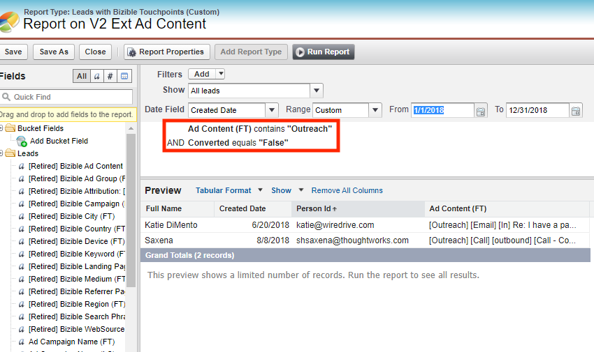
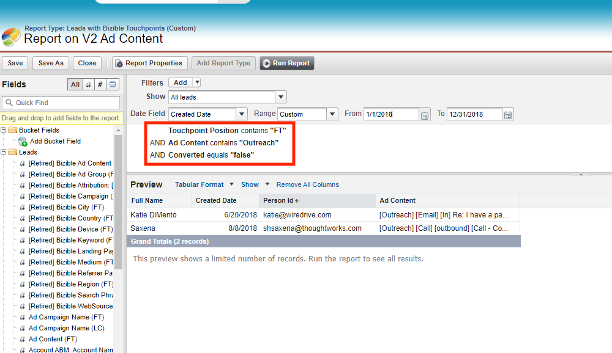

# [!DNL Salesforce] パッケージの統合 {#salesforce-package-consolidation}

ユーザーエクスペリエンスを向上させ、使用を簡素化するために、既存のパッケージは単一の包括的なパッケージにコンパイルされています。

## パッケージの廃止 {#package-retirement}

この統合の結果、現在のV1、V2_EXT、V2_Security、およびすべてのレポートパッケージは、2023年8月以降に廃止されます。 V2 パッケージが既にインストールされている場合は、新しい統合バージョンに更新する必要があります。

## 新しい統合パッケージ {#new-consolidated-package}

新しい統合V2 パッケージには、以前のパッケージのすべての機能が組み込まれており、ユーザーエクスペリエンスが向上しています。 この更新されたパッケージにより、マーケティングとセールスのパフォーマンス追跡がより効率的になり、顧客行動に関するより深いインサイトが可能になります。

レポート機能を強化するための新しいフィールドが2つあります。

* form_name：BT/BAT オブジェクトで使用できるようになったこのフィールドにより、ユーザーはフォーム名に基づいてレポートを作成できます。
* user_touchpoint_id：このフィールドを使用すると、一意のユーザータッチポイント数（`bizible2__User_Touchpoint_V2__c` Salesforce）を持つレポートを作成できます。

## サポートと移行 {#support-and-transition}

[&#x200B; サポートチーム &#x200B;](https://nation.marketo.com/t5/support/ct-p/Support){target="_blank"}は、質問に答え、新しい統合パッケージへのスムーズな移行を支援するために利用できます。

## 必要なアクション {#retired-actions}

* V2 パッケージが既にインストールされている場合は、新しい統合バージョンに更新する必要があります。
* 任意のレポートパッケージのレポートまたはダッシュボードがある場合は、すべてのフィールドが統合パッケージに存在するため、変更を必要とせずに簡単に再作成できます。
* V2_EXT パッケージのフィールドを使用してレポートを作成する場合は、次の手順に従って統合パッケージでレポートを再作成できます。
   * V2_EXT フィールドのすべてのデータはタッチポイントフィールドで使用できるので、レポートを変更して、タッチポイントの位置にフィルターを追加することで、対応するV2 タッチポイントフィールドからデータを取得できます。
   * 「アウトリーチ」テキストを含む広告コンテンツ FTを含むすべてのリードを取得するレポートの例。
      * V2_EXT クエリ：
         * bizible2_ext__Ad_Content_FT__c contains Outreach

* 統合パッケージ内の対応するクエリ：
   * bizible2__Touchpoint_Position__cにはFT ANDが含まれます
   * bizible2__Ad_Content__c contains Outreach

## よくある質問 {#faq}

**統合パッケージは、既存のパッケージのフィールドと競合しますか？**

統合パッケージをインストールする前に、パッケージをアンインストールする必要はありません。 フィールドは異なる名前空間にあるため、競合はありません。

**現在のパッケージのデータをバックフィルするにはどうすればよいですか？**

BT/BAT データのバックフィルと再処理を行い、タッチポイント IDおよびフォーム ID フィールドに入力するために、サポート [&#128279;](https://nation.marketo.com/t5/support/ct-p/Support){target="_blank"}を含むチケット を提出できます。

**V1およびV2_EXT パッケージのフィールドは、統合パッケージで利用できますか？**

はい。 統合パッケージには、V1に同じフィールドが含まれ、オブジェクトによる分類が追加され、タッチポイントフィールドを介したV2_EXT フィールドが追加されます。

**V2_EXT フィールドを使用するレポートを統合パッケージで再作成できますか？**

はい。 「[必要なアクション &#x200B;](#retired-actions)」セクションの手順に従います。
