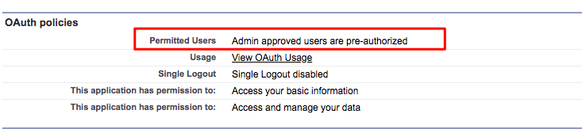

# [!DNL Marketo Measure] Insights 設定 {#marketo-measure-insights-configuration}

[!DNL Marketo Measure] Insights キャンバスアプリはリードページレイアウトに追加する必要がありますが、リー [!DNL Salesforce] 設定の「接続されたアプリ」セクションで追加の設定が必要です。 キャンバスアプリに適切な権限を持たせるには、次の手順に従います。

1. 設定 [!DNL Salesforce] 移動し、「**[!UICONTROL アプリを管理]** タブの下の [!UICONTROL  接続されたアプリ ] をクリックします。

1. 入力する [!DNL Marketo Measure Insights] をリストから選択します。

1. 「[!UICONTROL OAuth] ポリシー」セクションで、「許可されたユーザー」設定を「管理者の承認済みユーザーは事前承認済みです」に変更します。 ポップアップが表示されたら、「**[!UICONTROL OK]**」、「**[!UICONTROL 保存]** の順にクリックします。

   

1. ページを保存したら、「**[!UICONTROL プロファイルを管理]** ボタンをクリックできます。

   

1. [!DNL Marketo Measure] Insights へのアクセス権を持つすべてのプロファイルを選択し、「**[!UICONTROL 保存]** をクリックします。
