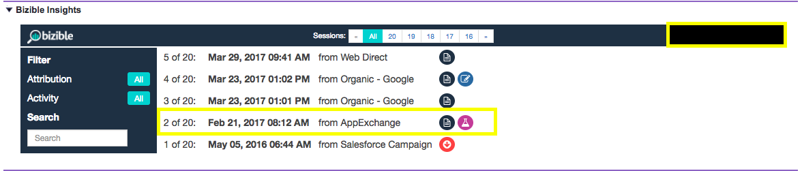

# [!DNL Marketo Measure] Insights の説明 {#marketo-measure-insights-explained}

詳しくは、 [!DNL Marketo Measure] のインサイトビュー [!DNL Salesforce]様々なアイコンの内容や機能の使用方法などを示します。 この機能は、リード、連絡先またはアカウントの最初の 20 セッションを確認する場合に最も役立ちます。

が [!DNL Marketo Measure] javascript を使用して Web サイトのフォームに入力すると、そのユーザーがシステムのリードになり、デジタルマーケティングデータが Salesforce(SFDC) 組織にプッシュされます。 この場合、タッチポイントデータが [!DNL Marketo Measure] リード/連絡先/商談/アカウントオブジェクトの「リードインサイト」セクション（キャンバスアプリ）

まず、インサイトの真ん中に、その人が Web サイトで過ごしたセッション数が表示されます。 これらのセッションをスクロールして、自由に移動できます。

インサイトの中央上部にある「すべて」をクリックすると、すべてのセッションのロールアップを確認できます。 個々のセッションの日付、どのチャネルやソースがこれらを駆動したか、および詳細を指定する一連のアイコンを理解できます。

最初に表示されるのは、FT または LC アイコンです。 これらは、リストされたセッションのタッチポイントの位置を表します。 特に、FT はファーストタッチを表し、LC はリード作成を表します。 複数のセッションを持つことができますが、FT または LC を持つことができるタッチポイントは 1 つだけです。 1 人の担当者に関連付けられた複数の FT または LC が見つかることはありません。

紙のようなアイコンは、セッション内でページビューが発生したことを示します。 すべてのセッションにこのアイコンが含まれる可能性があります。

ビーカーのようなアイコンは、A/B テストの実験が発生したことを示します。 現時点では、Optimizely および VWO と統合されています。 この統合により、ユーザーが閲覧した実験とバリエーションを特定のセッションでプッシュできます。

特定のセッションをクリックすると（セッションの実際の日付をクリックするか、グループ化されたセッションの上部中央にある）、セッションの詳細が表示されます。 各セッションでは、ユーザーが閲覧した特定のページをすべて日時順に表示できます。

各セッションの右側には、 [!DNL Marketo Measure] フィールドを設定します。 この例では、広告グループ、広告コンテンツ、キャンペーン、キーワード、メディアを表示できます。 下にスクロールして、 [!DNL Marketo Measure] 提供するデータ。

最後に、ユーザーが無数のセッションをおこなったら、 [!UICONTROL インサイト] を使用して、サイト上でのエンゲージメントの特定の部分を探します。 次の条件でフィルターできます。 [!UICONTROL タッチポイントの位置] 例：

また、ページビュー数、AB テストまたはFormsで検索できます。
