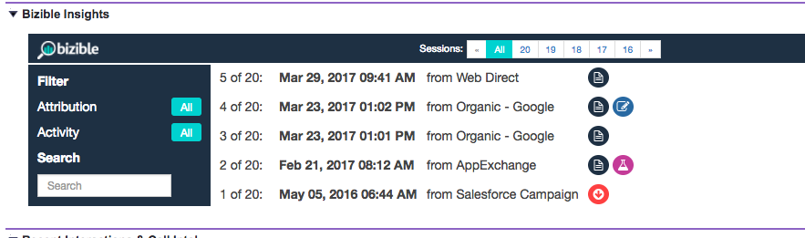
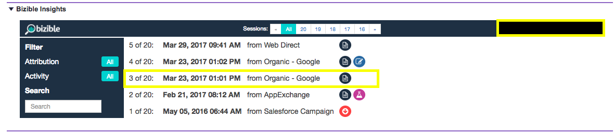
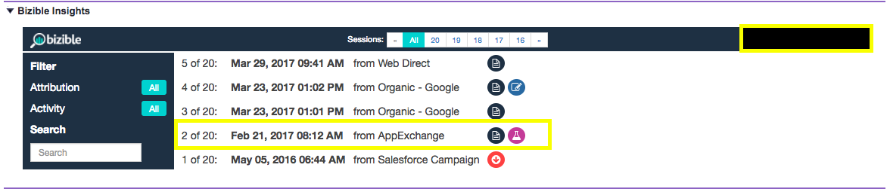
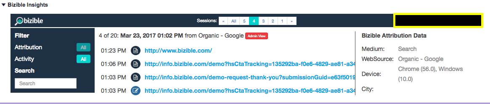

# [!DNL Marketo Measure] Insights の説明 {#marketo-measure-insights-explained}

様々なアイコンが何を表しているか、機能の使用方法など、[!DNL Salesforce]の[!DNL Marketo Measure] インサイトビューについて説明します。 この機能は、リード、取引先責任者、アカウントの最初の20件のセッションを確認するのに最も便利です。

[!DNL Marketo Measure] JavaScriptで追跡され、web サイトでフォームに入力すると、その人物はシステムのリードとなり、そのデジタルマーケティングデータはSalesforce （SFDC）組織に送信されます。 この場合、リード/取引先責任者/商談/アカウントオブジェクトの「[!DNL Marketo Measure] リードインサイト」セクション（キャンバスアプリ）にタッチポイントデータが入力されます。

まず、インサイトの中央に、その人がweb サイトで行ったセッションの数が表示されます。 これらのセッションをスクロールして、自由に移動できます。

インサイトの中上部にある「すべて」をクリックすると、すべてのセッションのロールアップを確認できます。 個々のセッションの日付、これらの要因となったチャネルやソース、詳細な情報を指定する一連のアイコンを確認できます。

最初に表示されるのは、FTまたはLCのアイコンです。 リストアップされたセッションのタッチポイント位置を表します。 具体的には、FTは「First Touch」を表し、LCは「Lead Creation」を表します。 複数のセッションを使用できますが、FTまたはLCは1つのタッチポイントのみを使用できます。 1人に関連付けられている複数のFTまたはLCが見つかりません。

紙のように見えるアイコンは、セッション内でページビューが発生したことを示しています。 すべてのセッションにこのアイコンが含まれている可能性があります。

ビーカーのように見えるアイコンは、A/B テスト実験が発生したことを示します。 この時点でOptimizerとVWOと統合しています。 この統合により、ユーザーが特定のセッションで見た実験やバリエーションをプッシュすることができます。

特定のセッションをクリックした場合（セッションの実際の日付またはグループ化されたセッションの上部の中央部分をクリックして実行できます）、セッションの詳細を確認できます。 各セッションでは、ユーザーが閲覧した特定のページを、日時ごとに表示できます。

各セッションの右側には、SFDCの[!DNL Marketo Measure] フィールドをプッシュしている詳細なマーケティングデータの詳細が表示されます。 この例では、Ad Group、Ad Content、Campaign、Keyword、Mediumが表示されます。 下にスクロールして、提供される[!DNL Marketo Measure] データの詳細を表示することもできます。

最後に、オーディエンスのセッション数が無数に増えた後は、[!UICONTROL  インサイト ]内でいくつかのフィルターを使用して、サイトでのエンゲージメントの特定の部分を検索できます。 例えば、[!UICONTROL  タッチポイント位置]でフィルタリングできます。

ページビュー、AB テスト、Formsで検索することもできます。
