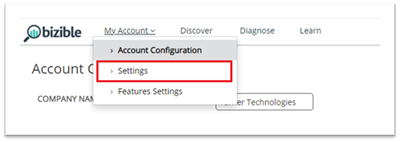
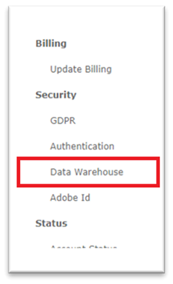
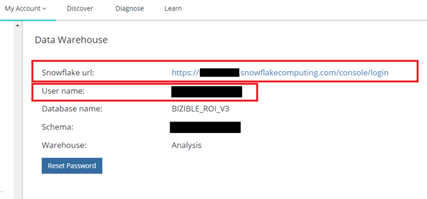
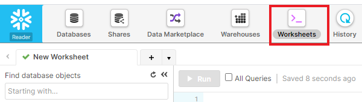
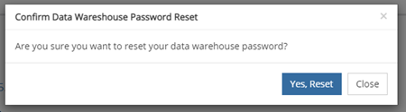

# データウェアハウスへのアクセス - Reader アカウント {#data-warehouse-access-reader-account}

## Snowflake Access Link {#snowflake-access-link}

Snowflake データウェアハウスにアクセスするには、Snowflake アカウントの特定のURLに移動する必要があります。 このアクセス リンクを見つけるには、[!DNL Marketo Measure]にログインし、次の手順に従ってData Warehouse情報ページに移動します。

1. [!DNL Marketo Measure]で、ページの上部にある「**[!UICONTROL 自分のアカウント]**」 > 「**[!UICONTROL 設定]**」をクリックします。

   」をクリックします

1. 左側のメニューの「セキュリティ」で、「**[!UICONTROL Data Warehouse]**」をクリックします。

   

1. このページには、Snowflake データウェアハウスへのリンクとユーザー名が表示されます。

   へのリンクがあります

   >[!NOTE]
   >
   >これは、個人ユーザーだけでなく、組織でも利用できる読み取り専用のアカウントです。 [!DNL Marketo Measure]へのアクセス権を持つ組織内のユーザーは、このアカウントを使用してSnowflake Data Warehouse reader アカウントにログインできます。

1. Snowflake URLに記載されているリンクをクリックすると、Snowflake ログインページに移動し、ユーザー名とパスワードを入力します。 _パスワードをお持ちでない場合は、次の手順に従ってパスワードをリセットしてください_。

   が表示されます

1. ログインしたら、ページ上部の「**[!UICONTROL ワークシート]**」をクリックします。

   」をクリックします

1. BIZIBLE_ROI_V3 データベースオブジェクトは、画面の左側にあります。 クエリウィンドウの上部にあるドロップダウンオプションから、「ウェアハウス」、「データベース」および「スキーマ」を入力します。 選択肢はそれぞれにつき1つだけ必要です。 これで、Snowflakeのクエリエディターでクエリを実行する準備が整いました。

   の左側にあります

## パスワードのリセット {#reset-your-password}

[!DNL Marketo Measure]さんには、Snowflakeのログインパスワードへのアクセス権がありません。 パスワードをリセットする必要がある場合は、Data Warehouseの情報ページの「[!UICONTROL &#x200B; パスワードをリセット &#x200B;]」ボタンをクリックし、指示に従います。 一時的なパスワードがUIにすぐに表示されます。 次のデータウェアハウスのログイン時に、独自のパスワードを作成するように求められます。

>[!NOTE]
>
>* パスワードをリセットすると、現在ログインしているユーザーだけでなく、組織内のすべての[!DNL Marketo Measure] ユーザーに対してパスワードがリセットされます。
>* UIには一時パスワードのみが表示されます。 メールは送信されません。

になります

になります

## サードパーティ製ツールを介してSnowflakeに接続する {#connecting-to-snowflake-via-third-party-tools}

Snowflakeとサードパーティ製品を連携させるには、いくつかの情報を入力する必要があります。

>[!NOTE]
>
>各ツールには異なる接続要件があります。接続しようとしている特定のツールのドキュメントを参照することをお勧めします。

* **URI** （常に必須）
   * これは、Snowflake アカウントのドメイン名です。 これは、Snowflake ログインリンクの一部に含まれています。
* **ユーザー名** （常に必須）
   * ユーザー名は、[!DNL Marketo Measure]のData Warehouse情報ページに表示されます。
* **パスワード** （常に必須）
   * これは、Snowflake アカウントに初めてログインしたときに設定したパスワードです。 パスワードをリセットするには、上記の手順を参照してください。
* **データベース名** （必ずしも必須ではありません）
   * データベースは、Snowflakeのデータを格納する場所です。 これはストレージリソースです。 データベース名は、[!DNL Marketo Measure]のData Warehouse情報ページに一覧表示されます。
* **ウェアハウス名** （必ずしも必須ではありません）
   * Snowflakeでは、クエリを実行するのがデータウェアハウスです。 計算リソースです。 ウェアハウス名は、[!DNL Marketo Measure]のData Warehouse情報ページに表示されます。

  です
