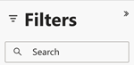
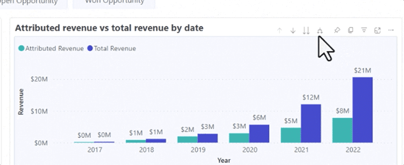
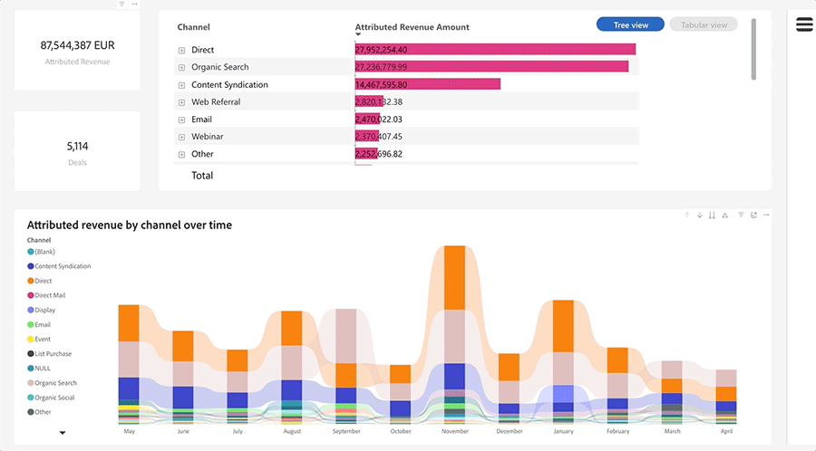

# Discover ダッシュボードの基本 {#discover-dashboard-basics}

この記事では、再設計されたインターフェイスの基本機能について説明し、データに容易にアクセスして解釈できるようにします。 フィルターペインのダイナミクスを詳しく説明し、ドリル機能、クロスフィルタリング、ツールヒントなど、強化されたレポート機能の複雑さを明らかにします。

## フィルターパネル {#filter-pane}

あらゆるダッシュボードにはさまざまなフィルターが用意されており、シームレスなナビゲーションとカスタマイズを実現するために、次のような管理機能が備わっています。

| 名前 | 説明 |
| --- | --- |
| フィルター切り替えボタン | フィルターペインを開くか閉じるかを切り替えます。 |
| 検索バー | フィルターパネルの上部にある検索を使用して、特定のフィルターを検索します。 各フィルターには、独自の検索バーもあります。 |
| フィルターボタンをクリア | フィルターをクリアするには、各フィルターの右上隅にある消しゴムアイコンをクリックします。 |
| 「適用」ボタン | クリックして、ダッシュボードでフィルターの変更を確認し、実装します。 |

## ビジュアル上のフィルター {#filters-on-visual}

ビジュアルの右上隅にマウスポインターを置くと、適用されたフィルターの読み取り専用リストが表示されます。

が表示されます

## レポート機能 {#report-capabilities}

### ドリルダウンして上へ {#drill-down-and-up}

* ビジュアルにカーソルを合わせると、ビジュアルに階層があるかどうかを識別できます。アクションバーにドリルコントロールオプションが表示されていれば、この状態が示されます。

* 灰色の背景でハイライト表示された単一の下向き矢印をクリックして、ドリルダウンを有効にします。 元に戻すには、ドリルアップアイコンを使用します。

一度に1つのフィールドをドリルダウンするには、ドリルダウンアイコンをオンにして、バーなどのビジュアル要素を選択します。

二重矢印ドリルダウンアイコンを使用して、次の階層レベルに進みます。

フォークのようなアイコンを使用して、現在のビューに階層レベルを追加します。

に階層レベルを追加します

### ドリルスルー {#drill-through}

ビジュアルの背後にあるデータを調べるには、ビジュアル要素を右クリックし、「ドリルスルー」オプションを選択します。

### データの書き出し {#export-data}

ビジュアルから基になるデータを書き出すには、右上隅にカーソルを合わせます。 「その他のオプション」ボタンをクリックし、「データの書き出し」を選択し、好みの形式を選択してから「書き出し」をクリックします。

### フォーカスモード {#focus-mode}

特定のビジュアルまたはタイルをズームインするには、右上隅にカーソルを合わせて「フォーカス」ボタンを選択します。

にカーソルを合わせます

### クロスフィルタリング {#cross-filtering}

1つのビジュアライゼーションで値または軸ラベルを選択すると、レポートページ上の他のビジュアルがクロスフィルターされ、関連するフィルター済みデータのみが表示されます。

がクロスフィルターされます

### ツールチップ {#tooltips}

ツールヒントには、表示されるデータに関する補足情報が表示されます。 ビジュアル要素にカーソルを合わせると、コンテクスト形式のツールヒントがポップアップ表示され、その特定のデータポイントに関連するインサイトや説明が表示されます。

