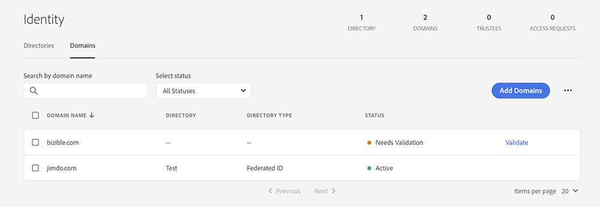
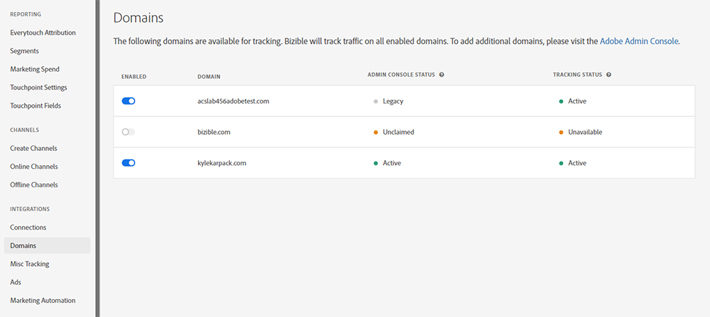
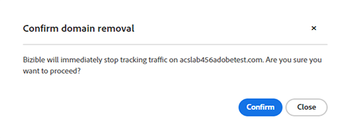

# ドメインの管理 {#domain-management}

Experience Cloud インターフェイスで [!DNL Marketo Measure] を実行している IMS 対応テナントの場合、[!DNL Marketo Measure] には、ユーザーが独自のドメインのリストを管理できるインターフェイスが用意されています。[!DNL Marketo Measure] ユーザーは、まず、[&#128279;](https://adminconsole.adobe.com/)0&rbrace;Adobe Admin Console&rbrace; で追跡するドメインを検証する必要があります。 Admin Consoleでドメインを検証すると、web サイトトラフィックの追跡にこれらのドメインを使用 [!DNL Marketo Measure] るかどうかを管理できます。

## Admin Consoleでのドメインの追加 {#adding-domains-in-admin-console}

Adobe Admin Consoleへのアクセス権を持つ IMS ユーザーは、所有するドメインを追加および検証できます。 ドメインの検証では、ドメインごとに DNS レコードを追加し、Admin Consoleでそのレコードを検証できるようにします。

 の項目を追加できます。

ドメインの追加手順については、[Admin Console ドキュメント &#x200B;](https://helpx.adobe.com/jp/enterprise/using/add-domains-directories.html) を参照してください。 ドメインを追加したら、そのドメインを [&#x200B; ディレクトリにリンク &#x200B;](https://helpx.adobe.com/jp/enterprise/using/add-domains-directories.html#link-domains-to-directoies) する必要があります。

## [!DNL Marketo Measure] でのドメインの管理 {#managing-domains-in-marketo-measure}

ドメインがAdmin Consoleに追加されると、[!DNL Marketo Measure] はこのレコードをデータベースに定期的に同期します。 この同期は夜間に行われ、また、ユーザーが [!DNL Marketo Measure] UI の **[!UICONTROL ドメイン]** ページにアクセスするたびに行われます。 デフォルトでは、読み込み対象のレコード [!DNL Marketo Measure] 無効になっており、テナントは各ドメインを手動で有効にする必要があります。

**[!UICONTROL 統合]**/**[!UICONTROL ドメイン]** ページには、Admin Consoleに登録したすべてのドメインがステータスと共に表示されます。 各ドメインは、有効または無効にできます。 ドメインが有効になっている場合、[!DNL Marketo Measure] のトラッキングは、そのドメインで発生するトラフィックを収集します。 ドメインが無効の場合、[!DNL Marketo Measure] はそのドメインからのトラフィックを無視し、タッチポイントや他のデータを作成しません。[!DNL Marketo Measure] ドメインの無効化を確認し、影響が生じていることを警告します。

ドメインの切り替えの影響は即座に生じ、変更はさかのぼって適用されません。 今後、[!DNL Marketo Measure] は、設定された期間の後に、無効なドメインからデータをパージします。

## 状態 {#statuses}

Admin Consoleのステータスは次のように分類されます。

* **検証済み**：このドメインはAdmin Consoleで検証されています
* **未検証**：このドメインはAdmin Consoleで完全には検証されておらず、[!DNL Marketo Measure] でのトラッキングには適していません
* **無効**：このドメインは有効期限が切れているか、Admin Consoleから削除されている可能性があります。 [!DNL Marketo Measure] 内の追跡データに削除のフラグが設定されました
* **従来**：このドメインは [!DNL Marketo Measure] で作成されたもので、Admin Consoleには存在しません

トラッキングステータスは次のようになります。

* **ACTIVE**:[!DNL Marketo Measure] はこのドメインからデータを受信しています
* **DISABLED**：このドメインはトラッキングに使用できますが、無効になっています
* **利用不可**：このドメインは検証されていないため、追跡には利用できません

個々のステータストリガーの上にマウスポインターを置くと、そのステータスについて詳しく説明するツールチップが表示されます。

## よくある質問 {#faq}

**Admin Consoleでドメインが削除されるとどうなりますか？**

Admin Consoleでドメインを削除すると、[!DNL Marketo Measure] はそのドメインを削除済みとしてマークします。[!DNL Marketo Measure] このドメインの追跡トラフィックを直ちに停止しますが、以前に収集したデータは削除されません。

**ドメインを有効にできないのはなぜですか？**

このページでドメインの選択を許可しない理由はいくつかあります。 ドメインがAdmin Consoleで検証されない場合は、[!DNL Marketo Measure] では使用できません。 同様に、現在の [!DNL Marketo Measure] テナントとは異なるAdobe組織がドメインを所有している場合は、選択できない可能性があります。

**このリストからドメインを削除するにはどうすればよいですか？**

ドメインで「有効」スイッチがオフになっている場合、[!DNL Marketo Measure] は無視し、実質的に [!DNL Marketo Measure] から削除されます。 ドメインを [!DNL Marketo Measure] から完全に削除するには、[!DNL Marketo Measure] で無効にしてから、Admin Consoleから削除する必要があります。
