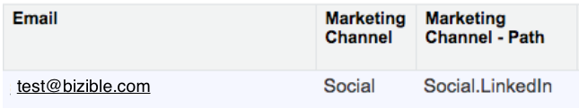

# Marketo Measureフィールドの用語集 {#glossary-of-marketo-measure-fields}

この記事では、Marketo Measureベースパッケージから Salesforce に追加されるすべてのMarketo Measureフィールドの用語集を提供します。 また、フィールドが見つかるオブジェクト、および各フィールドに情報が入力される方法に関する情報も確認できます。

各Marketo Measureフィールドが関連するオブジェクトのマップについては、 [ここをクリック](/help/configuration-and-setup/marketo-measure-and-salesforce/marketo-measure-object-and-field-taxonomy.md).

[A](#a) ・ [B](#b) ・ [C](#c) ・ [D](#d) ・ [E](#e) ・ [金](#f) ・ [G](#g) ・ H ・ I ・ J ・ [K](#k) ・ [L](#l) ・ [M](#m) ・ N ・ [O](#o) ・ [P](#p) ・ Q ・ [R](#r) ・ [S](#s) ・ [T](#t) ・ [U](#u) ・ [V](#v) ・ W ・ X ・ Y ・ Z

## A {#a}

**アカウント** |購入者属性タッチポイントで見つかりました

このフィールドには、BAT に関連付けられたアカウント名が入力されます。

**広告キャンペーン ID** |購入者タッチポイント、購入者属性タッチポイントで見つかりました

このフィールドに値を入力する方法は 3 つあります。

`1)` タッチポイントが有料検索（AdWords または BingAds）から取得された場合、広告プラットフォームの広告キャンペーン ID はここに表示されます。

`2)` タッチポイントが有料検索から来ていない場合、ランディングページの URL の utm_campaign 値を使用してフィールドに値が入力されます。

例: `http://info.marketomeasure.com/adwords-for-lead-generation?utm_source=Event&utm_medium=booth&utm_campaign=Marketo%20Virtual%20Event%20sep2014`

この例では、広告キャンペーン ID は次のように表示されます。 __GAId__ 2014 年 9 月のマーケティング仮想イベント

`3)` タッチポイントがオフラインの Salesforce キャンペーン（会議、ディナーなど）から取得された場合、広告キャンペーン ID は Salesforce キャンペーン ID を表示します

上記のいずれにも該当しない場合、このフィールドは空白になります。

**広告キャンペーン名** |購入者タッチポイント、購入者属性タッチポイント

`1)` タッチポイントが有料検索 (AdWords/Bing Ads) から取得された場合、広告プラットフォームの広告キャンペーン名がここに表示されます。

`2)` タッチポイントが有料検索から来ておらず、ランディングページの URL に utm_campaign の値が含まれている場合は、その値がここに入力されます。

`3)` タッチポイントが Salesforce キャンペーンから来た場合は、Salesforce キャンペーンの名前がここに表示されます。

`4)` これには、Marketo Measureアカウント内で作成された、アクティビティから生成されたタッチポイントに定義されたキャンペーン名が入力されます。

上記のいずれにも該当しない場合、このフィールドは空白になります。

**広告キャンペーン名 (FT)** |購入者タッチポイント

このフィールドは、広告キャンペーン名と同じ方法で入力されます。 ただし、このフィールドには、ファーストタッチタッチポイントを生成した広告キャンペーンの名前が具体的に表示されます。

**広告キャンペーン名 (LC)** |購入者タッチポイント

このフィールドは、広告キャンペーン名と同じ方法で入力されます。 ただし、このフィールドには、リード作成タッチポイントを生成した広告キャンペーンの名前が具体的に表示されます。

**広告コンテンツ** |購入者タッチポイント、購入者属性タッチポイント

`1)` タッチポイントが有料検索（AdWords/Bing 広告）からの場合、このフィールドには広告プラットフォームからの完全な広告コピーが表示されます。

`2)` タッチポイントが有料検索からのものでない場合、このフィールドにはランディングページの URL の utm_content 値が表示されます。

`3)` タッチポイントを生成した関連するアクティビティの件名値が入力されます。

上記のいずれにも該当しない場合、このフィールドは空白になります。

**広告のリンク先 URL** |購入者タッチポイント、購入者属性タッチポイント

`1)` タッチポイントが有料検索からのものである場合、このフィールドには、検索エンジンで広告をクリックした後にリダイレクトされた URL の宛先が表示されます。

タッチポイントが有料検索からでない場合、フィールドは空白になります。

**広告グループ ID** |購入者タッチポイント、購入者属性タッチポイント

`1)` タッチポイントが有料検索から来た場合、AdWords/Bing 広告の広告グループ ID がここに表示されます。

タッチポイントが有料検索から来ていない場合、フィールドは空白になります。

**広告グループ名** |購入者タッチポイント、購入者属性タッチポイント

`1)` タッチポイントが有料検索から来た場合、AdWords/Bing 広告の広告グループ名がここに表示されます。

タッチポイントが有料検索から来ていない場合、フィールドは空白になります。

**広告 ID** |購入者タッチポイント、購入者属性タッチポイント

`1)` タッチポイントが有料検索から来た場合、AdWords/Bing 広告の広告 ID がここに表示されます。

`2)` タッチポイントが CRM アクティビティから生成される場合は、アクティビティ外部 ID がこれに設定されます。

タッチポイントが有料検索から来ていない場合、フィールドは空白になります。

**属性%カスタムモデル** |購入者の属性タッチポイント

カスタムアトリビューションモデルを使用している場合、このフィールドには、カスタムモデルで設定された値に従って、タッチポイントに関連する売上高の割合が表示されます。

カスタムモデルを使用しない場合、このフィールドは空白になります。

**属性%ファーストタッチ** |購入者の属性タッチポイント

このフィールドには、ファーストタッチモデルに従って、タッチポイントに関連する売上高の割合が表示されます。

**属性%フル** |購入者の属性タッチポイント

このフィールドには、フルパスモデルに従って、タッチポイントに関連する売上高の割合が表示されます。

**属性%リード作成** |購入者の属性タッチポイント

このフィールドには、リード作成モデルに従って、タッチポイントに関連する売上高の割合が表示されます。

**属性% U 字形** |購入者の属性タッチポイント

このフィールドには、U 字形モデルに従ったタッチポイントに関連する売上高の割合が表示されます。

**属性% W-Shape** |購入者の属性タッチポイント

このフィールドには、W 字型モデルに従ったタッチポイントに関連する売上高の割合が表示されます。

[ページの上部に戻るには、ここをクリックします](#top)

## B {#b}

**Marketo Measure商談額** | Salesforce 商談

カスタムの [ 金額 ] フィールドを使用して商談の売上高をレポートする場合、Marketo Measureはこれらのカスタムの [ 金額 ] フィールドを読み取れません。 Marketo Measure商談額は、Marketo Measureが商談のカスタムの金額フィールドを読み取れるようにするワークフローの作成に使用される、非表示のフィールドです。

**ブラウザー** |購入者タッチポイント、購入者属性タッチポイント

このフィールドには、Web セッション中に使用された Web ブラウザーのタイプが表示されます（Chrome、Safari、Firefox など）。

[ページの上部に戻るには、ここをクリックします](#top)

## C {#c}

**連絡先** |購入者タッチポイント、購入者属性タッチポイント

「 」フィールドに、タッチポイントが属する連絡先が表示されます。

**カウント — カスタムモデル** |購入者の属性タッチポイント

カスタムアトリビューションモデルを使用している場合、このフィールドには、カスタムモデルで設定された値に従って、タッチポイントに与えられた売上高クレジットの割合が小数形式で表示されます。

カスタムモデルを使用しない場合、このフィールドは空白になります。

**カウント — カスタムモデル** |購入者タッチポイント

カスタムアトリビューションモデルを使用している場合、このフィールドには、カスタムモデルで設定された値に従って、タッチポイントに与えられたアトリビューションクレジットの割合が小数形式で表示されます。 このフィールドは購入者タッチポイントオブジェクトに関連するので、売上高クレジットの反映ではなく、単に属性クレジットのみを反映しています。

カスタムモデルを使用しない場合、このフィールドは空白になります。

**カウント — ファーストタッチ** |購入者の属性タッチポイント

このフィールドは、ファーストタッチモデルに従ってタッチポイントに与えられた売上高クレジットの割合を小数形式で表示します。

**カウント — ファーストタッチ** |購入者タッチポイント

このフィールドは、ファーストタッチモデルに従ってタッチポイントに与えられたアトリビューションクレジットの割合を 10 進数形式で表示します。 タッチポイントがファーストタッチの場合、このフィールドは常に 1.0（100%のアトリビューションクレジットを示します）になります。 タッチポイントがファーストタッチでない場合、このフィールドは常に 0（0%のアトリビューションクレジットを示します）になります。

このフィールドは購入者タッチポイントオブジェクトに関連するので、売上高クレジットの反映ではなく、単に属性クレジットのみを反映しています。

**カウント — フルパス** |購入者の属性タッチポイント

このフィールドは、フルパスモデルに従ってタッチポイントに与えられた売上高の割合を 10 進数形式で表示します。

**カウント — リード作成タッチ** |購入者の属性タッチポイント

このフィールドは、リード作成モデルに従ってタッチポイントに与えられた売上高クレジットの割合を小数形式で表示します。

**カウント — リード作成タッチ** |購入者タッチポイント

このフィールドは、リード作成モデルに従ってタッチポイントに与えられたアトリビューションクレジットの割合を小数形式で表示します。 タッチポイントがリード作成タッチの場合、このフィールドは常に 1.0（100%のアトリビューションクレジットを示します）になります。 タッチポイントがリード作成タッチではない場合、このフィールドは常に 0（0%のアトリビューションクレジットを示します）になります。

このフィールドは購入者タッチポイントオブジェクトに関連するので、売上高クレジットの反映ではなく、単に属性クレジットのみを反映しています。

**カウント — U 字形** |購入者の属性タッチポイント

このフィールドは、U 字形モデルに従ってタッチポイントに与えられた売上高クレジットの割合を小数で表示します。

**カウント — U 字形** |購入者タッチポイント

このフィールドは、U 字形モデルに従ってタッチポイントに与えられたアトリビューションクレジットの割合を小数形式で表示します。 U 字形モデルでは、ファーストタッチ、リード作成タッチ、およびファーストタッチとリード作成タッチの間に発生した中間フォーム送信の間でクレジットが分割されます。

このフィールドは購入者タッチポイントオブジェクトに関連するので、売上高クレジットの反映ではなく、単に属性クレジットのみを反映しています。

**カウント — W 字形** |購入者の属性タッチポイント

このフィールドは、W 字形モデルに従ってタッチポイントに与えられたクレジットの割合を 10 進数形式で表示します。

[ページの上部に戻るには、ここをクリックします](#top)

## D {#d}

報告日 | Marketo Measure ABTest, Marketo Measureイベント

Marketo Measureイベント — ユーザーが Web サイト上で特定のアクションを実行し、イベントをアクティブ化した日付

Marketo Measure ABTest — ユーザーが Web サイトで A/B テストに参加した日付

[ページの上部に戻るには、ここをクリックします](#top)

## E {#e}

**イベント名** | Marketo Measure Event

このフィールドには、イベントをトリガーしたアクションの名前（ページビュー）が表示されます。

**イベント値** | Marketo Measure Event

イベントの説明（「ホームページ」）

**実験名** | Marketo Measure ABTest

このフィールドには、実験の名前が表示されます（「試用」ボタン）

**実験 ID** |Marketo Measure AB テスト

各実験の一意の識別コード

[ページの上部に戻るには、ここをクリックします](#top)

## F {#f}

フォーム URL |購入者タッチポイント、購入者属性タッチポイント

このフィールドには、フォームの入力が発生した（UTM パラメーターなし）ページの URL の短縮版が表示されます

フォーム URL — 生 |購入者タッチポイント、購入者属性タッチポイント

このフィールドには、UTM パラメーターを含む、フォーム入力が発生したページ URL 全体が表示されます

[ページの上部に戻るには、ここをクリックします](#top)

## G {#g}

地域 — 市区町村 |購入者タッチポイント、購入者属性タッチポイント

このフィールドには、リード/連絡先が Web サイトを訪問した市区町村の名前が表示されます。 これは、リバース IP ルックアップを介して実行されます。

地域 — 国 |購入者タッチポイント、購入者属性タッチポイント

このフィールドには、リード/連絡先が Web サイトを訪問した国が表示されます。 これは、リバース IP ルックアップを介して実行されます。

地域 |購入者タッチポイント、購入者属性タッチポイント

このフィールドには、リード/連絡先が Web サイトを訪問した地域または都道府県が表示されます。 これは、リバース IP ルックアップを介して実行されます。

[ページの上部に戻るには、ここをクリックします](#top)

## K {#k}

**キーワード ID** |購入者タッチポイント、購入者属性タッチポイント

タッチポイントが有料検索から取得された場合、このフィールドには、広告プラットフォーム (Adwords/BingAds) のキーワード ID が表示されます。

このタッチポイントが有料検索から来ていない場合、このフィールドは空白になります。

**キーワード一致タイプ** |購入者タッチポイント、購入者属性タッチポイント

タッチポイントが有料検索から取得された場合、このフィールドには、広告プラットフォーム (Adwords/Bing) からの一致タイプが表示されます。

**キーワードテキスト** |購入者タッチポイント、購入者属性タッチポイント

`1)` タッチポイントが有料検索から取得された場合、このフィールドには、広告プラットフォーム (Adwords/BingAds) またはランディングページ URL の_bk パラメーターの値が表示されます。

例: `http://info.marketomeasure.com/intro-guide-b2b-marketing-attribution?_bt=12345678&_bk=marketing%20attribution&_bm=p&gclid=ABc123def456ghi789jkl`

`2)` タッチポイントが有料検索から来ていない場合、このフィールドにはランディングページの URL からの utm_term 値が表示されます。

`http://www.marketomeasure.com/blog/lead-generation?utm_source=linkedin&utm_medium=Social&utm_campaign=ABC%20Blog&utm_content=Lead%20Gen&utm_term=lead%20gen`.

タッチポイントが有料検索から来ていない場合、または utm_term 値がない場合、このフィールドは空白になります。

[ページの上部に戻るには、ここをクリックします](#top)

## L {#l}

**ランディングページ** |購入者タッチポイント、購入者属性タッチポイント

このフィールドには、Web セッション中に訪問された最初の Web ページの URL （UTM パラメーターなし）を短くしたバージョンが表示されます。

**ランディングページ — Raw** |購入者タッチポイント、購入者属性タッチポイント

このフィールドには、Web セッション中に最初に訪問された Web ページの URL 全体（UTM パラメーターを含む）が表示されます。

**リード** |購入者タッチポイント、Marketo Measure担当者

このフィールドには、タッチポイントが属するリードの名前が表示されます。

[ページの上部に戻るには、ここをクリックします](#top)

## M {#m}

**マーケティングチャネル** |購入者タッチポイント、購入者属性タッチポイント

このフィールドは、タッチポイントが属するマーケティングアクティビティまたはマーケティングチャネルの一般的なグループ（有料検索、直接、ソーシャルなど）を表示します。 タッチポイントは、Marketo Measureアプリでのチャネルの設定方法に従ってグループ化されます。 マーケティングチャネルの詳細やチャネルの設定方法については、 [ここをクリック](/help/channel-tracking-and-setup/online-channels/online-custom-channel-setup.md).

**マーケティングチャネル — パス** |購入者タッチポイント、購入者属性タッチポイント

このフィールドには、マーケティングチャネルと、タッチポイントが属するサブチャネルが表示されます。 以下の例では、マーケティングチャネル — パスは Social.Linkedin です。マーケティングチャネルは Social で、サブチャネルはLinkedInです。

**中** |購入者タッチポイント、購入者属性タッチポイント

`1)` タッチポイントが有料検索から来た場合は、Adwords/BingAds からのメディアがここに表示されます (CPC)。

`2)` タッチポイントが有料検索から来ていない場合、このフィールドにはランディングページの URL の utm_medium 値が表示されます。

`3)` タッチポイントがオフラインキャンペーンから取得された場合、このフィールドには Salesforce キャンペーンに「タイプ」フィールドが表示されます。

`4)` タッチポイントを生成した関連するアクティビティのアクティビティタイプ値が入力されます。

上記のいずれにも該当しない場合、Marketo Measureは自動的に中値を設定します。

[ページの上部に戻るには、ここをクリックします](#top)

O

**商談** |購入者の属性タッチポイント

このフィールドには、BAT が属する商談が表示されます。

[ページの上部に戻るには、ここをクリックします](#top)

P

**Platform** |購入者タッチポイント、購入者属性タッチポイント

このフィールドには、コンピューターまたは電話の種類と、Web セッション中に使用されたオペレーティングシステムの種類が表示されます。

[ページの上部に戻るには、ここをクリックします](#top)

R

**リファラーページ** |購入者タッチポイント、購入者属性タッチポイント

このフィールドには、リード/連絡先が Web サイトに誘導した最後の Web ページの URL（UTM パラメーターを除く）が表示されます。

例：

- タッチポイントが有料/オーガニック検索からのものである場合、フィールドには検索エンジンの URL が表示されます

- タッチポイントが Social から取得した場合、フィールドには、ソーシャル Web サイトの URL が表示されます ( 例：LinkedIn)

**リファラーページ — 生** |購入者タッチポイント、購入者属性タッチポイント

このフィールドには、リファラーページと同じ情報が表示されますが、このフィールドには参照 URL 全体（UTM パラメーターを含む）が表示されます。

**売上高 — カスタムモデル** |購入者の属性タッチポイント

カスタムアトリビューションモデルを使用している場合、このフィールドには、カスタムモデルで設定されたアトリビューションの割合に従って、タッチポイントに属する売上高が表示されます。

カスタムモデルを使用しない場合、ドル額は 0 になります。

**売上高 — ファーストタッチ** |購入者の属性タッチポイント

このフィールドには、ファーストタッチモデルの属性の割合に従って、タッチポイントに属するドルの売上高が表示されます。

**売上高 — フルパス** |購入者の属性タッチポイント

このフィールドには、フルパスモデルのアトリビューションの割合に従って、タッチポイントに属するドルの売上高が表示されます。

**収益 — リード作成タッチ** |購入者の属性タッチポイント

このフィールドには、リード作成モデルの属性の割合に従って、タッチポイントに属するドルの売上高が表示されます。

**売上高 — U 字形** |購入者の属性タッチポイント

このフィールドには、U 字形モデルの属性の割合に従って、タッチポイントに属するドル売上高額が表示されます。

**売上高 — W 字形** |購入者の属性タッチポイント

このフィールドには、W 字形モデルの属性の割合に従って、タッチポイントに属するドル売上高額が表示されます。

[ページの上部に戻るには、ここをクリックします](#top)

S

**Salesforce キャンペーン** |購入者タッチポイント、購入者属性タッチポイント

このフィールドには、タッチポイントが属する Salesforce キャンペーンが表示されます。

**検索フレーズ** |購入者タッチポイント、購入者属性タッチポイント

タッチポイントが有料検索またはオーガニック検索から来た場合、このフィールドには、検索エンジンに入力された検索フレーズが表示されます。 ただし、プライバシー上の理由により、この情報は通常利用できません。

**セグメント** |購入者の属性タッチポイント

このフィールドには、タッチポイントが属するセグメントが表示されます。 これは、Marketo Measureアプリでセグメントルールをどのように設定したかによって異なります。

[ページの上部に戻るには、ここをクリックします](#top)

T

**タッチポイント日** |購入者タッチポイント、購入者属性タッチポイント

`1)` タッチポイントがオンラインソースからのものである場合、このフィールドにはタッチポイントが発生した日時が表示されます。

`2)` タッチポイントがオフラインイベントから来た場合、このフィールドには、Salesforce キャンペーンまたはキャンペーン同期ルールで選択された日付フィールドに設定された日時が表示されます。

`3)` タッチポイントがアクティビティから来た場合、このフィールドには、アクティビティルールでタッチポイントの日付として選択されたフィールドの日時が表示されます。

**タッチポイント日 (FT)** |購入者タッチポイント

これは、タッチポイント日と同じフィールドです。ただし、このフィールドには、ファーストタッチタッチポイントが発生した日時が具体的に表示されます。

**タッチポイント日 (LC)** |購入者タッチポイント

これは、タッチポイント日と同じフィールドです。ただし、このフィールドには、リード作成タッチポイントが発生した日時が特に表示されます。

**タッチポイントの位置** |購入者タッチポイント、購入者属性タッチポイント

このフィールドには、タッチポイントの位置が表示されます。 タッチポイントの位置は、カスタマージャーニーの主要なマイルストーンタッチポイント（FT、フォーム、LC、OC、クローズド）を反映しています。 タッチポイントの位置は、カスタマージャーニーで発生したタイミングによって異なり、1 つのタッチポイントに複数の位置を設定できます。 様々なタッチポイントの位置を次に示します。

ファーストタッチ (FT) — ブランドとの最初のマーケティングインタラクション

リードの作成 (LC) — 最初の既知のマーケティングインタラクション（通常、フォーム送信または Salesforce キャンペーンの組み込み）

フォーム — 訪問者がオンラインフォームに入力したとき

商談の作成 (OC) — 商談が作成されたときに最も近いマーケティングインタラクション。

クローズ済み — 商談がクローズされた（獲得または失われた）ときに最も近いマーケティングインタラクション。

**タッチポイントソース** |購入者タッチポイント、購入者属性タッチポイント

`1)` タッチポイントが有料検索から来た場合、このフィールドには広告プラットフォームの名前が表示されます (AdWords/BingAds)

`2)` タッチポイントがオーガニック検索から来た場合、このフィールドに検索エンジンの名前が表示されます

`3)` #1または#2でなく、タッチポイントのランディングページ URL に utm_source の値が存在する場合は、その値がここに表示されます

`4)` タッチポイントが CRM キャンペーンから生成される場合は、CRM キャンペーンとして入力されます。

`5)` タッチポイントが CRM アクティビティから生成される場合は、CRM アクティビティとして入力されます。

上記のいずれの場合も、このフィールドは「Web ダイレクト」または「Web」として設定されます。

**タッチポイントソース (FT)** |購入者タッチポイント

これはタッチポイントソースと同じフィールドですが、このフィールドには、ファーストタッチポイントのソースが具体的に表示されます。

**タッチポイントソース (LC)** |購入者タッチポイント

これはタッチポイントソースと同じフィールドですが、このフィールドには、特にリード作成タッチポイントのソースが表示されます。

**タッチポイントのタイプ** |購入者のタッチポイントおよび購入者の属性のタッチポイントで見つかりました。

このフィールドには、タッチポイントのインタラクションのタイプが表示されます。 次のように表示されます。JavaScript タッチポイント用の Web 訪問、Web フォーム、または Web チャット。 CRM キャンペーンタッチポイントの場合は、CRM として表示されます。 アクティビティタッチポイントのタスクまたはイベントタイプが入力されます。

[ページの上部に戻るには、ここをクリックします](#top)

U

**UniqueId** |購入者タッチポイント、購入者属性タッチポイント

各タッチポイントに関連付けられた一意の ID

**ユーザー ID** | Marketo Measure ABTest

各用途に最適な固有の ID コード

[ページの上部に戻るには、ここをクリックします](#top)

## V {#v}

**バリエーション** | Marketo Measure ABTest

A/B テストのバリエーションの名前

**バリエーション ID** | Marketo Measure ABTest

A/B テストの各バリエーションに対する一意の識別コード。

[ページの上部に戻るには、ここをクリックします](#top)
