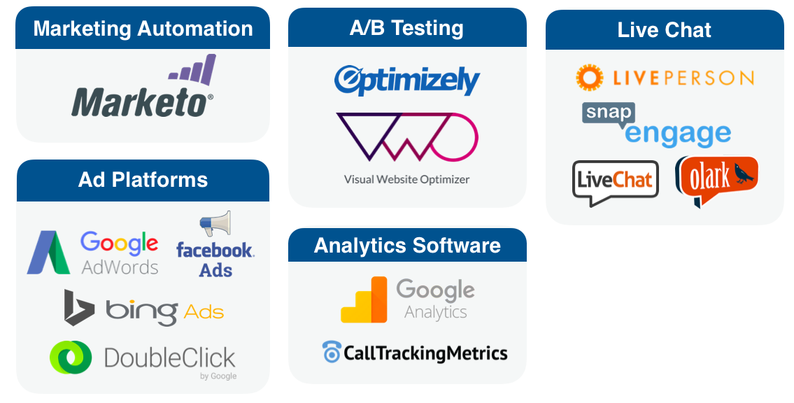

# Marketo Measure フレームワーク {#marketo-measure-framework}

Marketo Measure フレームワークを構成する 4 つのメインコンポーネントについて詳しく説明します。Marketo Measure は、これらのアプリケーションに依存して、データをトラッキング、整理および保管し、レポート機能を提供します。以下に、Marketo Measure のフレームワークを構成する 4 つのコンポーネントを示します。

* Marketo Measure の JavaScript
* CRM 統合
* サードパーティのアプリケーション／システム
* Marketo Measure アプリケーション

## Marketo Measure JavaScript {#marketo-measure-javascript}

Marketo Measure JavaScript は、見込み客／リードがお客様の組織に対して行うすべてのオンラインマーケティングインタラクション（タッチポイントとも呼ばれる）をトラッキングします。web サイトの各ページの終了 `</head>` タグの前に追加されるカスタムスクリプトです。

``

>[!NOTE]
>
>Marketo Measure JS の追加方法について詳しくは、[こちらを参照](/help/marketo-measure-tracking/setting-up-tracking/adding-marketo-measure-script.md)してください。

Marketo Measure JS は、web 訪問（匿名の web 訪問を含む）、一般的なトラフィック／ページナビゲーション、コンテンツのダウンロード、フォームの送信からのデータを取得します。このデータは、お使いの CRM にプッシュされ、各マーケティングインタラクションがタッチポイントとして表示されます。

## CRM 統合 {#crm-integrations}

Marketo Measure は、CRM と統合され、Marketo Measure JS によって取得されたすべてのデータを保管および整理します。現在、Marketo Measure は、2 つの CRM と API 統合されています。

Marketo Measure データをお使いの CRM で表示することで、各タッチポイントに関連する詳細な情報を確認したり、チャネルのパフォーマンスを把握するためのレポートを生成したりできます。

## サードパーティアプリケーション {#third-party-applications}

ほとんどのマーケターは、マーケティング活動を実行するために、いくつかの異なるアプリケーションに依存しています。Salesforce や MS Dynamics に加えて、Marketo Measure は、13 種類のサードパーティアプリケーション（以下を参照）と統合されています。

上記のアプリケーションを使用して任意のマーケティング活動を実行している場合、それらのアカウントを Marketo Measure アカウントにリンクできます。これにより、データを簡単にトラッキングして、Marketo Measure アカウントに転送できます。

## Marketo Measure アプリケーション {#marketo-measure-application}

Marketo Measure アプリケーションは、アトリビューションデータの表示およびレポート、アカウントの設定およびアカウント情報の更新に使用されます。以下に、Marketo Measure アプリのメインメニュー項目を示します。

**アカウント構成**

ここでは、会社の一般情報を更新したり、Marketo Measure JavaScript にアクセスしたりできます。

**設定**

このメニュー項目を使用すると、アトリビューションやチャネルマッピングを設定したり、CRM やサードパーティアプリケーションとの統合を管理したり、Marketo Measure アカウントユーザーを表示／追加したり、請求情報を更新したりできます。

**Marketing ROI ダッシュボード**

Marketing ROI ダッシュボードメニュー項目では、チャネルパフォーマンス、アクティビティおよびコストに関してデータを視覚化します。
