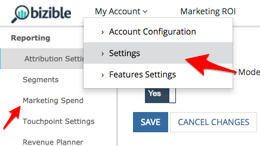
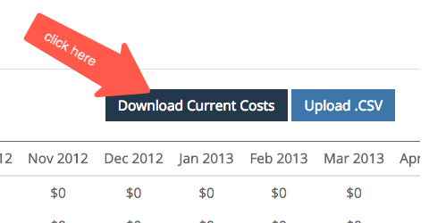
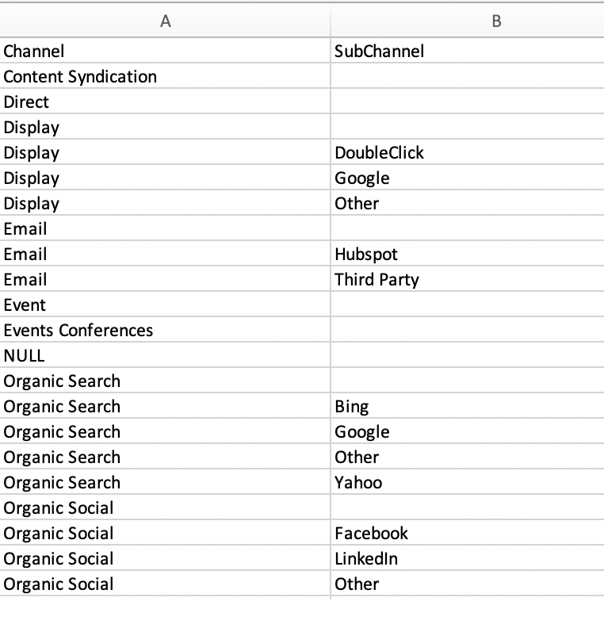

# マーケティングチャネルのコスト設定 {#marketing-channel-costs}

[!DNL Marketo Measure]を使用する最も基本的な利点の1つは、マーケティング活動を収益への影響に直接結び付けることができ、必要に応じて細分化することができます。 タッチポイントレベルで投資収益率を確認することができます。 このメリットを活用するには、チャネルコストを[!DNL Marketo Measure] アプリにアップロードする必要があります。 ROI レポートは自動的に作成され、[experience.adobe.com/marketo-measure](https://experience.adobe.com/marketo-measure?lang=ja){target="_blank"}の&#x200B;**マーケティング ROI ダッシュボード**&#x200B;で利用できます。

[ここをクリックして、手順に直接移動します。](/help/marketing-channel-costs.md)

[!DNL Marketo Measure] マーケティング支出機能を使用すると、顧客はすべてのチャネル、サブチャネル、およびキャンペーンに支出をアップロードできます。 顧客が追加するデータが多ければ多いほど、より多くのROI レポートが収益アトリビューションダッシュボードに表示されます。

直接広告接続からレポートおよび読み込まれたコストは、自動的に最も詳細なレベルで取り込まれるため、アップロードする必要はありません。 これには、Google AdWords、Bing Ads、Doubleclick、Facebookとの現在の統合が含まれます。

[ここをクリックして直接FAQに移動します。](/help/marketing-channel-costs.md)

## 定義 {#definitions}

**キャンペーン別の支出**

最も詳細なレベルでは、顧客は各チャネル内でグループ化された、個々のキャンペーンごとの支出を入力できます。 CRM キャンペーンの場合、[!DNL Marketo Measure]はキャンペーン IDを別の列に取り込み、CRMからオフライン キャンペーンの支出をこのテーブルにマッピングするのに役立ちます。 このレベルで支出を追加すると、顧客はキャンペーンのROIを確認し、キャンペーンごとのパフォーマンスを最適化できます。

すべてのキャンペーンの合計は、サブチャネルまたはチャネルで入力された値を合計する必要はありませんが、サブチャネルまたはチャネルで入力された値を超えることはできません。 合計がサブチャネルまたはチャネルで入力された値より小さい場合、[!DNL Marketo Measure]は差をカバーし、ギャップを埋めるために「その他」の行を自動的に追加します。

**サブチャネル別の支出**

より高いレベルでは、顧客はチャネルの下にグループ化されたサブチャネルごとに支出を入力できます。 このレベルで支出を追加すると、顧客はサブチャネルのROIを表示し、サブチャネル別のパフォーマンスを最適化できます。

すべてのサブチャネルの合計は、チャネルで入力された値を合計する必要はありませんが、チャネルで入力された値を超えることはできません。 合計がチャネルで入力された値より小さい場合、[!DNL Marketo Measure]は、差分をカバーし、ギャップを埋めるために「その他」の行を自動的に追加します。

**チャネル別の支出**

最も高いレベルでは、顧客はチャネルごとに支出を入力できます。 このレベルで支出を追加することで、顧客はチャネルのROIを把握し、チャネル別のパフォーマンスを最適化できます。

**日付選択**

デフォルトの日付範囲は、開始日から[!DNL Marketo Measure]から現在の月まで開始されます。 コストを正しく保つために、今後数か月間のコストを入力することはできませんが、[!DNL Marketo Measure]とのパートナーシップの前に数か月間のコストを入力することができます。

**フィルター**

「マーケティング費用」テーブルで結果を絞り込むには、上部のチャネルを選択して他のチャネルを除外します。 これは、チームが単一のチャネルに注力している場合に役立ちます。

**検索**

検索ボックスを使用して、チャネル、サブチャネル、またはキャンペーンから一致するテキストを検索します。

**現在のコストのダウンロード**

ダウンロードされたCSVは、現在の画面から結果を引き出します。つまり、適用された日付、フィルター、検索は、そのままダウンロードされます。

**CSVをアップロード**

ブラウザーに表示されているビューに関係なく、フィルタリングされたビューであるか、すべての日付とチャネルを含むデフォルトのビューである場合は、任意のCSVをアップロードできます。

最も一般的なエラーは、日付列のフォーマットです。日付書式が変更された場合に発生し、ExcelやGoogle シート間で移動する場合に意図的に発生する可能性があります。 日付はMM-YYである必要があるので、9月12日ではなく9月12日、または5月12日ではなく5月12日である必要があります。

## 始める前に {#before-you-begin}

[!DNL Marketo Measure]には、13のデフォルトチャネルが用意されており、使用または拡張することができます。 さらに、独自のマーケティング構造に対応するために、オンラインとオフラインのチャネルを最大40個作成できます。 さらに、オンラインとオフラインのチャネルをサポートするために、合計200個のサブチャネルを作成できます。

[!DNL Marketo Measure]は、Bing AdsやGoogle AdWordsなどのAPI統合を持つプラットフォームから、マーケティングチャネルコストを自動的にダウンロードします。 [!DNL Marketo Measure]と統合されていないプラットフォームのコストは、手動でアップロードする必要があります。 コストデータをアップロードする前に、マーケティングチャネルを設定する必要があります。

## マーケティングコストのアップロード {#uploading-marketing-costs}

マーケティングチャネルとルールを設定または更新したら、関連するコストをアップロードします。 これを行うには、以下の手順に従います。

**手順1: [!DNL Marketo Measure] アプリのマーケティング支出ページに移動します。**

**[!UICONTROL マイアカウント]** メニューに移動し、**[!UICONTROL 設定]**&#x200B;をクリックし、左側のサイドバーの&#x200B;**[!UICONTROL レポート]** セクションの&#x200B;**[!UICONTROL マーケティング支出]** オプションに移動します。

をクリックします

**手順2：現在のコスト CSV**&#x200B;をダウンロード

画面の右側に移動し、**[!UICONTROL 現在のコストのダウンロード ].**&#x200B;をクリックします このオプションを使用すると、スプレッドシートをCSV形式でダウンロードできます。

」をクリックします

**手順3: CSV ファイルを開いて変更を加える**

ファイルを読み込んで、Google シート、Apple番号、Microsoft Excelまたは任意のソフトウェアを使用して開くことができます。 [!DNL Marketo Measure]様はGoogle シートの使用を推奨しています。

シートを読み込んだら、チャネルやサブチャネルへのコストの追加や既存の情報の更新など、必要な変更を行います。

シートのロジック ルールを確認します。 各行には、チャネルとそのサブチャネルの1つが（。）で区切られている必要があります 最後にドットを付けます。 一貫してこのフォーマットを使用することが重要です。

例えば、Facebookをサブチャネルとして、ソーシャルをチャネルとして示すには、ルールを「Social.Facebook」と記述します。 同様に、オフラインイベントを追跡するには、チャネルの構文を「Events.Big Conference」にします。 例を次の画像に示します。

として示します

_追加メモ_:

スプレッドシートの日付を変更しないでください。ドキュメントをアップロードする際に問題が発生する可能性があります。

どのフィールドも空白のままにしないでください。 追加する金額がない場合でも、金額として$0を入力します。

[!DNL Marketo Measure]は、これらのプラットフォームとのAPI接続からこのデータを自動的に取得するため、Bing AdsおよびGoogle AdWordsのコストを入力または更新する必要はありません。

**手順4: CSV形式でファイルを保存**

Google シートで作業している場合は、必ず最初にファイルをダウンロードしてください。 CSV ファイルを後で[!DNL Marketo Measure]にアップロードしようとすると問題が発生するため、月次データを除外または削除しないでください。

**手順5: CSV ファイルをアップロード**

[!DNL Marketo Measure] アプリの&#x200B;**[!UICONTROL Cost]** セクションに移動し、**[!UICONTROL Upload.CSV]**&#x200B;をクリックします。 システムが更新され、新しい情報が反映されます。

## よくある質問 {#faq}

**数字がCSV**&#x200B;に表示される理由

チャネルやサブチャネルなどの上位レベルで値が入力されない場合、[!DNL Marketo Measure]は自動的に子レベルの合計を表示します。これは、ファイルがアップロードされると表示されます。 また、子の合計が親に入力された値より小さい場合、[!DNL Marketo Measure]は「その他」行を追加して、合計の差を示します。

**表示されているリストでキャンペーンはどのように決定されますか？**

現在、私たちの結果は、タッチポイントでクレジットされたキャンペーンを一覧表示しています。 キャンペーンからアクティビティが発生した場合は、発生したタッチポイント日に基づいてキャンペーンを表示します。

**検索対象の行と列が多すぎます – ビューを統合できますか？**

日付範囲を変更したり、チャネルをフィルタリングしたり、値を検索したりできる機能を使用すると、ニーズに合わせてテーブルの結果を統合できます。

**ファイルをアップロードできないのはなぜですか？**

[!DNL Marketo Measure] アプリ内に異なる権限セットがあります。 ファイルをアップロードするには、「AccountAdmin」である必要があります。 この問題を回避するには、AccountAdminにアクセス権をリクエストするか、AccountAdminに代わってファイルをアップロードしてもらいます。 ユーザーとその役割のリストは、**[!UICONTROL マイアカウント]**/**[!UICONTROL 設定]**/**[!UICONTROL アカウントユーザーの表示/追加]**&#x200B;の下にあります。
