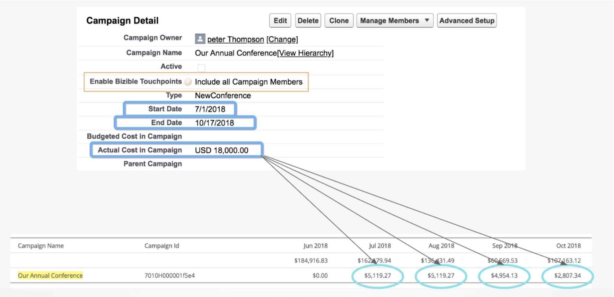

# CRM キャンペーンコスト {#crm-campaign-costs}

[!DNL Marketo Measure]人の顧客のほとんどが、オフラインのマーケティング活動を追跡するためにCRM キャンペーンを使用しています。 これらの施策を実施するマーケターは、CRM内のコストも監視できます。 この機能を使用すると、[!DNL Marketo Measure]がそのコストを読み取り、[!DNL Marketo Measure]以内に報告されたマーケティング費用に適用できるようにすることで、マーケターが簡単になります。 現在まで、顧客は1か月ごとに施策のコストを手動で入力する必要がありましたが、[!DNL Marketo Measure]さんに必要な情報を提供することで、このプロセスを自動化することができ、マーケターは支出とROIの分析により多くの時間を費やすことができます。

## 利用可能性 {#availability}

この機能は、[!DNL Salesforce]およびDynamicsのすべてのユーザーが利用できます。

## 仕組み {#how-it-works}

[!DNL Marketo Measure]は、最初にタッチポイントに対して「有効」になっているキャンペーンを探します。そのため、作成された一致するキャンペーン同期ルールがあるか、バイヤーのタッチポイントを有効にする値が「すべてのキャンペーンメンバーを含める」または「応答済みキャンペーンメンバーを含める」です。」 さらに、[!DNL Marketo Measure]は正しい値を読み込み、コストの配分方法を知っている必要があります。そのため、次のフィールドに値を含める必要があります。

**[!DNL Salesforce]**: `ActualCost`, `StartDate`, `EndDate`

**[!DNL Microsoft Dynamics]**: `totalactualcost`, `actualstart`, `actualend`

3つのフィールドのいずれかが値を欠落している場合、[!DNL Marketo Measure]はコストを読み込みません。 これを修正するには、CRMのキャンペーンレコードを更新します。 [!DNL Salesforce]は空白と$0を同じとして扱うため、$0に設定されている場合、コストは読み込まれません。

[!DNL Marketo Measure]が月単位でキャンペーンの配分を決定するには、キャンペーンの開始日と終了日を使用して、1日あたりの量を均等に配分します。

この例では、キャンペーンの期間は109日であるため、総費用は18,000 ドルで、1日あたりの支出は約165.14 ドルになります。

1か月あたりの日数に基づいて、表に示すように、これらの月間合計を取得します。

2018年7月：（$18,000/109） x 31 = $5,119.27

2018年8月：（$18,000/109） x 31 = $5,119.27

2018年9月：（$18,000/109） x 30 = $4,954.13

2018年10月：（$18,000/109） x 17 = $2,807.34

## 過去のレポート済み費用 {#historical-reported-spend}

過去に追跡され、CRM キャンペーンにマッピングされたキャンペーンの費用を入力した場合、入力した費用のいずれも上書きされません。 CRM内の同じキャンペーンが変更された場合、そのキャンペーンは無視され、以前にCSV アップロードで行った変更が優先されます。

今後CRM キャンペーンのコストを取り込む場合は、CSVの値を$0に変更して、エントリを無効にします。 次回ジョブを実行してコストをインポートすると、以前に編集したレポートが取り込まれます。

## 顧客接点のないキャンペーン {#campaigns-with-no-touchpoints}

多くのマーケターは、顧客接点を生み出さないCRM キャンペーンや、支出を追跡する目的でキャンペーンメンバーがいないCRM キャンペーンのマーケティング費用を報告することを選択します。 3つのフィールド（開始日、終了日、コスト）が入力され、キャンペーンがタッチポイントに対して有効になっている限り、[!DNL Marketo Measure]は、それに関連付けられたタッチポイントがない場合でも、そのコストを取り込みます。

これは、過剰なマーケティング費用やROIの計算に組み込むためのツールに費やした費用を追跡するのに役立ちます。

## Marketo Program Sync {#marketo-program-sync}

Marketo プログラムをキャンペーンとしてCRMに取り込む場合は、必要なCRM フィールドに開始日、終了日、および期間コスト マッピングが設定されていることを確認します。 「購入者のタッチポイントを有効にする」フィールドへのマッピングはないので、コストを引き出すことができるように、これらのキャンペーンを有効にする必要があります。

## コストの編集 {#editing-the-costs}

キャンペーンをCRMから読み込むと、キャンペーンはAPI広告プロバイダーと同様に扱われ、コストを変更するためにCSVに表示されません。

コストや配分の変更は、一元管理されたCRMでおこなう必要があります。

## よくある質問 {#faq}

**キャンペーンに変更を加えました。マーケティング費用テーブルまたはレポートの変更内容は、いつ確認できますか？**

3～4時間

**開始日、終了日、コストが入力されていますが、[!DNL Marketo Measure]でコストがまだ表示されないのはなぜですか？**

「Buyer Touchpointを有効にする」の値が「すべてのキャンペーンメンバーを含める」または少なくとも「応答済みキャンペーンメンバーを含める」に設定されているか、またはこのキャンペーンを含むカスタムキャンペーン同期ルールを作成していることを確認してください。 これを確認してもCampaignが表示されない場合は、[Marketo サポート ](https://nation.marketo.com/t5/support/ct-p/Support){target="_blank"}にお問い合わせください。これにより、Campaignが正しく読み込まれていることを確認できます。

**キャンペーンの配分を変更して、特定の月に重みを付けることができるようにする必要があります。 どうすればよいですか？**

コストの配分は、開始日から終了日までの均等な配分に基づいて行われます。 残念ながら、設定した日付とは別にコストの重み付けが異なるように変更することはできません。 これは、月の各日が重要なので、キャンペーンの開始日と終了日を調整することで制御できます。

**親キャンペーンにコストを設定しています。子キャンペーンを親キャンペーンから割り当てるにはどうすればよいですか？**

実際、コストを引き出す方法は、親と子の関係に関係なく、単一のキャンペーンから直接決まります。 キャンペーンの日付と共に子キャンペーンのコストが発生し、親キャンペーンをタッチポイントに対して有効にしない傘キャンペーンとして使用することをお勧めします。

**1か月のコストを[!DNL Marketo Measure]で変更するにはどうすればよいですか？**

信頼できる唯一の情報源はCRMであるため、あらゆる変更をCRMでおこなう必要があります。 Campaignが[!DNL Marketo Measure]によってインポートされると、Campaignの値は[!DNL Marketo Measure]またはCSV ファイルで編集できません。

**マーケティング費用テーブルにキャンペーンが表示されるシナリオは表示されなくなりますか？**

3つのキーフィールド（開始日、終了日、コスト）の値が引き続き必要です。 デフォルトの動作は、値が$0より大きいCampaignsのみを読み込むことです。 理想的には、明示的な$0があるキャンペーンを読み込み、空白のままのキャンペーンを読み込まないですが、Salesforce APIは、値に関係なく、両方を$0として読み込みます。 さらに、「Buyer Touchpointを有効にする」の値が「すべてを含める」または「応答済みを含める」から「すべてを除外」に変更された場合、キャンペーンとコストがマーケティング費用テーブルから削除されます。

**行がCRMから既にダウンロードされていて、同じキャンペーン IDでCSVに別の行を入力した場合、どのコストが優先されますか？**

ファイルを正常にアップロードできても、統合から自動的に取得された同じ値を持つキャンペーン IDが既に存在するため、[!DNL Marketo Measure]はその行を使用しません。

**CRMで設定したデジタルキャンペーンからコストを引き出す方法を教えてください。**

[!DNL Marketo Measure]のJavaScriptは既にお客様のサイトからweb アクティビティを追跡しているため、Web フォームやその他のサイト アクティビティからキャンペーンメンバーを追跡するキャンペーンを同期すると、タッチが2倍にカウントされるので、お勧めします。 そのため、マーケティングコストで「CSV アップロード」オプションを引き続き使用して、そのプラットフォーム（Twitter、Adroll）と統合されていない場合は、オンライン/デジタルコストを追跡する必要があります。
