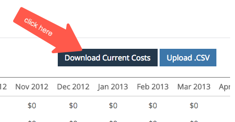
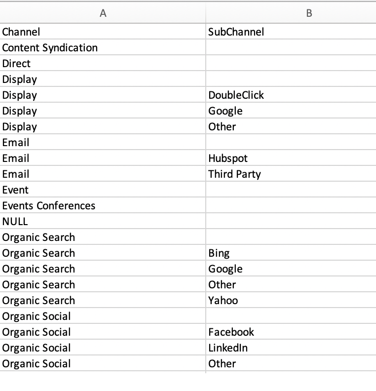

# マーケティングチャネルのコスト設定 {#marketing-channel-costs}

[!DNL Marketo Measure] を使用する最も基本的なメリットの 1 つは、マーケティング活動を、必要なだけ詳細に、収益に与える影響に直接結び付けることができることです。 タッチポイントレベルでは、ROI を確認することが可能です。 この利点を活用するには、チャネルコストを [!DNL Marketo Measure] アプリにアップロードする必要があります。 ROI レポートは自動的に作成され、[experience.adobe.com/marketo-measure **の** マーケティング ROI ダッシュボード ](https://experience.adobe.com/marketo-measure?lang=ja){target="_blank"} で使用できます。

[手順に直接移動するには、ここをクリックします。](/help/marketing-spend/spend-management/marketing-channel-costs.md#uploading-marketing-costs)

[!DNL Marketo Measure] マーケティング費用機能を使用すると、顧客は、すべてのチャネル、サブチャネルおよびキャンペーンにわたって費用をアップロードできます。 顧客によって追加されるデータが多いほど、売上高アトリビューションダッシュボードにより多くの ROI レポートが表示されます。

直接広告接続からレポートおよびインポートされたコストは、最も詳細なレベルで自動的に取り込まれ、アップロードする必要はありません。 これには、Google AdWords、Bing Ads、Doubleclick、Facebookとの現在の統合が含まれます。

[FAQ に直接移動するには、ここをクリックしてください。](/help/marketing-spend/spend-management/marketing-channel-costs.md#faq)

## 定義 {#definitions}

**キャンペーン別の支出**

最も詳細なレベルでは、顧客は、個々のキャンペーンごとに、それぞれのチャネル内にグループ化されて支出を入力できます。 CRM キャンペーンの場合、[!DNL Marketo Measure] はキャンペーン ID を別の列に取り込み、CRM からオフラインのキャンペーン費用をこのテーブルにマッピングするのに役立ちます。 このレベルで費用を追加すると、お客様はキャンペーンの ROI を確認し、キャンペーン別にパフォーマンスを最適化できます。

すべてのキャンペーンの合計は、サブチャネルまたはチャネルに入力された値を合計する必要はありませんが、サブチャネルまたはチャネルに入力された値を超えることはできません。 合計がサブチャネルまたはチャネルに入力された値を下回 [!DNL Marketo Measure] 場合は、差分を埋めてギャップを埋めるために、「その他」の行が自動的に追加されます。

**サブチャネル別の支出**

上位レベルでは、顧客は、サブチャネル別に支出を入力し、そのチャネルの下にグループ化できます。 このレベルで費用を追加すると、お客様はサブチャネル ROI を表示し、サブチャネル別にパフォーマンスを最適化できます。

すべてのサブチャネルの合計は、チャネルで入力された値を合計する必要はありませんが、チャネルで入力された値を超えることはできません。 合計がチャネルに入力された値よりも小さい場合、[!DNL Marketo Measure] は自動的に「その他」の行を追加して違いを補い、ギャップを埋めます。

**チャネル別の支出**

最高レベルでは、顧客はチャネル別に支出を入力できます。 このレベルで費用を追加すると、お客様はチャネルの ROI を確認し、チャネル別にパフォーマンスを最適化できます。

**日付選択**

デフォルトの日付範囲は、開始日から現在の月の [!DNL Marketo Measure] で開始します。 コストが正しいままであることを保証するために、今後数か月のコストを入力することはできませんが、[!DNL Marketo Measure] とのパートナーシップを結ぶ前の数か月のコストを入力できます。

**フィルター**

マーケティング費用テーブルの結果を絞り込むには、上部のチャネルを選択して、他のチャネルを除外します。 単一のチャネルに焦点を当てたチームがある場合に役立ちます。

**検索**

検索ボックスを使用して、チャネル、サブチャネルまたはキャンペーンから一致したテキストを検索します。

**現在のコストのダウンロード**

ダウンロードした CSV は現在の画面から結果を取り込みます。つまり、適用された日付、フィルターまたは検索は、そのままダウンロードされます。

**CSV をアップロード**

ブラウザーに表示されているビューに関係なく、フィルタリングされたビューや、すべての日付とチャネルを含むデフォルトのビューの場合は、任意の CSV をアップロードできます。

最も一般的なエラーは、日付列の形式です。これは日付形式が変更された場合に発生し、Excel やGoogle Sheets 間を移動する場合に意図的に発生する可能性があります。 日付は MM-YY なので、9 月 12 日ではなく 9 月 12 日、または 05 月 12 日ではなく 5 月 12 日である必要があります。

## 始める前に {#before-you-begin}

[!DNL Marketo Measure] には、使用または拡張できる 13 のデフォルトチャネルが用意されています。 また、独自のマーケティング構造に対応するように、最大 40 個のオンラインチャネルとオフラインチャネルを作成できます。 これを基に、これらのオンラインおよびオフラインチャネルをサポートするために、合計 200 のサブチャネルを作成できます。

[!DNL Marketo Measure] は、Bing Ads やGoogle AdWords などの API が統合されたプラットフォームから、マーケティングチャネルコストを自動的にダウンロードします。 [!DNL Marketo Measure] と統合されていないプラットフォームのコストは、手動でアップロードする必要があります。 コストデータをアップロードする前に、マーケティングチャネルを設定する必要があります。

## マーケティングコストのアップロード {#uploading-marketing-costs}

マーケティングチャネルとルールを設定または更新すると、関連コストをアップロードできるようになります。 これを行うには、次の手順に従います。

**手順 1:[!DNL Marketo Measure] アプリのマーケティング費用ページに移動します。**

**[!UICONTROL マイアカウント]** メニューに移動し、「**[!UICONTROL 設定]** をクリックして、左側のサイドバーの **[!UICONTROL レポート]** セクションの下にある **[!UICONTROL マーケティング費用]** オプションに移動します。

**手順 2：現在のコストの CSV をダウンロード**

画面の右側に移動して、「**[!UICONTROL 現在のコストをダウンロード &#x200B;]」をクリックします。** このオプションを使用すると、スプレッドシートを CSV 形式でダウンロードできます。

**手順 3:CSV ファイルを開いて変更する**

ファイルを読み込んで、Google Sheets、Apple Numbers、Microsoft Excel または選択したソフトウェアを使用して開くことができます。 Google シートを使用することをお [!DNL Marketo Measure] めします。

シートを読み込んだ後、チャネルやサブチャネルへのコストの追加や既存の情報の更新など、必要な変更を行います。

シートの論理ルールを確認します。 各行には、チャネルと、（.）で区切られたサブチャネルの 1 つが含まれている必要があります 末尾にドットを付けます。 この形式を一貫して使用することが重要です。

例えば、Facebookをサブチャネル、ソーシャルをチャネルとして示すには、ルールを「ソーシャル。Facebook」のように記述する必要があります。 同様に、オフラインイベントを追跡するには、チャネル構文を「Events.Big Conference」にする必要があります。 次の画像に例を示します。

_その他のメモ_:

ドキュメントをアップロードする際に問題が発生する可能性があるので、スプレッドシートの日付を変更しないでください。

どのフィールドも空白のままにしないでください。 追加するドル値がない場合でも、ドルの金額として「$0」を入力します。

Bing Ads およびGoogle AdWords のコストは、入力または更新する必要はありません。これらのプラットフォームとの API 接続から、[!DNL Marketo Measure] がデータを自動的に取り込むからです。

**手順 4：ファイルを CSV 形式で保存**

Google Sheets で作業している場合は、必ず最初にファイルをダウンロードしてください。 後で CSV ファイルをアップロードしようとすると問題が発生するので、毎月のデータを除外または削除しないでくだ [!DNL Marketo Measure] い。

**手順 5:CSV ファイルをアップロードする**

[!DNL Marketo Measure] アプリの「**[!UICONTROL Cost]**」セクションに移動し、「**[!UICONTROL Upload.CSV]**」をクリックします。 システムが更新され、新しい情報が反映されます。

## よくある質問 {#faq}

**CSV に数値が表示される理由**

チャネルやサブチャネルなど、上位レベルで値が入力され [!DNL Marketo Measure] いない場合は、子レベルの合計が自動的に表示され、ファイルがアップロードされると表示されます。 また、子の合計が親に入力された値より小さい場合、[!DNL Marketo Measure] は「その他」行を追加して、合計の違いを表示します。

**表示されているリストでキャンペーンはどのように決定されますか？**

現時点では、結果として、タッチポイントでクレジットを受け取ったキャンペーンをリストアップしています。 キャンペーンからアクティビティがあった場合、発生したタッチポイント日に基づいたキャンペーンを表示します。

**行と列が多すぎて移動できません。ビューを統合できますか？**

日付範囲の変更、チャネルのフィルタリング、値の検索を行う機能により、テーブルの結果をニーズに合わせて統合できます。

**ファイルをアップロードできないのはなぜですか？**

[!DNL Marketo Measure] アプリ内には異なる権限セットがあります。 ファイルをアップロードするには、「アカウント管理者」である必要があります。 これを回避するには、アカウント管理者にアクセス権をリクエストするか、アカウント管理者に代わってファイルをアップロードしてもらいます。 ユーザーとその役割のリストは、**[!UICONTROL マイアカウント]**/**[!UICONTROL 設定]**/**[!UICONTROL アカウントユーザーの表示/追加]** にあります。
