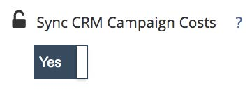

# 支出管理方法 {#spend-management-methods}

[!DNL Marketo Measure]のROI レポートを成功させるには、支出データが重要です。 すべてのチャネルとサブチャネルで正確かつ包括的なROI レポートを作成するには、適切な支出データが[!DNL Marketo Measure]に取り込まれていることを確認する必要があります。

[!DNL Marketo Measure]に支出データを取り込む方法は3つあります。 各メソッドは、特定のデータ入力から支出データを取得するように設計されています。

**1個のAPI接続アカウント**

APIを介して[!DNL Marketo Measure]に接続した広告アカウントには、ROI レポート用に支出が自動的に[!DNL Marketo Measure]に取り込まれます。 接続したアカウントと支出を引き込んだアカウントを確認するには、[!DNL Marketo Measure] アプリに移動し、[!UICONTROL 統合] セクションの「[!UICONTROL 接続]」タブを選択します。 API接続の設定について詳しくは、[統合広告プラットフォーム &#x200B;](/help/api-connections/utilizing-marketo-measures-api-connections/integrated-ad-platforms.md#how-to-connect-ad-platforms)を参照してください。

**2 CRM キャンペーンコスト同期**

すべての[!DNL Marketo Measure] アカウントは、[CRM キャンペーンのコストを同期](/help/marketing-spend/spend-management/crm-campaign-costs.md#availability)という機能にアクセスできます。 デフォルトでは、この機能ビットは「いいえ」に設定されていますが、いつでもオンにできます。

この機能を有効にすると、次の条件を満たすCRM キャンペーン/プログラムから支出が自動的に取り込まれます。

私は。 [!DNL Marketo Measure]は、最初に、キャンペーン/プログラムが作成された一致する[&#x200B; キャンペーン同期ルール &#x200B;](/help/channel-tracking-and-setup/offline-channels/custom-campaign-sync.md)から、または作成された一致する[&#x200B; プログラム同期ルール &#x200B;](/help/marketo-measure-and-marketo/marketo-measure-integrations-with-marketo/marketo-engage-programs-integration.md)から、タッチポイントを作成しているかどうかを確認します。または、[購入者タッチポイントを有効にする値](/help/channel-tracking-and-setup/offline-channels/legacy-processes/syncing-offline-campaigns.md#how-to-create-a-campaign-and-sync-buyer-touchpoints)は、「すべてのキャンペーンメンバーを含める」または「応答済み」キャンペーンメンバーを含める」です。

ii. 開始日は、キャンペーン/プログラムに入力する必要があります

iii. 終了日は、キャンペーン/プログラムに入力する必要があります

iv. 実際のコスト（SFDCのキャンペーンの場合）または期間コスト（Marketoのプログラムの場合）を指定する必要があります。

**3手作業によるコストのアップロード**

この方法を使用すると、API接続アカウントまたはCRM Campaign Cost Syncでカバーされていないチャネルとサブチャネルの支出データ [&#128279;](/help/marketing-spend/spend-management/marketing-channel-costs.md#uploading-marketing-costs)を手動でアップロードできます。 [!DNL Marketo Measure]設定の「マーケティング費用」セクションに移動すると、任意のチャネルのCSV ファイルを介して費用データをアップロードできます。

お客様は、これらの3つの方法をすべて組み合わせて、[!DNL Marketo Measure]の特定の設定に応じて、支出を管理できます。 [!DNL Marketo Measure]に支出を読み込む方法は3つあるので、「もっと知る」にあるマーケティング支出ボードを使用して、すべての支出データを包括的に表示することを強くお勧めします。 このボードは、すべてのチャネルとそれに関連する支出を確認できる唯一の場所です。 マーケティング費用ボードは、費用データにギャップがある場所をすばやく特定し、ROI レポートを改善する方法に役立ちます。
