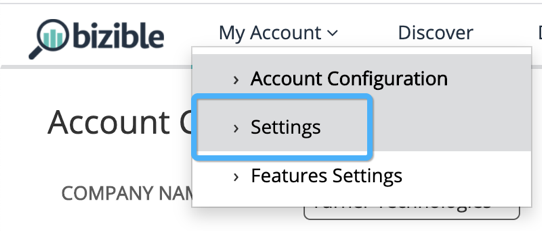
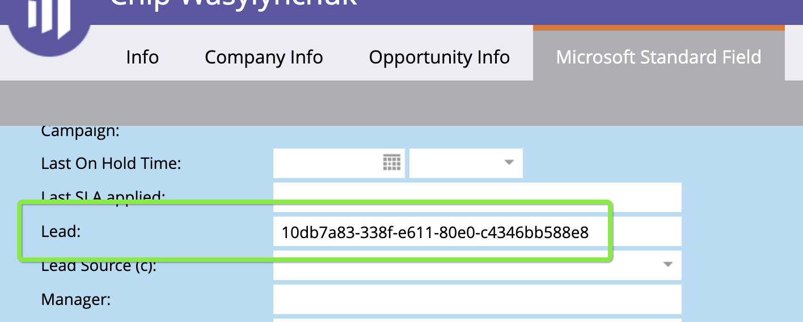
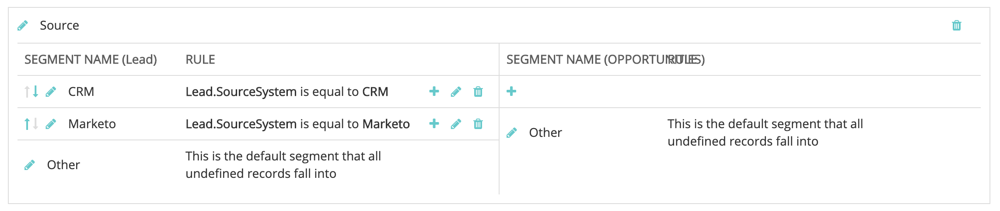
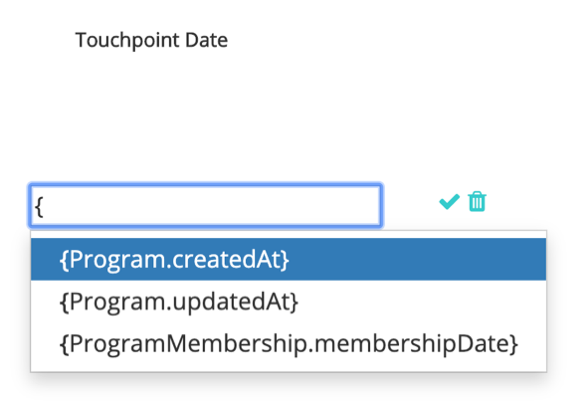
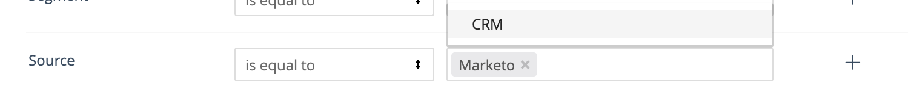
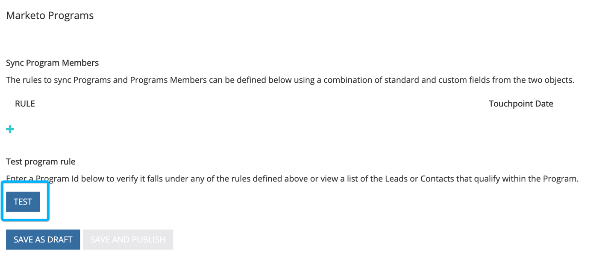
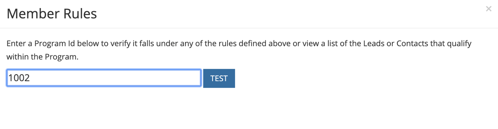
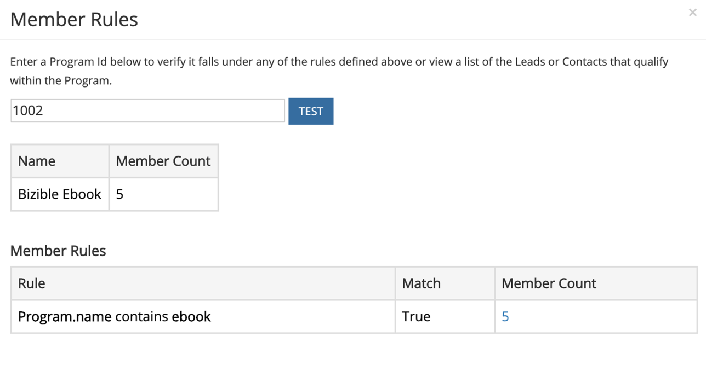
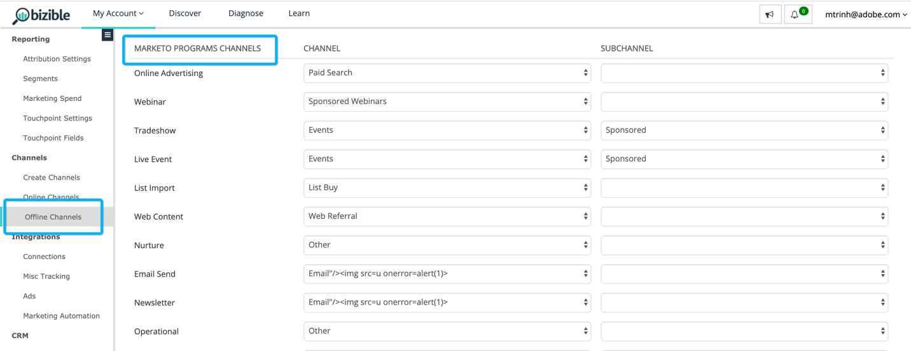

# [!DNL Marketo Engage] プログラム統合 {#marketo-engage-programs-integration}

[!DNL Marketo Measure]と[!DNL Marketo Engage] プログラムの統合により、お客様はMarketo プログラム メンバーシップからアトリビューション トラッキング用のタッチポイントを作成できるようになります。 この機能を使用すると、マーケターは、他の方法では[!DNL Marketo Measure] javascriptで表示されず、アトリビューションジャーニー内で測定する必要がある電子メールまたはエンゲージメントプログラムからプログラムメンバーシップのトラッキングを開始できます。

## 利用可能性 {#availability}

すべての層：

## 要件 {#requirements}

* 実稼動Marketo インスタンス
* 実稼動SalesforceまたはMicrosoft Dynamics インスタンス
* 任意の有料[!DNL Marketo Measure] サブスクリプション
* Marketo People Syncが有効になっています（[!DNL Marketo Measure]設定）
* Marketo プログラムが有効になっています（[!DNL Marketo Measure]設定）

## 設定 {#setup}

**ルール**

1. Marketo プログラムのルールの設定を開始するには、**[!UICONTROL マイアカウント]** > **[!UICONTROL 設定]** > **[!UICONTROL プログラム]**&#x200B;に移動します。 **+** アイコンをクリックして、最初のルールの作成を開始します。

   

   

1. ルールを追跡するのに役立つ場合は、オプションでルールの名前を設定できます。 最初に、「プログラム」フィールドと「プログラムメンバーシップ」フィールドのリストから、ルールを定義するフィールドを選択します。 チェックする演算子と期待値を選択して、ルールの作成を続行します。

   の場合は、オプションで設定できます

1. 同じボックス内に別のステートメントを追加して、ルールに「and」条件を設定するか、ボックスの外側にある「+」アイコンをクリックして「or」ステートメントを設定します。

   を設定します

1. タッチポイント日付にマッピングするために使用する日付または日時フィールドを選択します。 Marketoで使用可能な値のリストを表示するには、中括弧`{`を入力すると、使用可能なフィールドが表示されます。

   

   >[!NOTE]
   >
   >ルールでアクティビティ日、またはプログラムメンバーが特定のステータスに達した日付を取得する場合は、[!DNL Marketo Engage] アクティビティ統合を利用し、「進行状況のステータスを変更」アクティビティタイプのルールを設定します。

   

完了したルールは次のようになります。

## テスト {#test}

ルールを作成したら、それをテストして、ステートメントがプログラムと一致することを確認します。

1. テストを実行するには、次に示すように、**[!UICONTROL TEST]** ボタンをクリックします。

   のように「テスト」ボタンをクリックします

1. Marketoからプログラム IDに入力できるモーダルが表示されます。

   に入力できるモーダルが表示されます

   Idを入力して「[!UICONTROL &#x200B; テスト &#x200B;]」ボタンをクリックすると、アドビのルールエンジンが各ルールを確認し、プログラムがどのルールに適合しているかどうかを判断します。 下の例では、[!DNL Marketo Measure] Ebookというプログラム 1002には5人のプログラム メンバーが含まれており、表示されているルールが適用されていることがわかります。

   ルールは、サンプルサイズ 5,000人で実行されます。 プログラムに5000人以上のメンバーが含まれている場合、すべてのメンバーの互換性を確認しない可能性があります。 このツールは、ルールが正しく構築されているかどうかを確認する方法として機能します。

   の場合

   「メンバー数」をクリックすると、プログラム内で対象となるMarketo People Idのリストを表示できます。

   の一覧を表示できます

## チャネルマッピング {#channel-mapping}

Marketo プログラムチャネルのリストから、設定内で作成した[!DNL Marketo Measure]個のカスタムマーケティングチャネルに値をマッピングする必要があります。 これらのプログラムによって生成されたタッチポイントは、ここで選択したチャネル名とサブチャネル名を継承します。

1. 最初に、**[!UICONTROL マイアカウント]** > **[!UICONTROL 設定]** > **[!UICONTROL オフラインチャネル]**&#x200B;に移動します。

1. 上部にCRM キャンペーンタイプにマッピングするオプションがあり、下にMarketo プログラムチャネルのオプションが表示されます。

1. 最初に値にマッピングするチャネルを選択し、オプションでサブチャネルを選択します。 完了したら、下部の「**[!UICONTROL 保存]**」をクリックします。

   

## プログラムのコスト {#program-costs}

Marketo プログラムのデータ読み込みにより、期間原価から原価が自動的にダウンロードされ、Marketoで報告された原価は割り当てられた月を通して分配されます。 例えば、2021年1月に1000 ドルが報告された場合、1000 ドルは31日に分割されます。 コストは[!DNL Marketo Measure Discover]で確認できます。

## 仕組み {#how-it-works}

**フィールドマッピング**

<table>
 <colgroup>
  <col>
  <col>
 </colgroup>
 <tbody>
  <tr>
   <th>biz_ad_campaigns</th>
   <th>Marketo</th>
  </tr>
  <tr>
   <td>ID</td>
   <td>id</td>
  </tr>
  <tr>
   <td>IS_DELETED</td>
   <td>（API経由でプログラムがまだ存在するかどうかを確認します）</td>
  </tr>
  <tr>
   <td>
NAME
</td>
   <td>name</td>
  </tr>
 </tbody>
</table>

| biz_campaign_members | Marketo |
|---|---|
| ID | &quot;MarketoProgramMembership&quot;_ProgramId_Lead Id |
| MODIFIED_DATE | updatedAt |
| CREATED_DATE | membershipDate |
| LEAD_ID | Id （リストメンバーシップ） |
| LEAD_EMAIL | メール（リストメンバーシップ） |
| STATUS | progressionStatus |
| HAS_RESPONDED | reachedStatus |
| CAMPAIGN_NAME | programName |
| CAMPAIGN_ID | programId |
| CAMPAIGN_TYPE | チャネル |

## Cookie マッピング {#cookie-mapping}

[!DNL Marketo Measure]とMarketoの統合の結果、[!DNL Marketo Measure] Cookie Idも[!DNL Marketo Munchkin Id]とマッピングおよび同期されるようになりました。 これにより、FTとLCの両方のタッチをMarketo アクティビティに関連付けるのではなく、匿名のファーストタッチをweb セッションに関連付けるためにギャップを埋めることができます。 このシナリオを想像してみてください。

マークは[!DNL Facebook]広告をクリックすると、wayneenterprises.comにアクセスし、[!DNL Marketo Measure] ID 123と[!DNL Marketo Munchkin Id] 456でCookieを取得します。 フォームへの入力は行われません。

Wayne Enterprisesのマーケティング チームは、特定のターゲットとなるリードにメールを送信します。そのうちの1つは`mark@email.com`です。

`mark@email.com`はメールを受信し、クリックしてwayneenterprises.comにアクセスします。 これは、同じCookie IDを持つ`wayneenterprise.com`への`mark@email.com's`の2回目の訪問になりますが、フォームへの入力はありませんでしたので、[!DNL Marketo Measure]は、まだ匿名の訪問者です。

Wayne Enterprisesのマーケティングチームは、「クリックメール」アクティビティタイプのタッチポイントを生成するためのMarketoアクティビティルールを作成します。

今日の実装では、Marketo アクティビティから`mark@email.com`のFTおよびLC タッチポイントを、「電子メールをクリック」アクティビティ タイプから1つ作成します。

このCookie マッピングの機能強化により、FTは[!DNL Facebook]広告に戻ってクレジットされ、LCはメールにクレジットされます。

>[!NOTE]
>
>Cookie マッピングの動作を使用すると、web訪問から来るLC タッチポイントを見つけることができます。 関連付けられたアクティビティなしでリードがMarketoに表示された後、[!DNL Marketo Measure]がそのリードをダウンロードし、関連付けられたCookieを照合して、リードを作成したフォームアクティビティがなくても、最新のweb セッションにリードをトレースした可能性があります。

## よくある質問 {#faq}

**タッチポイント日を進行日またはステータス変更がプログラムメンバーに発生した日付に設定するにはどうすればよいですか？**

ルールでアクティビティ日、またはプログラムメンバーが特定のステータスに達した日付を取得する場合は、[!DNL Marketo Engage] アクティビティ統合を利用し、「進行状況のステータスを変更」アクティビティタイプのルールを設定します。 それ以外の場合、[!DNL Marketo Engage] プログラム統合では、複数のステータスがある場合でも、Marketo ユーザーをプログラムに取り込んだ最初の日付であるメンバーシップ日のみを使用できます。

**タッチポイント日付の日付オプションの選択リストを取得できますか？**

オートコンプリートをトリガーするには、まずテキストフィールドに中括弧`{`を入力すると、使用可能なフィールドが表示されます。

**Marketo プログラムルールを作成し、CRM Campaign ルールも使用している場合、2回カウントされますか？**

ルール定義によって異なりますが、おそらく。 プログラムとキャンペーンをカバーするルールを持たないように、ルールセットを評価する必要があります。これは、類似のメンバーシップの重複を排除したり、検出したりしないためです。 解決策の1つは、Marketoを信頼できる唯一の情報源として使用したい場合は、Campaign ルールをプログラムにコピーしてから、Campaign ルールを削除することです。 別のオプションとして、「CreatedOn」または「CreatedDate」の条件をルールに追加して、特定の日付より前のルールがCampaign ルールを使用し、特定の日付より後のルールがプログラムルールを使用できるようにします。 解決策は数多くありますが、ある程度の計画と調整が必要になります。

**Marketoのプログラム メンバーシップのカスタム フィールドを定義できますか？**

技術的な制限により、現時点ではプログラムメンバーシップのカスタムフィールドをサポートできません。 これらのフィールドがその他のMarketo APIを通じて利用可能になると、それらのフィールドはアドビに公開され、ユーザーが使用できるようになります。

**プログラムとアクティビティのどちらを使用するかを知るにはどうすればよいですか？**

[!DNL Marketo Engage] プログラム統合は、個人がプログラム メンバーであるかどうかに基づいてタッチポイントを生成する簡単な方法です。 ユーザーが特定のプログラムステータスに変更された時間に基づいてルールを定義する場合は、[!DNL Marketo Engage] アクティビティ統合が必要な設定になります。具体的には、「進行状況のステータスを変更」アクティビティタイプです。
