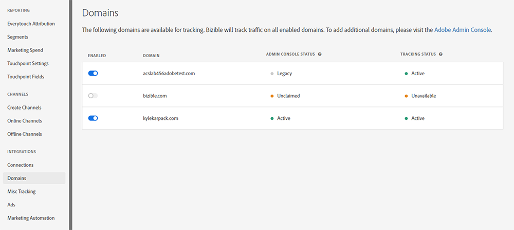

# ドメインの管理 {#domain-management}

実行中の IMS 対応テナントの場合 [!DNL Marketo Measure] Experience Cloudインターフェイス [!DNL Marketo Measure] は、ユーザーが独自のドメインリストを管理できるインターフェイスを提供します。 [!DNL Marketo Measure] ユーザーは、最初に、 [Adobe Admin Console](https://adminconsole.adobe.com/). ドメインがAdmin Consoleで検証されると、ユーザーは、 [!DNL Marketo Measure] は、web サイトトラフィックの追跡にこれらのドメインを使用します。

## ドメインのAdmin Console {#adding-domains-in-admin-console}

Adobe Admin Consoleへのアクセス権を持つ IMS ユーザーは、所有するドメインを追加および検証できます。 ドメインの検証では、各ドメインの DNS レコードを追加し、その後、Admin Consoleがそのレコードを検証できるようにします。

ドメインの追加手順については、 [Admin Console文書](https://helpx.adobe.com/enterprise/using/set-up-identity.html#setup-domains). ドメインを追加した後は、 [ディレクトリにリンクされています](https://helpx.adobe.com/enterprise/using/set-up-identity.html#link-domains-to-directories).

## でのドメインの管理 [!DNL Marketo Measure] {#managing-domains-in-marketo-measure}

ドメインがAdmin Consoleに追加されたら、 [!DNL Marketo Measure] は、このレコードを定期的にデータベースに同期します。 この同期は毎晩おこなわれ、また、ユーザーが **[!UICONTROL ドメイン]** ページの [!DNL Marketo Measure] UI デフォルトでは、 [!DNL Marketo Measure] インポートは無効になり、テナントは各ドメインを手動で有効にする必要があります。

の **[!UICONTROL 統合]** > **[!UICONTROL ドメイン]** ページに追加された場合、ユーザーには、Admin Consoleに登録したすべてのドメインとステータスが表示されます。 各ドメインは、有効または無効にすることができます。 ドメインが有効な場合、 [!DNL Marketo Measure] トラッキングにより、そのドメインで見られるトラフィックがすべて収集されます。 ドメインが無効になっている場合、 [!DNL Marketo Measure] は、そのドメインから来たトラフィックを無視し、タッチポイントやその他のデータを作成しません。 [!DNL Marketo Measure] また、ドメインの無効化を確認し、次のような影響について警告します。

ドメインの切り替えの影響は直ちに発生し、変更は遡及されません。 将来、 [!DNL Marketo Measure] は、設定された期間が経過すると、無効なドメインからデータをパージします。

## ステータス {#statuses}

Admin Consoleのステータスは、次のように分類されます。

* **検証済み**:このドメインはAdmin Consoleで検証されます
* **未検証**:このドメインはAdmin Consoleで完全に検証されておらず、でのトラッキングの対象になっていません [!DNL Marketo Measure]
* **無効**:このドメインは、期限切れになったか、Admin Consoleから削除された可能性があります。 でのデータのトラッキング [!DNL Marketo Measure] 削除のフラグが設定されています
* **レガシー**:このドメインはで作成されました [!DNL Marketo Measure] Admin Consoleに存在しない

トラッキングのステータスには、次のものがあります。

* **アクティブ**: [!DNL Marketo Measure] は現在、このドメインからデータを受信しています
* **無効**:このドメインは追跡に使用できますが、現在は無効になっています
* **使用不可**:このドメインは、検証されていないので、トラッキングに使用できません

個々のステータス項目の上にマウスポインターを置くと、そのステータスをさらに説明するツールチップがトリガーされます。

## よくある質問 {#faq}

**ドメイン内のドメインが削除されると、どうなりますか？Admin Console**

ドメインがAdmin Consoleで削除された場合、 [!DNL Marketo Measure] がドメインを削除済みとマークします。 [!DNL Marketo Measure] は、このドメインでのトラッキングトラフィックを直ちに停止しますが、以前に収集されたデータは削除されません。

**ドメインを有効にできないのはなぜですか？**

このページでドメインの選択が許可されない理由はいくつかあります。 ドメインがAdmin Consoleで検証されていない場合、次の場所で使用できません： [!DNL Marketo Measure]. 同様に、ドメインが現在のドメインとは異なるAdobe組織に所有されている場合 [!DNL Marketo Measure] テナント。選択できない可能性があります。

**このリストからドメインを削除する方法を教えてください。**

ドメインの「有効」スイッチがオフになっている場合、 [!DNL Marketo Measure] は無視し、次の場所から効果的に削除されます： [!DNL Marketo Measure]. ドメインを次の場所から永久に削除するには [!DNL Marketo Measure]を無効にするには、で無効にする必要があります。 [!DNL Marketo Measure]をクリックし、Admin Consoleから削除します。
