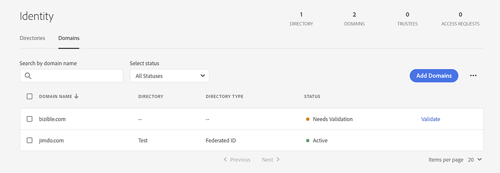
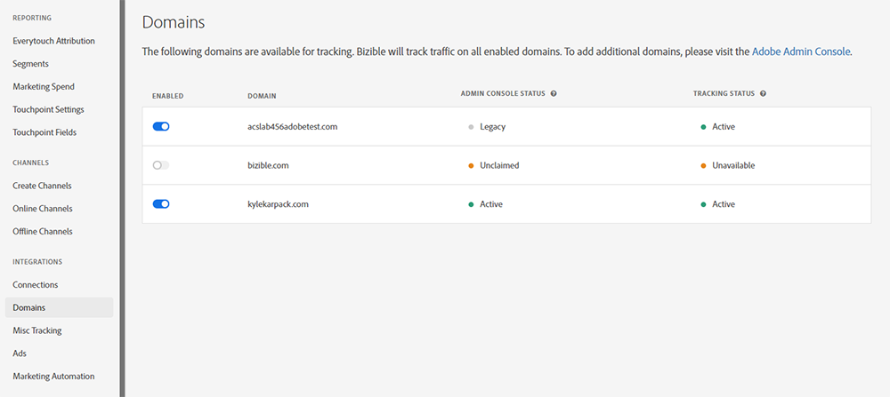
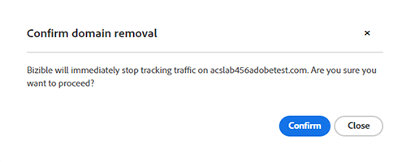

# ドメインの管理 {#domain-management}

Experience Cloud インターフェイスで[!DNL Marketo Measure]を実行しているIMS対応テナントの場合、[!DNL Marketo Measure]には、ユーザーが独自のドメインのリストを管理できるインターフェイスが用意されています。 [!DNL Marketo Measure]人のユーザーは、まず[Adobe Admin Console](https://adminconsole.adobe.com/)でトラッキングするドメインを確認する必要があります。 Admin Consoleでドメインが検証されると、[!DNL Marketo Measure]がこれらのドメインをweb サイトのトラフィックのトラッキングに使用しているかどうかを管理できます。

## Admin Consoleでのドメインの追加 {#adding-domains-in-admin-console}

ADOBE ADMIN CONSOLEへのアクセス権を持つIMS ユーザーは、自分が所有するドメインを追加および検証できます。 ドメインの検証では、ドメインごとにDNS レコードを追加し、Admin Consoleがそのレコードを検証できるようにします。

ドメインを追加する方法については、[Admin Console ドキュメント &#x200B;](https://helpx.adobe.com/jp/enterprise/using/add-domains-directories.html)を参照してください。 ドメインを追加したら、そのドメインは[&#x200B; ディレクトリ &#x200B;](https://helpx.adobe.com/jp/enterprise/using/add-domains-directories.html#link-domains-to-directoies)にリンクされている必要があります。

## [!DNL Marketo Measure]のドメインの管理 {#managing-domains-in-marketo-measure}

Admin Consoleでドメインが追加されると、[!DNL Marketo Measure]はこのレコードをデータベースに定期的に同期します。 この同期は夜間に行われ、ユーザーが[!DNL Marketo Measure] UIの&#x200B;**[!UICONTROL ドメイン]** ページにアクセスするたびに行われます。 デフォルトでは、[!DNL Marketo Measure]が読み込むレコードはすべて無効になっており、テナントは各ドメインを手動で有効にする必要があります。

**[!UICONTROL 統合]** > **[!UICONTROL ドメイン]** ページで、Admin Consoleに登録したすべてのドメインと、そのステータスが表示されます。 各ドメインは有効または無効にできます。 ドメインが有効になっている場合、[!DNL Marketo Measure] トラッキングは、そのドメインで表示されているすべてのトラフィックを収集します。 ドメインが無効になっている場合、[!DNL Marketo Measure]はそのドメインからのトラフィックを無視し、タッチポイントやその他のデータを作成しません。 [!DNL Marketo Measure]は、ドメインの無効化を確認し、次の影響について警告します。

ドメインの切り替えの影響は直ちに発生し、変更は遡及的ではありません。 今後、[!DNL Marketo Measure]は一定期間が経過すると、無効なドメインからデータをパージします。

## ステータス {#statuses}

Admin Consoleのステータスは、次のように分類されます。

* **VALIDATED**：このドメインはAdmin Consoleで検証されています
* **UNVERIFIED**：このドメインはAdmin Consoleで完全に検証されておらず、[!DNL Marketo Measure]でのトラッキングの対象にはなりません
* **無効**：このドメインは期限切れか、Admin Consoleから削除された可能性があります。 [!DNL Marketo Measure]のトラッキングデータは削除用にフラグが立てられています
* **LEGACY**：このドメインは[!DNL Marketo Measure]で作成されたもので、Admin Consoleには存在しません

トラッキングステータスは次のとおりです。

* **ACTIVE**: [!DNL Marketo Measure]がこのドメインからデータを受信しています
* **無効**：このドメインはトラッキングに使用できますが、無効になっています
* **利用不可**：このドメインは検証されていないため、追跡できません

個々のステータス項目にカーソルを合わせると、そのステータスをさらに説明するツールヒントがトリガーされます。

## よくある質問 {#faq}

**Admin Consoleでドメインが削除されるとどうなりますか？**

Admin Consoleでドメインが削除されると、[!DNL Marketo Measure]はそのドメインを削除済みとしてマークします。 [!DNL Marketo Measure]は、このドメインのトラフィックの追跡を直ちに停止しますが、以前に収集したデータは削除しません。

**ドメインを有効にできない理由は何ですか？**

このページでドメインの選択が許可されない理由はいくつかあります。 Admin Consoleでドメインが検証されていない場合、[!DNL Marketo Measure]では使用できません。 同様に、現在の[!DNL Marketo Measure] テナントとは異なるAdobe組織によってドメインが所有されている場合、選択できない可能性があります。

**このリストからドメインを削除するにはどうすればよいですか？**

ドメインで「有効」スイッチがオフになっている場合、[!DNL Marketo Measure]はそれを無視し、[!DNL Marketo Measure]から効果的に削除されます。 [!DNL Marketo Measure]からドメインを完全に削除するには、[!DNL Marketo Measure]でドメインを無効にし、そのドメインをAdmin Consoleから削除する必要があります。
