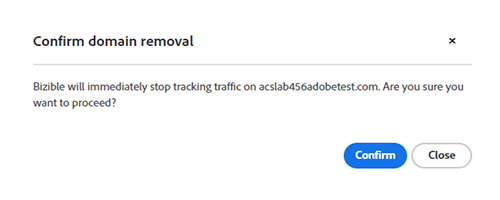

# ドメインの管理 {#domain-management}

実行中の IMS 対応テナントの場合 [!DNL Marketo Measure] Experience Cloudインターフェイス [!DNL Marketo Measure] は、ユーザーが独自のドメインリストを管理できるインターフェイスを提供します。 [!DNL Marketo Measure] ユーザーは、最初に、 [Adobe Admin Console](https://adminconsole.adobe.com/). ドメインがAdmin Consoleで検証されると、ユーザーは、 [!DNL Marketo Measure] は、web サイトトラフィックの追跡にこれらのドメインを使用します。

## ドメインの追加Admin Console {#adding-domains-in-admin-console}

Adobe Admin Consoleへのアクセス権を持つ IMS ユーザーは、所有するドメインを追加および検証できます。 ドメインの検証では、各ドメインの DNS レコードを追加し、Admin Consoleがそのレコードを検証できるようにします。

ドメインの追加手順については、 [Admin Console文書](https://helpx.adobe.com/enterprise/using/add-domains-directories.html). ドメインを追加した後は、 [ディレクトリにリンクされています](https://helpx.adobe.com/enterprise/using/add-domains-directories.html#link-domains-to-directoies).

## でのドメインの管理 [!DNL Marketo Measure] {#managing-domains-in-marketo-measure}

ドメインに追加された後、Admin Console [!DNL Marketo Measure] このレコードを定期的にデータベースに同期します。 この同期は毎晩おこなわれます。また、ユーザーが **[!UICONTROL ドメイン]** ページの [!DNL Marketo Measure] UI デフォルトでは、 [!DNL Marketo Measure] インポートは無効になっており、テナントは各ドメインを手動で有効にする必要があります。

次の日： **[!UICONTROL 統合]** > **[!UICONTROL ドメイン]** ページに表示される場合は、Admin Consoleに登録したすべてのドメインとそのステータスが表示されます。 各ドメインは、有効または無効にすることができます。 ドメインが有効な場合、 [!DNL Marketo Measure] トラッキングは、そのドメインで見られるトラフィックをすべて収集します。 ドメインが無効になっている場合、 [!DNL Marketo Measure] は、そのドメインからのトラフィックを無視し、タッチポイントやその他のデータは作成しません。 [!DNL Marketo Measure] は、ドメインの無効化を確認し、次のような影響があるかどうかを警告します。

ドメインの切り替えの影響は直ちに発生し、変更は遡及されません。 将来、 [!DNL Marketo Measure] は、設定された期間が過ぎると、無効なドメインからデータをパージします。

## ステータス {#statuses}

Admin Consoleのステータスは、次のように分類されます。

* **検証済み**：このドメインは、Admin Consoleで検証されます
* **未検証**：このドメインはAdmin Consoleで完全に検証されておらず、でのトラッキングの対象になっていません [!DNL Marketo Measure]
* **無効**：このドメインは、期限切れになっているか、Admin Consoleから削除されている可能性があります。 でのデータのトラッキング [!DNL Marketo Measure] 削除のフラグが設定されています
* **レガシー**：このドメインはで作成されました。 [!DNL Marketo Measure] とはAdmin Consoleに存在しない

トラッキングのステータスには、次のものがあります。

* **アクティブ**: [!DNL Marketo Measure] は、このドメインからデータを受信しています
* **無効**：このドメインはトラッキングに使用できますが、無効になっています。
* **UNAVAILABLE**：このドメインは、検証されていないので、トラッキングに使用できません

個々のステータス項目の上にマウスポインターを置くと、そのトリガーをさらに説明するツールチップが表示されます。

## よくある質問 {#faq}

**ドメイン内のドメインが削除されるとどうなりますか？Admin Console内のドメインが削除されるとどうなりますか？**

ドメインがAdmin Consoleで削除された場合、 [!DNL Marketo Measure] ドメインを削除済みとしてマークします。 [!DNL Marketo Measure] は、このドメインでのトラッキングトラフィックを即座に停止しますが、以前に収集されたデータは削除されません。

**ドメインを有効にできないのはなぜですか？**

このページでドメインの選択が許可されない理由はいくつかあります。 ドメインがAdmin Consoleで検証されていない場合、次の場所では使用できません： [!DNL Marketo Measure]. 同様に、ドメインが現在のドメインとは異なるAdobe組織に所有されている場合 [!DNL Marketo Measure] テナント。選択できない可能性があります。

**このリストからドメインを削除する方法を教えてください。**

ドメインの「有効」スイッチがオフになっている場合、 [!DNL Marketo Measure] は無視し、効果的に削除されます。 [!DNL Marketo Measure]. ドメインを次の場所から永久に削除するには： [!DNL Marketo Measure]を無効にするには、で無効にする必要があります。 [!DNL Marketo Measure]をクリックし、Admin Consoleから削除します。
