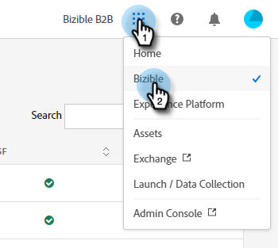
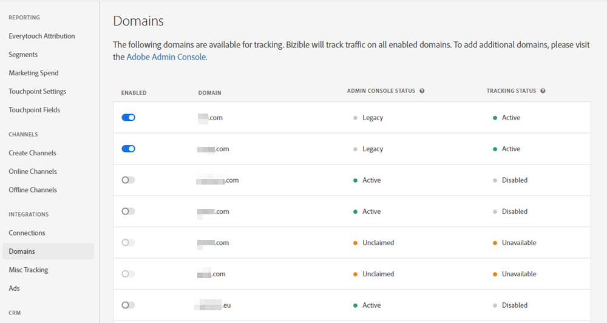
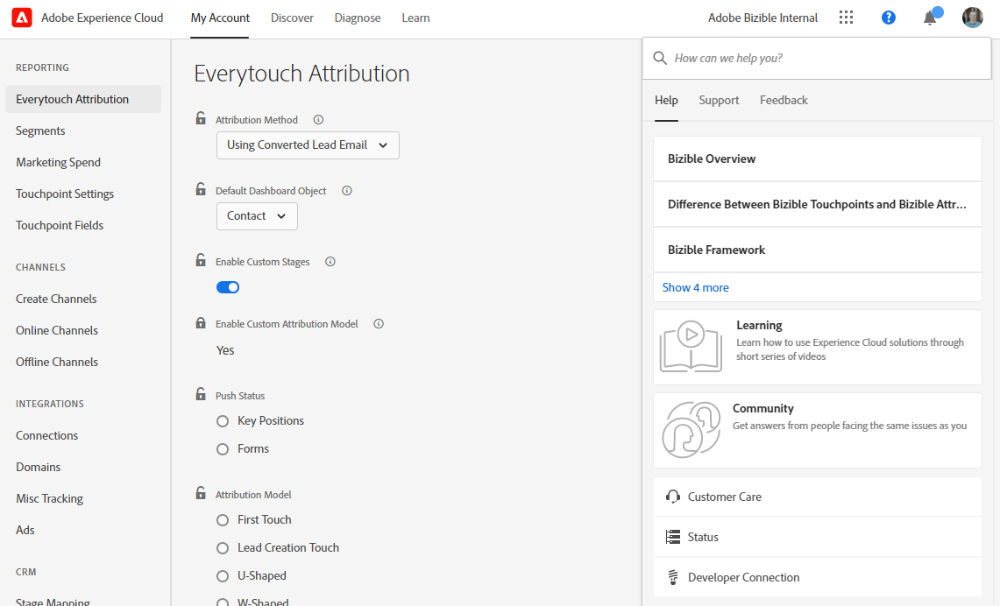
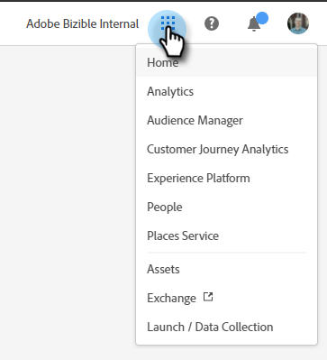
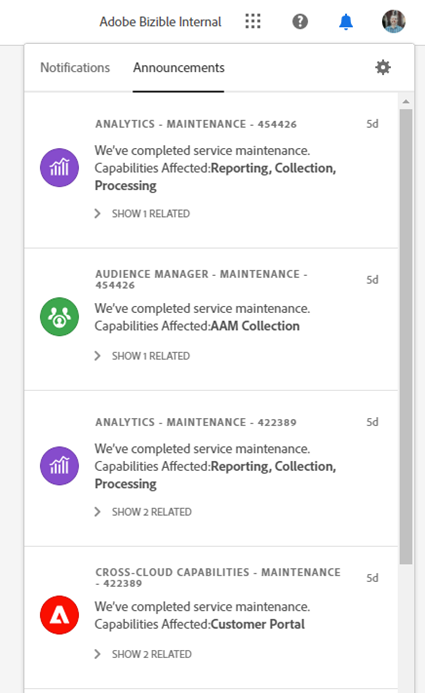
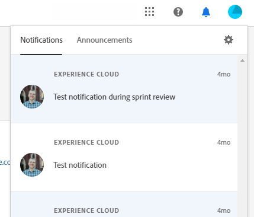
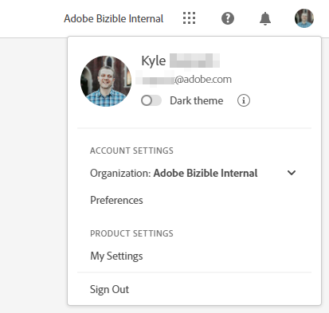
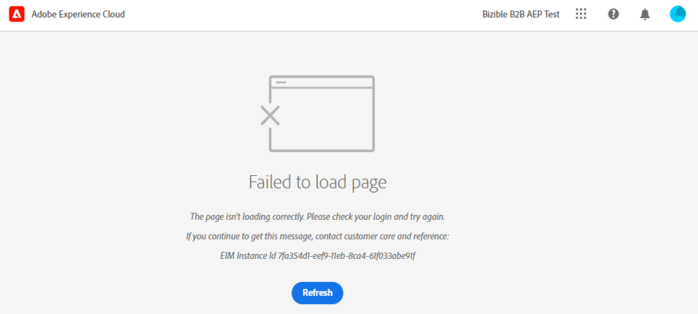

# Adobe Experience Cloud インターフェイスの概要 {#experience-cloud-interface-overview}

Adobe Experience Cloud Interfaceは、Adobe Experience Cloudのアプリケーションとサービスのルックアンドフィールを調整します。 ただの新しいデザインではありません。 単一のインスタンスでユーザーエクスペリエンスを提供する単一ページアプリケーションです。

## ユーザーフロー {#user-flow}

既にAdobe Experience Cloud製品にログインしている場合は、メニューアイコンをクリックし、**[!DNL Marketo Measure]**&#x200B;を選択します。

>[!NOTE]
>
>サブスクリプションを購入しているAdobe Experience Cloud製品によって、ドロップダウンメニューが異なる場合があります。

_まだ_&#x200B;様がAdobe Experience Cloud製品にログインしていない場合は、次の[!DNL Marketo Measure]に直接ログインしてください：[https://experience.adobe.com/marketo-measure](https://experience.adobe.com/marketo-measure?lang=ja)。

## 新機能 {#new-features}

更新されたルックアンドフィールに加えて、次の機能に注意してください。

**ドメイン管理**

[!DNL Marketo Measure]様の支援なしで[お客様の [!DNL Marketo Measure]  ドメイン &#x200B;](/help/marketo-measure-and-adobe/domain-management.md)を管理します。

**統合ヘルプセンター**

サポート記事の検索、チケットの送信、フィードバックの提供など、すべて[!DNL Marketo Measure] アプリケーション内から行います。

**アプリケーションの切り替え**

複数のAdobe製品にアクセスできるユーザーは、簡単に切り替えることができます。

**通知とお知らせ**

製品固有の通知や一般的なアドビ製品のお知らせを、アプリケーションで直接表示および操作します。

**アドビ設定**

言語やその他のAdobe全体の環境設定を変更するには、プロファイルアイコンをクリックします。 **マイ設定**&#x200B;をクリックして、[!DNL Marketo Measure]固有の変更を行うこともできます。

## よくある質問 {#faq}

**ブックマークはどうなりますか？**

ブックマークはリダイレクトされます。 例えば、https://apps.marketo-measure.com/Discover/391に移動する場合、認証を完了するとhttps://experience.adobe.com/marketo-measure/Discover/391にリダイレクトされます。

**Experience Cloud インターフェイスを使用して[!DNL Marketo Measure]にログインできません。 何が問題なのでしょうか？**

Adobe Experience Cloudにログインできるが、次のようなページが表示される場合、問題は[!DNL Marketo Measure]側にある可能性があります。

上記のエラーが表示された場合は、[&#x200B; サポートにお問い合わせください](https://nation.marketo.com/t5/support/ct-p/Support)。
