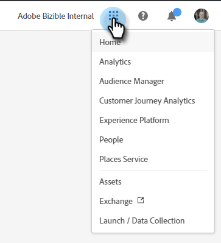

# Adobe Experience Cloud Interface {#unified-shell-overview}

Adobe Experience Cloudインターフェイスは、Adobe Experience Cloudアプリケーションおよびサービスの「シェル」ルックアンドフィールを揃えます。 ただの新しいデザインではありません。単一のインスタンスでユーザエクスペリエンスを提供する単一ページアプリケーションです。

## ユーザフロー {#user-flow}

既にAdobe Experience Cloud製品にログインしている場合は、メニューアイコンをクリックし、「 」を選択します。 **[!DNL Marketo Measure]**.

>[!NOTE]
>
>ドロップダウンメニューは、購読している Adobe Experience Cloud 製品に応じて異なる表示になる場合があります。

次の場合、 _not_ 既にAdobe Experience Cloud製品にログインしている場合は、に直接ログインしてください。 [!DNL Marketo Measure] こちら： [https://experience.adobe.com/marketo-measure](https://experience.adobe.com/marketo-measure).

## 新機能 {#new-features}

最新のルックアンドフィールに加えて、次の機能が見られます。

**ドメインの管理**

[を管理 [!DNL Marketo Measure] ドメイン](/help/marketo-measure-and-adobe/domain-management.md) 助けを借りずに [!DNL Marketo Measure].

**統合ヘルプセンター**

サポート記事を検索し、チケットを送信し、フィードバックを提供します。 [!DNL Marketo Measure] アプリケーション。

**アプリケーションの切り替え**

複数のAdobe製品にアクセスできるユーザーは、簡単に切り替えることができます。

**通知とお知らせ**

製品固有の通知や一般的なアドビ製品のお知らせを、アプリケーションで直接表示および操作します。

**アドビ設定**

プロファイルアイコンをクリックして、言語やその他のアドビ全体の環境設定を変更します。また、 [!DNL Marketo Measure] — クリックして特定の変更 **マイ設定**.

## よくある質問 {#faq}

**自分のブックマークはどうなりますか？**

ブックマークはリダイレクトされます。 例えば、https://apps.marketo-measure.com/Discover/391に移動した場合は、認証が完了するとhttps://experience.adobe.com/marketo-measure/Discover/391にリダイレクトされます。

**にログインできません [!DNL Marketo Measure] を使用します。 問題の原因**

Adobe Experience Cloudにログインできるが、次のようなページが表示された場合は、 [!DNL Marketo Measure] サイド：

上記のエラーが発生した場合は、 [サポートに連絡](https://nation.marketo.com/t5/support/ct-p/Support) 助けを求めて
