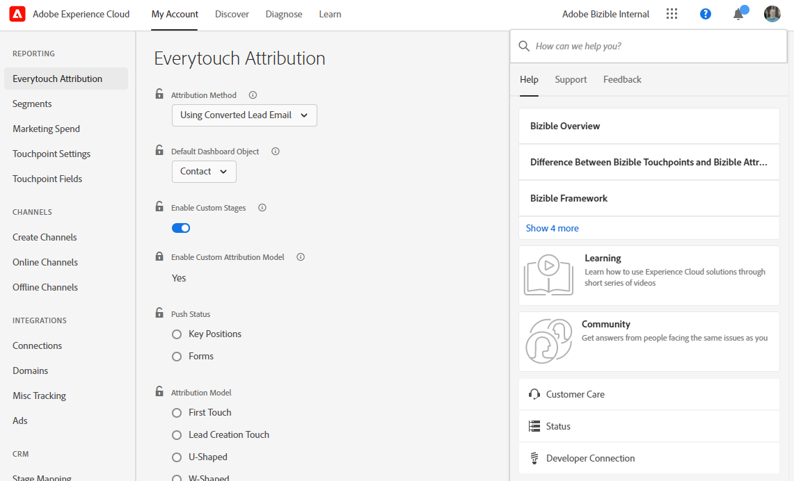
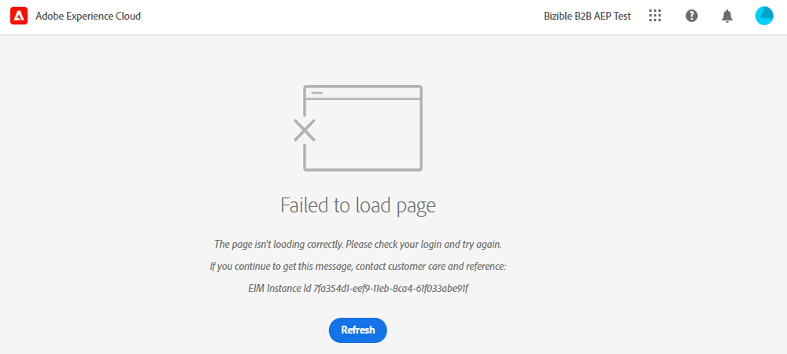

# Adobe Experience Cloud インターフェイスの概要 {#experience-cloud-interface-overview}

Adobe Experience Cloud インターフェイスは、Adobe Experience Cloud アプリケーションおよびサービスのルックアンドフィールを調整します。 ただの新しいデザインではありません。単一のインスタンスでユーザーエクスペリエンスを提供する単一ページアプリケーションです。

## ユーザーフロー {#user-flow}

既にAdobe Experience Cloudにログインしている場合は、メニューアイコンをクリックし、「**[!DNL Marketo Measure]**」を選択します。

>[!NOTE]
>購読しているAdobe Experience Cloud商品によって、ドロップダウンメニューの表示が異なる場合があります。

Adobe Experience Cloud製品にまだログインしていない _場合_、次の場所から [!DNL Marketo Measure] に直接ログインします：[https://experience.adobe.com/marketo-measure](https://experience.adobe.com/marketo-measure?lang=ja)。

## 新機能 {#new-features}

新しいルックアンドフィールに加えて、次の機能に注意してください。

**ドメインの管理**

[ ーザーのサポートを受けずに  [!DNL Marketo Measure]  ドメイン ](/help/marketo-measure-and-adobe/domain-management.md) 管理 [!DNL Marketo Measure] します。

**統合ヘルプセンター**

サポート記事の検索、チケットの送信、フィードバックの提供をすべて [!DNL Marketo Measure] アプリケーション内から行います。

**アプリケーションの切り替え**

複数のAdobe製品にアクセスできるユーザーは、簡単に切り替えることができます。

**通知とお知らせ**

製品固有の通知や一般的なアドビ製品のお知らせを、アプリケーションで直接表示および操作します。

**アドビ設定**

言語やその他のAdobe全体の環境設定を変更するには、自分のプロファイルアイコンをクリックします。 また、[ マイ設定 [!DNL Marketo Measure] をクリックして、**固有の変更を行うこ** もできます。

## よくある質問 {#faq}

**ブックマークはどうなりますか？**

ブックマークはリダイレクトされます。 例えば、https://apps.marketo-measure.com/Discover/391に移動する場合は、認証が完了したらhttps://experience.adobe.com/marketo-measure/Discover/391にリダイレクトされます。

**Experience Cloud インターフェイスから [!DNL Marketo Measure] にログインできません。 何が問題なのでしょうか？**

Adobe Experience Cloudにログインできるが、次のようなページが表示される場合、問題は [!DNL Marketo Measure] 側にある可能性があります。

上記のエラーが発生した場合は、[ サポートにお問い合わせください ](https://nation.marketo.com/t5/support/ct-p/Support)。
