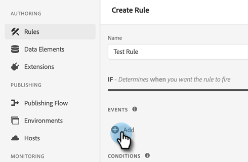
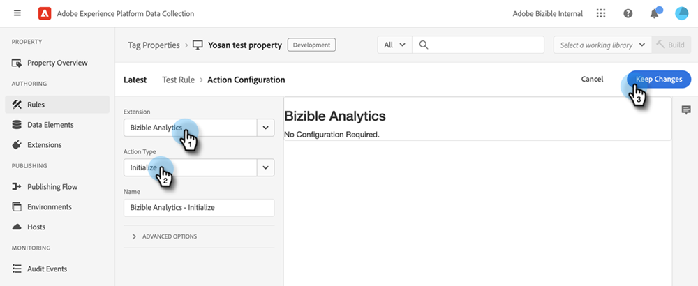
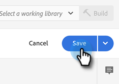

# [!DNL Marketo Measure] AdobeLaunch との統合 {#marketo-measure-integrations-with-adobe-launch}

AdobeLaunch 拡張機能は、既存のユーザー向けに設計されています。 [!DNL Marketo Measure] の Web サイトで既にAdobeLaunch を利用しているユーザーのみを対象としています。 拡張機能は、特定のイベントや条件に基づいてページにスクリプトを設定し、動的に読み込むためのタグ管理ソリューションとして機能します。

Launch でインストールおよび設定した場合、AdobeLaunch では、 [!DNL Marketo Measure] 拡張機能は、Launch スクリプトが存在するページに bizible.jsAdobeを読み込みます。 これにより、マーケターは Web ページを明示的に変更して bizible.js スクリプトタグを追加するのに対し、AdobeLaunch 設定を通じて bizible.js を追加できます。

## AdobeLaunch 拡張機能の設定 {#configure-the-adobe-launch-extension}

>[!PREREQUISITES]
>
>Launch とその拡張機能について詳しくは、次のリンクをAdobeしてください。
>
>* [[!DNL Marketo Measure] 拡張](https://experienceleague.adobe.com/docs/experience-platform/destinations/catalog/email/bizible.html?lang=en#catalog){target=&quot;_blank&quot;}
>* [Adobe起動の概要](https://experienceleague.adobe.com/docs/launch-learn/implementing-in-websites-with-launch/index.html?lang=en#prerequisites){target=&quot;_blank&quot;}
>* [AdobeLaunch 拡張機能の概要](https://experienceleague.adobe.com/docs/launch/using/extension-dev/overview.html?lang=en#extension-configuration){target=&quot;_blank&quot;}

1. 手順に従ってプロパティを作成します。 [この記事では、](https://experienceleague.adobe.com/docs/platform-learn/implement-in-websites/configure-tags/create-a-property.html?lang=en#go-to-the-data-collection-interface){target=&quot;_blank&quot;}。

1. 作成したプロパティをクリックします。

   

1. 「**[!UICONTROL 拡張機能]**」をクリックします。

   

1. 次をクリック： **[!UICONTROL カタログ]** タブで、「[!UICONTROL Bizible].&quot;

   

1. 内 [!UICONTROL Bizible Analytics] タイル、クリック **[!UICONTROL インストール]**.

   

1. 「Bizible AccountId」フィールドに、Web サイトの URL を入力します。

   

   >[!NOTE]
   >
   >このフィールドは、Business_Prod.Business テーブルの「アカウント ID」ではありません。 指定された URL のすべての Web アクティビティは、 [!DNL Marketo Measure] テナント。

1. 「**[!UICONTROL 保存]**」をクリックします。

   

1. クリック **[!UICONTROL ルール]**&#x200B;を選択し、「 **[!UICONTROL 新規ルールの作成]**.

   

1. 次をクリック： **[!UICONTROL 追加]** 下のボタン [!UICONTROL イベント].

   

1. 拡張機能ドロップダウンで、「 **[!UICONTROL コア]**. 次に、「イベントタイプ」ドロップダウンで、「 **[!UICONTROL 読み込まれたライブラリ（ページ上部）]**. イベントに名前を付けない場合、デフォルトの名前が適用されます。 クリック **[!UICONTROL 変更を保持]** 完了したら、

   

1. 次をクリック： **[!UICONTROL 追加]** ボタンをクリックします。

   

1. 「拡張機能」ドロップダウンで、「 **[!UICONTROL Bizible Analytics]**. 次に、「アクションタイプ」ドロップダウンで、「 **[!UICONTROL 初期化]**. アクションに名前を付けない場合、デフォルトの名前が適用されます。 クリック **[!UICONTROL 変更を保持]** 完了したら、

   

1. 「**[!UICONTROL 保存]**」をクリックします。

   
