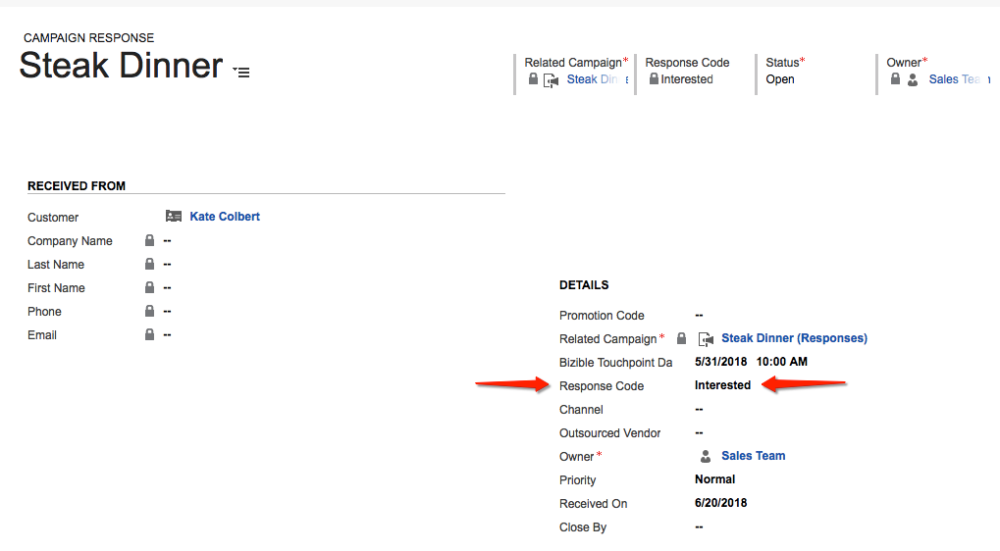
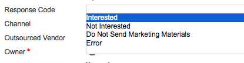
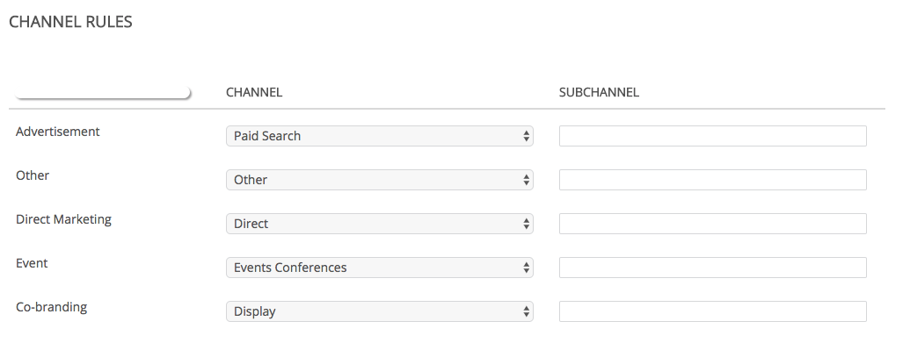

# Dynamics キャンペーンとマーケティングリスト {#dynamics-campaigns-and-marketing-lists}

>[!NOTE]
>
>&quot;[!DNL Marketo Measure]」 （アドビのドキュメント内）。ただし、CRM には「Bizible」が表示されます。 アドビは現在、その更新をおこなっており、ブランディングの変更が CRM に反映される予定です。

## キャンペーン {#campaigns}

Dynamics キャンペーンは、オフラインマーケティングアクティビティを追跡し、オムニチャネルジャーニーに含めるのに適しています。 キャンペーンは、リードまたは連絡先に関連付ける必要があり、キャンペーンの回答またはマーケティングリストを通じてキャンペーンにロールアップできます。

## キャンペーン応答 {#campaign-responses}

リードまたは連絡先がキャンペーンに直接追加されると、その連絡先はキャンペーンの反応レコードとして入力されます。

## タッチポイントの有効化 {#enable-touchpoints}

これらのレコードをタッチポイントジャーニーに含めるには、同期するキャンペーンの応答のタイプに対していくつかのオプションがあります。 キャンペーンレコードには、「[!UICONTROL 購入者タッチポイントの有効化].&quot; これが表示されない場合は、フォームエディターを使用してフィールドを追加する必要があります。

キャンペーンの反応を持つすべてのレコードをキャンペーンに含めるか、「関心あり」の応答を持つレコードのみを含めるか、デフォルトでキャンペーンの反応を含めることはできません。 このフィールドを空白のままにするか、明示的に除外するように選択できます。

[!DNL Marketo Measure] はカスタムの応答値をサポートしていません。

キャンペーン応答の在庫応答値は次のとおりです。

選択に基づいて、これらのレコードは、リード、連絡先、または商談のジャーニーのタッチポイントの対象になります。 該当する場合は、「Dynamics Campaign」タッチポイントがジャーニーに表示されます。

キャンペーンの応答が表示されない理由の 1 つは、リード/連絡先に対してファーストタッチまたはリード作成タッチアクティビティが既に記録され、「PostLC」機能が無効になっているか、最大タッチポイント数に達しているためです。

## Touchpoint日 {#touchpoint-date}

キャンペーンのタッチポイント日は、通常、キャンペーンの応答がキャンペーンに追加された日に設定されます。 「Buyer Touchpoint Date」というラベルが付いたインストール済みソリューションのカスタムフィールドに値が入力されている場合、上書きできます。 これが表示されない場合は、フォームエディターを使用してフィールドを追加する必要があります。

このフィールドの一般的な使用例の 1 つは、イベントの発生後の CRM 日にイベントのバッジスキャンのリストが追加され、ユーザーが実際に購入者タッチポイント日をイベントの発生日に戻す場合です。

## マーケティングリスト {#marketing-lists}

マーケティングリストは、リードや連絡先をマーケティングジャーニーに含めるもう 1 つの方法です。 マーケティングリストは、リードまたは連絡先のグループに対して一意です。つまり、リストがリードのセットか連絡先のセットかをユーザーが選択する必要があります。

[!DNL Marketo Measure] は、静的マーケティングリストのみをサポートします。 処理ではレコードの変更日を確認する必要があるので、動的マーケティングリストはサポートされていません。動的リストは頻繁に変更されるので、変更日は [!DNL Marketo Measure] チェックする対象。 そのためには、1 日を通じて完全なデータセットを継続的にダウンロードする必要があります。

上のスクリーンショットは、リードのマーケティングリストです。 マーケティングリストはキャンペーンに関連付けられ、複数のキャンペーンに関連付けることができます。 1 つのキャンペーンに対して 1 つのマーケティングリストしか作成しない場合を除き、 [!DNL Marketo Measure] では、顧客はマーケティングリストを使用してキャンペーンを追跡することはお勧めしません。 リード/連絡先の同じ正確なリストが、複数のキャンペーンをまたいだタッチポイントに対する資格を持つことはあり得ません。

## タッチポイントの有効化 {#enable-touchpoints-1}

タッチポイントに対してマーケティングリストを有効にするには、「[!UICONTROL マーケティングリストの同期]、」と表示されます。これは、シンプルな yes/no スイッチです。 これが表示されない場合は、フォームエディターを使用してフィールドを追加する必要があります。 キャンペーンレコードを見ると、キャンペーンに関連するマーケティングリストを確認できるので、有効にしているリストの数を把握できます。

## Touchpoint日 {#touchpoint-date-1}

マーケティングリストのタッチポイント日は、通常、ListMember が作成した日付なので、リードまたは連絡先がマーケティングリストに追加された日付です。 「Buyer Touchpoint Date」というラベルが付いたインストール済みソリューションのカスタムフィールドに値が入力されている場合、上書きできます。 これが表示されない場合は、フォームエディターを使用してフィールドを追加する必要があります。

## チャネルマッピング {#channel-mapping}

Dynamics キャンペーンは、「キャンペーンタイプ」フィールドを使用してカスタムマーケティングチャネルでグループ化されます。 これらは、Dynamics カスタマイズメニューで変更できます。

キャンペーンタイプメニューの値が [!DNL Marketo Measure] アプリケーション。 **[!UICONTROL マイアカウント]** > **[!UICONTROL 設定]** > **[!UICONTROL オフラインチャネル]**.

キャンペーンタイプごとに、チャネルとサブチャネルの組み合わせにマッピングでき、キャンペーンから派生する各タッチポイントで、正しくマッピングされたチャネルとサブチャネルが使用されます。

## キャンペーン同期日 {#campaign-sync-date}

Dynamics のお客様は利用できません

## よくある質問 {#faq}

**マーケティングリストのタッチポイントを有効にできますか、それとも Dynamics のキャンペーンのみを有効にできますか？**

マーケティングリストを有効にすることはできますが、マーケティングリストを同期するオプションはキャンペーン上に存在するので、キャンペーンに関連付ける必要があります。

**キャンペーンの回答とマーケティングリストをキャンペーンで使用できますか？**

あります。
