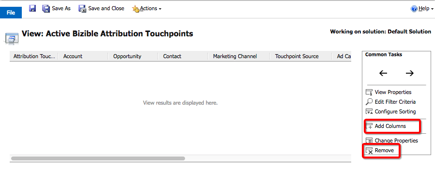
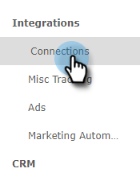

# [!DNL Microsoft Dynamics] CRM インストールガイド {#microsoft-dynamics-crm-installation-guide}

>[!NOTE]
>
>この場合、[!DNL Marketo Measure]」 （ドキュメント内）が表示されますが、CRM には「Bizible」が表示されます。 アドビは現在、その更新を行っており、ブランディングの変更がまもなく CRM に反映される予定です。

## サポートされているバージョン {#supported-versions}

[!DNL Marketo Measure] は、次をサポートします。 [!DNL Microsoft Dynamics CRM] バージョン：

* [!DNL Microsoft Dynamics 2016] （オンラインおよびオンプレミス）
* [!DNL Microsoft Dynamics 365] （オンラインおよびオンプレミス）

接続と認証の場合、 [!DNL Marketo Measure] は、次の Active Directory Federated Services(ADFS) バージョンをサポートしています。

* ADFS 4.0 - [!DNL Windows Server 2016]
* ADFS 5.0 - [!DNL Windows Server 2019]

## 管理ソリューションのインストール {#install-the-managed-solution}

[ダウンロードとインストール](assets/marketo-measure-dynamics-extension.zip) Dynamics CRM 内の zip ファイル。

**[!UICONTROL 設定]** > **[!UICONTROL カスタマイズ]** > **[!UICONTROL ソリューション]** > **[!UICONTROL インポート]** （ボタン） > **[!UICONTROL ファイルを選択]**.

>[!NOTE]
>
>次の 2 つのスクリーンショットは、ソリューションのアップグレード中に撮影されたものなので、実際のスクリーンショットとは少し異なる場合があります。

## の作成 [!DNL Marketo Measure] ユーザー {#creating-a-marketo-measure-user}

CRM の他のユーザーとの問題を回避するために、Dynamics 内で専用のMarketo Measureユーザーを「アプリケーションユーザー」として作成して、データをエクスポートおよびインポートすることをお勧めします。 ユーザー名とパスワード、およびエンドポイント URL を控えておきます。これらは、 [!DNL Marketo Measure] アカウント。

## セキュリティロール {#security-roles}

組織で Dynamics セキュリティロールを使用している場合は、接続されているユーザーまたは専用のユーザーを確認してください [!DNL Marketo Measure] ユーザーには、必要なエンティティに対する十分な読み取り/書き込み権限があります。

セキュリティロールは次の場所にあります。 **[!UICONTROL 設定]** > **[!UICONTROL セキュリティ]** > **[!UICONTROL セキュリティロール]**.

の場合 [!DNL Marketo Measure] カスタムエンティティの場合は、すべてのエンティティに対してフルパーミッションが必要です。

>[!NOTE]
>
>商談をクローズしたユーザーには、完全な権限も必要です。

Dynamics 標準エンティティについては、 [!DNL Marketo Measure] Dynamics スキーマドキュメント。 高いレベルでは [!DNL Marketo Measure] は、特定のエンティティを読み取って適切なデータを収集し、管理ソリューションと共にインストールされるカスタムフィールドに書き込みます。 標準レコードは作成されず、標準フィールドは更新されません。

## ページレイアウトにタッチポイントを含める： {#include-touchpoints-on-page-layouts}

1. 各エンティティについて、フォームエディターに移動します。 これは、以下の場所にあります。 **[!UICONTROL 設定]** > **[!UICONTROL カスタマイズ]** > **[!UICONTROL システムのカスタマイズ]** > `[Entity]` > **[!UICONTROL Forms]**. または、レコードを表示しているときに、設定に表示されます。

   * 設定するエンティティ（アカウント、商談、連絡先、リード、キャンペーン）。

   * キャンペーンを設定するには、 **[!UICONTROL CRM]** > **[!UICONTROL キャンペーン]**.

   

1. ページレイアウト：最初に「[!UICONTROL 1 列]」タッチポイントを有効にするセクションのタイル。 この新しい列内には、アカウント、商談、連絡先、およびリードエンティティ内の各フォームにサブグリッドを追加する必要があります。

   

   

1. サブグリッドでレンダリングするオブジェクト（購入者属性タッチポイントまたは購入者タッチポイント）を選択します。これは、オブジェクトの関係に依存します。 必要に応じて、「編集」ボタンをクリックして、表示する列を変更します。 デフォルトのレイアウトは管理ソリューションによって設定されます。

   購入者属性タッチポイントサブグリッド — アカウント、商談、連絡先\
   購入者タッチポイントサブグリッド — リードと連絡先

   

1. フォームの更新が完了したら、変更を発行して保存します。

## スキーマ関連の考慮事項 {#schema-related-considerations}

**売上高**

[!DNL Marketo Measure] は、デフォルトで、標準の「実際の売上高」フィールドを指します。 これを使用しない場合は、カスタムワークフローが必要となるために、ソリューションエンジニアまたはサクセスマネージャーに売上高を報告する方法を説明します。

**クローズ日**

[!DNL Marketo Measure] は、標準の [ 実際の終了日 ] フィールドを指します。 これを使用していない場合や、「 Estimated Close Date 」フィールドも使用している場合は、ソリューションエンジニアまたはサクセスマネージャーにプロセスを説明してください。 両方のフィールドを考慮するには、カスタムワークフローが必要になる場合があります。

## 接続とデータプロバイダーの設定 {#configuring-your-connections-and-data-providers}

にログインした後、 [!DNL Marketo Measure] アプリケーションを使用し、Adobe Admin Consoleでユーザーとして設定されている場合、次の手順は、様々なデータ接続を設定することです。

**データプロバイダーとしての CRM**

1. を [!DNL Marketo Measure] アカウントを選択し、 **[!UICONTROL マイアカウント]** ドロップダウンして「 」を選択します。 **[!UICONTROL 設定]**.

   

1. の下 [!UICONTROL 統合] 左側のナビゲーションで、 **[!UICONTROL 接続]**.

   

1. 次をクリック： **[!UICONTROL 新しい CRM 接続の設定]** 」ボタンをクリックします。

   

1. 次の隣 [!UICONTROL Microsoft Dynamics CRM]をクリックし、 **[!UICONTROL 接続]** 」ボタンをクリックします。

   

1. 選択 [!UICONTROL 資格情報] または [!UICONTROL OAuth].

   

   >[!NOTE]
   >
   >OAuth の詳細については、を参照してください。 [この記事](/help/marketo-measure-and-dynamics/getting-started-with-marketo-measure-and-dynamics/oauth-with-azure-active-directory-for-dynamics-crm.md). プロセスについてご質問がある場合は、 [!DNL Marketo Measure] アカウント担当者。

1. この例では、「資格情報」を選択します。 資格情報を入力し、「 **[!UICONTROL 次へ]**.

接続後、Dynamics 接続の詳細が「CRM/MAP 接続」リストに表示されます。

**広告アカウント接続**

広告アカウントをに接続するには [!DNL Marketo Measure]を開始するには、まず [!UICONTROL 接続] タブ内の [!DNL Marketo Measure] アプリケーション。

1. 上記の手順 1 および 2 に従います。 _データプロバイダーとしての CRM_ 」セクションに入力します。

1. 次をクリック： **[!UICONTROL 新しい CRM 接続の設定]** 」ボタンをクリックします。

   

1. 目的のプラットフォームを選択します。

   

**[!DNL Marketo Measure]JavaScript**

の場合 [!DNL Marketo Measure] web アクティビティを追跡するには、複数の設定手順があります。

1. 次をクリック： **[!UICONTROL マイアカウント]** ドロップダウンして「 」を選択します。 **[!UICONTROL アカウント設定]**.

   

1. 電話番号を入力してください。 「 Web サイト」で、 [!DNL Marketo Measure] 追跡機能を使用できます。 終了したら「**[!UICONTROL 保存]**」をクリックします。

   

   >[!NOTE]
   >
   >複数のルートドメインを追加する場合は、 [!DNL Marketo Measure] アカウント担当者。

1. The [[!DNL Marketo Measure] JavaScript](/help/marketo-measure-tracking/setting-up-tracking/adding-marketo-measure-script.md) 次に、サイト全体とランディングページに配置する必要があります。 ランディングページのヘッド内でスクリプトをハードコーディングするか、Tag Managementシステムを使用して次のようなスクリプトを追加することをお勧めします。 [Google Tag Manager](/help/marketo-measure-tracking/setting-up-tracking/adding-marketo-measure-script-via-google-tag-manager.md).

   >[!NOTE]
   >
   >デフォルトでは、ジョブが CRM にデータを送信するたびに、[!DNL Marketo Measure] は API クレジットごとに 200 件のレコードを書き出します。これにより、ほとんどの顧客に、[!DNL Marketo Measure] が消費する API クレジットと CRM の CPU リソース要件との間の最適なバランスが提供されます。ただし、ワークフローやトリガーなど複雑な CRM 設定を持つ顧客の場合は、バッチサイズを小さくすると CRM のパフォーマンスの向上に役立つ場合があります。この目的のために、[!DNL Marketo Measure] では顧客が CRM 書き出しのバッチサイズを設定できます。この設定は、 [!DNL Marketo Measure] Web アプリケーションとお客様は、200（デフォルト）、100、50、25 のバッチサイズから選択できます。
   >
   >この設定を変更する場合、小さいバッチサイズでは、CRM からの API クレジットがより多く消費されることに注意してください。 CRM で CPU がタイムアウトしたり、CPU 負荷が高くなったりした場合にのみ、バッチサイズを小さくすることをお勧めします。

   >[!NOTE]
   >
   >Dynamics へのMarketo Measureのデータの書き出しを無効にしても、既存のデータは削除されません。 既存のデータの削除に関するヘルプが必要な場合は、Dynamics サポートにお問い合わせください。

   >[!MORELIKETHIS]
   >
   >[エラー通知](/help/configuration-and-setup/getting-started-with-marketo-measure/error-notifications.md){target="_blank"}
