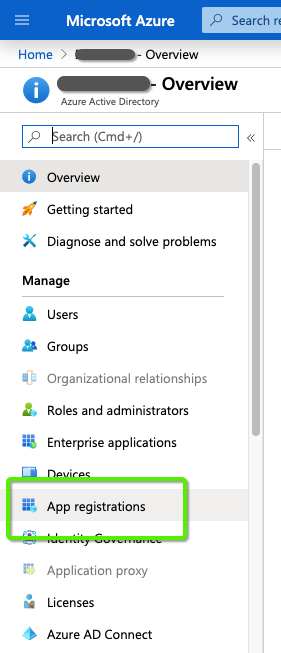
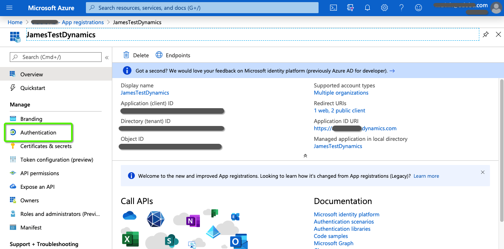
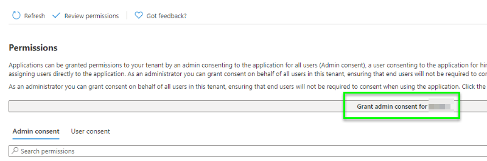

# Dynamics CRM 用 [!DNL Azure Active Directory] での OAuth {#oauth-with-azure-active-directory-for-dynamics-crm}

## 影響の対象 {#who-s-affected}

この設定は、[!DNL Azure Active Directory] （AAD） アカウントで Dynamics CRM を使用している新規の [!DNL Marketo Measure] 顧客、または従来のユーザー名とパスワードから OAuth を使用する [!DNL Azure Active Directory] に移行する顧客を対象としています。

>[!NOTE]
>
>これらの両方のシナリオで、AAD はここで、[!DNL Marketo Measure] as a データプロバイダーへの Dynamics インスタンスの接続を容易にするように設定されています。

## 新しいアプリケーションの設定 {#set-up-new-application}

1. [Azure Portal](https://portal.azure.com/#home) にログインします。

1. Azure AD テナントを選択します。それには、ページの右上隅にあるアカウントをクリックし、「ディレクトリを切り替え」ナビゲーションをクリックして、適切なテナントを選択します。 アカウントの下に Azure AD テナントが 1 つしかない場合、または適切な Azure AD テナントを既に選択している場合は、この手順をスキップしてください。

   

1. 検索バーで「[!DNL Azure Active Directory]」を検索し、名前をクリックして開きます。

   

1. 左側のメニューで **[!UICONTROL アプリ登録]** をクリックします。

   

1. 上部の **[!UICONTROL 新規登録]** をクリックします。

   

1. プロンプトに従って、アプリケーションを作成します。 Web アプリケーションかパブリッククライアント（モバイルおよびデスクトップ）アプリケーションかに関係なく、Web アプリケーションまたはパブリッククライアントアプリケーションの具体的な例が必要な場合は、[ クイックスタート ](https://learn.microsoft.com/en-us/azure/active-directory/develop/v2-overview) を確認してください。\
   a. 「名前」はアプリケーション名で、エンドユーザーに対するアプリケーションの説明です。\
   b. 「サポートされているアカウントタイプ」で、任意の組織ディレクトリおよび個人用Microsoft アカウント内の「アカウント」を選択します。\
   c. リダイレクト URI を指定します。 Web アプリケーションの場合、これは、ユーザーがログインできるアプリのベース URL です。 例：`http://localhost:12345`。 パブリッククライアント（モバイルおよびデスクトップ）の場合、Azure AD はこれを使用してトークン応答を返します。 アプリケーションに固有の値を入力します。 例：`http://MyFirstAADApp`。

1. 登録が完了すると、Azure AD はアプリケーションに一意のクライアント識別子（アプリケーション ID）を割り当てます。 この値は次のセクションで必要になるので、アプリケーションページからコピーします。

1. Azure Portal でアプリケーションを検索するには、「**[!UICONTROL アプリ登録]**」をクリックし、「**[!UICONTROL すべてのアプリケーション]**」をクリックします。 新しく作成したアプリケーションを開きます。

1. 左側のメニューで **[!UICONTROL 認証]** をクリックします。

   

1. リダイレクト URL のリストに [!DNL Marketo Measure] リダイレクト URL `https://apps.bizible.com/OAuth2` および `https://apps.bizible.com/OAuth2?identityOnly=true` を追加します。

   

1. 「API 権限」タブに移動し、アプリケーションに正しい権限が割り当てられていることを確認します。

   

1. ここから、検索ボックスに「[!UICONTROL enterprise]」と入力し、「エンタープライズアプリケーション **[!UICONTROL をクリック]** ます。

   

1. 再度、アプリケーションのリストから新しいアプリケーションを見つけて開きます。

1. 「権限」タブで、「**[!UICONTROL （インスタンス名）の管理者の同意を付与]**」をクリックします。

   

1. 「**[!UICONTROL 確定]**」をクリックします。

   

1. 「[!UICONTROL  ユーザーとグループ ]」タブで、有効な「ユーザーとグループ」がアプリケーションに割り当てられていることを確認します。

   

## アプリケーションユーザーの作成 {#creating-an-application-user}

アプリケーションの登録が完了したら、アプリケーションユーザーを作成できます。

1. 共通データサービス環境（`https://[org].crm.dynamics.com`）に移動します。

1. **[!UICONTROL 設定]**/**[!UICONTROL セキュリティ]**/**[!UICONTROL ユーザー]** に移動します。

1. 表示フィルターで「**[!UICONTROL アプリケーションユーザー]**」を選択します。

1. 「**[!UICONTROL +新規]**」を選択します。

1. アプリケーションユーザーフォームで、必要な情報を入力します。

   >[!NOTE]
   >
   >* ユーザー名情報は、[!DNL Azure Active Directory] に存在するユーザーと一致しないでください。
   >
   >* 「アプリケーション ID」フィールドに、以前に Azure AD に登録したアプリのアプリケーション ID を入力します。

1. 設定が正しい場合、「**[!UICONTROL 保存]**」を選択すると、**[!UICONTROL アプリケーション ID URI]** および **[!UICONTROL Azure AD オブジェクト ID]** フィールドに正しい値が自動入力されます。

1. ユーザーフォームを終了する前に、「**[!UICONTROL 役割の管理]**」を選択し、このアプリケーションユーザーにセキュリティーロールを割り当てて、アプリケーションユーザーが目的の組織データにアクセスできるようにします。

## OAuth 経由での Dynamics インスタンスの接続 {#connecting-your-dynamics-instance-via-oAuth}

1. Dynamics 接続を初めて設定する場合は、[ この記事 ](/help/marketo-measure-and-dynamics/getting-started-with-marketo-measure-and-dynamics/microsoft-dynamics-crm-installation-guide.md) の「データプロバイダーとしての CRM」の節の手順 1～5 に従ってください。

1. OAuth 資格情報の入力画面が表示されたら、前述の節で設定したクライアント ID、クライアント秘密鍵、アプリケーション ID URI を入力します。

a. クライアント ID は、上記の節の手順#7 の ID です。 書き留めていない場合は、アプリ登録の設定にアプリケーション ID が表示されます。

b. クライアントシークレットは、証明書とシークレットの下で、アプリケーション用に Azure Portal で作成されたアプリケーションシークレットです。

c. アプリケーション ID URI は、ターゲット web API （保護されたリソース）の URL です。 アプリ ID の URL を確認するには、Azure Portal で [[!DNL Azure Active Directory]] をクリックし、[ アプリケーション登録 ] をクリックして、アプリケーションの [ 設定 ] ページを開き、[ プロパティ ] をクリックします。 また、`https://graph.microsoft.com` のような外部リソースである場合もあります。 これは、通常、Dynamics インスタンスの URL です。

1. **[!UICONTROL 送信]** をクリックすると、[!DNL Azure Active Directory] でサインインするように求められます。 認証が成功すると、Dynamics アカウントは [!DNL Marketo Measure] 内のデータプロバイダーとして接続されます。

## Dynamics アカウントの再認証 {#re-authenticating-your-dynamics-account}

1. [!DNL Marketo Measure] アプリケーションで、**[!UICONTROL マイ設定]**/**[!UICONTROL 設定]**/**[!UICONTROL 接続]** に移動します。

1. Dynamics 接続の横にある「CRM」セクションのキーアイコンをクリックします。

1. キーをクリックすると、ポップアップが表示され、サインアップフローと同様に、クライアント ID、クライアントの秘密鍵、アプリケーション ID URI を入力するよう求められます。

   

1. **[!UICONTROL 送信]** をクリックすると、[!DNL Azure Active Directory] でサインインするように求められます。 認証に成功すると、[!DNL Marketo Measure] 内で Dynamics アカウントが再認証されます。
