# Dynamics CRM用[!DNL Azure Active Directory]のOAuth {#oauth-with-azure-active-directory-for-dynamics-crm}

## 影響するユーザー {#who-s-affected}

この設定は、[!DNL Azure Active Directory] （AAD） アカウントでDynamics CRMを使用している新規[!DNL Marketo Measure]のお客様、またはOAuthを使用して従来のユーザー名とパスワードから[!DNL Azure Active Directory]に移行するお客様を対象としています。

>[!NOTE]
>
>これらの両方のシナリオで、AADは[!DNL Marketo Measure]のDynamics インスタンスをデータプロバイダーとして簡単に接続できるように、ここに設定されています。

## 新しいアプリケーションの設定 {#set-up-new-application}

1. [Azure ポータル &#x200B;](https://portal.azure.com/#home)にログインします。

1. ページの右上隅にあるアカウントをクリックし、「ディレクトリを切り替え」ナビゲーションをクリックして適切なテナントを選択し、Azure AD テナントを選択します。 アカウントにAzure AD テナントが1つしかない場合や、適切なAzure AD テナントを既に選択している場合は、この手順をスキップしてください。

   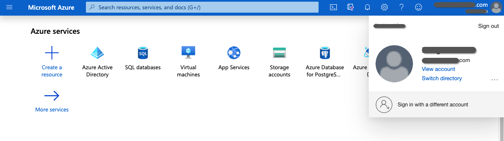

1. 検索バーで「[!DNL Azure Active Directory]」を検索し、名前をクリックして開きます。

   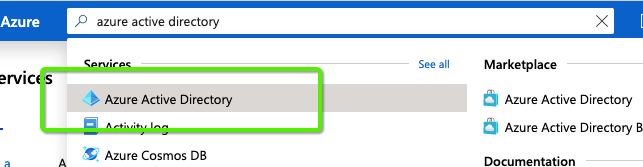

1. 左側のメニューで「**[!UICONTROL アプリ登録]**」をクリックします。

   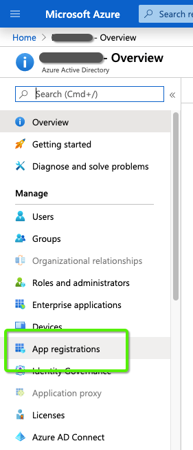

1. 上部の「**[!UICONTROL 新規登録]**」をクリックします。

   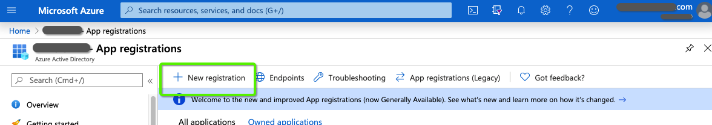

1. プロンプトに従ってアプリケーションを作成します。 Web アプリケーションまたはパブリッククライアント（モバイルおよびデスクトップ）アプリケーションのいずれであっても、web アプリケーションまたはパブリッククライアントアプリケーションの具体的な例については、[&#x200B; クイックスタート &#x200B;](https://learn.microsoft.com/en-us/azure/active-directory/develop/v2-overview)を参照してください。\
   a. 「名前」はアプリケーション名で、エンドユーザーに対するアプリケーションを説明します。\
   b. 「サポートされているアカウントタイプ」で、「任意の組織ディレクトリのアカウント」および「個人のMicrosoft アカウント」を選択します。\
   c. リダイレクト URIを指定します。 Web アプリケーションの場合、これはユーザーがログインできるアプリのベース URLです。 たとえば、`http://localhost:12345` のように設定します。 パブリッククライアント（モバイルおよびデスクトップ）の場合、Azure ADはそれを使用してトークン応答を返します。 アプリケーションに固有の値を入力します。 例：`http://MyFirstAADApp`。

1. 登録が完了すると、Azure ADは一意のクライアント ID （アプリケーション ID）をアプリケーションに割り当てます。 次のセクションでこの値が必要なので、アプリケーションページからコピーします。

1. Azure ポータルでアプリケーションを検索するには、**[!UICONTROL アプリケーション登録]**&#x200B;をクリックし、**[!UICONTROL すべてのアプリケーション]**&#x200B;をクリックします。 新しく作成したアプリケーションを開く

1. 左側のメニューで「**[!UICONTROL 認証]**」をクリックします。

   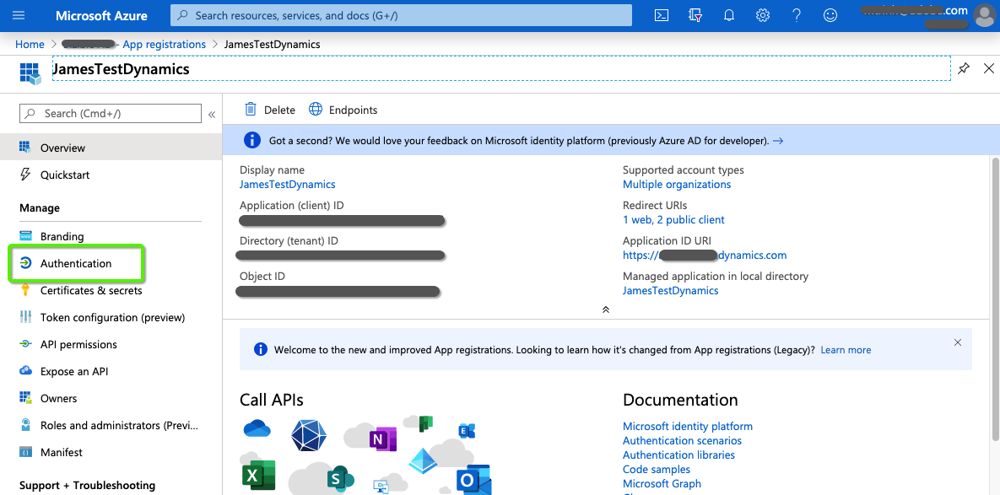

1. [!DNL Marketo Measure]個のリダイレクト URL: `https://apps.bizible.com/OAuth2`と`https://apps.bizible.com/OAuth2?identityOnly=true`をリダイレクト URLのリストに追加します。

   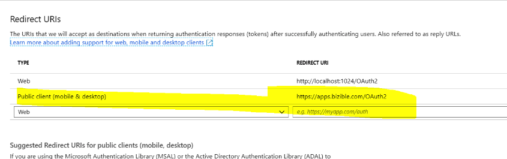

1. 「API権限」タブに移動し、正しい権限がアプリケーションに割り当てられていることを確認します。

   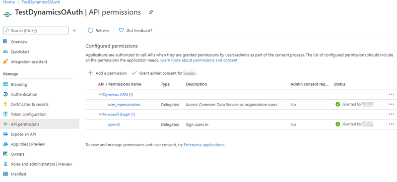

1. ここから、検索ボックスに「[!UICONTROL enterprise]」と入力し、**[!UICONTROL Enterprise Applications]**&#x200B;をクリックします。

   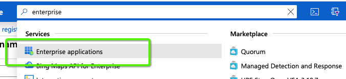

1. アプリケーションのリストから、新しいアプリケーションを検索して開きます。

1. 「権限」タブで、「**[!UICONTROL 管理者の同意を付与（インスタンス名）]**」をクリックします。

   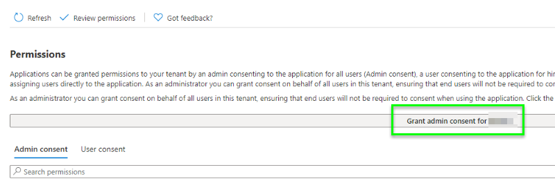

1. 「**[!UICONTROL 確定]**」をクリックします。

   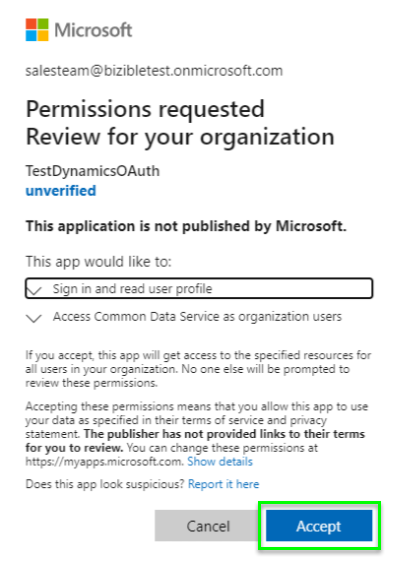

1. 「[!UICONTROL &#x200B; ユーザーとグループ &#x200B;]」タブで、有効な「ユーザーとグループ」がアプリケーションに割り当てられていることを確認します。

   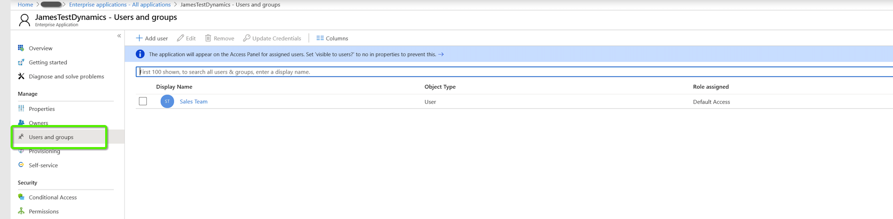

## アプリケーションユーザーの作成 {#creating-an-application-user}

アプリケーション登録が完了したら、アプリケーションユーザーを作成できます。

1. Common Data Service環境（`https://[org].crm.dynamics.com`）に移動します。

1. **[!UICONTROL 設定]** > **[!UICONTROL セキュリティ]** > **[!UICONTROL ユーザー]**&#x200B;に移動します。

1. ビューフィルターで「**[!UICONTROL アプリケーションユーザー]**」を選択します。

1. **[!UICONTROL +新規]**&#x200B;を選択します。

1. アプリケーションユーザーフォームに、必要な情報を入力します。

   >[!NOTE]
   >
   >* ユーザー名の情報は、[!DNL Azure Active Directory]に存在するユーザーと一致することはできません。
   >
   >* 「アプリケーション ID」フィールドに、以前にAzure ADに登録したアプリケーションのアプリケーション IDを入力します。

1. 設定が正しい場合は、**[!UICONTROL Save]**&#x200B;を選択した後、**[!UICONTROL アプリケーション ID URI]**&#x200B;および&#x200B;**[!UICONTROL Azure AD オブジェクト ID]** フィールドに正しい値が自動入力されます。

1. ユーザーフォームを終了する前に、**[!UICONTROL 役割の管理]**&#x200B;を選択し、アプリケーション ユーザーが目的の組織データにアクセスできるように、このアプリケーション ユーザーにセキュリティ役割を割り当てます。

## OAuthを介したDynamics インスタンスの接続 {#connecting-your-dynamics-instance-via-oAuth}

1. Dynamics接続を初めて設定する場合は、[この記事](/help/marketo-measure-and-dynamics/getting-started-with-marketo-measure-and-dynamics/microsoft-dynamics-crm-installation-guide.md)の「CRM as a Data Provider」セクションの手順1 ～ 5に従ってください。

1. OAuth資格情報の入力を求められたら、上記のセクションで設定したクライアント ID、クライアント秘密鍵、およびアプリケーション ID URIを入力します。

a. クライアント IDは、上記のセクションのステップ #7のIDです。 書き留めなかった場合は、アプリ登録の「設定」にアプリ IDが表示されます。

b. Client Secretは、証明書とシークレットの下のアプリケーション用にAzure ポータルで作成されたアプリケーションのシークレットです。

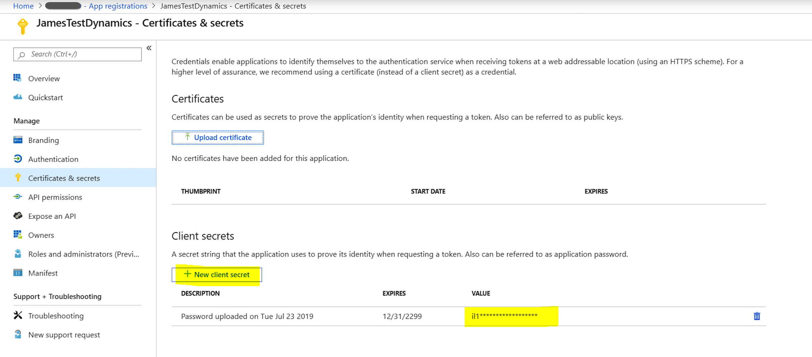

c. アプリケーション ID URIは、ターゲット Web API （セキュアリソース）のURLです。 アプリ IDのURLを見つけるには、Azure ポータルで「[!DNL Azure Active Directory]」をクリックし、「Application registrations」をクリックして、アプリケーションの「Settings」ページを開き、「Properties」をクリックします。 `https://graph.microsoft.com`のような外部リソースを使用することもできます。 これは通常、Dynamics インスタンスのURLです。

1. **[!UICONTROL 送信]**&#x200B;をクリックすると、[!DNL Azure Active Directory]でログインするよう求められます。 認証が成功すると、Dynamics アカウントは[!DNL Marketo Measure]内のデータ プロバイダーとして接続されます。

## Dynamics アカウントの再認証 {#re-authenticating-your-dynamics-account}

1. [!DNL Marketo Measure] アプリケーションを使用している場合は、**[!UICONTROL My Settings]** > **[!UICONTROL Settings]** > **[!UICONTROL Connections]**&#x200B;に移動します。

1. Dynamics接続の横にあるCRM セクションのキーアイコンをクリックします。

1. キーをクリックすると、ポップアップが表示され、サインアップフローと同様に、クライアント ID、クライアント秘密鍵、およびアプリケーション ID URIを入力するように求められます。

   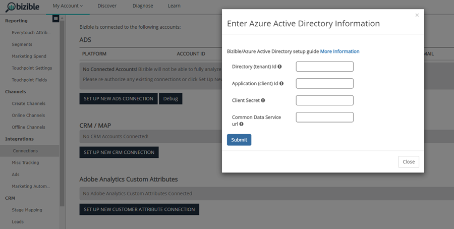

1. **[!UICONTROL 送信]**&#x200B;をクリックすると、[!DNL Azure Active Directory]でログインするよう求められます。 認証が成功すると、Dynamics アカウントは[!DNL Marketo Measure]内で再認証されます。
