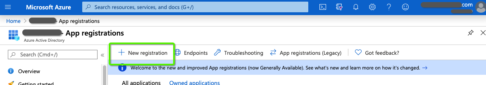

# 次を使用する OAuth [!DNL Azure Active Directory] Dynamics CRM の場合 {#oauth-with-azure-active-directory-for-dynamics-crm}

## 影響を受けたユーザー {#who-s-affected}

この設定は新規用です [!DNL Marketo Measure] Dynamics CRM を [!DNL Azure Active Directory] (AAD) アカウント、または従来のユーザー名やパスワードログインからに移行するお客様用 [!DNL Azure Active Directory] を OAuth に設定します。

>[!NOTE]
>
>これらの両方のシナリオで、AAD は、Dynamics インスタンスを簡単にで接続できるように、ここで設定されています。 [!DNL Marketo Measure] をデータプロバイダーとして設定します。

## 新しいアプリケーションの設定 {#set-up-new-application}

1. ログイン先： [Azure Portal](https://portal.azure.com/#home).

1. ページの右上隅にあるアカウントをクリックし、Switch Directory ナビゲーションをクリックして適切なテナントを選択します（アカウントに Azure AD テナントが 1 つだけある場合、または適切な Azure AD テナントを既に選択している場合は、この手順をスキップします）。

   

1. 「[!DNL Azure Active Directory]」と入力し、名前をクリックして開きます。

   

1. クリック **[!UICONTROL アプリ登録]** をクリックします。

   

1. クリック **[!UICONTROL 新規登録]** 一番上に

   

1. 画面の指示に従って、新しいアプリケーションを作成します。 Web アプリケーションでもパブリッククライアント（モバイル&amp;デスクトップ）アプリケーションでも構いませんが、Web アプリケーションやパブリッククライアントアプリケーションに関する具体的な例をご希望の場合は、 [quickstarts](https://docs.microsoft.com/en-us/azure/active-directory/develop/v1-overview).\
   a.「名前」はアプリケーション名で、エンドユーザーに対するアプリケーションを表します。\
   b.「サポートされるアカウントの種類」で、「任意の組織ディレクトリのアカウント」および「個人のMicrosoftアカウント」を選択します。\
   c.リダイレクト URI を指定します。 Web アプリケーションの場合、これはユーザーがログインできるアプリのベース URL です。 例： `http://localhost:12345`. パブリッククライアント（モバイルおよびデスクトップ）の場合、Azure AD はこれを使用してトークン応答を返します。 アプリケーションに固有の値を入力します。 例： `http://MyFirstAADApp`.

1. 登録が完了すると、Azure AD はアプリケーションに一意のクライアント識別子（アプリケーション ID）を割り当てます。 この値は次のセクションで必要になるので、アプリケーションページからコピーします。

1. Azure ポータルでアプリケーションを検索するには、 **[!UICONTROL アプリ登録]**&#x200B;を選択し、「 **[!UICONTROL すべてのアプリ]**. 新しく作成したアプリケーションを開きます。

1. クリック **[!UICONTROL 認証]** をクリックします。

   

1. を [!DNL Marketo Measure] リダイレクト URL: `https://apps.bizible.com/OAuth2` および `https://apps.bizible.com/OAuth2?identityOnly=true` をリダイレクト URL のリストに追加します。

   

1. 「 API 権限」タブに移動し、正しい権限がアプリケーションに割り当てられていることを確認します。

   

1. ここから、&quot;[!UICONTROL enterprise]」をクリックし、 **[!UICONTROL エンタープライズアプリケーション]**.

   

1. 再度、アプリケーションのリストから新しいアプリケーションを探して開きます。

1. 「権限」タブで、 **[!UICONTROL （インスタンス名）の管理者の同意を得る]**.

   

1. 「**[!UICONTROL 確定]**」をクリックします。

   

1. 「[!UICONTROL ユーザーとグループ]&quot;」タブで、有効な「ユーザーとグループ」がアプリケーションに割り当てられていることを確認します。

   

## アプリケーションユーザーの作成 {#creating-an-application-user}

申込登録が完了したら、申込ユーザを作成できます。

1. 共通データサービス環境 (`https://[org].crm.dynamics.com`) をクリックします。

1. に移動します。 **[!UICONTROL 設定]** > **[!UICONTROL セキュリティ]** > **[!UICONTROL ユーザー]**.

1. 選択 **[!UICONTROL アプリユーザ]** をクリックします。

1. 選択 **[!UICONTROL +新規]**.

1. アプリケーションユーザーフォームで、必要な情報を入力します。

   >[!NOTE]
   >
   >* ユーザー名情報が、 [!DNL Azure Active Directory].
   >
   >* 「アプリケーション ID 」フィールドに、Azure AD で以前に登録したアプリのアプリケーション ID を入力します。

1. 設定が正しい場合は、「 **[!UICONTROL 保存]**、 **[!UICONTROL アプリケーション ID URI]** および **[!UICONTROL Azure AD オブジェクト ID]** フィールドに正しい値が自動入力されます。

1. ユーザーフォームを終了する前に、「 」を選択します。 **[!UICONTROL 役割の管理]** セキュリティロールをこのアプリケーションユーザーに割り当てて、アプリケーションユーザーが目的の組織データにアクセスできるようにします。

## OAuth を使用した Dynamics インスタンスの接続 {#connecting-your-dynamics-instance-via-oAuth}

1. 初めて Dynamics 接続を設定する場合は、 [この記事](/help/marketo-measure-and-dynamics/getting-started-with-marketo-measure-and-dynamics/microsoft-dynamics-crm-installation-guide.md).

1. OAuth 資格情報の入力を求められたら、上記のセクションで設定したクライアント ID、クライアントの秘密鍵、アプリケーション ID の URI を入力します。

a.クライアント ID は、上記の節の手順#7の ID です。 書き留めていない場合は、アプリ登録の「設定」にアプリケーション ID が表示されます。

b.Client Secret は、Azure Portal で「証明書と秘密鍵」の下に作成されたアプリケーションのアプリケーション秘密鍵です。

c. Application ID URI は、ターゲット Web API（保護されたリソース）の URL です。 アプリ ID URL を見つけるには、Azure ポータルで、 [!DNL Azure Active Directory]、「アプリケーションの登録」をクリックし、アプリケーションの設定ページを開いて、「プロパティ」をクリックします。 また、 `https://graph.microsoft.com`. これは通常、Dynamics インスタンスの URL です。

1. 次をクリックした後： **[!UICONTROL 送信]**&#x200B;を使用してログインすると、 [!DNL Azure Active Directory]. 認証が成功すると、Dynamics アカウントは内のデータプロバイダーとして接続されます [!DNL Marketo Measure].

## Dynamics アカウントの再認証 {#re-authenticating-your-dynamics-account}

1. 次の場合、 [!DNL Marketo Measure] アプリケーション、に移動します。 **[!UICONTROL マイ設定]** > **[!UICONTROL 設定]** > **[!UICONTROL 接続]**.

1. Dynamics 接続の横にある「 CRM 」セクションのキーアイコンをクリックします。

1. キーをクリックすると、ポップアップが表示され、サインアップフローと同様に、クライアント ID、クライアント秘密鍵、アプリケーション ID の URI を入力するよう求められます。

   

1. 次をクリックした後： **[!UICONTROL 送信]**&#x200B;を使用してログインすると、 [!DNL Azure Active Directory]. 認証に成功すると、Dynamics アカウントは、 [!DNL Marketo Measure].
