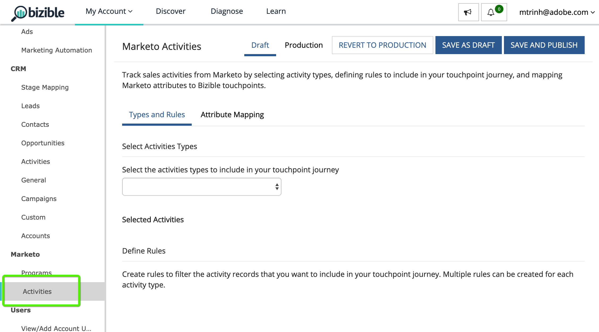
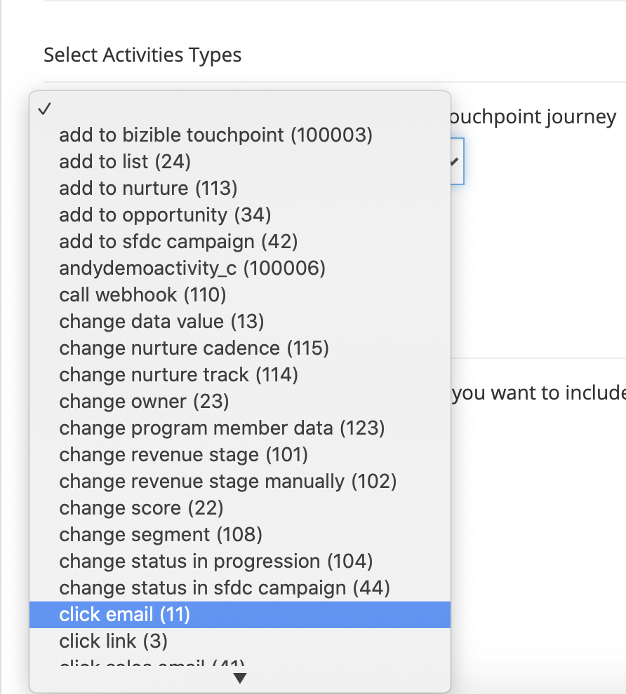
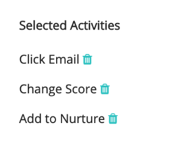
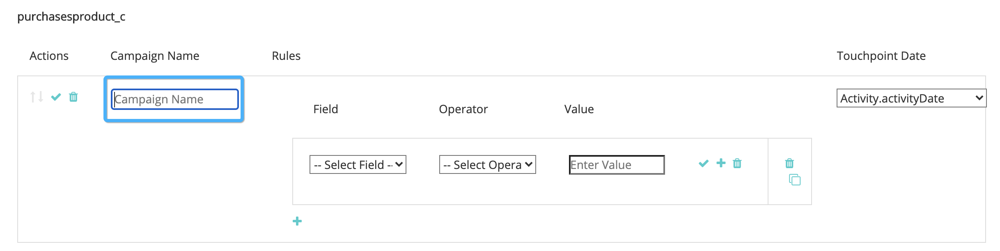
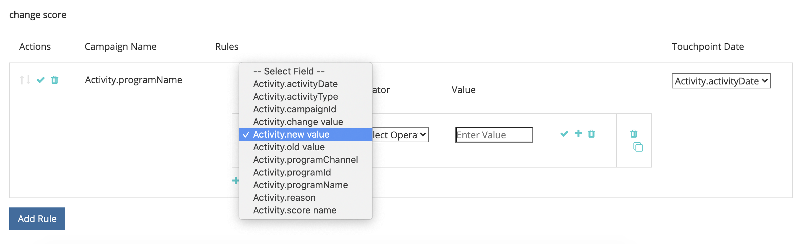
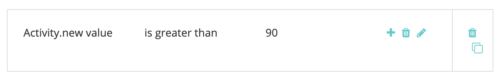
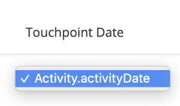
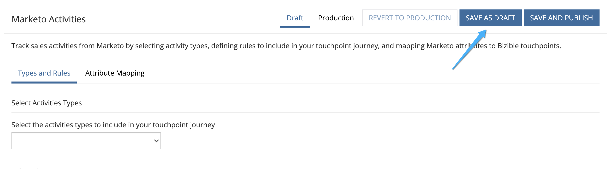
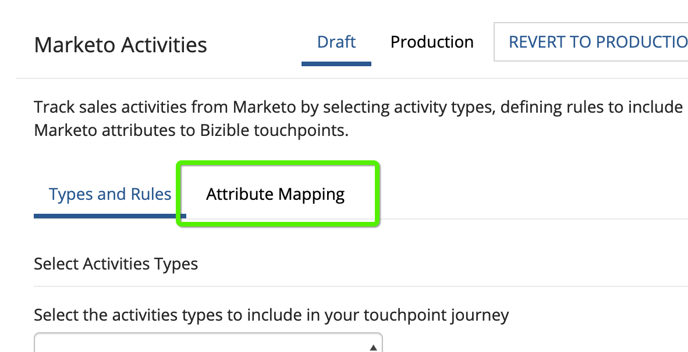

# [!DNL Marketo Engage] アクティビティの統合 {#marketo-engage-activities-integration}

全体的な[!DNL Marketo Measure]および[!DNL Marketo Engage]統合の一環として、Marketo アクティビティを取り込むこの取り組みは大きな役割を果たします。 Marketo アクティビティを使用すると、`Click Email`、`Change Score`、`Change Status in Progression`などのイベントを追跡できます。これらのアクティビティタイプを作成して定義し、タッチポイントの対象となるサブセットを選択できます。 顧客接点がこれらのアクティビティで作成されると、エンゲージメントジャーニーで追跡され、検索連動型広告やパートナーマーケティングなどの他のマーケティングチャネルと並行して測定されます。

## 要件 {#requirements}

* 実稼動Marketo インスタンス
* 実稼動[!DNL Salesforce]または[!DNL Microsoft Dynamics] インスタンス
* 任意の有料[!DNL Marketo Measure] サブスクリプション
* Marketo People Syncが有効になっています（[!DNL Marketo Measure]設定）
* Marketo プログラムが有効になっています（[!DNL Marketo Measure]設定）
* Marketo アクティビティが有効になっています（[!DNL Marketo Measure]設定）

## 設定 {#setup}

1. Marketo アクティビティの設定を開始するには、**マイアカウント** > **設定** > **アクティビティ**&#x200B;に移動します。

   

   

   最初に必要なのは、ルールを作成する予定のアクティビティタイプのリストを選択することです。 必要なアクティビティタイプにハードナンバーはありませんが、顧客接点を過剰に使用したり、重要なマイルストーンの重要性を希薄化したりしないことをお勧めします。 ただし、関連するエンゲージメントを追跡するために、5種類を超えるアクティビティタイプは必要ない場合があります。

1. 「[!UICONTROL  アクティビティの種類を選択]」の下にあるドロップダウンメニューをクリックして、様々な種類の選択を開始します。

   

1. 必要なすべてのアクティビティが選択されると、[!UICONTROL 選択したアクティビティ リスト ]および[!UICONTROL  ルールの定義]の下に入力されたアクティビティが表示されます。

   

1. アクティビティタイプごとに、タッチポイントの対象となるレコードを決定する1つ以上のルールを定義する必要があります。 この例では、「スコアを変更」アクティビティタイプのルールを追加して、Marketo ユーザーが90以上のスコアに達したときに、システムがタッチポイントを作成するようにします。

1. まず、アクティビティタイプによっては、後でチャネルマッピングに使用できる[!DNL Marketo Measure] キャンペーン名を設定する必要がある場合があります。[!DNL Marketo Measure] キャンペーン名は、複数のルールで再利用できます。 これにより、単一のチャネルルールで使用できる、より幅広い名前を付けることができます。 すべてのアクティビティタイプにMarketo プログラムが含まれているわけではないので、この最初の手順では名前を付ける必要があります。

   次に、追加ステップの例を示します。

   

1. 「スコアの変更」の例では、Marketo プログラムからキャンペーン名を取得する必要があります。 ここでルール式を作成します。 次の例では、値が90の演算子「[!UICONTROL は]より大きい」のフィールド「[!UICONTROL 新しい値]」を選択します。

   ルールを拡張し、「and」または「or」ステートメントを追加して結果を絞り込むことで、フィルターまたは条件を追加できます。

   

   

1. 最後に、タッチポイント日として何を使用するかを選択します。 使用可能なすべての日付または日時フィールドは、Marketoからここに表示されます。 カスタム日付フィールドがない限り、「[!UICONTROL  アクティビティ日]」が表示されます。

   

1. 変更が失われないように、途中で&#x200B;**[!UICONTROL ドラフトとして保存]**&#x200B;をクリックしてください。

   

1. 「**[!UICONTROL 属性マッピング]**」タブに移動します。

   

1. 選択した各アクティビティタイプに対して、追加のMarketo属性をタッチポイントフィールドにマッピングして、[!DNL Marketo Measure Discover]またはCRMでそれらの値を表示およびレポートできるようにすることができます。

   多くのフィールドは自動的にマッピングされ、他の統合との一貫性を保つために変更できません。 以下の「フィールドマッピング」セクションを参照して、これらの値を見つけます。 一部のアクティビティタイプでは、Marketoにランディングページ、リファラーページ、またはオプションでタッチポイントフィールドにマッピングできるブラウザーの属性が含まれています。 下の例では、削除できる提案をいくつか追加しました。

1. マッピングする左側の列から「Buyer Touchpoint」フィールドを選択します。 次に、Buyer Touchpoint フィールドに入力するMarketo属性を選択します。 これらはオプションであり、[!DNL Marketo Measure]が既に確立しているものの上に追加のマッピングが追加されていることを忘れないでください。

   マッピング可能なフィールド：

   * 市区町村
   * 国
   * 地域
   * ランディングページ
   * 参照元ページ
   * フォームページ
   * フォーム日
   * Platform
   * ブラウザー

   >[!NOTE]
   >
   >広告コンテンツやキーワードなどの広告フィールドは、広告プラットフォーム統合のために予約されているため、このリストでは使用できません。

## アクティビティタイプ {#activity-types}

一部のアクティビティタイプでは、プログラム IDとプログラム名が提供されているので、これをBuyer Touchpointのキャンペーン IDとキャンペーン名に簡単にマッピングできます。 他の場合は、プログラムの関連付けがないので、ルール定義の一部では、[!DNL Marketo Measure] キャンペーン名を作成する必要があります。 以下に、各カテゴリのリストを示します。

プログラム ID **を持つ** アクティビティ タイプ

電子メールの送信（6）\
配信された電子メール （7）\
電子メールバウンス （8）\
メールの購読解除（9）\
メールを開く（10）\
電子メールをクリック （11）\
データ値の変更（13）\
スコアの変更（22）\
リストに追加（24）\
進行状況の変更（104）\
ナーチャリングに追加（113）\
ナーチャリング頻度の変更（115）

>[!NOTE]
>
>プログラム IDを期待するアクティビティ タイプのうち、プログラムなしでアクティビティが検出された場合、[!DNL Marketo Measure]はキャンペーンの値をnullにすることはできないので、対象となるタッチポイントとしてそれを受け入れません。

プログラム IDのない&#x200B;**アクティビティ タイプ**

クリックリンク （3）\
新しいリード （12）\
リードをSFDCに同期（19）\
リードのコンバージョン （21）\
所有者の変更（23）\
リストから削除（25）\
SFDC アクティビティ （26）\
電子メールバウンスのソフト （27）\
SFDCからリードを削除（29）\
リードの結合（32）\
商談への追加（34）\
商談から削除（35）\
商談の更新（36）\
リードの削除（37）\
アラートの送信（38）\
販売メールの送信（39）\
営業メールを開く（40）\
セールスメールをクリックします（41）\
SFDC Campaignに追加（42）\
SFDC Campaignからの削除（43）\
SFDC Campaignのステータスの変更（44）\
セールスメールの受信（45）\
リクエストキャンペーン （47）\
売上メールのバウンス （48）\
収益ステージの変更（101）\
収益ステージを手動で変更する（102）\
セグメントを変更（108）\
Webhookを呼び出す（110）\
友達のメールに転送（111）\
友達に転送メール （112）\
ナーチャリングトラックの変更（114）\
リードをMarketoにプッシュ （145）\
リードをMicrosoftに同期（300）\
コンテンツの共有（400）
対話を行う（158）
インタラクション済み文書（159）
ダイアログの予定（160）
目標を達成しました（161）
カスタムアクティビティ （xxx）

## チャネルマッピング {#channel-mapping}

プログラム IDを持つアクティビティタイプのルールの場合、Marketo プログラムチャンネルはプログラムから決定されます。 プログラム チャネルを使用してカスタム オフラインチャネルにマッピングするので、チャネルが適切に設定されていることを確認する必要があります[こちら](/help/marketo-measure-and-marketo/marketo-measure-integrations-with-marketo/marketo-engage-programs-integration.md#channel-mapping){target="_blank"}の指示に従って。

また、プログラム IDのないアクティビティタイプのルールの場合、最初の手順はキャンペーン名を作成することでした。 このキャンペーン名を使用して、カスタムのオンラインチャネル [を設定します。レイアウトは](/help/channel-tracking-and-setup/online-channels/online-custom-channel-setup.md){target="_blank"}です。

Marketo アクティビティのチャネルが適切に設定されていない場合、新しいタッチポイントが「その他」のチャネルに該当する可能性があります。

## プログラムのコスト {#program-costs}

Marketo プログラムのデータ読み込みにより、期間原価から原価が自動的にダウンロードされ、Marketoで報告された原価は割り当てられた月を通して分配されます。 例えば、2021年1月に1000 ドルが報告された場合、1000 ドルは31日に分割されます。 コストは[!DNL Marketo Measure Discover]で確認できます。

## Cookie マッピング {#cookie-mapping}

[!DNL Marketo Measure]とMarketoの統合の結果、[!DNL Marketo Measure] Cookie Idも[!DNL Marketo Munchkin Id]とマッピングおよび同期されるようになりました。 これにより、FTとLCの両方のタッチをMarketo アクティビティに関連付けるのではなく、匿名のファーストタッチをweb セッションに関連付けるためにギャップを埋めることができます。 このシナリオを想像してみてください。

MarkはFacebook広告をクリックし、wayneenterprises.comにアクセスし、[!DNL Marketo Measure] Id 123と[!DNL Marketo Munchkin Id] 456のCookieを取得します。 フォームへの入力は行われません。

Wayne Enterprisesのマーケティング チームは、特定のターゲットとなるリードにメールを送信します。そのうちの1つは`mark@email.com`です。

`mark@email.com`はメールを受信し、クリックして`wayneenterprises.com`に到達します。 これは、同じCookie IDを持つ`wayneenterprise.com`への`mark@email.com's`の2回目の訪問になりますが、フォームへの入力はありませんでしたので、[!DNL Marketo Measure]は、まだ匿名の訪問者です。

Wayne Enterprisesのマーケティングチームは、「クリックメール」アクティビティタイプのタッチポイントを生成するためのMarketoアクティビティルールを作成します。

今日の実装では、Marketo アクティビティから`mark@email.com`のFTおよびLC タッチポイントを、「電子メールをクリック」アクティビティ タイプから1つ作成します。

このCookie マッピングの機能強化により、FTはFacebook広告に戻ってクレジットされ、LCはメールにクレジットされます。

>[!NOTE]
>
>Cookie マッピングの動作を使用すると、web訪問から来るLC タッチポイントを見つけることができます。 関連付けられたアクティビティなしでリードがMarketoに表示された後、[!DNL Marketo Measure]がそのリードをダウンロードし、関連付けられたCookieを照合して、リードを作成したフォームアクティビティがなくても、最新のweb セッションにリードをトレースした可能性があります。

## よくある質問 {#faq}

**Marketo プログラム ルールとMarketo アクティビティ ルールのどちらを作成すればよいですか？**

[!DNL Marketo Engage] プログラム統合は、個人がプログラム メンバーであるかどうかに基づいてタッチポイントを生成する簡単な方法です。 ユーザーが特定のプログラムステータスに変更した時間に基づいてルールを定義する場合は、[!DNL Marketo Engage] アクティビティ統合が必要な設定、特に「進行状況のステータスの変更」アクティビティタイプになります。これにより、タッチポイント日をシステム生成のアクティビティ日にマッピングできます。

**タッチポイントタイプの名前が切り捨てられているのはなぜですか？**

タッチポイントタイプ フィールドは、16文字の[!DNL Marketo Measure] パッケージで作成されました。 残念ながら、フィールドの文字制限を変更するには、既存のフィールドを非推奨にし、フィールドを作成する必要があります。 タッチポイントタイプの値はアクティビティタイプで、「Medium」フィールドにも設定されています。

**カスタム アクティビティ タイプが使用可能なアクティビティのリストに表示されないのはなぜですか？**

「承認済み」カスタムアクティビティタイプのみを表示し、「ドラフト」または「ドラフトで承認済み」は表示しません。

**タッチポイントを生成するアクティビティタイプを決定するにはどうすればよいですか？**

作成できるアクティビティタイプの数に制限はありませんが、通常は5つ以下のアクティビティタイプをお勧めします。 タッチポイントジャーニーに組み込むことができるマーケティング施策を判断するには、時間がかかります。 例えば、「メールの購読解除」は、追跡する重要なタッチポイントではないかもしれませんが、追加のフィルターを含む「メールをクリック」は良いタッチポイントかもしれません。 これは組織やチームによって異なるので、ここで最適なアプローチをブレインストーミングすることをお勧めします。

**ブラウザー名が切り落とされるのはなぜですか？**

[!DNL Marketo Measure] ブラウザー名のハード制限は20文字ですが、Marketoから取得するユーザーエージェントの値は、より長い文字列になる傾向があります。

BrowserInfo.Name\
BrowserInfo.Version\
PlatformInfo.Name\
PlatformInfo.Version
