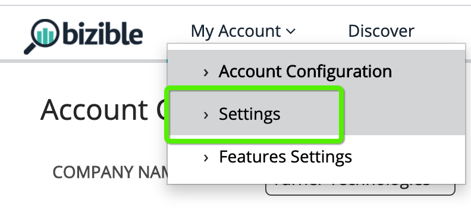
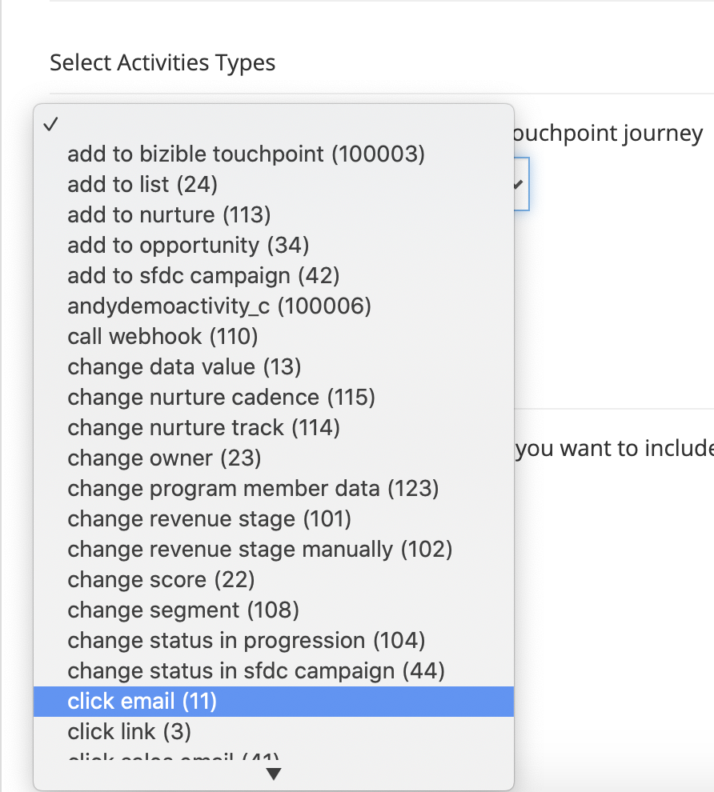

# [!DNL Marketo Engage] アクティビティの統合 {#marketo-engage-activities-integration}

全体の一部として [!DNL Marketo Measure] および [!DNL Marketo Engage] 統合、Marketo Activities を引き込むこの取り組みは、大きな役割を果たします。 Marketoアクティビティを通じて、クリックメール、スコアの変更、進行状況のステータスの変更などのイベントを追跡します。これらのアクティビティタイプを一部省略して、タッチポイントに適したサブセットを選択するように定義できます。 これらのアクティビティでタッチポイントを作成すると、エンゲージメントジャーニーで追跡され、有料検索やパートナーマーケティングなどの他のマーケティングチャネルと共に測定されます。

## 要件 {#requirements}

* 実稼動Marketoインスタンス
* 実稼動 [!DNL Salesforce] または [!DNL Microsoft Dynamics] インスタンス
* 任意の有料 [!DNL Marketo Measure] 購読
* Marketo担当者同期が有効 ([!DNL Marketo Measure] 設定 )
* Marketoプログラム有効 ([!DNL Marketo Measure] 設定 )
* Marketoアクティビティ有効 ([!DNL Marketo Measure] 設定 )

## セットアップ {#setup}

1. Marketo Activities の設定を開始するには、 **マイアカウント** > **設定** > **アクティビティ**.

   

   

   最初に必要なのは、ルールを作成する予定のアクティビティタイプのリストを選択することです。 必要なアクティビティタイプの数は多くありませんが、タッチポイントを過負荷にせず、重要なマイルストーンの重要性を薄めることをお勧めします。 ただし、関連するエンゲージメントを追跡するために 5 つを超えるアクティビティタイプは必要ない場合があります。

1. の下にあるドロップダウンメニューをクリックします。 [!UICONTROL アクティビティタイプを選択] をクリックして、様々なタイプの選択を開始します。

   

1. 必要なアクティビティをすべて選択すると、 [!UICONTROL 選択したアクティビティリスト] 同様に [!UICONTROL ルールの定義].

   

1. アクティビティタイプごとに、タッチポイントに適したレコードを決定する 1 つ以上のルールを定義する必要があります。 この例では、「スコアの変更」アクティビティタイプにルールを追加し、Marketoのユーザーがスコア 90 以上に達したときにタッチポイントが作成されるようにします。

1. まず、アクティビティタイプに応じて、 [!DNL Marketo Measure] キャンペーン名。後でチャネルマッピングに使用できます。 [!DNL Marketo Measure] キャンペーン名は、複数のルールで再利用できます。 これにより、単一のチャネルルールで使用できる幅広い名前を付けることができます。 すべてのアクティビティタイプにMarketoプログラムが含まれているわけではないので、最初の手順として名前を指定する必要があります。

   この余分な手順の例を次に示します。

   

1. この「スコアの変更」の例では、キャンペーン名を入力する必要はありません。Marketoプログラムからその情報を取り込むことができるからです。 これで、ルール式を作成できます。 この例では、「[!UICONTROL 新しい値]」と「[!UICONTROL 次よりも大きい]」の値を 90 に設定します。

   ルールを展開し、「and」または「or」ステートメントを追加して結果を絞り込むことで、フィルターや条件を追加できます。

   

   

1. 最後に、タッチポイントの日付として使用するものを選択します。 使用可能なすべての日付や日付/時間フィールドが、Marketoからここに表示されます。 カスタムの日付フィールドがない場合、「[!UICONTROL アクティビティ日].&quot;

   

1. 必ず「 **[!UICONTROL ドラフトとして保存]** 変更内容が失われないようにする方法に沿って

   

1. 次に移動： **[!UICONTROL 属性マッピング]** タブをクリックします。

   

1. 選択した各アクティビティタイプに対して、追加のMarketo属性をタッチポイントフィールドにマッピングし、それらの値を表示およびレポートできるようにするオプションがあります。 [!DNL Marketo Measure Discover] または CRM 内。

   多くのフィールドは自動的にマッピングされ、他の統合と整合性を保つために変更することはできません。 これらの値を見つけるには、以下の「フィールドマッピング」セクションを参照してください。 一部のアクティビティタイプでは、Marketoにランディングページ、リファラーページまたはブラウザーの属性が含まれ、オプションでタッチポイントフィールドにマッピングできます。 次の例では、削除できる追加の提案をいくつかおこないました。

1. マッピング先の左側の列から「 Buyer Touchpoint 」フィールドを選択します。 次に、「 Buyer Touchpoint 」フィールドに入力するMarketo属性を選択します。 これらはオプションで、 [!DNL Marketo Measure] は既に確立されています。

   マッピング可能なフィールド：

   * 市区町村
   * 国
   * 地域
   * ランディングページ
   * 参照元ページ
   * フォームページ
   * フォーム日
   * プラットフォーム
   * ブラウザー

   >[!NOTE]
   >
   >広告コンテンツやキーワードなどの広告フィールドは、アドビの広告プラットフォーム統合用に予約されているので、このリストでは使用できません。

## アクティビティタイプ {#activity-types}

一部のアクティビティタイプでは、プログラム ID とプログラム名が提供されるので、購入者タッチポイントでキャンペーン ID とキャンペーン名に簡単にマッピングできます。 他のユーザーの場合は、プログラムの関連付けがないので、ルール定義の一部では、 [!DNL Marketo Measure] キャンペーン名。 次に、各カテゴリのリストを示します。

**プログラム ID を持つアクティビティタイプ**

メールの送信 (6)\
メール配信済み (7)\
バウンスメール (8)\
メールの配信停止 (9)\
メールを開く (10)\
メール (11) をクリックします\
データ値の変更 (13)\
スコアの変更 (22)\
リストに追加 (24)\
進行状況のステータスの変更 (104)\
育成に追加 (113)\
育成ケイデンスの変更 (115)

>[!NOTE]
>
>プログラムなしでアクティビティが検出された場合に、プログラム ID が期待されるアクティビティタイプの [!DNL Marketo Measure] は Campaign の値を null にすることができないので、を適格なタッチポイントとして受け入れません。

**プログラム ID のないアクティビティタイプ**

リンクをクリックする (3)\
新規リード (12)\
リードを SFDC に同期 (19)\
リードの変換 (21)\
所有者の変更 (23)\
リストから削除 (25)\
SFDC アクティビティ (26)\
ソフトバウンスメール (27)\
SFDC からリードを削除 (29)\
リードのマージ (32)\
商談に追加 (34)\
商談からの削除 (35)\
商談の更新 (36)\
リードの削除 (37)\
アラートの送信 (38)\
セールスメールの送信 (39)\
セールスメールを開く (40)\
セールスメール (41) をクリックします\
SFDC キャンペーンに追加 (42)\
SFDC キャンペーンからの削除 (43)\
SFDC キャンペーンでのステータスの変更 (44)\
セールスメールの受信 (45)\
キャンペーンのリクエスト (47)\
バウンス販売メール (48)\
収益ステージの変更 (101)\
収益ステージの手動変更 (102)\
セグメントを変更 (108)\
ウェブフックの呼び出し (110)\
友達への転送メール (111)\
友達への転送メールを受信しました (112)\
育成トラックの変更 (114)\
リードをMarketoにプッシュ (145)\
リードをMicrosoftに同期 (300)\
コンテンツの共有 (400) ダイアログエンゲージ (158) ドキュメント (159) ダイアログ予定 (160) ダイアログ目標到達 (161) カスタムアクティビティ (xxx)

## チャネルマッピング {#channel-mapping}

プログラム ID を持つアクティビティタイプのルールの場合、Marketoプログラムチャネルはプログラムから決定されます。 プログラムチャネルを使用してカスタムオフラインチャネルにマッピングするので、チャネルが正しく設定されていることを確認する必要があります [ここで指示された通り](/help/marketo-measure-and-marketo/marketo-measure-integrations-with-marketo/marketo-engage-programs-integration.md#channel-mapping).

また、プログラム ID のないアクティビティタイプのルールの場合、最初の手順はキャンペーン名を作成することでした。 このキャンペーン名を使用してカスタムオンラインチャネルを設定します [ここに配置される](/help/channel-tracking-and-setup/online-channels/online-custom-channel-setup.md).

Marketoアクティビティのチャネルが正しく設定されていない場合、新しいタッチポイントが「その他」チャネルに分類される可能性が高くなります。

## プログラムコスト {#program-costs}

Marketoプログラムのデータインポートを通じて、コストが期間原価から自動的にダウンロードされ、Marketoで報告されたコストが割り当てられた月を通じて配分されます。 例えば、2021 年 1 月に$1000 がレポートされる場合、$1000 は 31 日間に分割されます。 費用は、 [!DNL Marketo Measure Discover].

## Cookie マッピング {#cookie-mapping}

結果として [!DNL Marketo Measure] Marketo、 [!DNL Marketo Measure] cookie ID もマッピングされ、 [!DNL Marketo Munchkin Id]. これにより、FT タッチと LC タッチの両方をMarketo Activity に関連付けるのではなく、匿名のファーストタッチを Web セッションに関連付けるのに役立ちます。 次のシナリオを想像してください。

facebook広告のクリックをマークし、wayneenterprises.com にランディングします。このとき、でクッキーを使用します。 [!DNL Marketo Measure] ID 123 および [!DNL Marketo Munchkin Id] 456. フォームの入力は行われません。

Wayne Enterprises マーケティングチームが、特定のターゲットリードに E メールの一斉送信を送信します。そのうちの 1 つは、 `mark@email.com`.

`mark@email.com` E メールを受信し、をクリックスルーして、 `wayneenterprises.com`. これは `mark@email.com's` ～への 2 回目の訪問 `wayneenterprise.com` 同じ cookie ID を持つものの、フォームの入力が行われていない場合、 [!DNL Marketo Measure]に値を付けると、その訪問者は匿名の訪問者となります。

Wayne Enterprises マーケティングチームは、「E メールのクリック」アクティビティタイプのタッチポイントを生成するMarketoアクティビティルールを作成します。

今日の実装では、 `mark@email.com` 「E メールをクリック」アクティビティタイプの「Marketoアクティビティ」から。

この cookie マッピング機能の強化により、FT はFacebookに戻ってクレジットされ、LC は E メールにクレジットされます。

>[!NOTE]
>
>cookie マッピング動作では、Web 訪問から取得された LC タッチポイントが見つかる場合があります。 関連付けられたアクティビティなしでMarketoにリードが表示された可能性があります。 [!DNL Marketo Measure] そのリードをダウンロードし、関連する cookie と一致し、リードを作成したフォームアクティビティがない場合でも、最新の web セッションまでトレースしました。

## よくある質問 {#faq}

**MarketoプログラムルールとMarketoアクティビティルールのどちらを作成すればよいですか？**

この [!DNL Marketo Engage] プログラム統合は、個人がプログラムのプログラムメンバーかどうかに基づいてタッチポイントを生成する簡単な方法です。 個人が特定のプログラムステータスに変わる時間に基づいてルールを定義する場合、 [!DNL Marketo Engage] アクティビティ統合は、タッチポイント日をシステム生成アクティビティ日にマッピングできるように、「進行状況のステータスの変更」アクティビティタイプを指定して、必要な設定になります。

**タッチポイントタイプの名前が切り捨てられるのはなぜですか？**

タッチポイントタイプフィールドは、 [!DNL Marketo Measure] 16 文字のパッケージ。 残念ながら、フィールドの文字制限を変更するには、既存のフィールドを廃止し、新しいフィールドを作成する必要があります。 タッチポイントタイプの値は、アクティビティタイプで、「中」フィールドにも設定されます。

**カスタムアクティビティタイプが使用可能なアクティビティのリストに表示されないのはなぜですか？**

「承認済み」のカスタムアクティビティタイプのみを表示し、「ドラフト」または「ドラフトで承認済み」は表示しません。

**タッチポイントを生成するアクティビティのタイプを決定する方法を教えてください。**

作成できるアクティビティタイプの数に制限はありませんが、通常は 5 つ以下のアクティビティタイプをお勧めします。 タッチポイントジャーニーに含まれるのに十分に関連するマーケティングアクティビティを判断するには、時間がかかります。 例えば、「Unsubscribe Email」は追跡する重要なタッチポイントではない場合がありますが、追加のフィルターを含む「Click Email」は適切なタッチポイントです。 これは各組織と各チームによって異なるので、チームと協力して、最良のアプローチについてブレインストーミングをおこなうことをお勧めします。

**ブラウザー名が切れているのはなぜですか？**

この [!DNL Marketo Measure] ブラウザー名には 20 文字のハード制限がありますが、Marketoから取得する User Agent 値は長い文字列になる傾向があります。

BrowserInfo.Name\
BrowserInfo.Version\
PlatformInfo.Name\
PlatformInfo.Version
