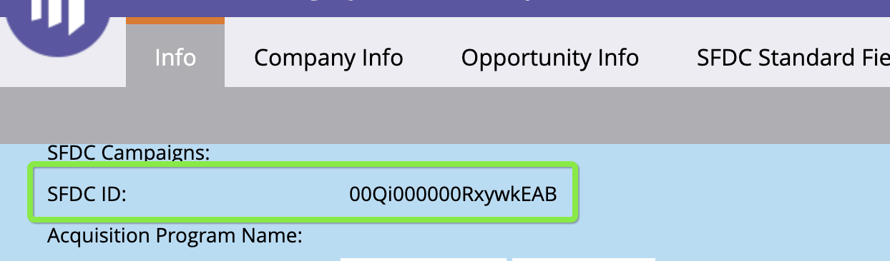

# [!DNL Marketo Engage]人の統合 {#marketo-engage-people-integration}

Marketoのユーザー統合により、[!DNL Marketo Measure]はMarketoからユーザーのダウンロードを開始し、トラッキング対象のセッションを個人に関連付け、タッチポイントをエンゲージメントにマッピングし始めることができます。 従来、[!DNL Marketo Measure]では、CRMの担当者にタッチポイントをマッピングすることしかできませんでした。そのため、マーケターは、CRMにタッチポイントを同期するステージやトリガーを待つのではなく、すばやくマーケティング活動を測定できます。

## 要件 {#requirements}

* 実稼動Marketo インスタンス
* 実稼動[!DNL Salesforce]または[!DNL Microsoft Dynamics] インスタンス
* 任意の有料[!DNL Marketo Measure] サブスクリプション
* SOLRが有効になっています（これを有効にするには、[Marketo サポート ](https://nation.marketo.com/t5/Support/ct-p/Support){target="_blank"}にお問い合わせください）

## 仕組み {#how-it-works}

現在の顧客として、[!DNL Marketo Measure]は既にCRMからユーザーをダウンロードしています。 標準プロセスは、[!DNL Marketo Measure]が人物をダウンロードし、bizible.jsを介して追跡したweb セッションにメールアドレスをマッピングすることです。

Marketo ユーザーのダウンロードが導入されたことで、[!DNL Marketo Measure]は、CRMと同期されていない個人の大きなグループにweb セッションをマッピングできるようになりました。 私たちはよくこの問題を経験します。社内プロセスで、顧客がCRMにプッシュされる前に特定のステータスに達するまで待つ必要があるからです。

[!DNL Marketo Measure]がMarketo ユーザーをweb セッションに正常にマッピングすると、処理によって関連するタッチポイントが生成され、最終的に[!DNL Marketo Measure Discover]で報告されます。 そのMarketoのユーザーがCRMにプッシュされた場合、[!DNL Marketo Measure]は重複したシナリオを処理し、CRMのユーザーのタッチポイントを再作成し、最初のセットを「重複」としてマークします。

これらの重複を検出するには、[!DNL Marketo-Salesforce]または[!DNL Marketo-Dynamics]同期がMarketoの人物のリード IDと連絡先IDに入力されていることを確認してください。 Idが正しく同期されている場合は、次のように、人物レコードのCRM IDを確認できます。

お客様は、[!DNL Marketo Measure]件の見つける内のMarketoのユーザーとCRMのユーザーの完全なセットをレポートするオプションがあります。 CRMのユーザーに関するレポートのみを作成する場合は、それらのユーザーをフィルタリングするセグメントを作成することをお勧めします。

## [!DNL Marketo Measure Discover] {#marketo-measure-discover}

[!DNL Marketo Measure Discover]のリード （人物）についてレポートする場合、MarketoとCRMのリードの合計が表示されます。 MarketoのユーザーまたはCRM リードのみをレポートするには、ソースのセグメントカテゴリを作成し、「Source System」フィールドを使用してMarketoおよびCRMのセグメントルールを作成してルールを定義します。 セグメントを作成すると、[!DNL Marketo Measure Discover] ダッシュボード全体でフィルタリングできるSource カテゴリが表示されます。

## フィールド マッピング {#field-mappings}

<table> 
 <colgroup> 
  <col> 
  <col> 
 </colgroup> 
 <tbody> 
  <tr> 
   <th>
<strong>biz_leads</strong>
</th> 
   <th>
<strong>Marketo</strong>
</th> 
  </tr> 
  <tr> 
   <td>
ID
</td> 
   <td>
ID
</td> 
  </tr> 
  <tr> 
   <td>
MODIFIED_DATE
</td> 
   <td>
updatedAt<strong>*</strong>
</td> 
  </tr> 
  <tr> 
   <td>
CREATED_DATE
</td> 
   <td>
createdAt
</td> 
  </tr> 
  <tr> 
   <td>
EMAIL
</td> 
   <td>
メール
</td> 
  </tr> 
  <tr> 
   <td>
WEB_SITE
</td> 
   <td>
website
</td> 
  </tr> 
  <tr> 
   <td>
COMPANY
</td> 
   <td>
company
</td> 
  </tr> 
  <tr> 
   <td>
IS_CONVERTED
</td> 
   <td>
該当なし
</td> 
  </tr> 
  <tr> 
   <td>
ACCOUNT_ID
</td> 
   <td>
アカウント Id （L2A）
</td> 
  </tr> 
  <tr> 
   <td>
BIZIBLE_STAGE
</td> 
   <td>
ステータス
</td> 
  </tr> 
  <tr> 
   <td>
IS_DELETED
</td> 
   <td>
true/false
</td> 
  </tr> 
 </tbody> 
</table>

*Marketo Company エンティティのフィールドが人物のupdatedAt値に影響を与えない既知の動作の問題があるため、Web サイトや会社などの関連フィールドが更新された場合、[!DNL Marketo Measure]は、更新されたAtの日付/時刻の値が更新されていないため、それらの値が変更されていることがわかりません。 これはABM機能に影響を与え、リードのアカウントを解決するための新しいデータがありません。 現時点では回避策はありませんが、今後これに対処する計画はあります。

## よくある質問 {#faq}

**CRMと[!DNL Marketo Measure Discover]でリード数が異なるのはなぜですか？**

この統合により、Adobe Marketoから直接インポートしたリードのタッチポイントを作成できるようになりました。そのため、CRMに同期されなかったリードが存在する可能性があり、その場合、タッチポイントはCRM リードにのみプッシュされるため、「もっと知る」のカウントがCRMよりも多くなる可能性があります。

**データの置き換え方法は？**

この統合は、現在の[!DNL Marketo Measure] インスタンス内のデータセットを実際に結合するので、何も置き換えられません。 現在のCRM リードから期待されるのは、2年分のMarketo リードをダウンロードする際に、そのリード レコードを更新するだけで、Marketo リードと一致する可能性があることがわかります。 すべてバックエンドで実行し、顧客接点は同じままであることが期待されます。 また、Marketoのリードの資格があるため、より多くの顧客接点が提供されることを期待しています。 これらのMarketo ユーザーに一致するweb セッションを見つけることができれば、[!DNL Marketo Measure]でカウントされたタッチポイントが表示されます。

**Marketoから自分の人物のみをダウンロードし、CRM接続を切断することはできますか？**

現時点では、いいえ。 将来的にはこのオプションが用意されますが、Marketoから[!DNL Marketo Measure]までのプログラム、オポチュニティ、取引を結びつけるために、このMarketo統合の他のフェーズを構築する必要があります。

**Marketoの人物をすべて読み込みますか？**

現時点では、最も早い時期に人をインポートするのは、2018年1月1日からで、最低2年間のデータがあります。これは、CRM ダウンロードから適用するのと同じ動作です。 Marketo接続が確立されると、ローリングする2年間のウィンドウをダウンロードするように改善された動作が実装されます。

また、人物タイプに対してもフィルタリングを行わないので、2年間の期間のすべての人物が読み込まれ、タッチポイントの対象となります。

**SOLRとは何ですか。なぜこの機能を使用するためにSOLRを有効にする必要があるのですか？**

Marketo インスタンスに対してSOLRを有効にすることは、Marketoのハードウェアスペースを開いて、[!DNL Marketo Measure]統合をサブスクリプションで利用できるようにするための簡単な手順です。 SOLRを有効にしていない場合、Marketo インスタンスから適切なユーザーをダウンロードできる特定の呼び出しにはアクセスできません。
