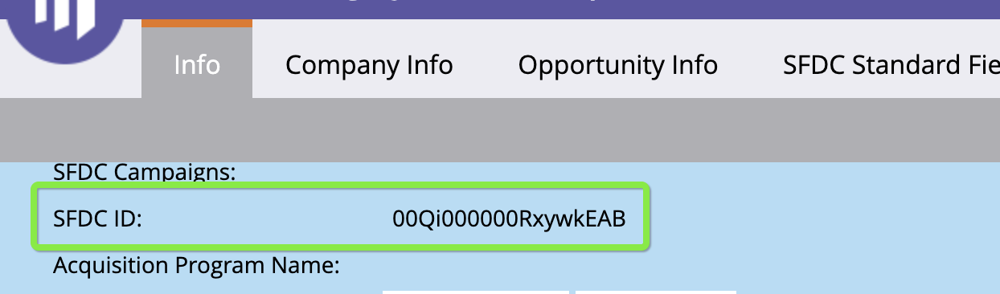

# [!DNL Marketo Engage] 人物統合 {#marketo-engage-people-integration}

Marketoのユーザー統合により、 [!DNL Marketo Measure] :Marketoから人物をダウンロードし始め、追跡セッションを個人に結び付け、タッチポイントを自分のエンゲージメントにマッピングし始める場合。 歴史的に、 [!DNL Marketo Measure] では、タッチポイントを CRM の個人にマッピングすることしかできないので、マーケターは、ステージやトリガーが CRM に同期するのを待たずに、早くマーケティング活動を測定できます。

## 要件 {#requirements}

* 実稼動Marketoインスタンス
* 実稼動 [!DNL Salesforce] または [!DNL Microsoft Dynamics] インスタンス
* 任意の有料 [!DNL Marketo Measure] 購読
* SOLR が有効になっています ( 次の場所にアクセスしてください： [Marketoサポート](https://nation.marketo.com/t5/Support/ct-p/Support) を有効にする )

## 仕組み {#how-it-works}

現在のお客様は、 [!DNL Marketo Measure] は、既に CRM から担当者をダウンロードしています。 標準的なプロセスは [!DNL Marketo Measure] ユーザーをダウンロードし、電子メールアドレスを bizible.js 経由で追跡した Web セッションにマッピングします。

Marketoの担当者をダウンロードする機能が導入され、 [!DNL Marketo Measure] では、CRM と同期されていない、より大きな個人プールに web セッションをマッピングできるようになりました。 一般的に、これは、ユーザーが特定のステータスに達するまで CRM にプッシュされるまで待つ内部プロセスが原因です。

条件 [!DNL Marketo Measure] Marketoの担当者を web セッションに正常にマッピングするために、アドビの処理で関連するタッチポイントが生成され、最終的にはでレポート可能になります。 [!DNL Marketo Measure Discover]. そのMarketoの担当者が CRM にプッシュされた場合、 [!DNL Marketo Measure] が重複シナリオを処理します。CRM 担当者のタッチポイントを再作成し、初期セットを「重複」とマークします。

これらの重複を検出するには、 [!DNL Marketo-Salesforce] または [!DNL Marketo-Dynamics] 同期がMarketo担当者のリード ID と連絡先 ID に入力されています。 ID が正しく同期されている場合は、次のように、Person レコードに CRM ID が表示されます。

お客様は、の中のMarketoの担当者と CRM の担当者の完全なセットをレポートするオプションがあります。 [!DNL Marketo Measure] 検出。 CRM の担当者のみのレポートに関心がある場合は、フィルターするセグメントを作成することをお勧めします。

## [!DNL Marketo Measure Discover] {#marketo-measure-discover}

でリード（人）のレポートを作成する場合 [!DNL Marketo Measure Discover]をクリックすると、Marketoと CRM のリードの合計が表示されます。 Marketoのリードのみ、または CRM のリードのみを報告するには、ソースのセグメントカテゴリを作成し、「ソースシステム」フィールドを使用してMarketoと CRM のセグメントルールを作成してルールを定義します。 セグメントを作成すると、「ソース」カテゴリが [!DNL Marketo Measure Discover] ダッシュボード。

## フィールドマッピング {#field-mappings}

<table> 
 <colgroup> 
  <col> 
  <col> 
 </colgroup> 
 <tbody> 
  <tr> 
   <th>
<strong>biz_leads</strong>
</th> 
   <th>
<strong>Marketo</strong>
</th> 
  </tr> 
  <tr> 
   <td>
ID
</td> 
   <td>
ID
</td> 
  </tr> 
  <tr> 
   <td>
MODIFIED_DATE
</td> 
   <td>
updatedAt<strong>*</strong>
</td> 
  </tr> 
  <tr> 
   <td>
CREATED_DATE
</td> 
   <td>
createdAt
</td> 
  </tr> 
  <tr> 
   <td>
EMAIL
</td> 
   <td>
メール
</td> 
  </tr> 
  <tr> 
   <td>
WEB_SITE
</td> 
   <td>
website
</td> 
  </tr> 
  <tr> 
   <td>
COMPANY
</td> 
   <td>
会社
</td> 
  </tr> 
  <tr> 
   <td>
IS_CONVERTED
</td> 
   <td>
該当なし
</td> 
  </tr> 
  <tr> 
   <td>
ACCOUNT_ID
</td> 
   <td>
アカウント ID (L2A)
</td> 
  </tr> 
  <tr> 
   <td>
BIZIBLE_STAGE
</td> 
   <td>
ステータス
</td> 
  </tr> 
  <tr> 
   <td>
IS_DELETED
</td> 
   <td>
true/false
</td> 
  </tr> 
 </tbody> 
</table>

*Marketo会社エンティティのフィールドが担当者の updatedAt 値に影響を与えない既知の行動上の問題があります。そのため、Web サイトや会社などの関連するフィールドが更新される場合、 [!DNL Marketo Measure] updatedAt の日時の値が更新されないので、はこれらの値が変更されたことを認識しません。 これは ABM 機能に影響を与えます。リードのアカウントを解決するための新しいデータが得られない場合です。 現時点では回避策はありませんが、今後、この問題に対処する予定があります。

## よくある質問 {#faq}

**リード数が CRM とで異なるのはなぜですか？ [!DNL Marketo Measure Discover]?**

この統合により、Marketoから直接インポートしたリードのタッチポイントを作成できるので、CRM に同期されないリードが存在する可能性があるので、タッチポイントは CRM リードに対してのみプッシュされるので、Discover 内のカウントは CRM よりも多くなる可能性があります。

**これによってデータはどのように置き換えられますか？**

この統合により、実際に現在の [!DNL Marketo Measure] インスタンスで置き換えられるものはありません。 現在の CRM リードから期待されることは、Marketoリードの 2 年間分をダウンロードした場合に、そのリードレコードを更新するだけで、Marketoリードとの一致も示せるようにすることです。 バックエンドで発生するすべての操作とタッチポイントは同じままである必要があります。 また、対象となるMarketoリードにより、より多くのタッチポイントが表示されると予想されます。 これらのMarketoの担当者に一致する Web セッションが見つかった場合は、次のリンクでカウントされたタッチポイントが表示され始めます： [!DNL Marketo Measure].

**担当者をMarketoからダウンロードして CRM 接続を切断することはできますか？**

現時点では、いいえ。 今後もこのオプションが用意される予定ですが、Marketoからのプログラム、機会、契約を次のものに結び付けるには、このMarketo統合の他のフェーズを構築する必要があります。 [!DNL Marketo Measure].

**すべてのMarketoの担当者をインポートしますか？**

現時点では、最も早く人をインポートできるのは1/1/2018で、最低でも 2 年分のデータが保持されます。これは、CRM ダウンロードで実行するのと同じ動作です。 Marketo接続が確立されたら、2 年間周期のウィンドウをダウンロードする動作を改善します。

また、どの人物タイプもフィルタリングしないので、2 年間の期間内のすべての人がインポートされ、タッチポイントの対象になります。

**SOLR とは何ですか？また、この機能を使用するために SOLR を有効にする必要があるのはなぜですか？**

Marketoインスタンスで SOLR を有効にすると、Marketoでハードウェア領域が開き、サブスクリプションで [!DNL Marketo Measure] 統合とも呼ばれます。 SOLR を有効にしないと、特定の呼び出しにアクセスできなくなり、そうしないと、お使いのMarketoインスタンスから適切なユーザーをダウンロードできるようになります。
