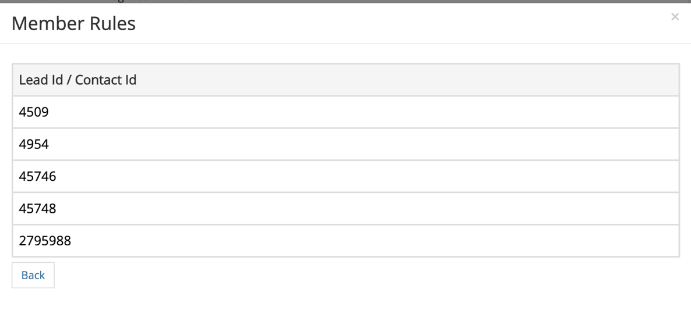

# [!DNL Marketo Engage] プログラムの統合 {#marketo-engage-programs-integration}

[!DNL Marketo Engage] プログラムとの [!DNL Marketo Measure] 統合により、お客様は、Marketo プログラムメンバーシップからアトリビューショントラッキング用タッチポイントの作成を開始できます。 この機能を使用すると、マーケターは、電子メールまたはエンゲージメントプログラムからプログラムメンバーシップのトラッキングを開始できます。これらのプログラムは [!DNL Marketo Measure] Javascript では表示されないので、アトリビューションジャーニー内で測定する必要があります。

## 利用可能性 {#availability}

すべての層。

## 要件 {#requirements}

* 実稼動Marketo インスタンス
* 実稼動SalesforceまたはMicrosoft Dynamics インスタンス
* 任意の有料 [!DNL Marketo Measure] サブスクリプション
* Marketo人物同期を有効にする（[!DNL Marketo Measure] Settings）
* Marketo プログラムを有効にする（[!DNL Marketo Measure] Settings）

## 設定 {#setup}

**ルール**

1. Marketo プログラムでルールの設定を開始するには、**[!UICONTROL マイアカウント]**/**[!UICONTROL 設定]**/**[!UICONTROL プログラム]** に移動します。 **+** アイコンをクリックして、最初のルールの作成を開始します。

   

   

1. ルールの追跡に役立つ場合は、オプションでルールの名前を設定できます。 最初にフィールドを選択して、プログラムおよびプログラムメンバーシップフィールドのリストからルールを定義します。 演算子とチェックする期待値を選択して、ルールの作成を続けます。

   

1. 同じボックス内に別のステートメントを追加してルール内の「and」条件を設定するか、ボックスの外側の「+」アイコンをクリックして「or」ステートメントを設定します。

   

1. タッチポイントの日付にマッピングするために使用する日付または日付/時間フィールドを選択します。 Marketoで使用可能な値のリストを表示するには、中括弧 `{` を入力してください。使用可能なフィールドが表示されます。

   

   >[!NOTE]
   >
   >ルールでアクティビティの日付を取り込む場合、またはプログラム・メンバーが特定のステータスに達した日付を取り込む場合は、[!DNL Marketo Engage] Activities 統合を使用して、「進捗のステータスの変更」アクティビティ・タイプのルールを設定します。

   

完了したルールは次のようになります。

## テスト {#test}

いくつかのルールを作成したら、ステートメントがプログラムと一致することを確認するために、ルールをテストすることができます。

1. テストを実行するには、次に示すように、「**[!UICONTROL テスト]**」ボタンをクリックします。

   

1. モーダルが表示され、Marketoからプログラム ID を入力できます。

   

   ID を入力して「[!UICONTROL &#x200B; テスト &#x200B;]」ボタンをクリックすると、ルールエンジンが各ルールを調べて、プログラムがどのルールにも適合するかどうかを判断します。 次の例では、[!DNL Marketo Measure] Ebook と呼ばれる Program 1002 に 5 つのプログラム メンバーがあり、表示されるルールによって適格であることがわかります。

   ルールは、サンプルサイズ 5,000 メンバーで実行されます。 プログラムに 5000 人を超えるメンバーが含まれている場合は、すべてのメンバーの互換性がチェックされない可能性があります。 このツールは、ルールが正しく構築されていることを確認する手段としてのみ機能します。

   

   「メンバー数」をクリックして、プログラム内で適格なMarketoの人物 ID のリストを表示できます。

   

## チャネルマッピング {#channel-mapping}

Marketo プログラムチャネルのリストから、設定内で作成した [!DNL Marketo Measure] のカスタムマーケティングチャネルに値をマッピングする必要があります。 これらのプログラムで生成されたタッチポイントは、ここで選択したチャネル名とサブチャネル名を継承します。

1. まず、**[!UICONTROL マイアカウント]**/**[!UICONTROL 設定]**/**[!UICONTROL オフラインチャネル]** に移動します。

1. 上部には、CRM キャンペーンタイプにマッピングするオプションがあります。その後、下の下に、Marketo プログラムチャネルのオプションが表示されます。

1. まず、値にマッピングするチャネルを選択してから、オプションでサブチャネルを選択します。 完了したら、下部にある **[!UICONTROL 保存]** をクリックします。

   

## プログラムコスト {#program-costs}

Marketo プログラムのデータインポートにより、コストは「期間コスト」から自動的にダウンロードされ、Marketoで報告されたコストは割り当てられた月を通じて配分されます。 例えば、2021 年 1 月に$1000 とレポートされた場合、$1000 は 31 日間に分割されます。 コストは [!DNL Marketo Measure Discover] で確認できます。

>[!NOTE]
>
>Marketo Measureでサポートされる期間コストは、1 か月に 1 つのみです。 すべてのコストを確実にインポートするには、合計月額コストを 1 つのエントリに集計します。 同じ月の複数の期間コスト エントリはサポートされていません。

## 仕組み {#how-it-works}

**フィールドマッピング**

<table><thead>
  <tr> 
   <th>biz_ad_campaign</th> 
   <th>Marketo</th> 
  </tr></thead>
<tbody>
  <tr> 
   <td>ID</td> 
   <td>ID</td> 
  </tr> 
  <tr> 
   <td>IS_DELETED</td> 
   <td>（API を使用してプログラムがまだ存在するかどうかを確認します）</td> 
  </tr> 
  <tr> 
   <td>NAME</td> 
   <td>名前</td> 
  </tr> 
 </tbody> 
</table>

<table><thead>
  <tr>
    <th>biz_campaign_members</th>
    <th>Marketo</th>
  </tr></thead>
<tbody>
  <tr>
    <td>ID</td>
    <td>"MarketoProgramMembership"_ProgramId_Lead Id</td>
  </tr>
  <tr>
    <td>MODIFIED_DATE</td>
    <td>updatedAt</td>
  </tr>
  <tr>
    <td>CREATED_DATE</td>
    <td>membershipDate</td>
  </tr>
  <tr>
    <td>LEAD_ID</td>
    <td>Id （リストのメンバーシップ）</td>
  </tr>
  <tr>
    <td>LEAD_EMAIL</td>
    <td>メール （リストのメンバーシップ）</td>
  </tr>
  <tr>
    <td>STATUS</td>
    <td>progressionStatus</td>
  </tr>
  <tr>
    <td>HAS_RESPONDED</td>
    <td>reachedStatus</td>
  </tr>
  <tr>
    <td>CAMPAIGN_NAME</td>
    <td>programName</td>
  </tr>
  <tr>
    <td>CAMPAIGN_ID</td>
    <td>programId</td>
  </tr>
  <tr>
    <td>CAMPAIGN_TYPE</td>
    <td>チャネル</td>
  </tr>
</tbody>
</table>

## cookie のマッピング {#cookie-mapping}

Marketoとの [!DNL Marketo Measure] 統合の結果、[!DNL Marketo Measure] Cookie ID もマッピングされ、[!DNL Marketo Munchkin Id] と同期されるようになりました。 これは、FT と LC の両方のタッチをMarketo アクティビティに関連付けるのではなく、匿名のファーストタッチを web セッションに関連付けることのできるギャップを埋めるのに役立ちます。 次のシナリオを考えてみます。

Mark が [!DNL Facebook] 広告をクリックすると、wayneenterprises.comにアクセスし、ID 123 と [!DNL Marketo Munchkin Id] 456 で Cookied[!DNL Marketo Measure] 取得します。 フォームへの入力は行われません。

Wayne Enterprises Marketing チームは、特定のターゲットを絞ったリードに電子メールを送信します。その 1 つは `mark@email.com` です。

`mark@email.com` がメールを受け取り、クリックしてwayneenterprises.comにアクセスします。 これは `mark@email.com's` 同じ Cookie ID を持つ `wayneenterprise.com` への 2 回目の訪問となりますが、フォームは入力されていなかったので、[!DNL Marketo Measure] の時点で引き続き匿名訪問者となっています。

Wayne Enterprises Marketing チームは、「クリック電子メール」アクティビティタイプのタッチポイントを生成するためのMarketo アクティビティルールを作成します。

今日の導入では、「メールをクリック」アクティビティタイプのMarketo アクティビティの `mark@email.com` に、1 つの FT および LC タッチポイントを作成します。

この cookie マッピングの機能強化により、FT は戻って [!DNL Facebook] 広告にクレジットされ、LC はメールにクレジットされます。

>[!NOTE]
>
>Cookie マッピング動作を使用すると、web 訪問から取得した一部の LC タッチポイントを検出する場合があります。 Marketoにリードが表示されたにもかかわらず、それに関連するアクティビティが [!DNL Marketo Measure] く、そのリードをダウンロードして、関連する Cookie を照合し、リードを作成したフォームアクティビティがない場合でも、最新の web セッションまでリードをトレースした可能性があります。

## よくある質問 {#faq}

**タッチポイント日を進行状況日やプログラムメンバーにステータス変更が発生した日付に設定するにはどうすればよいですか？**

ルールでアクティビティの日付を取り込む場合、またはプログラム・メンバーが特定のステータスに達した日付を取り込む場合は、[!DNL Marketo Engage] Activities 統合を使用して、「進捗のステータスの変更」アクティビティ・タイプのルールを設定します。 それ以外の場合、[!DNL Marketo Engage] Programs Integration ではメンバーシップの日付のみが使用可能になります。これは、複数のステータスがある場合でも、Marketo ユーザーがプログラムに参加した最初の日付です。

**タッチポイント日の日付オプションの選択リストを取得できますか？**

オートコンプリートをトリガーするには、テキストフィールドに中括弧 `{` を入力して開始すると、使用可能なフィールドが表示されます。

**Marketo プログラムルールを作成し、さらに CRM キャンペーンルールも持っている場合、2 回カウントされますか？**

ルールの定義によって異なりますが、場合によっては異なります。 類似のメンバーシップの重複が排除されたり検出されたりすることがないので、プログラムとキャンペーンをカバーするルールが含まれないようにルールセットを評価する必要があります。 考えられる解決策の 1 つは、Campaign ルールをプログラムにコピーし、Marketoを唯一の情報源にしたい場合は、Campaign ルールを削除することです。 別のオプションとして、「CreatedOn」または「CreatedDate」条件をルールに追加して、特定の日前のルールが Campaign ルールを使用し、特定の日後のルールがプログラムルールを使用するようにすることもできます。 多くの回避策がありますが、計画と調整が必要です。

**Marketo プログラムメンバーシップカスタムフィールドを定義できますか？**

技術的な制約により、現時点ではプログラムメンバーシップカスタムフィールドをサポートできません。 その他のMarketo API を通じてこれらのフィールドを使用できるようになると、フィールドはアドビに公開され、お客様が使用できるようになります。

**プログラムとアクティビティのどちらを使用すべきかを知る方法を教えてください。**

[!DNL Marketo Engage] プログラム統合は、ユーザーがプログラムのプログラムメンバーであるかどうかに基づいて、タッチポイントを生成する簡単な方法です。 ある人物が特定のプログラム・ステータスに変更した時間に基づいてルールを定義することに関心がある場合、[!DNL Marketo Engage] Activities 統合は、必要な設定、特に「進捗でのステータスの変更」アクティビティ・タイプとなります。
