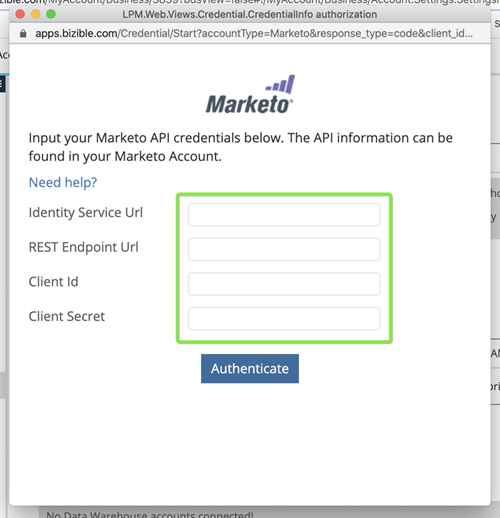

# Marketo接続のセットアップ {#set-up-marketo-connection}

Marketoへの接続を設定する方法を次に示します。

>[!PREREQUISITES]
>
>[API 専用のユーザーロールの作成](https://experienceleague.adobe.com/docs/marketo/using/product-docs/administration/users-and-roles/create-an-api-only-user.html) (Marketo Measure/Marketo Engage接続用 )

1. In [!DNL Marketo Measure]、 **[!UICONTROL マイアカウント]** ドロップダウンして「 」を選択します。 **[!UICONTROL 設定]**.

   

1. の下 [!UICONTROL 統合]をクリックし、 **[!UICONTROL 接続]**.

   

1. クリック **[!UICONTROL 新しい CRM 接続の設定]**.

   

1. 次をクリック： **[!UICONTROL 接続]** ボタンをクリックします。Marketo

   

1. 新しいタブで、Marketo Engageアカウントにログインします。 に移動します。 **管理者** > **Web サービス**. 下にスクロールして REST API を表示します。 エンドポイントと ID サービスの URL をハイライトして保存します。 あと少しで必要になる。

   

1. まだMarketo Engage中、 **LaunchPoint** 左の木に。 Marketo Measure に接続するカスタムサービスを見つけ、 **詳細を表示**.

   

1. クライアント ID とクライアント秘密鍵をハイライト表示して保存します。 「**閉じる**」をクリックします。

   

1. 戻る [!DNL Marketo Measure]を設定し、フィールドに収集したデータを入力します。

   

1. 値を入力した後、 **[!UICONTROL 認証]**. Marketo Engageアカウントは次に接続されます： [!DNL Marketo Measure].

   

   >[!NOTE]
   >
   >[!DNL Marketo Measure] は、Marketo API の制限を消費することなく、お客様に代わってMarketo API への呼び出しをおこなうので、他の統合との間でキャップやクレジットの割り当てについて心配する必要はありません。
