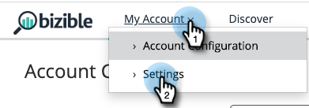
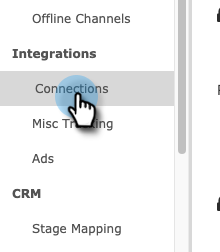
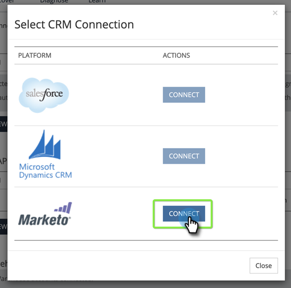
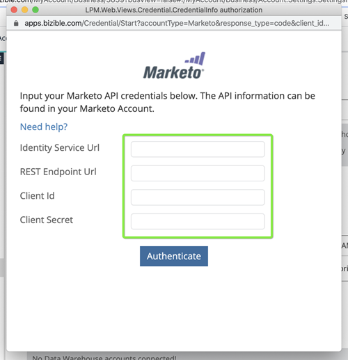

# Marketo Connectionの設定 {#set-up-marketo-connection}

Marketoへの接続を設定する方法は次のとおりです。

>[!PREREQUISITES]
>
>[[!DNL Marketo Measure]/Marketo Engage接続用のAPIのみのユーザーロール ](https://experienceleague.adobe.com/docs/marketo/using/product-docs/administration/users-and-roles/create-an-api-only-user.html?lang=ja){target="_blank"}を作成します。

1. [!DNL Marketo Measure]で、**[!UICONTROL マイアカウント]** ドロップダウンをクリックし、**[!UICONTROL 設定]**&#x200B;を選択します。

   

1. [!UICONTROL 統合]で、**[!UICONTROL 接続]**&#x200B;をクリックします。

   

1. **[!UICONTROL 新しいCRM接続の設定]**&#x200B;をクリックします。

   

1. Marketoの横にある「**[!UICONTROL Connect]**」ボタンをクリックします。

   

1. 新しいタブで、Marketo Engage アカウントにログインします。 **管理者** > **Web サービス**&#x200B;に移動します。 REST APIまでスクロールダウンします。 エンドポイントとID サービスのURLをハイライト表示して保存します。 次の手順で必要になります。

   

1. まだMarketo Engageで、左側のツリーで「**LaunchPoint**」を選択します。 Marketo Measureに接続するカスタムサービスを見つけて、**詳細を表示**&#x200B;をクリックします。

   

1. クライアント IDとクライアントシークレットをハイライト表示して保存します。 「**閉じる**」をクリックします。

   

1. [!DNL Marketo Measure]に戻って、収集したデータをフィールドに入力します。

   

1. 値を入力したら、**[!UICONTROL 認証]**&#x200B;をクリックします。 お使いのMarketo Engage アカウントは[!DNL Marketo Measure]に接続されています。

   

   >[!NOTE]
   >
   >[!DNL Marketo Measure]は、Marketo APIの制限を使用せずにMarketo APIに代わって呼び出しを行うため、他の統合との上限やクレジット割り当てについて心配する必要はありません。
