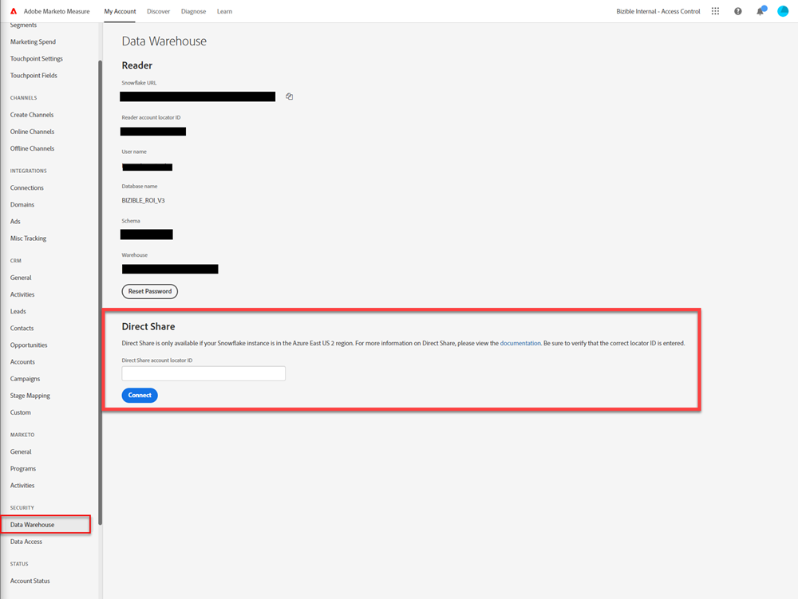

# データウェアハウスへのアクセス - Direct Share {#data-warehouse-access-direct-share}

## 要件 {#requirements}

[!DNL Marketo Measure]がデータウェアハウスへの直接共有を設定するには、次の要件を満たす必要があります。

* 独自のSnowflakeインスタンスがあります。
* Snowflake インスタンスは、Azure東米国2 Snowflake リージョンにあります。
* [!DNL Marketo Measure]にSnowflake アカウント IDを指定しました。

## 制限事項 {#limitations}

[!DNL Marketo Measure]は、Azure東US 2のアカウントでSnowflake Direct Sharesを設定できます（これは、SnowflakeではなくMarketo Measureの制限です）。 お客様のデータを他のSnowflake リージョンで利用できるようにする必要がある場合は、Azure East US 2にあるSnowflake アカウントにデータのコピーを作成し、[Snowflake Database Replication](https://docs.snowflake.com/en/user-guide/database-replication-intro.html){target="_blank"}機能を使用して、お客様が選択したSnowflake リージョン/アカウントにデータをコピーすることをお勧めします。

## Snowflake アカウント IDを入力 {#enter-snowflake-account-id}

Marketo Measure アプリで「**設定**」セクションを開き、**Data Warehouse** ページに移動します。 **Direct Share** セクションで、提供されたボックスに[Snowflake アカウント ID](https://docs.snowflake.com/en/user-guide/admin-account-identifier.html){target="_blank"}を入力し、**Connect**&#x200B;をクリックします。



## 共有へのアクセス {#accessing-the-share}

指定されたアカウント IDに対して共有を作成したら、Snowflake インスタンス内の[設定手順](https://docs.snowflake.com/en/user-guide/data-share-consumers.html){target="_blank"}を完了してデータにアクセスする必要があります。

>[!NOTE]
>
>任意のデータベース名を選択できます。 Snowflake インスタンスに存在する限り、任意のロールに権限を割り当てることができます。

* アカウント管理者の役割の使用

```
USE ROLE ACCOUNTADMIN
```

* 使用可能な共有を表示します（付与された共有の名前が表示されます）

```
SHOW SHARES
```

* 共有用のデータベースの作成

```
CREATE DATABASE <database_name> FROM SHARE <provider_account>.<share_name>
```

* 共有データベースに対する権限の付与

```
GRANT IMPORTED PRIVILEGES ON DATABASE <database_name> TO ROLE <role_name>
GRANT IMPORTED PRIVILEGES ON ALL SCHEMAS IN DATABASE <database_name> TO ROLE <role_name>
```

Snowflake UIからこれらの手順を実行するための詳細な手順と手順については、[Snowflakeのドキュメントを直接](https://docs.snowflake.com/en/user-guide/data-share-consumers.html){target="_blank"}参照してください。
