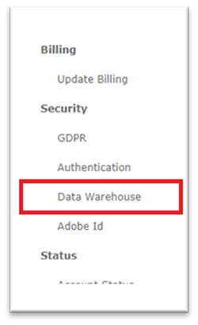

# データウェアハウスへのアクセス - Reader アカウント {#data-warehouse-access-reader-account}

## Snowflakeアクセスリンク {#snowflake-access-link}

SnowflakeData Warehouse にアクセスするには、Snowflakeアカウントの特定の URL に移動する必要があります。 このアクセスリンクを確認するには、[!DNL Marketo Measure] にログインし、次の手順に従ってData Warehouse情報ページに移動します。

1. [!DNL Marketo Measure] で、ページ上部の **[!UICONTROL マイアカウント]**/**[!UICONTROL 設定]** をクリックします。

   

1. 左側のメニューの [ セキュリティ ] で、[**[!UICONTROL Data Warehouse]**] をクリックします。

   

1. このページには、Snowflakeの Data Warehouse へのリンクとユーザー名が記載されています。

   

   >[!NOTE]
   >
   >これは、個々のユーザーだけでなく、組織で使用できる読み取り専用アカウントです。 [!DNL Marketo Measure] へのアクセス権を持つ組織内のすべてのユーザーは、このアカウントを使用してSnowflakeData Warehouseリーダーアカウントにログインできます。

1. Snowflakeの URL に記載されているリンクをクリックすると、Snowflakeのログインページが表示されます。このページで、ユーザー名とパスワードを入力します。 _パスワードがない場合は、次の手順を参照してリセットしてください_。

   

1. ログインしたら、ページ上部の「**[!UICONTROL ワークシート]**」をクリックします。

   

1. BIZIBLE_ROI_V3 データベースオブジェクトが画面の左側に表示されます。 クエリー・ウィンドウの上部にあるドロップダウン・オプションから、「ウェアハウス」、「データベース」、「スキーマ」を入力します。 それぞれにオプションは 1 つだけにする必要があります。 これで、Snowflakeクエリエディター内でクエリを実行する準備が整いました。

   

## パスワードのリセット {#reset-your-password}

[!DNL Marketo Measure] はSnowflakeのログイン パスワードへのアクセス権を持っていません。 パスワードをリセットする必要がある場合は、Data Warehouse情報ページの [!UICONTROL &#x200B; パスワードのリセット &#x200B;] ボタンをクリックし、指示に従ってください。 一時パスワードが UI に直ちに表示されます。 次に Data Warehouse にログインする際に、独自のパスワードを作成するよう求められます。

>[!NOTE]
>
>* パスワードをリセットすると、現在ログインしてい [!DNL Marketo Measure] ユーザーだけでなく、組織内のすべてのユーザーに対してパスワードがリセットされます。
>* UI には一時パスワードのみが表示されます。 メールは送信されません。

## サードパーティ製ツールを使用したSnowflakeへの接続 {#connecting-to-snowflake-via-third-party-tools}

Snowflakeデータウェアハウスをサードパーティのツールに接続するには、いくつかの情報を入力する必要があります。

>[!NOTE]
>
>ツールごとに接続要件が異なります。接続する特定のツールのドキュメントを参照することをお勧めします。

* **URI** （常に必須）
   * これは、Snowflakeアカウントのドメイン名です。 Snowflakeのログインリンクの一部に含まれています。
* **ユーザー名** （常に必須）
   * ユーザー名は、[!DNL Marketo Measure] のData Warehouse情報ページに一覧表示されます。
* **パスワード** （常に必須）
   * これは、Snowflakeアカウントに初めてログインしたときに設定したパスワードです。 パスワードをリセットするには、上記の手順を参照してください。
* **データベース名** （必ずしも必須ではありません）
   * データベースは、データをSnowflakeに保存するものです。 これはストレージリソースです。 データベース名は、[!DNL Marketo Measure] のData Warehouse情報ページに一覧表示されます。
* **ウェアハウス名** （必ずしも必須ではありません）
   * ウェアハウスは、Snowflakeでクエリを実行するものです。 これは計算されたリソースです。 ウェアハウス名は [!DNL Marketo Measure] のData Warehouse情報ページにリストされます。

  
