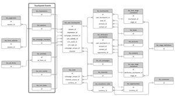

# Data Warehouseスキーマ {#data-warehouse-schema}

Data Warehouseを使用すると、必要なだけ追跡し、任意の場所にアトリビューションデータを報告し、他のデータセットにプラグインできます。

>[!IMPORTANT]
>
>_DELETED_DATE の値を持つ行は 15 日間保持され、Snowflakeから削除されます。 Snowflakeタイムゾーンは UTC です。

>[!NOTE]
>
>[ここをクリック](#sample-queries) を参照して、この記事の下部にクエリ例を表示します。

## エンティティ関係図 {#entity-relationship-diagrams}

この _Data Warehouseデータモデル_ ERD は、Data Warehouse 内のデータがフローし、相互にリンクされる方法を示します。 マッピングテーブル、既に存在する他のテーブルのビュー、またはこれ以上使用しない推奨のテーブルを表すテーブルが存在するので、この図では、Data Warehouse で使用可能なすべてのテーブルが含まれているわけではありません。 以下の Data Warehouse にあるテーブルと列の詳細な説明を参照してください。 これらのテーブルの多くは非正規化されたフィールドを含んでいますが、代わりにディメンションテーブルのデータを活用し、この図は推奨されるデータモデルです。

追加の _広告ディメンションデータモデル_ ERD は、広告固有のディメンションのテーブルを、メインデータモデルのテーブルに最も効果的にリンクする方法を示します。 広告ディメンションは他のテーブルでも非正規化されますが、これは、これらのディメンションを結合するための推奨モデルを表します。

_フルサイズ版の画像をクリックします_

<table style="table-layout:auto"> 
 <colgroup> 
  <col> 
  <col> 
 </colgroup> 
 <tbody> 
  <tr> 
   <td><strong>Data Warehouseデータモデル</strong></td> 
   <td><strong>広告ディメンションデータモデル</strong></td> 
  </tr> 
  <tr> 
   <td> 
    <div> 
     <p><a href="assets/data-warehouse-data-model.pdf"></a></p> 
    </div></td>
   <td> 
    <div> 
     <p><a href="assets/ads-dimensional-data-model.pdf"></a></p>
    </div></td> 
  </tr> 
 </tbody> 
</table>

## 参照 {#views}

### BIZ_ACCOUNTS {#biz-accounts}

ソースシステムからインポートしたアカウント。

<table>
  <tbody>
    <tr>
      <th><strong>列</strong></th>
      <th><strong>データタイプ</strong></th>
      <th><strong>説明</strong></th>
      <th><strong>サンプルデータ</strong></th>
    </tr>
    <tr>
      <td>ID</td>
      <td>varchar</td>
      <td>ソースシステムのアカウント ID。</td>
      <td>0013100001kpAZxAAM</td>
    </tr>
    <tr>
      <td>CREATED_DATE</td>
      <td>timestamp_ntz</td>
      <td>ソースシステムからのアカウントの作成日。</td>
      <td>2016-08-28 00:32:55.000</td>
    </tr>
    <tr>
      <td>MODIFIED_DATE</td>
      <td>timestamp_ntz</td>
      <td>ソースシステムからのアカウントの最終変更日。</td>
      <td>2018-08-01 17:38:30.000</td>
    </tr>
    <tr>
      <td>名前</td>
      <td>varchar</td>
      <td>ソース・システムからのアカウント名。</td>
      <td>[!DNL Marketo Measure]</td>
    </tr>
    <tr>
      <td>WEB_SITE</td>
      <td>varchar</td>
      <td>リードとアカウントのマッピングに使用される、ソースシステムで記録されたアカウントの Web サイト。</td>
      <td>www.adobe.com</td>
    </tr>
    <tr>
      <td>ENGAGEMENT_RATING</td>
      <td>varchar</td>
      <td>レター等級 (A、B、C、D、N/A)。 [!DNL Marketo Measure] 機械学習モデル。 ABM が無効な場合は null になります。</td>
      <td>B</td>
    </tr>
    <tr>
      <td>ENGAGEMENT_SCORE</td>
      <td>number(38,19)</td>
      <td>次の式で計算された数値スコア： [!DNL Marketo Measure] 予測エンゲージメントスコアを生成する機械学習 (Engagement_Rating)。 ABM が無効な場合は null になります。</td>
      <td>0.1417350147058800000</td>
    </tr>
    <tr>
      <td>ドメイン</td>
      <td>varchar</td>
      <td>Web サイトの解析済みバージョン（ドメインのみ保存）。</td>
      <td>adobe</td>
    </tr>
    <tr>
      <td>IS_DELETED</td>
      <td>ブール値</td>
      <td>ソースシステムでレコードが削除されるかどうか。</td>
      <td>偽</td>
    </tr>
    <tr>
      <td>CUSTOM_PROPERTIES</td>
      <td>varchar</td>
      <td>カスタムプロパティ [!DNL Marketo Measure] は JSON 形式でソースシステムから読み込まれました。</td>
      <td>{"Account_Type__c":"セキュリティ", "Foo":"Bar"}</td>
    </tr>
    <tr>
      <td>_CREATED_DATE</td>
      <td>timestamp_ntz</td>
      <td>レコードがSnowflakeで作成された日付。</td>
      <td>2020-01-01 01:01:00.000</td>
    </tr>
    <tr>
      <td>_MODIFIED_DATE</td>
      <td>timestamp_ntz</td>
      <td>レコードが最後に変更された日付 (Snowflake)。</td>
      <td>2020-01-01 01:01:00.000</td>
    </tr>
    <tr>
      <td>_DELETED_DATE</td>
      <td>timestamp_ntz</td>
      <td>レコードが削除済みとマークされたSnowflake。</td>
      <td>2020-01-01 01:01:00.000</td>
    </tr>
  </tbody>
</table>

### BIZ_ACCOUNT_TO_EMAILS {#biz-account-to-emails}

既知のリード/連絡先のメールアドレスとアカウント間のマッピングテーブル。 ABM が無効な場合、このテーブルは空になります。

<table>
  <tbody>
    <tr>
    <th><strong>列</strong></th>
      <th><strong>データタイプ</strong></th>
      <th><strong>説明</strong></th>
      <th><strong>サンプルデータ</strong></th>
    </tr>
    <tr>
      <td>ID</td>
      <td>varchar</td>
      <td>レコードの一意の ID。</td>
      <td>0013800001MMPPiAAP_person@adobe.com|2022-01-05 17:22:13.000</td>
    </tr>
    <tr>
      <td>
        <p>ACCOUNT_ID</p>
      </td>
      <td>
        <p>varchar</p>
      </td>
      <td>
        <p>ソースシステムアカウント ID。</p>
      </td>
      <td>
        <p>0013100001phrBAAAY</p>
      </td>
    </tr>
    <tr>
      <td>
        <p>電子メール</p>
      </td>
      <td>
        <p>varchar</p>
      </td>
      <td>
        <p>取引先責任者の関係またはリードからアカウントへのマッピングを通じて、アカウントにマッピングされた電子メールアドレス。</p>
      </td>
      <td>
        <p>person@adobe.com</p>
      </td>
    </tr>
    <tr>
      <td>
        <p>MODIFIED_DATE</p>
      </td>
      <td>
        <p>timestamp_ntz</p>
      </td>
      <td>
        <p>ソースシステムからのアカウントの最終変更日。</p>
      </td>
      <td>
        <p>2018-08-31 23:53:39.000</p>
      </td>
    </tr>
    <tr>
      <td>
        <p>CREATED_DATE</p>
      </td>
      <td>
        <p>timestamp_ntz</p>
      </td>
      <td>
        <p>ソースシステムからのアカウントの作成日。</p>
      </td>
      <td>
        <p>2018-08-18 22:01:32.000</p>
      </td>
    </tr>
    <tr>
      <td>
        <p>IS_DELETED</p>
      </td>
      <td>
        <p>ブール値</p>
      </td>
      <td>
        <p>レコードが削除されたと見なされるかどうか。</p>
      </td>
      <td>
        <p>偽</p>
      </td>
    </tr>
    <tr>
      <td>_CREATED_DATE</td>
      <td>timestamp_ntz</td>
      <td>レコードがSnowflakeで作成された日付。</td>
      <td>2020-01-01 01:01:00.000</td>
    </tr>
    <tr>
      <td>_MODIFIED_DATE</td>
      <td>timestamp_ntz</td>
      <td>レコードが最後に変更された日付 (Snowflake)。</td>
      <td>2020-01-01 01:01:00.000</td>
    </tr>
    <tr>
      <td>_DELETED_DATE</td>
      <td>timestamp_ntz</td>
      <td>レコードが削除済みとマークされたSnowflake。</td>
      <td>2020-01-01 01:01:00.000</td>
    </tr>
  </tbody>
</table>

### BIZ_ACTIVITYS {#biz-activities}

ソースシステムまたは接続された広告アカウントから読み込まれたアクティビティ。

<table>
  <tbody>
  <tr>
    <th><strong>列</strong></th>
    <th><strong>データタイプ</strong></th>
    <th><strong>説明</strong></th>
    <th><strong>サンプルデータ</strong></th>
    </tr>
    <tr>
      <td>
        <p>ID</p>
      </td>
      <td>
        <p>varchar</p>
      </td>
      <td>
        <p>ソースシステムからのアクティビティ ID。</p>
      </td>
      <td>
        <p>1678625515</p>
      </td>
    </tr>
    <tr>
      <td>
        <p>LEAD_ID</p>
      </td>
      <td>
        <p>varchar</p>
      </td>
      <td>アクティビティに関連付けられたリードの ID。</td>
      <td>
        <p>15530482</p>
      </td>
    </tr>
    <tr>
      <td>
        <p>CONTACT_ID</p>
      </td>
      <td>
        <p>varchar</p>
      </td>
      <td>
        <p>アクティビティに関連付けられた連絡先の ID。</p>
      </td>
      <td>
        <p>13792552</p>
      </td>
    </tr>
    <tr>
      <td>
        <p>ACTIVITY_TYPE_ID</p>
      </td>
      <td>
        <p>varchar</p>
      </td>
      <td>
        <p>ソースシステムから取得したアクティビティタイプの ID。</p>
      </td>
      <td>
        <p>104</p>
      </td>
    </tr>
    <tr>
      <td>ACTIVITY_TYPE_NAME</td>
      <td>varchar</td>
      <td>ソースシステムのアクティビティ名。</td>
      <td>
        <p>進行状況の状態を変える</p>
      </td>
    </tr>
    <tr>
      <td>START_DATE</td>
      <td>timestamp_ntz</td>
      <td>ソースシステムからの活動の開始日。</td>
      <td>2020-01-01 01:01:00.000</td>
    </tr>
    <tr>
      <td>END_DATE</td>
      <td>timestamp_ntz</td>
      <td>ソースシステムからのアクティビティの終了日。</td>
      <td>2020-01-01 01:01:00.000</td>
    </tr>
    <tr>
      <td>CAMPAIGN_ID</td>
      <td>varchar</td>
      <td>アクティビティが属するキャンペーンの ID（ソースシステムから取得）。</td>
      <td>
        <p>li.508038570.147643566</p>
      </td>
    </tr>
    <tr>
      <td>SOURCE_SYSTEM</td>
      <td>varchar</td>
      <td>ソースシステムタイプを識別します。</td>
      <td>Marketo</td>
    </tr>
    <tr>
      <td>CREATED_DATE</td>
      <td>timestamp_ntz</td>
      <td>行がソース・システムで作成された日付。</td>
      <td>2020-01-01 01:01:00.000</td>
    </tr>
    <tr>
      <td>MODIFIED_DATE</td>
      <td>timestamp_ntz</td>
      <td>ソース・システムで行が最後に変更された日付。</td>
      <td>2020-01-01 01:01:00.000</td>
    </tr>
    <tr>
      <td>IS_DELETD</td>
      <td>ブール値</td>
      <td>ソースシステムでレコードが削除されたと見なされるかどうか。</td>
      <td>偽</td>
    </tr>
    <tr>
      <td>AD_FORM_ID</td>
      <td>varchar</td>
      <td>アクティビティが属する広告フォームの ID（ソースシステムから取得）。</td>
      <td>li.507063119.3757704</td>
    </tr>
    <tr>
      <td>_CREATED_DATE</td>
      <td>timestamp_ntz</td>
      <td>レコードがSnowflakeで作成された日付。</td>
      <td>2020-01-01 01:01:00.000</td>
    </tr>
    <tr>
      <td>_MODIFIED_DATE</td>
      <td>timestamp_ntz</td>
      <td>レコードが最後に変更された日付 (Snowflake)。</td>
      <td>2020-01-01 01:01:00.000</td>
    </tr>
    <tr>
      <td>_DELETED_DATE</td>
      <td>timestamp_ntz</td>
      <td>レコードが削除済みとマークされたSnowflake。</td>
      <td>2020-01-01 01:01:00.000</td>
    </tr>
  </tbody>
</table>

### BIZ_ADS {#biz-ads}

接続された広告アカウントから読み込まれた広告。

<table>
  <tbody>
    <tr>
      <th>
        <p><strong>列</strong></p>
      </th>
      <th>
        <p><strong>データタイプ</strong></p>
      </th>
      <th>
        <p><strong>説明</strong></p>
      </th>
      <th>
        <p><strong>サンプルデータ</strong></p>
      </th>
    </tr>
    <tr>
      <td>
        <p>ID</p>
      </td>
      <td>
        <p>varchar</p>
      </td>
      <td>
        <p>広告の一意の ID。</p>
      </td>
      <td>
        <p>fb.106851586409075.6052044288804.6052044290004.6053457066804</p>
      </td>
    </tr>
    <tr>
      <td>
        <p>DISPLAY_ID</p>
      </td>
      <td>
        <p>varchar</p>
      </td>
      <td>
        <p>ソースシステムからの広告 ID。</p>
      </td>
      <td>
        <p>6053457066804</p>
      </td>
    </tr>
    <tr>
      <td>
        <p>AD_ACCOUNT_UNIQUE_ID</p>
      </td>
      <td>
        <p>varchar</p>
      </td>
      <td>
        <p>広告がインポートされた広告アカウントの ID。</p>
      </td>
      <td>
        <p>fb.106851586409075</p>
      </td>
    </tr>
    <tr>
      <td>
        <p>AD_ACCOUNT_NAME</p>
      </td>
      <td>
        <p>varchar</p>
      </td>
      <td>
        <p>広告がインポートされた広告アカウントの名前。</p>
      </td>
      <td>
        <p>[!DNL Marketo Measure] アカウント</p>
      </td>
    </tr>
    <tr>
      <td>
        <p>ADVERTISER_UNIQUE_ID</p>
      </td>
      <td>
        <p>varchar</p>
      </td>
      <td>
        <p>広告の広告主の ID（特に Doubleclick 用）。</p>
      </td>
      <td>
        <p>300181641</p>
      </td>
    </tr>
    <tr>
      <td>
        <p>ADVERTISER_NAME</p>
      </td>
      <td>
        <p>varchar</p>
      </td>
      <td>
        <p>広告の広告主の名前（特に Doubleclick 用）。</p>
      </td>
      <td>
        <p>マーケティング分析</p>
      </td>
    </tr>
    <tr>
      <td>
        <p>AD_GROUP_UNIQUE_ID</p>
      </td>
      <td>
        <p>varchar</p>
      </td>
      <td>
        <p>広告の広告グループの ID。</p>
      </td>
      <td>
        <p>fb.106851586409075.6052044288804.6052044290004</p>
      </td>
    </tr>
    <tr>
      <td>
        <p>AD_GROUP_NAME</p>
      </td>
      <td>
        <p>varchar</p>
      </td>
      <td>
        <p>広告の広告グループの名前。</p>
      </td>
      <td>
        <p>広告 B の広告セット</p>
      </td>
    </tr>
    <tr>
      <td>
        <p>AD_CAMPAIGN_UNIQUE_ID</p>
      </td>
      <td>
        <p>varchar</p>
      </td>
      <td>
        <p>広告のキャンペーンの ID。</p>
      </td>
      <td>
        <p>fb.106851586409075.6052044288804</p>
      </td>
    </tr>
    <tr>
      <td>
        <p>AD_CAMPAIGN_NAME</p>
      </td>
      <td>
        <p>varchar</p>
      </td>
      <td>
        <p>広告のキャンペーン名。</p>
      </td>
      <td>
        <p>リード生成キャンペーン</p>
      </td>
    </tr>
    <tr>
      <td>
        <p>IS_ACTIVE</p>
      </td>
      <td>
        <p>ブール値</p>
      </td>
      <td>
        <p>ソースシステムで広告がまだアクティブかどうか。</p>
      </td>
      <td>
        <p>偽</p>
      </td>
    </tr>
    <tr>
      <td>
        <p>IS_DELETED</p>
      </td>
      <td>
        <p>ブール値</p>
      </td>
      <td>
        <p>ソースシステムで広告が削除されたかどうか。</p>
      </td>
      <td>
        <p>偽</p>
      </td>
    </tr>
    <tr>
      <td>
        <p>MODIFIED_DATE</p>
      </td>
      <td>
        <p>timestamp_ntz</p>
      </td>
      <td>
        <p>レコードが最後に変更された日付。</p>
      </td>
      <td>
        <p>2018-08-02 06:35:59.000</p>
      </td>
    </tr>
    <tr>
      <td>
        <p>FIRST_IMPORTED</p>
      </td>
      <td>
        <p>timestamp_ntz</p>
      </td>
      <td>
        <p>レコードがソースシステムから最初に読み込まれた日付。</p>
      </td>
      <td>
        <p>2018-08-02 06:35:59.000</p>
      </td>
    </tr>
    <tr>
      <td>
        <p>名前</p>
      </td>
      <td>
        <p>varchar</p>
      </td>
      <td>
        <p>ソースシステムから取得した広告の名前。</p>
      </td>
      <td>
        <p>広告 2</p>
      </td>
    </tr>
    <tr>
      <td>
        <p>NEEDS_UPDATE</p>
      </td>
      <td>
        <p>ブール値</p>
      </td>
      <td>
        <p>広告を [!DNL Marketo Measure] タグ付け。</p>
        <p>（診断フィールド。内部処理で使用されます）。</p>
      </td>
      <td>
        <p>偽</p>
      </td>
    </tr>
    <tr>
      <td>
        <p>GROUPING_KEY</p>
      </td>
      <td>
        <p>varchar</p>
      </td>
      <td>診断フィールド。内部処理に使用されます。</td>
      <td>
        <p>fb.106851586409075.6052044288804.6052044290004</p>
      </td>
    </tr>
    <tr>
      <td>
        <p>ENTITY_TYPE</p>
      </td>
      <td>
        <p>varchar</p>
      </td>
      <td>
        <p>このテーブルのメインオブジェクトまたはエンティティ。 この場合は、「Ad」です。</p>
      </td>
      <td>
        <p>広告</p>
      </td>
    </tr>
    <tr>
      <td>
        <p>PROVIDER_TYPE</p>
      </td>
      <td>
        <p>varchar</p>
      </td>
      <td>
        <p>広告の広告プロバイダーの名前。</p>
      </td>
      <td>
        <p>Facebook</p>
      </td>
    </tr>
    <tr>
      <td>
        <p>URL_CURRENT</p>
      </td>
      <td>
        <p>varchar</p>
      </td>
      <td>
        <p>ランディングページの URL。</p>
        <p>（内部処理用の診断フィールド。）</p>
      </td>
      <td></td>
    </tr>
    <tr>
      <td>
        <p>URL_OLD</p>
      </td>
      <td>
        <p>varchar</p>
      </td>
      <td>
        <p>URL_CURRENT の以前の値。</p>
        <p>（内部処理用の診断フィールド。）</p>
      </td>
      <td></td>
    </tr>
    <tr>
      <td>
        <p>URL_REQUESTED</p>
      </td>
      <td>
        <p>varchar</p>
      </td>
      <td>
        <p>URL の修飾対象 [!DNL Marketo Measure] パラメーター。</p>
        <p>（内部処理用の診断フィールド。）</p>
      </td>
      <td></td>
    </tr>
    <tr>
      <td>
        <p>URL_ALTENATIVES</p>
      </td>
      <td>
        <p>varchar</p>
      </td>
      <td>
        <p>ソースシステムから読み込まれました。</p>
        <p>（内部処理用の診断フィールド。）</p>
      </td>
      <td></td>
    </tr>
    <tr>
      <td>
        <p>ROW_KEY</p>
      </td>
      <td>
        <p>number(38,0)</p>
      </td>
      <td>
        <p>Biz_Facts ビューの外部キー。</p>
      </td>
      <td>
        <p>6008900572523230000</p>
      </td>
    </tr>
    <tr>
      <td>_CREATED_DATE</td>
      <td>timestamp_ntz</td>
      <td>レコードがSnowflakeで作成された日付。</td>
      <td>2020-01-01 01:01:00.000</td>
    </tr>
    <tr>
      <td>_MODIFIED_DATE</td>
      <td>timestamp_ntz</td>
      <td>レコードが最後に変更された日付 (Snowflake)。</td>
      <td>2020-01-01 01:01:00.000</td>
    </tr>
    <tr>
      <td>_DELETED_DATE</td>
      <td>timestamp_ntz</td>
      <td>レコードが削除済みとマークされたSnowflake。</td>
      <td>2020-01-01 01:01:00.000</td>
    </tr>
  </tbody>
</table>

### BIZ_ADVERTISERS {#biz-advertisers}

接続された広告アカウントから読み込まれた広告主。

<table>
  <tbody>
    <tr>
      <th>
        <p>列</p>
      </th>
      <th>
        <p>データタイプ</p>
      </th>
      <th>
        <p>説明</p>
      </th>
      <th>
        <p>サンプルデータ</p>
      </th>
    </tr>
    <tr>
      <td>
        <p>ID</p>
      </td>
      <td>
        <p>varchar</p>
      </td>
      <td>
        <p>広告主の一意の ID。</p>
      </td>
      <td>
        <p>dc.6114.9143143</p>
      </td>
    </tr>
    <tr>
      <td>
        <p>DISPLAY_ID</p>
      </td>
      <td>
        <p>varchar</p>
      </td>
      <td>ソースシステムの広告主 ID。</td>
      <td>9143143</td>
    </tr>
    <tr>
      <td>
        <p>AD_ACCOUNT_UNIQUE_ID</p>
      </td>
      <td>
        <p>varchar</p>
      </td>
      <td>
        <p>広告がインポートされた広告アカウントの ID。</p>
      </td>
      <td>
        <p>fb.106851586409075</p>
      </td>
    </tr>
    <tr>
      <td>
        <p>AD_ACCOUNT_NAME</p>
      </td>
      <td>
        <p>varchar</p>
      </td>
      <td>
        <p>広告がインポートされた広告アカウントの名前。</p>
      </td>
      <td>
        <p>[!DNL Marketo Measure] アカウント</p>
      </td>
    </tr>
    <tr>
      <td>
        <p>ADVERTISER_UNIQUE_ID</p>
      </td>
      <td>
        <p>varchar</p>
      </td>
      <td>
        <p>広告主の ID（特に Doubleclick 用）。</p>
      </td>
      <td>
        <p>300181641</p>
      </td>
    </tr>
    <tr>
      <td>
        <p>ADVERTISER_NAME</p>
      </td>
      <td>
        <p>varchar</p>
      </td>
      <td>
        <p>広告主の名前（特に Doubleclick 用）。</p>
      </td>
      <td>
        <p>[!DNL Marketo Measure] マーケティング分析</p>
      </td>
    </tr>
    <tr>
      <td>
        <p>AD_GROUP_UNIQUE_ID</p>
      </td>
      <td>
        <p>varchar</p>
      </td>
      <td>
        <p>どの広告階層にも広告主より上に広告グループがないので、null になると想定されます。</p>
      </td>
      <td>
        <p>NULL</p>
      </td>
    </tr>
    <tr>
      <td>
        <p>AD_GROUP_NAME</p>
      </td>
      <td>
        <p>varchar</p>
      </td>
      <td>
        <p>どの広告階層にも広告主より上に広告グループがないので、null になると想定されます。</p>
      </td>
      <td>
        <p>NULL</p>
      </td>
    </tr>
    <tr>
      <td>
        <p>AD_CAMPAIGN_UNIQUE_ID</p>
      </td>
      <td>
        <p>varchar</p>
      </td>
      <td>
        <p>どの広告階層にも広告主より上に広告キャンペーンがないので、null になると想定されます。</p>
      </td>
      <td>
        <p>NULL</p>
      </td>
    </tr>
    <tr>
      <td>
        <p>AD_CAMPAIGN_NAME</p>
      </td>
      <td>
        <p>varchar</p>
      </td>
      <td>
        <p>どの広告階層にも広告広告主より上にキャンペーンがないので、null になると想定されます。</p>
      </td>
      <td>
        <p>NULL</p>
      </td>
    </tr>
    <tr>
      <td>
        <p>IS_ACTIVE</p>
      </td>
      <td>
        <p>ブール値</p>
      </td>
      <td>
        <p>ソースシステムで広告主がまだアクティブかどうか。</p>
      </td>
      <td>
        <p>真</p>
      </td>
    </tr>
    <tr>
      <td>
        <p>IS_DELETED</p>
      </td>
      <td>
        <p>ブール値</p>
      </td>
      <td>
        <p>ソースシステムで広告主が削除されたかどうか。</p>
      </td>
      <td>
        <p>偽</p>
      </td>
    </tr>
    <tr>
      <td>
        <p>MODIFIED_DATE</p>
      </td>
      <td>
        <p>timestamp_ntz</p>
      </td>
      <td>
        <p>レコードが最後に変更された日付。</p>
      </td>
      <td>
        <p>2018-08-02 06:35:59.000</p>
      </td>
    </tr>
    <tr>
      <td>
        <p>FIRST_IMPORTED</p>
      </td>
      <td>
        <p>timestamp_ntz</p>
      </td>
      <td>
        <p>レコードがソースシステムから最初に読み込まれた日付。</p>
      </td>
      <td>
        <p>2018-08-02 06:35:59.000</p>
      </td>
    </tr>
    <tr>
      <td>
        <p>名前</p>
      </td>
      <td>
        <p>varchar</p>
      </td>
      <td>
        <p>ソースシステムから取得した広告主の名前。</p>
      </td>
      <td>
        <p>[!DNL Marketo Measure] マーケティング分析</p>
      </td>
    </tr>
    <tr>
      <td>
        <p>NEEDS_UPDATE</p>
      </td>
      <td>
        <p>ブール値</p>
      </td>
      <td>
        <p>広告主を [!DNL Marketo Measure] タグ付け。</p>
        <p>（診断フィールド。内部処理で使用されます）。</p>
      </td>
      <td>
        <p>偽</p>
      </td>
    </tr>
    <tr>
      <td>
        <p>GROUPING_KEY</p>
      </td>
      <td>
        <p>varchar</p>
      </td>
      <td>診断フィールド。内部処理に使用されます。</td>
      <td></td>
    </tr>
    <tr>
      <td>
        <p>ENTITY_TYPE</p>
      </td>
      <td>
        <p>varchar</p>
      </td>
      <td>
        <p>このテーブルのメインオブジェクトまたはエンティティ。 この場合は、「広告主」です。</p>
      </td>
      <td>
        <p>広告主</p>
      </td>
    </tr>
    <tr>
      <td>
        <p>PROVIDER_TYPE</p>
      </td>
      <td>
        <p>varchar</p>
      </td>
      <td>
        <p>広告主の広告プロバイダー。</p>
      </td>
      <td>
        <p>Doubleclick</p>
      </td>
    </tr>
    <tr>
      <td>
        <p>ROW_KEY</p>
      </td>
      <td>
        <p>number(38,0)</p>
      </td>
      <td>
        <p>Biz_Facts ビューの外部キー。</p>
      </td>
      <td>
        <p>6008900572523230000</p>
      </td>
    </tr>
    <tr>
      <td>_CREATED_DATE</td>
      <td>timestamp_ntz</td>
      <td>レコードがSnowflakeで作成された日付。</td>
      <td>2020-01-01 01:01:00.000</td>
    </tr>
    <tr>
      <td>_MODIFIED_DATE</td>
      <td>timestamp_ntz</td>
      <td>レコードが最後に変更された日付 (Snowflake)。</td>
      <td>2020-01-01 01:01:00.000</td>
    </tr>
    <tr>
      <td>_DELETED_DATE</td>
      <td>timestamp_ntz</td>
      <td>レコードが削除済みとマークされたSnowflake。</td>
      <td>2020-01-01 01:01:00.000</td>
    </tr>
  </tbody>
</table>

### BIZ_AD_ACCOUNTS {#biz-ad-accounts}

接続された広告アカウントから読み込まれた広告アカウント。

<table>
  <tbody>
    <tr>
      <th>
        <p>列</p>
      </th>
      <th>
        <p>データタイプ</p>
      </th>
      <th>
        <p>説明</p>
      </th>
      <th>
        <p>サンプルデータ</p>
      </th>
    </tr>
    <tr>
      <td>
        <p>ID</p>
      </td>
      <td>
        <p>varchar</p>
      </td>
      <td>
        <p>広告アカウントの一意の識別子。</p>
      </td>
      <td>
        <p>aw.6601259029</p>
      </td>
    </tr>
    <tr>
      <td>
        <p>DISPLAY_ID</p>
      </td>
      <td>
        <p>varchar</p>
      </td>
      <td>ソースシステムからの広告アカウント ID。</td>
      <td>
        <p>6601259029</p>
      </td>
    </tr>
    <tr>
      <td>
        <p>AD_ACCOUNT_UNIQUE_ID</p>
      </td>
      <td>
        <p>varchar</p>
      </td>
      <td>これは広告階層の広告アカウントのレコードなので、null になると想定されます。</td>
      <td>NULL</td>
    </tr>
    <tr>
      <td>
        <p>AD_ACCOUNT_NAME</p>
      </td>
      <td>
        <p>varchar</p>
      </td>
      <td>これは広告階層の広告アカウントのレコードなので、null になると想定されます。</td>
      <td>NULL</td>
    </tr>
    <tr>
      <td>
        <p>ADVERTISER_UNIQUE_ID</p>
      </td>
      <td>
        <p>varchar</p>
      </td>
      <td>
        <p>どの広告階層にも広告アカウントより上に広告主がないので、null になると想定されます。</p>
      </td>
      <td>NULL</td>
    </tr>
    <tr>
      <td>
        <p>ADVERTISER_NAME</p>
      </td>
      <td>
        <p>varchar</p>
      </td>
      <td>
        <p>どの広告階層にも広告アカウントより上に広告主がないので、null になると想定されます。</p>
      </td>
      <td>NULL</td>
    </tr>
    <tr>
      <td>
        <p>AD_GROUP_UNIQUE_ID</p>
      </td>
      <td>
        <p>varchar</p>
      </td>
      <td>
        <p>どの広告階層にも広告アカウントより上に広告グループがないので、null になると想定されます。</p>
      </td>
      <td>NULL</td>
    </tr>
    <tr>
      <td>
        <p>AD_GROUP_NAME</p>
      </td>
      <td>
        <p>varchar</p>
      </td>
      <td>
        <p>どの広告階層にも広告アカウントより上に広告グループがないので、null になると想定されます。</p>
      </td>
      <td>NULL</td>
    </tr>
    <tr>
      <td>
        <p>AD_CAMPAIGN_UNIQUE_ID</p>
      </td>
      <td>
        <p>varchar</p>
      </td>
      <td>
        <p>どの広告階層にも広告アカウントより上に広告キャンペーンがないので、null となることが期待されます。</p>
      </td>
      <td>NULL</td>
    </tr>
    <tr>
      <td>
        <p>AD_CAMPAIGN_NAME</p>
      </td>
      <td>
        <p>varchar</p>
      </td>
      <td>
        <p>どの広告階層にも広告アカウントより上に広告キャンペーンがないので、null となることが期待されます。</p>
      </td>
      <td>NULL</td>
    </tr>
    <tr>
      <td>
        <p>IS_ACTIVE</p>
      </td>
      <td>
        <p>ブール値</p>
      </td>
      <td>
        <p>ソースシステムで広告アカウントがアクティブかどうか。</p>
      </td>
      <td>
        <p>真</p>
      </td>
    </tr>
    <tr>
      <td>
        <p>IS_DELETED</p>
      </td>
      <td>
        <p>ブール値</p>
      </td>
      <td>
        <p>広告アカウントがソースシステムで削除されたかどうか。</p>
      </td>
      <td>
        <p>偽</p>
      </td>
    </tr>
    <tr>
      <td>
        <p>MODIFIED_DATE</p>
      </td>
      <td>
        <p>timestamp_ntz</p>
      </td>
      <td>
        <p>レコードが最後に変更された日付。</p>
      </td>
      <td>
        <p>2018-09-06 12:54:37.000</p>
      </td>
    </tr>
    <tr>
      <td>
        <p>FIRST_IMPORTED</p>
      </td>
      <td>
        <p>timestamp_ntz</p>
      </td>
      <td>
        <p>レコードがソースシステムから最初に読み込まれた日付。</p>
      </td>
      <td>
        <p>2018-08-02 06:35:58.000</p>
      </td>
    </tr>
    <tr>
      <td>
        <p>名前</p>
      </td>
      <td>
        <p>varchar</p>
      </td>
      <td>ソースシステムから取得した広告アカウントの名前。</td>
      <td>
        <p>[!DNL Marketo Measure] 広告アカウント</p>
      </td>
    </tr>
    <tr>
      <td>
        <p>NEEDS_UPDATE</p>
      </td>
      <td>
        <p>ブール値</p>
      </td>
      <td>
        <p>広告主を [!DNL Marketo Measure] タグ付け。</p>
        <p>（診断フィールド。内部処理で使用されます）。</p>
      </td>
      <td>
        <p>偽</p>
      </td>
    </tr>
    <tr>
      <td>
        <p>GROUPING_KEY</p>
      </td>
      <td>
        <p>varchar</p>
      </td>
      <td>診断フィールド。内部処理に使用されます。</td>
      <td></td>
    </tr>
    <tr>
      <td>
        <p>ENTITY_TYPE</p>
      </td>
      <td>
        <p>varchar</p>
      </td>
      <td>
        <p>このテーブルのメインオブジェクトまたはエンティティ。 この場合は、「アカウント」です。</p>
      </td>
      <td>
        <p>アカウント</p>
      </td>
    </tr>
    <tr>
      <td>
        <p>PROVIDER_TYPE</p>
      </td>
      <td>
        <p>varchar</p>
      </td>
      <td>
        <p>広告アカウントの広告プロバイダーの名前。</p>
      </td>
      <td>
        <p>AdWords</p>
      </td>
    </tr>
    <tr>
      <td>
        <p>ACCOUNT_CURRENCY_UNIT</p>
      </td>
      <td>
        <p>varchar</p>
      </td>
      <td>
        <p>広告アカウントに使用するソースシステムの通貨コード。</p>
      </td>
      <td>
        <p>USD</p>
      </td>
    </tr>
    <tr>
      <td>
        <p>COMPANY_ID</p>
      </td>
      <td>
        <p>varchar</p>
      </td>
      <td>内部処理に使用されます。</td>
      <td>1933789</td>
    </tr>
    <tr>
      <td>
        <p>SOURCE</p>
      </td>
      <td>
        <p>varchar</p>
      </td>
      <td>utm_source からの URL から解析される。</td>
      <td>
        <p>ソーシャル</p>
      </td>
    </tr>
    <tr>
      <td>
        <p>MEDIUM</p>
      </td>
      <td>
        <p>varchar</p>
      </td>
      <td>utm_medium から URL で解析されます。</td>
      <td>
        <p>lisu07261601</p>
      </td>
    </tr>
    <tr>
      <td>
        <p>LAST_30_DAYS_COST</p>
      </td>
      <td>
        <p>number(38,19)</p>
      </td>
      <td>
        <p>過去 30 日間にインポートされた支出の金額。AdWords にのみ適用されます。</p>
      </td>
      <td>
        <p>17260.000000000000000000</p>
      </td>
    </tr>
    <tr>
      <td>
        <p>LAST_30_DAYS_IMPRESSIONS</p>
      </td>
      <td>
        <p>number(38,0)</p>
      </td>
      <td>
        <p>過去 30 日間のインプレッション数（AdWords にのみ適用）。</p>
      </td>
      <td>
        <p>730060</p>
      </td>
    </tr>
    <tr>
      <td>
        <p>LAST_30_DAYS_CLICKS</p>
      </td>
      <td>
        <p>number(38,0)</p>
      </td>
      <td>
        <p>過去 30 日間のクリック数。AdWords にのみ適用されます。</p>
      </td>
      <td>
        <p>3400</p>
      </td>
    </tr>
    <tr>
      <td>
        <p>LAST_30_DAYS_CONVERSIONS</p>
      </td>
      <td>
        <p>number(38,0)</p>
      </td>
      <td>
        <p>過去 30 日間にレポートされたコンバージョンの数。AdWords にのみ適用されます。</p>
      </td>
      <td>
        <p>180</p>
      </td>
    </tr>
    <tr>
      <td>
        <p>TRACKING_URL_TEMPLATE</p>
      </td>
      <td>
        <p>varchar</p>
      </td>
      <td>内部診断に使用されます。</td>
      <td>
        <p>http://cdn.adobe.com/redir?lp={lpurl}&amp;_bt={creative}&amp;_bk={keyword}&amp;_bm={matchType}</p>
      </td>
    </tr>
    <tr>
      <td>
        <p>TRACKING_URL_TEMPLATE_OLD</p>
      </td>
      <td>
        <p>varchar</p>
      </td>
      <td>内部診断に使用されます。</td>
      <td></td>
    </tr>
    <tr>
      <td>
        <p>TRACKING_URL_TEMPLATE_REQUESTED</p>
      </td>
      <td>
        <p>varchar</p>
      </td>
      <td>内部診断に使用されます。</td>
      <td></td>
    </tr>
    <tr>
      <td>
        <p>TRACKING_URL_TEMPLATE_APPLIED</p>
      </td>
      <td>
        <p>varchar</p>
      </td>
      <td>
        <p>ランディングページのタグ付け用に、AdWords または Bing の広告アカウントレベルに追加されたトラッキングテンプレート。</p>
      </td>
      <td>
        <p>http://cdn.adobe.com/redir?lp={lpurl}&amp;_bt={creative}&amp;_bk={keyword}&amp;_bm={matchType}</p>
      </td>
    </tr>
    <tr>
      <td>
        <p>ROW_KEY</p>
      </td>
      <td>
        <p>number(38,0)</p>
      </td>
      <td>
        <p>Biz_Facts ビューの外部キー。</p>
      </td>
      <td>
        <p>-4609512587744160000</p>
      </td>
    </tr>
    <tr>
      <td>_CREATED_DATE</td>
      <td>timestamp_ntz</td>
      <td>レコードがSnowflakeで作成された日付。</td>
      <td>2020-01-01 01:01:00.000</td>
    </tr>
    <tr>
      <td>_MODIFIED_DATE</td>
      <td>timestamp_ntz</td>
      <td>レコードが最後に変更された日付 (Snowflake)。</td>
      <td>2020-01-01 01:01:00.000</td>
    </tr>
    <tr>
      <td>_DELETED_DATE</td>
      <td>timestamp_ntz</td>
      <td>レコードが削除済みとマークされたSnowflake。</td>
      <td>2020-01-01 01:01:00.000</td>
    </tr>
  </tbody>
</table>

### BIZ_AD_CAMPAIGNS {#biz-ad-campaigns}

接続された広告アカウント、ソースシステム、utm および自己レポートからインポートされたキャンペーン。

<table>
  <tbody>
    <tr>
      <th>
        <p>列</p>
      </th>
      <th>
        <p>データタイプ</p>
      </th>
      <th>
        <p>説明</p>
      </th>
      <th>
        <p>サンプルデータ</p>
      </th>
    </tr>
    <tr>
      <td>
        <p>ID</p>
      </td>
      <td>
        <p>varchar</p>
      </td>
      <td>
        <p>キャンペーンの一意の ID。</p>
      </td>
      <td>
        <p>aw.6601259029.285114995</p>
      </td>
    </tr>
    <tr>
      <td>
        <p>DISPLAY_ID</p>
      </td>
      <td>
        <p>varchar</p>
      </td>
      <td>ソースシステムからのキャンペーン ID。</td>
      <td>
        <p>285114995</p>
      </td>
    </tr>
    <tr>
      <td>
        <p>AD_ACCOUNT_UNIQUE_ID</p>
      </td>
      <td>
        <p>varchar</p>
      </td>
      <td>
        <p>キャンペーンのインポート元の広告アカウントの ID。</p>
      </td>
      <td>
        <p>aw.6601259029</p>
      </td>
    </tr>
    <tr>
      <td>
        <p>AD_ACCOUNT_NAME</p>
      </td>
      <td>
        <p>varchar</p>
      </td>
      <td>
        <p>キャンペーンのインポート元の広告アカウントの名前。</p>
      </td>
      <td>
        <p>[!DNL Marketo Measure]</p>
      </td>
    </tr>
    <tr>
      <td>
        <p>ADVERTISER_UNIQUE_ID</p>
      </td>
      <td>
        <p>varchar</p>
      </td>
      <td>
        <p>キャンペーンの広告主の ID（特に Doubleclick 用）。</p>
      </td>
      <td>
        <p>300181641</p>
      </td>
    </tr>
    <tr>
      <td>
        <p>ADVERTISER_NAME</p>
      </td>
      <td>
        <p>varchar</p>
      </td>
      <td>
        <p>キャンペーンの広告主の名前（特に Doubleclick 用）。</p>
      </td>
      <td>
        <p>マーケティング分析</p>
      </td>
    </tr>
    <tr>
      <td>
        <p>AD_GROUP_UNIQUE_ID</p>
      </td>
      <td>
        <p>varchar</p>
      </td>
      <td>
        <p>どの広告階層にもキャンペーンより上に広告グループがないので、null となると想定されます。</p>
      </td>
      <td>
        <p>NULL</p>
      </td>
    </tr>
    <tr>
      <td>
        <p>AD_GROUP_NAME</p>
      </td>
      <td>
        <p>varchar</p>
      </td>
      <td>
        <p>どの広告階層にもキャンペーンより上に広告グループがないので、null となると想定されます。</p>
      </td>
      <td>NULL</td>
    </tr>
    <tr>
      <td>
        <p>AD_CAMPAIGN_UNIQUE_ID</p>
      </td>
      <td>
        <p>varchar</p>
      </td>
      <td>
        <p>キャンペーンの一意の ID。代わりに、 ID フィールドを使用します。</p>
      </td>
      <td></td>
    </tr>
    <tr>
      <td>
        <p>AD_CAMPAIGN_NAME</p>
      </td>
      <td>
        <p>varchar</p>
      </td>
      <td>
        <p>キャンペーンの名前。代わりに、名前フィールドを使用します。</p>
      </td>
      <td></td>
    </tr>
    <tr>
      <td>
        <p>IS_ACTIVE</p>
      </td>
      <td>
        <p>ブール値</p>
      </td>
      <td>
        <p>キャンペーンがソースシステムでアクティブであるかどうか。</p>
      </td>
      <td>
        <p>真</p>
      </td>
    </tr>
    <tr>
      <td>
        <p>IS_DELETED</p>
      </td>
      <td>
        <p>ブール値</p>
      </td>
      <td>
        <p>キャンペーンがソースシステムで削除されたかどうか。</p>
      </td>
      <td>
        <p>偽</p>
      </td>
    </tr>
    <tr>
      <td>
        <p>MODIFIED_DATE</p>
      </td>
      <td>
        <p>timestamp_ntz</p>
      </td>
      <td>
        <p>レコードが最後に変更された日付。</p>
      </td>
      <td>
        <p>2018-08-02 06:35:58.000</p>
      </td>
    </tr>
    <tr>
      <td>
        <p>FIRST_IMPORTED</p>
      </td>
      <td>
        <p>timestamp_ntz</p>
      </td>
      <td>
        <p>レコードがソースシステムから最初に読み込まれた日付。</p>
      </td>
      <td>
        <p>2018-08-02 06:35:58.000</p>
      </td>
    </tr>
    <tr>
      <td>
        <p>名前</p>
      </td>
      <td>
        <p>varchar</p>
      </td>
      <td>
        <p>キャンペーンの名前。</p>
      </td>
      <td>
        <p>パートナーのリターゲティング</p>
      </td>
    </tr>
    <tr>
      <td>
        <p>NEEDS_UPDATE</p>
      </td>
      <td>
        <p>ブール値</p>
      </td>
      <td>
        <p>キャンペーンを [!DNL Marketo Measure] タグ付け。</p>
        <p>（診断フィールド。内部処理で使用されます）。</p>
      </td>
      <td>
        <p>偽</p>
      </td>
    </tr>
    <tr>
      <td>
        <p>GROUPING_KEY</p>
      </td>
      <td>
        <p>varchar</p>
      </td>
      <td>診断フィールド。内部処理に使用されます。</td>
      <td></td>
    </tr>
    <tr>
      <td>
        <p>ENTITY_TYPE</p>
      </td>
      <td>
        <p>varchar</p>
      </td>
      <td>
        <p>このテーブルのメインオブジェクトまたはエンティティ。 この場合は、「キャンペーン」です。</p>
      </td>
      <td>
        <p>キャンペーン</p>
      </td>
    </tr>
    <tr>
      <td>
        <p>PROVIDER_TYPE</p>
      </td>
      <td>
        <p>varchar</p>
      </td>
      <td>
        <p>キャンペーンの広告プロバイダーの名前。</p>
      </td>
      <td>
        <p>AdWords</p>
      </td>
    </tr>
    <tr>
      <td>
        <p>DAILY_BUDGET</p>
      </td>
      <td>
        <p>number(38,19)</p>
      </td>
      <td>
        <p>キャンペーンの広告プラットフォームで設定される 1 日の予算です。</p>
      </td>
      <td>
        <p>0.0000000000000000000</p>
      </td>
    </tr>
    <tr>
      <td>
        <p>TRACKING_URL_TEMPLATE</p>
      </td>
      <td>
        <p>varchar</p>
      </td>
      <td>内部診断に使用されます。</td>
      <td></td>
    </tr>
    <tr>
      <td>
        <p>TRACKING_URL_TEMPLATE_OLD</p>
      </td>
      <td>
        <p>varchar</p>
      </td>
      <td>内部診断に使用されます。</td>
      <td></td>
    </tr>
    <tr>
      <td>
        <p>TRACKING_URL_TEMPLATE_REQUESTED</p>
      </td>
      <td>
        <p>varchar</p>
      </td>
      <td>内部診断に使用されます。</td>
      <td></td>
    </tr>
    <tr>
      <td>
        <p>TRACKING_URL_TEMPLATE_APPLIED</p>
      </td>
      <td>
        <p>varchar</p>
      </td>
      <td>
        <p>ランディングページのタグ付け用に、AdWords または Bing のキャンペーンレベルに追加されたトラッキングテンプレート。</p>
      </td>
      <td>
        <p>http://cdn.adobe.com/redir?lp={lpurl}&amp;_bt={creative}&amp;_bk={keyword}&amp;_bm={matchType}</p>
      </td>
    </tr>
    <tr>
      <td>
        <p>ROW_KEY</p>
      </td>
      <td>
        <p>number(38,0)</p>
      </td>
      <td>
        <p>Biz_Facts ビューの外部キー。</p>
      </td>
      <td>
        <p>-6008900572523230000</p>
      </td>
    </tr>
    <tr>
      <td>_CREATED_DATE</td>
      <td>timestamp_ntz</td>
      <td>レコードがSnowflakeで作成された日付。</td>
      <td>2020-01-01 01:01:00.000</td>
    </tr>
    <tr>
      <td>_MODIFIED_DATE</td>
      <td>timestamp_ntz</td>
      <td>レコードが最後に変更された日付 (Snowflake)。</td>
      <td>2020-01-01 01:01:00.000</td>
    </tr>
    <tr>
      <td>_DELETED_DATE</td>
      <td>timestamp_ntz</td>
      <td>レコードが削除済みとマークされたSnowflake。</td>
      <td>2020-01-01 01:01:00.000</td>
    </tr>
  </tbody>
</table>

### BIZ_AD_FORMS {#biz-ad-forms}

接続された広告アカウントから読み込まれた広告Forms。

<table>
  <tr>
    <th>
      <p>列</p>
    </th>
    <th>
      <p>データタイプ</p>
    </th>
    <th>
      <p>説明</p>
    </th>
    <th>
      <p>サンプルデータ</p>
    </th>
  </tr>
  <tbody>
    <tr>
      <td>
        <p>ID</p>
      </td>
      <td>
        <p>varchar</p>
      </td>
      <td>
        <p>広告フォームの一意の ID。</p>
      </td>
      <td>
        <p>li.507063119.3757704</p>
      </td>
    </tr>
    <tr>
      <td>
        <p>AD_ACCOUNT_UNIQUE_ID</p>
      </td>
      <td>
        <p>varchar</p>
      </td>
      <td>
        <p>広告フォームの読み込み元の広告アカウントの ID。</p>
      </td>
      <td>
        <p>li.507063119</p>
      </td>
    </tr>
    <tr>
      <td>
        <p>AD_ACCOUNT_NAME</p>
      </td>
      <td>
        <p>varchar</p>
      </td>
      <td>
        <p>広告フォームの読み込み元の広告アカウントの名前。</p>
      </td>
      <td>
        <p>[!DNL Marketo Measure]</p>
      </td>
    </tr>
    <tr>
      <td>
        <p>IS_DELETED</p>
      </td>
      <td>
        <p>ブール値</p>
      </td>
      <td>
        <p>ソースシステムからステータスを削除しました。 ステータスがドラフト、アーカイブ、キャンセルの場合は削除済みに設定します。</p>
      </td>
      <td>
        <p>偽</p>
      </td>
    </tr>
    <tr>
      <td>
        <p>MODIFIED_DATE</p>
      </td>
      <td>
        <p>timestamp_ntz</p>
      </td>
      <td>
        <p>レコードが最後に変更された日付。</p>
      </td>
      <td>
        <p>2018-08-02 06:35:58.000</p>
      </td>
    </tr>
    <tr>
      <td>
        <p>FIRST_IMPORTED</p>
      </td>
      <td>
        <p>timestamp_ntz</p>
      </td>
      <td>
        <p>レコードがソースシステムから最初に読み込まれた日付。</p>
      </td>
      <td>
        <p>2018-08-02 06:35:58.000</p>
      </td>
    </tr>
    <tr>
      <td>
        <p>名前</p>
      </td>
      <td>
        <p>varchar</p>
      </td>
      <td>
        <p>広告フォームの名前。</p>
      </td>
      <td>
        <p>NSPA Ebook LGF（2020 年 5 月）</p>
      </td>
    </tr>
    <tr>
      <td>
        <p>ENTITY_TYPE</p>
      </td>
      <td>
        <p>varchar</p>
      </td>
      <td>
        <p>このテーブルのメインオブジェクトまたはエンティティ。 この場合は、「AdForm」です。</p>
      </td>
      <td>
        <p>AdForm</p>
      </td>
    </tr>
    <tr>
      <td>
        <p>PROVIDER_TYPE</p>
      </td>
      <td>
        <p>varchar</p>
      </td>
      <td>
        <p>広告フォームの広告プロバイダーの名前。</p>
      </td>
      <td>
        <p>LinkedIn</p>
      </td>
    </tr>
    <tr>
      <td>
        <p>説明</p>
      </td>
      <td>
        <p>varchar</p>
      </td>
      <td>
        <p>広告フォームの説明。</p>
      </td>
      <td>
        <p>インテリジェント自動化が住宅ローンの申し込みのプロセス効率を高める方法を説明します。</p>
      </td>
    </tr>
    <tr>
      <td>
        <p>見出し</p>
      </td>
      <td>
        <p>varchar</p>
      </td>
      <td>広告フォームのヘッドライン。</td>
      <td>
        <p>リファイナンス・アプリケーション・プロセスを自動化する時期</p>
      </td>
    </tr>
    <tr>
      <td>
        <p>LANDING_URL</p>
      </td>
      <td>
        <p>varchar</p>
      </td>
      <td>広告フォームのランディング URL。</td>
      <td>
        <p>https://adobe.com/blog/refinancing-application-process/</p>
      </td>
    </tr>
    <tr>
      <td>
        <p>質問</p>
      </td>
      <td>
        <p>varchar</p>
      </td>
      <td>広告フォームに関する質問のリストです。</td>
      <td>
        <p>名：姓：メールアドレス：国/地域：職位：会社名</p>
      </td>
    </tr>
    <tr>
      <td>
        <p>ステータス</p>
      </td>
      <td>
        <p>varchar</p>
      </td>
      <td>
        <p>広告フォームのステータス。</p>
      </td>
      <td>
        <p>送信済み</p>
      </td>
    </tr>
    <tr>
      <td>_CREATED_DATE</td>
      <td>timestamp_ntz</td>
      <td>レコードがSnowflakeで作成された日付。</td>
      <td>2020-01-01 01:01:00.000</td>
    </tr>
    <tr>
      <td>_MODIFIED_DATE</td>
      <td>timestamp_ntz</td>
      <td>レコードが最後に変更された日付 (Snowflake)。</td>
      <td>2020-01-01 01:01:00.000</td>
    </tr>
    <tr>
      <td>_DELETED_DATE</td>
      <td>timestamp_ntz</td>
      <td>レコードが削除済みとマークされたSnowflake。</td>
      <td>2020-01-01 01:01:00.000</td>
    </tr>
    <tr>
      <td>SOURCE_ID</td>
      <td>varchar</td>
      <td>レコードの元のソースの ID。</td>
      <td>aw.3284209</td>
    </tr>
  </tbody>
</table>

### BIZ_AD_GROUPS {#biz-ad-groups}

接続された任意の広告アカウントからインポートされた広告グループ。

<table>
  <tbody>
    <tr>
      <th>
        <p>列</p>
      </th>
      <th>
        <p>データタイプ</p>
      </th>
      <th>
        <p>説明</p>
      </th>
      <th>
        <p>サンプルデータ</p>
      </th>
    </tr>
    <tr>
      <td>
        <p>ID</p>
      </td>
      <td>
        <p>varchar</p>
      </td>
      <td>
        <p>広告グループの一意の ID。</p>
      </td>
      <td>
        <p>aw.6601259029.317737955.23105326115</p>
      </td>
    </tr>
    <tr>
      <td>
        <p>DISPLAY_ID</p>
      </td>
      <td>
        <p>varchar</p>
      </td>
      <td>ソースシステムからの広告グループ ID。</td>
      <td>
        <p>23105326115</p>
      </td>
    </tr>
    <tr>
      <td>
        <p>AD_ACCOUNT_UNIQUE_ID</p>
      </td>
      <td>
        <p>varchar</p>
      </td>
      <td>
        <p>広告グループのインポート元の広告アカウントの ID。</p>
      </td>
      <td>
        <p>aw.6601259029</p>
      </td>
    </tr>
    <tr>
      <td>
        <p>AD_ACCOUNT_NAME</p>
      </td>
      <td>
        <p>varchar</p>
      </td>
      <td>
        <p>広告グループのインポート元の広告アカウントの名前。</p>
      </td>
      <td>
        <p>[!DNL Marketo Measure]</p>
      </td>
    </tr>
    <tr>
      <td>
        <p>ADVERTISER_UNIQUE_ID</p>
      </td>
      <td>
        <p>varchar</p>
      </td>
      <td>
        <p>Doubleclick 広告階層に広告グループがないので、null になると想定されています。</p>
      </td>
      <td>
        <p>NULL</p>
      </td>
    </tr>
    <tr>
      <td>
        <p>ADVERTISER_NAME</p>
      </td>
      <td>
        <p>varchar</p>
      </td>
      <td>
        <p>Doubleclick 広告階層に広告グループがないので、null になると想定されています。</p>
      </td>
      <td>
        <p>NULL</p>
      </td>
    </tr>
    <tr>
      <td>
        <p>AD_GROUP_UNIQUE_ID</p>
      </td>
      <td>
        <p>varchar</p>
      </td>
      <td>
        <p>これは階層内の広告グループのレコードなので、null になると想定されます。</p>
      </td>
      <td>
        <p>NULL</p>
      </td>
    </tr>
    <tr>
      <td>
        <p>AD_GROUP_NAME</p>
      </td>
      <td>
        <p>varchar</p>
      </td>
      <td>
        <p>これは階層内の広告グループのレコードなので、null になると想定されます。</p>
      </td>
      <td>
        <p>NULL</p>
      </td>
    </tr>
    <tr>
      <td>
        <p>AD_CAMPAIGN_UNIQUE_ID</p>
      </td>
      <td>
        <p>varchar</p>
      </td>
      <td>
        <p>広告グループのキャンペーンの ID。</p>
      </td>
      <td>
        <p>aw.6601259029.317737955</p>
      </td>
    </tr>
    <tr>
      <td>
        <p>AD_CAMPAIGN_NAME</p>
      </td>
      <td>
        <p>varchar</p>
      </td>
      <td>
        <p>広告グループのキャンペーン名。</p>
      </td>
      <td>
        <p>売上高属性</p>
      </td>
    </tr>
    <tr>
      <td>
        <p>IS_ACTIVE</p>
      </td>
      <td>
        <p>ブール値</p>
      </td>
      <td>
        <p>ソースシステムで広告アカウントがアクティブかどうか。</p>
      </td>
      <td>
        <p>真</p>
      </td>
    </tr>
    <tr>
      <td>
        <p>IS_DELETED</p>
      </td>
      <td>
        <p>ブール値</p>
      </td>
      <td>
        <p>広告アカウントがソースシステムで削除されたかどうか。</p>
      </td>
      <td>
        <p>偽</p>
      </td>
    </tr>
    <tr>
      <td>
        <p>MODIFIED_DATE</p>
      </td>
      <td>
        <p>timestamp_ntz</p>
      </td>
      <td>
        <p>レコードが最後に変更された日付。</p>
      </td>
      <td>
        <p>2018-08-02 06:36:14.000</p>
      </td>
    </tr>
    <tr>
      <td>
        <p>FIRST_IMPORTED</p>
      </td>
      <td>
        <p>timestamp_ntz</p>
      </td>
      <td>
        <p>レコードがソースシステムから最初に読み込まれた日付。</p>
      </td>
      <td>
        <p>2018-08-02 06:36:14.000</p>
      </td>
    </tr>
    <tr>
      <td>
        <p>名前</p>
      </td>
      <td>
        <p>varchar</p>
      </td>
      <td>
        <p>広告グループの名前。</p>
      </td>
      <td>
        <p>収益属性 — アカウントベース</p>
      </td>
    </tr>
    <tr>
      <td>
        <p>NEEDS_UPDATE</p>
      </td>
      <td>
        <p>ブール値</p>
      </td>
      <td>
        <p>広告主を [!DNL Marketo Measure] タグ付け。</p>
        <p>（診断フィールド。内部処理で使用されます）。</p>
      </td>
      <td>
        <p>偽</p>
      </td>
    </tr>
    <tr>
      <td>
        <p>GROUPING_KEY</p>
      </td>
      <td>
        <p>varchar</p>
      </td>
      <td>診断フィールド。内部処理に使用されます。</td>
      <td></td>
    </tr>
    <tr>
      <td>
        <p>ENTITY_TYPE</p>
      </td>
      <td>
        <p>varchar</p>
      </td>
      <td>
        <p>このテーブルのメインオブジェクトまたはエンティティ。 この場合は、「AdGroup」です。</p>
      </td>
      <td>
        <p>AdGroup</p>
      </td>
    </tr>
    <tr>
      <td>
        <p>PROVIDER_TYPE</p>
      </td>
      <td>
        <p>varchar</p>
      </td>
      <td>
        <p>広告グループの広告プロバイダーの名前。</p>
      </td>
      <td>
        <p>AdWords</p>
      </td>
    </tr>
    <tr>
      <td>
        <p>AD_NETWORK_TYPE</p>
      </td>
      <td>
        <p>varchar</p>
      </td>
      <td>
        <p>広告グループが実行されているメディア。</p>
      </td>
      <td>
        <p>検索、表示、YouTube_Search、YouTube_Watch</p>
      </td>
    </tr>
    <tr>
      <td>
        <p>TRACKING_URL_TEMPLATE</p>
      </td>
      <td>
        <p>varchar</p>
      </td>
      <td>内部診断に使用されます。</td>
      <td></td>
    </tr>
    <tr>
      <td>
        <p>TRACKING_URL_TEMPLATE_OLD</p>
      </td>
      <td>
        <p>varchar</p>
      </td>
      <td>内部診断に使用されます。</td>
      <td></td>
    </tr>
    <tr>
      <td>
        <p>TRACKING_URL_TEMPLATE_REQUESTED</p>
      </td>
      <td>
        <p>varchar</p>
      </td>
      <td>内部診断に使用されます。</td>
      <td></td>
    </tr>
    <tr>
      <td>
        <p>TRACKING_URL_TEMPLATE_APPLIED</p>
      </td>
      <td>
        <p>varchar</p>
      </td>
      <td>
        <p>ランディングページのタグ付け用に、AdWords または Bing の広告アカウントレベルに追加されたトラッキングテンプレート。</p>
      </td>
      <td>
        <p>http://cdn.adobe.com/redir?lp={lpurl}&amp;_bt={creative}&amp;_bk={keyword}&amp;_bm={matchType}</p>
      </td>
    </tr>
    <tr>
      <td>
        <p>ROW_KEY</p>
      </td>
      <td>
        <p>number(38,0)</p>
      </td>
      <td>
        <p>Biz_Facts ビューの外部キー。</p>
      </td>
      <td>
        <p>-5594512713562690000</p>
      </td>
    </tr>
    <tr>
      <td>_CREATED_DATE</td>
      <td>timestamp_ntz</td>
      <td>レコードがSnowflakeで作成された日付。</td>
      <td>2020-01-01 01:01:00.000</td>
    </tr>
    <tr>
      <td>_MODIFIED_DATE</td>
      <td>timestamp_ntz</td>
      <td>レコードが最後に変更された日付 (Snowflake)。</td>
      <td>2020-01-01 01:01:00.000</td>
    </tr>
    <tr>
      <td>_DELETED_DATE</td>
      <td>timestamp_ntz</td>
      <td>レコードが削除済みとマークされたSnowflake。</td>
      <td>2020-01-01 01:01:00.000</td>
    </tr>
  </tbody>
</table>

### BIZ_AD_PROVIDERS

<p>接続された任意の広告アカウントからの広告プロバイダー。該当する場合は、自己報告のエントリを含みます。</p>

<table>
  <tbody>
    <tr>
      <th>
        <p>列</p>
      </th>
      <th>
        <p>データタイプ</p>
      </th>
      <th>
        <p>説明</p>
      </th>
      <th>
        <p>サンプルデータ</p>
      </th>
    </tr>
    <tr>
      <td>
        <p>ID</p>
      </td>
      <td>
        <p>varchar</p>
      </td>
      <td>
        <p>広告プロバイダーの一意の ID。</p>
      </td>
      <td>
        <p>Bing</p>
      </td>
    </tr>
    <tr>
      <td>
        <p>名前</p>
      </td>
      <td>
        <p>varchar</p>
      </td>
      <td>
        <p>広告プロバイダーの名前。</p>
      </td>
      <td>
        <p>Bing</p>
      </td>
    </tr>
    <tr>
      <td>
        <p>ROW_KEY</p>
      </td>
      <td>
        <p>number(38,0)</p>
      </td>
      <td>
        <p>Biz_Facts ビューの外部キー。</p>
      </td>
      <td>
        <p>4783788151269206864</p>
      </td>
    </tr>
    <tr>
      <td>_CREATED_DATE</td>
      <td>timestamp_ntz</td>
      <td>レコードがSnowflakeで作成された日付。</td>
      <td>2020-01-01 01:01:00.000</td>
    </tr>
    <tr>
      <td>_MODIFIED_DATE</td>
      <td>timestamp_ntz</td>
      <td>レコードが最後に変更された日付 (Snowflake)。</td>
      <td>2020-01-01 01:01:00.000</td>
    </tr>
    <tr>
      <td>_DELETED_DATE</td>
      <td>timestamp_ntz</td>
      <td>レコードが削除済みとマークされたSnowflake。</td>
      <td>2020-01-01 01:01:00.000</td>
    </tr>
  </tbody>
</table>

### BIZ_ATTRIBUTION_TOUCHPOINTS {#biz-attribution-touchpoints}

<p>購入者の属性タッチポイント（商談に関連付けられたすべてのタッチポイント）。</p>
<table>
  <tbody>
    <tr>
      <th>
        <p>列</p>
      </th>
      <th>
        <p>データタイプ</p>
      </th>
      <th>
        <p>説明</p>
      </th>
      <th>
        <p>サンプルデータ</p>
      </th>
    </tr>
    <tr>
      <td>
        <p>ID</p>
      </td>
      <td>
        <p>varchar</p>
      </td>
      <td>
        <p>購入者属性タッチポイント (BAT) の一意の ID です。</p>
      </td>
      <td>
        <p>BAT2_0060Z00000lFHtOQAW_</p>
        <p>0030Z00003K5bpKQAR_2017-06-20:01-05-20-6193330.0b5c5678807c</p>
      </td>
    </tr>
    <tr>
      <td>
        <p>MODIFIED_DATE</p>
      </td>
      <td>
        <p>timestamp_ntz</p>
      </td>
      <td>
        <p>レコードが最後に変更された日付。</p>
      </td>
      <td>
        <p>2018-09-01 04:53:53.000</p>
      </td>
    </tr>
    <tr>
      <td>
        <p>OPPORTUNITY_ID</p>
      </td>
      <td>
        <p>varchar</p>
      </td>
      <td>
        <p>BAT の属性が付与されるオポチュニティの ID。</p>
      </td>
      <td>
        <p>0060Z00000lFHtOQAW</p>
      </td>
    </tr>
    <tr>
      <td>
        <p>CONTACT_ID</p>
      </td>
      <td>
        <p>varchar</p>
      </td>
      <td>
        <p>BAT に関連付けられた連絡先の ID。</p>
      </td>
      <td>
        <p>0030Z00003K5bpKQAR</p>
      </td>
    </tr>
    <tr>
      <td>電子メール</td>
      <td>varchar</td>
      <td>BAT に関連付けられた電子メールアドレス。</td>
      <td>person@adobe.com</td>
    </tr>
    <tr>
      <td>
        <p>ACCOUNT_ID</p>
      </td>
      <td>
        <p>varchar</p>
      </td>
      <td>
        <p>BAT の属性が属するアカウントの ID。</p>
      </td>
      <td>
        <p>0013100001otbIAAAY</p>
      </td>
    </tr>
    <tr>
      <td>
        <p>USER_TOUCHPOINT_ID</p>
      </td>
      <td>
        <p>varchar</p>
      </td>
      <td>
        <p>BAT を生成したユーザータッチポイントの ID。</p>
      </td>
      <td>
        <p>person@adobe.com_00v1B00003ZbWzHQAV</p>
      </td>
    </tr>
    <tr>
      <td>
        <p>TOUCHPOINT_DATE</p>
      </td>
      <td>
        <p>timestamp_ntz</p>
      </td>
      <td>
        <p>タッチポイントの日付。</p>
      </td>
      <td>
        <p>2017-06-20 01:05:20.000</p>
      </td>
    </tr>
    <tr>
      <td>VISITOR_ID</td>
      <td>varchar</td>
      <td>BAT に関連付けられた訪問者の ID。</td>
      <td>v_277d79d01678498fea067c9b631bf6df</td>
    </tr>
    <tr>
      <td>
        <p>MARKETING_TOUCH_TYPE</p>
      </td>
      <td>
        <p>varchar</p>
      </td>
      <td>
        <p>アクティビティ、Web 訪問、Web フォーム、Web チャット、電話、[CRM] キャンペーン、または [CRM] アクティビティのタイプ。 CRM では「タッチポイントタイプ」と呼ばれます。</p>
      </td>
      <td>
        <p>ウェブフォーム</p>
      </td>
    </tr>
    <tr>
      <td>
        <p>CHANNEL</p>
      </td>
      <td>
        <p>varchar</p>
      </td>
      <td>
        <p>タッチポイントが属するチャネル ( [!DNL Marketo Measure] アプリ。 CRM では「マーケティングチャネル — パス」と呼ばれます。</p>
      </td>
      <td>
        <p>Social.LinkedIn</p>
      </td>
    </tr>
    <tr>
      <td>
        <p>CATEGORY1</p>
      </td>
      <td>
        <p>varchar</p>
      </td>
      <td>
        <p>タッチポイントが該当する最初のカテゴリのセグメント値。 [!DNL Marketo Measure] アプリ。 CRM では「セグメント」と呼ばれます。</p>
      </td>
      <td>
        <p>ABC</p>
      </td>
    </tr>
    <tr>
      <td>
        <p>CATEGORY2</p>
      </td>
      <td>
        <p>varchar</p>
      </td>
      <td>
        <p>タッチポイントが該当する第 2 カテゴリのセグメント値。 [!DNL Marketo Measure] アプリ。 CRM では「セグメント」と呼ばれます。</p>
      </td>
      <td>
        <p>はい</p>
      </td>
    </tr>
    <tr>
      <td>
        <p>CATEGORY3</p>
      </td>
      <td>
        <p>varchar</p>
      </td>
      <td>
        <p>タッチポイントが該当する第 3 カテゴリのセグメント値。 [!DNL Marketo Measure] アプリ。 CRM では「セグメント」と呼ばれます。</p>
      </td>
      <td>
        <p>中小企業</p>
      </td>
    </tr>
    <tr>
      <td>
        <p>CATEGORY4</p>
      </td>
      <td>
        <p>varchar</p>
      </td>
      <td>タッチポイントが該当する第 4 カテゴリのセグメント値。 [!DNL Marketo Measure] アプリ。 CRM では「セグメント」と呼ばれます。</td>
      <td>
        <p>新しいビジネス</p>
      </td>
    </tr>
    <tr>
      <td>
        <p>CATEGORY5</p>
      </td>
      <td>
        <p>varchar</p>
      </td>
      <td>タッチポイントが該当する第 5 カテゴリのセグメント値。 [!DNL Marketo Measure] アプリ。 CRM では「セグメント」と呼ばれます。</td>
      <td></td>
    </tr>
    <tr>
      <td>
        <p>CATEGORY6</p>
      </td>
      <td>
        <p>varchar</p>
      </td>
      <td>タッチポイントが該当する第 6 カテゴリのセグメント値。 [!DNL Marketo Measure] アプリ。 CRM では「セグメント」と呼ばれます。</td>
      <td></td>
    </tr>
    <tr>
      <td>
        <p>CATEGORY7</p>
      </td>
      <td>
        <p>varchar</p>
      </td>
      <td>タッチポイントが該当する第 7 カテゴリのセグメント値 ( [!DNL Marketo Measure] アプリ。 CRM では「セグメント」と呼ばれます。</td>
      <td></td>
    </tr>
    <tr>
      <td>
        <p>CATEGORY8</p>
      </td>
      <td>
        <p>varchar</p>
      </td>
      <td>タッチポイントが該当する第 8 カテゴリのセグメント値。 [!DNL Marketo Measure] アプリ。 CRM では「セグメント」と呼ばれます。</td>
      <td></td>
    </tr>
    <tr>
      <td>
        <p>CATEGORY9</p>
      </td>
      <td>
        <p>varchar</p>
      </td>
      <td>タッチポイントが該当する第 9 カテゴリのセグメント値 ( [!DNL Marketo Measure] アプリ。 CRM では「セグメント」と呼ばれます。</td>
      <td></td>
    </tr>
    <tr>
      <td>
        <p>CATEGORY10</p>
      </td>
      <td>
        <p>varchar</p>
      </td>
      <td>タッチポイントが該当する 10 番目のカテゴリのセグメント値。 [!DNL Marketo Measure] アプリ。 CRM では「セグメント」と呼ばれます。</td>
      <td></td>
    </tr>
    <tr>
      <td>
        <p>CATEGORY11</p>
      </td>
      <td>
        <p>varchar</p>
      </td>
      <td>タッチポイントが該当する第 11 カテゴリのセグメント値。 [!DNL Marketo Measure] アプリ。 CRM では「セグメント」と呼ばれます。</td>
      <td></td>
    </tr>
    <tr>
      <td>
        <p>CATEGORY12</p>
      </td>
      <td>
        <p>varchar</p>
      </td>
      <td>タッチポイントが該当する 12 番目のカテゴリのセグメント値。 [!DNL Marketo Measure] アプリ。 CRM では「セグメント」と呼ばれます。</td>
      <td></td>
    </tr>
    <tr>
      <td>
        <p>CATEGORY13</p>
      </td>
      <td>
        <p>varchar</p>
      </td>
      <td>タッチポイントが該当する 13 番目のカテゴリのセグメント値。 [!DNL Marketo Measure] アプリ。 CRM では「セグメント」と呼ばれます。</td>
      <td></td>
    </tr>
    <tr>
      <td>
        <p>CATEGORY14</p>
      </td>
      <td>
        <p>varchar</p>
      </td>
      <td>タッチポイントが該当する 14 番目のカテゴリのセグメント値。 [!DNL Marketo Measure] アプリ。 CRM では「セグメント」と呼ばれます。</td>
      <td></td>
    </tr>
    <tr>
      <td>
        <p>CATEGORY15</p>
      </td>
      <td>
        <p>varchar</p>
      </td>
      <td>タッチポイントが該当する第 15 カテゴリのセグメント値。 [!DNL Marketo Measure] アプリ。 CRM では「セグメント」と呼ばれます。</td>
      <td></td>
    </tr>
    <tr>
      <td>
        <p>BROWSER_NAME</p>
      </td>
      <td>
        <p>varchar</p>
      </td>
      <td>
        <p>は、JavaScript と IP アドレスから、セッション中にユーザーが閲覧していたブラウザーを検出しました。</p>
      </td>
      <td>
        <p>Chrome</p>
      </td>
    </tr>
    <tr>
      <td>
        <p>BROWSER_VERSION</p>
      </td>
      <td>
        <p>varchar</p>
      </td>
      <td>
        <p>JavaScript および IP アドレスから、セッション中にユーザーが閲覧していたブラウザーのバージョンが検出されました。</p>
      </td>
      <td>
        <p>58</p>
      </td>
    </tr>
    <tr>
      <td>
        <p>PLATFORM_NAME</p>
      </td>
      <td>
        <p>varchar</p>
      </td>
      <td>
        <p>JavaScript および IP アドレスから、は、セッション中にユーザーがいたプラットフォームを検出しました。</p>
      </td>
      <td>
        <p>Mac</p>
      </td>
    </tr>
    <tr>
      <td>
        <p>PLATFORM_VERSION</p>
      </td>
      <td>
        <p>varchar</p>
      </td>
      <td>
        <p>JavaScript および IP アドレスから、セッション中にユーザーがいたプラットフォームの検出されたバージョン。</p>
      </td>
      <td>
        <p>10_12</p>
      </td>
    </tr>
    <tr>
      <td>
        <p>LANDING_PAGE</p>
      </td>
      <td>
        <p>varchar</p>
      </td>
      <td>
        <p>タッチポイントにつながったセッションの最初のランディングページ。 CRM では「ランディングページ」と呼ばれます。</p>
      </td>
      <td>
        <p>http://www.adobe.com/blog/uncover- truth-behind-cost-per-lead</p>
      </td>
    </tr>
    <tr>
      <td>
        <p>LANDING_PAGE_RAW</p>
      </td>
      <td>
        <p>varchar</p>
      </td>
      <td>
        <p>タッチポイントにつながったセッションの最初のランディングページ。 生のランディングページには、URL 内のすべてのクエリパラメーターが含まれます。 CRM では「ランディングページ — 生」と呼ばれます。</p>
      </td>
      <td>
        <p>http://www.adobe.com/blog/uncover-truth -behind-cost-per-lead?utm_content=27322869&amp;utm_medium=social&amp;utm_source=linkedin</p>
      </td>
    </tr>
    <tr>
      <td>
        <p>REFERRER_PAGE</p>
      </td>
      <td>
        <p>varchar</p>
      </td>
      <td>
        <p>通常、ユーザーが Web サイトにアクセスする直前の外部ランディングページです。 CRM で「リファラーページ」と呼ばれます。</p>
      </td>
      <td>
        <p>https://www.linkedin.com/</p>
      </td>
    </tr>
    <tr>
      <td>
        <p>REFERRER_PAGE_RAW</p>
      </td>
      <td>
        <p>varchar</p>
      </td>
      <td>
        <p>通常、ユーザーが Web サイトにアクセスする直前の外部ランディングページです。 生のリファラーページでは、URL にクエリーパラメーターを含めることができます。 CRM で「リファラーページ — 生」と呼ばれます。</p>
      </td>
      <td>
        <p>https://www.linkedin.com/</p>
      </td>
    </tr>
    <tr>
      <td>
        <p>FORM_PAGE</p>
      </td>
      <td>
        <p>varchar</p>
      </td>
      <td>
        <p>セッションで記録された最初のフォーム（タッチポイントになりました）。 以降のフォーム送信は、Attribution_Touchpoints テーブルではなく、Form_Submits テーブルに表示されます。 CRM で「フォーム URL」と呼ばれます。</p>
      </td>
      <td>
        <p>http://info.adobe.com/intro-guide-b2b-marketing-attribution</p>
      </td>
    </tr>
    <tr>
      <td>
        <p>FORM_PAGE_RAW</p>
      </td>
      <td>
        <p>varchar</p>
      </td>
      <td>
        <p>セッションで記録された最初のフォーム（タッチポイントになりました）。 以降のフォーム送信は、Attribution_Touchpoints テーブルではなく、Form_Submits テーブルに表示されます。 生のフォームページでは、URL にクエリーパラメーターを含めることができます。 CRM で「フォーム URL — 生」と呼ばれます。</p>
      </td>
      <td>
        <p>http://info.adobe.com/intro-guide-b2b-marketing-attribution</p>
      </td>
    </tr>
    <tr>
      <td>
        <p>FORM_DATE</p>
      </td>
      <td>
        <p>timestamp_ntz</p>
      </td>
      <td>
        <p>フォーム送信が発生した日付。</p>
      </td>
      <td>
        <p>2017-06-20 01:06:41.000</p>
      </td>
    </tr>
    <tr>
      <td>
        <p>都市</p>
      </td>
      <td>
        <p>varchar</p>
      </td>
      <td>
        <p>JavaScript および IP アドレスから、セッション中にユーザーがいた検出された市区町村。</p>
      </td>
      <td>
        <p>サンフランシスコ</p>
      </td>
    </tr>
    <tr>
      <td>
        <p>地域</p>
      </td>
      <td>
        <p>varchar</p>
      </td>
      <td>
        <p>JavaScript および IP アドレスから、セッション中にユーザーがいた、検出された地域。</p>
      </td>
      <td>
        <p>カリフォルニア</p>
      </td>
    </tr>
    <tr>
      <td>
        <p>国</p>
      </td>
      <td>
        <p>varchar</p>
      </td>
      <td>
        <p>JavaScript および IP アドレスから、セッション中にユーザーがいた、検出された国。</p>
      </td>
      <td>
        <p>アメリカ</p>
      </td>
    </tr>
    <tr>
      <td>
        <p>MEDIUM</p>
      </td>
      <td>
        <p>varchar</p>
      </td>
      <td>
        <p>タッチポイントにつながったメディアを定義するために使用します。 これは、utm_medium からの URL から解析できます。 または、 [!DNL Marketo Measure] は広告を解決でき、「cpc」や「display」などの値になります。</p>
      </td>
      <td>
        <p>social</p>
      </td>
    </tr>
    <tr>
      <td>
        <p>WEB_SOURCE</p>
      </td>
      <td>
        <p>varchar</p>
      </td>
      <td>
        <p>タッチポイントにつながったソースを定義するために使用されます。 これは、utm_source からの URL から解析でき、CRM から同期された場合は一般的に「CRM キャンペーン」として設定されます。 [!DNL Marketo Measure] は、広告を解決できる場合、「Google AdWords」や「Facebook」などの値になります。 CRM では「タッチポイントソース」と呼ばれます。</p>
      </td>
      <td>
        <p>linkedin</p>
      </td>
    </tr>
    <tr>
      <td>
        <p>SEARCH_PHRASE</p>
      </td>
      <td>
        <p>varchar</p>
      </td>
      <td>
        <p>ユーザーが検索のためにブラウザーに入力し、最終的に Web サイトに掲載された値。 購入したキーワードに応じて、有料検索プラットフォームから購入したキーワードと一致する場合と一致しない場合があります。</p>
      </td>
      <td>
        <p>google [!DNL Marketo Measure]</p>
      </td>
    </tr>
    <tr>
      <td>
        <p>AD_PROVIDER</p>
      </td>
      <td>
        <p>varchar</p>
      </td>
      <td>
        <p>広告プラットフォーム [!DNL Marketo Measure] は、通常、アドビの統合パートナーの 1 社から解決できました。</p>
      </td>
      <td>
        <p>Google</p>
      </td>
    </tr>
    <tr>
      <td>
        <p>ACCOUNT_UNIQUE_ID</p>
      </td>
      <td>
        <p>varchar</p>
      </td>
      <td>
        <p>広告が解決された広告アカウントの ID。</p>
      </td>
      <td>
        <p>aw.6601259029</p>
      </td>
    </tr>
    <tr>
      <td>
        <p>ACCOUNT_NAME</p>
      </td>
      <td>
        <p>varchar</p>
      </td>
      <td>
        <p>広告が解決された広告アカウントの名前。</p>
      </td>
      <td>
        <p>[!DNL Marketo Measure]</p>
      </td>
    </tr>
    <tr>
      <td>
        <p>ADVERTISER_UNIQUE_ID</p>
      </td>
      <td>
        <p>varchar</p>
      </td>
      <td>
        <p>広告が解決された広告アカウントの広告主の ID。 これは、Doubleclick Campaign Manager にのみ適用されます。</p>
      </td>
      <td>
        <p>300181641</p>
      </td>
    </tr>
    <tr>
      <td>
        <p>ADVERTISER_NAME</p>
      </td>
      <td>
        <p>varchar</p>
      </td>
      <td>
        <p>広告が解決された広告アカウントの広告主の名前。 これは、Doubleclick Campaign Manager にのみ適用されます。</p>
      </td>
      <td>
        <p>[!DNL Marketo Measure] マーケティング分析</p>
      </td>
    </tr>
    <tr>
      <td>
        <p>SITE_UNIQUE_ID</p>
      </td>
      <td>
        <p>varchar</p>
      </td>
      <td>
        <p>広告が解決された広告アカウントのサイトの ID。 これは、Doubleclick Campaign Manager にのみ適用されます。</p>
      </td>
      <td>
        <p>1695651</p>
      </td>
    </tr>
    <tr>
      <td>
        <p>SITE_NAME</p>
      </td>
      <td>
        <p>varchar</p>
      </td>
      <td>
        <p>広告が解決された広告アカウントのサイトの名前。 これは、Doubleclick Campaign Manager にのみ適用されます。</p>
      </td>
      <td>
        <p>Quora.com</p>
      </td>
    </tr>
    <tr>
      <td>
        <p>PLACEMENT_UNIQUE_ID</p>
      </td>
      <td>
        <p>varchar</p>
      </td>
      <td>
        <p>広告が解決された広告アカウントからのプレースメントの ID。 これは、Doubleclick Campaign Manager にのみ適用されます。</p>
      </td>
      <td>
        <p>120839827</p>
      </td>
    </tr>
    <tr>
      <td>
        <p>PLACEMENT_NAME</p>
      </td>
      <td>
        <p>varchar</p>
      </td>
      <td>
        <p>広告が解決された広告アカウントからのプレースメントの名前。 これは、Doubleclick Campaign Manager にのみ適用されます。</p>
      </td>
      <td>
        <p>道路遮断</p>
      </td>
    </tr>
    <tr>
      <td>
        <p>CAMPAIGN_UNIQUE_ID</p>
      </td>
      <td>
        <p>varchar</p>
      </td>
      <td>
        <p>広告が解決された広告アカウントからのキャンペーンの ID。</p>
      </td>
      <td>
        <p>aw.6601259029.317738075</p>
      </td>
    </tr>
    <tr>
      <td>
        <p>CAMPAIGN_NAME</p>
      </td>
      <td>
        <p>varchar</p>
      </td>
      <td>
        <p>広告が解決された広告アカウントからのキャンペーンの名前。</p>
      </td>
      <td>
        <p>マーケティングアトリビューション</p>
      </td>
    </tr>
    <tr>
      <td>
        <p>AD_GROUP_UNIQUE_ID</p>
      </td>
      <td>
        <p>varchar</p>
      </td>
      <td>
        <p>広告が解決された広告アカウントからの広告グループの ID。 これは、Google Adwords にのみ適用されます。</p>
      </td>
      <td>
        <p>aw.6601259029.317738075.23105327435</p>
      </td>
    </tr>
    <tr>
      <td>
        <p>AD_GROUP_NAME</p>
      </td>
      <td>
        <p>varchar</p>
      </td>
      <td>
        <p>広告が解決された広告アカウントからの広告グループの名前。 これは、Google AdWords にのみ適用されます。</p>
      </td>
      <td>
        <p>マーケティング属性 — 一般</p>
      </td>
    </tr>
    <tr>
      <td>
        <p>AD_UNIQUE_ID</p>
      </td>
      <td>
        <p>varchar</p>
      </td>
      <td>
        <p>広告が解決された広告アカウントからの広告の ID。 これは、Doubleclick Campaign Manager とFacebook（表示）に当てはまります。</p>
      </td>
      <td>
        <p>dc.6114.8882972.25272734.492579576</p>
      </td>
    </tr>
    <tr>
      <td>
        <p>AD_NAME</p>
      </td>
      <td>
        <p>varchar</p>
      </td>
      <td>
        <p>広告が解決された広告アカウントからの広告の名前。 これは、Doubleclick Campaign Manager とFacebook（表示）に当てはまります。</p>
      </td>
      <td>
        <p>予算ウェビナー — サイドバー</p>
      </td>
    </tr>
    <tr>
      <td>
        <p>CREATIVE_UNIQUE_ID</p>
      </td>
      <td>
        <p>varchar</p>
      </td>
      <td>
        <p>広告が解決された広告アカウントからのクリエイティブの ID。 これは、Google AdWords および Bing Ads（検索）に当てはまります。</p>
      </td>
      <td>
        <p>aw.6601259029.317738075.23105327435.182716179597</p>
      </td>
    </tr>
    <tr>
      <td>
        <p>CREATIVE_NAME</p>
      </td>
      <td>
        <p>varchar</p>
      </td>
      <td>
        <p>広告が解決された広告アカウントからのクリエイティブの名前。 これは、Google AdWords および Bing Ads（検索）に当てはまります。</p>
      </td>
      <td>
        <p>B2B マーケティング属性</p>
      </td>
    </tr>
    <tr>
      <td>
        <p>CREATIVE_DESCRIPTION_1</p>
      </td>
      <td>
        <p>varchar</p>
      </td>
      <td>
        <p>広告が解決された広告アカウントから取り出された、検索広告からのクリエイティブの最初の行。 これは、Google AdWords および Bing Ads（検索）に当てはまります。</p>
      </td>
      <td>
        <p>CMO ガイドのダウンロード</p>
      </td>
    </tr>
    <tr>
      <td>
        <p>CREATIVE_DESCRIPTION_2</p>
      </td>
      <td>
        <p>varchar</p>
      </td>
      <td>
        <p>広告が解決された広告アカウントから取り出された、検索広告からのクリエイティブの 2 行目。 これは、Google AdWords および Bing Ads（検索）に当てはまります。</p>
      </td>
      <td>
        <p>アトリビューションがマーケティング活動と売上高を結び付けて ROI を測定する方法を説明します</p>
      </td>
    </tr>
    <tr>
      <td>
        <p>CREATIVE_DESTINATION_URL</p>
      </td>
      <td>
        <p>varchar</p>
      </td>
      <td>
        <p>広告の検索からクリックスルーするランディングページで、広告が解決された広告アカウントから取得されたもの。 これは、Google AdWords および Bing Ads（検索）に当てはまります。</p>
      </td>
      <td>
        <p>http://info.adobe.com/cmos-guide-to-b2b-marketing-attribution</p>
      </td>
    </tr>
    <tr>
      <td>
        <p>CREATIVE_DISPLAY_URL</p>
      </td>
      <td>
        <p>varchar</p>
      </td>
      <td>
        <p>広告が解決された広告アカウントから取り込まれた、検索広告に表示されるわかりやすい URL 名。 これは、Google AdWords および Bing Ads（検索）に当てはまります。</p>
      </td>
      <td>
        <p>http://info.adobe.com/CMOs-Guide</p>
      </td>
    </tr>
    <tr>
      <td>
        <p>KEYWORD_UNIQUE_ID</p>
      </td>
      <td>
        <p>varchar</p>
      </td>
      <td>
        <p>広告が解決された広告アカウントから取り出した、有料検索購入から購入したキーワードの ID。 これは、Google AdWords および Bing Ads（検索）に当てはまります。</p>
      </td>
      <td>
        <p>aw.6601259029.317738075.23105327435.4838421670</p>
      </td>
    </tr>
    <tr>
      <td>
        <p>キーワード名</p>
      </td>
      <td>
        <p>varchar</p>
      </td>
      <td>
        <p>広告が解決された広告アカウントから取り出した、有料検索購入から購入したキーワードの名前。 これは、Google AdWords および Bing Ads（検索）に当てはまります</p>
      </td>
      <td>
        <p>"マーケティング属性"</p>
      </td>
    </tr>
    <tr>
      <td>
        <p>KEYWORD_MATCH_TYPE</p>
      </td>
      <td>
        <p>varchar</p>
      </td>
      <td>
        <p>検索フレーズと購入したキーワードとの一致のタイプ。</p>
      </td>
      <td>
        <p>正確</p>
      </td>
    </tr>
    <tr>
      <td>
        <p>IS_FIRST_TOUCH</p>
      </td>
      <td>
        <p>ブール値</p>
      </td>
      <td>
        <p>このタッチポイントがオポチュニティジャーニーのファーストタッチとして扱われるかどうか。</p>
      </td>
      <td>
        <p>偽</p>
      </td>
    </tr>
    <tr>
      <td>
        <p>IS_LEAD_CREATION_TOUCH</p>
      </td>
      <td>
        <p>ブール値</p>
      </td>
      <td>
        <p>このタッチポイントがオポチュニティジャーニーのリード作成タッチとして扱われるかどうか。</p>
      </td>
      <td>
        <p>偽</p>
      </td>
    </tr>
    <tr>
      <td>
        <p>IS_OPP_CREATION_TOUCH</p>
      </td>
      <td>
        <p>ブール値</p>
      </td>
      <td>
        <p>このタッチポイントがオポチュニティジャーニーのオポチュニティ作成タッチとして扱われるかどうか。</p>
      </td>
      <td>
        <p>偽</p>
      </td>
    </tr>
    <tr>
      <td>
        <p>IS_CLOSED_TOUCH</p>
      </td>
      <td>
        <p>ブール値</p>
      </td>
      <td>
        <p>このタッチポイントがオポチュニティジャーニーのクローズドタッチとして扱われるかどうか。</p>
      </td>
      <td>
        <p>偽</p>
      </td>
    </tr>
    <tr>
      <td>
        <p>STAGES_TOUCHED</p>
      </td>
      <td>varchar</td>
      <td>このフィールドは非推奨です。 ステージ情報には、 Stage_Transitions テーブルを使用します。</td>
      <td>NULL</td>
    </tr>
    <tr>
      <td>
        <p>IS_FORM_SUBMISSION_TOUCH</p>
      </td>
      <td>
        <p>ブール値</p>
      </td>
      <td>
        <p>セッション中にこのタッチポイントにフォームの入力があったかどうか。</p>
      </td>
      <td>
        <p>真</p>
      </td>
    </tr>
    <tr>
      <td>
        <p>IS_IMPRESSION_TOUCH</p>
      </td>
      <td>
        <p>ブール値</p>
      </td>
      <td>
        <p>このタッチポイントがオポチュニティジャーニーの最初のインプレッションタッチとして扱われるかどうか</p>
      </td>
      <td>
        <p>偽</p>
      </td>
    </tr>
    <tr>
      <td>
        <p>FIRST_CLICK_PERCENTAGE</p>
      </td>
      <td>
        <p>number(22,19)</p>
      </td>
      <td>
        <p>ファーストタッチなので、このタッチポイントに割り当てられた計算済みの割合（Is_First_Touch を参照）。</p>
      </td>
      <td>
        <p>0.0000000000000000000</p>
      </td>
    </tr>
    <tr>
      <td>
        <p>LAST_ANON_CLICK_PERCENTAGE</p>
      </td>
      <td>
        <p>number(22,19)</p>
      </td>
      <td>
        <p>リード作成タッチなので、このタッチポイントに割り当てられた計算済みの割合（Is_Lead_Creation_Touch を参照）。</p>
      </td>
      <td>
        <p>0.0000000000000000000</p>
      </td>
    </tr>
    <tr>
      <td>
        <p>U_SHAPE_PERCENTAGE</p>
      </td>
      <td>
        <p>number(22,19)</p>
      </td>
      <td>
        <p>U 字形タッチの一部なので、このタッチポイントに割り当てられた計算済みの割合（ Is_First_Touch および Is_Lead_Creation_Touch を参照）。</p>
      </td>
      <td>
        <p>0.0000000000000000000</p>
      </td>
    </tr>
    <tr>
      <td>
        <p>W_SHAPE_PERCENTAGE</p>
      </td>
      <td>
        <p>number(22,19)</p>
      </td>
      <td>
        <p>W 字型タッチの一部なので、このタッチポイントに割り当てられた計算済みの割合（Is_First_Touch、Is_Lead_Creation_Touch および Is_Opp_Creation_Touch を参照）。</p>
      </td>
      <td>
        <p>0.0153374234214425</p>
      </td>
    </tr>
    <tr>
      <td>
        <p>FULL_PATH_PERCENTAGE</p>
      </td>
      <td>
        <p>number(22,19)</p>
      </td>
      <td>
        <p>このタッチポイントに割り当てられた計算済みの割合（フルパスモデルの一部なので）（ Is_First_Touch、Is_Lead_Creation_Touch、Is_Opp_Creation_Touch、Is_Closed_Touch を参照）。</p>
      </td>
      <td>
        <p>0.0143061513081193</p>
      </td>
    </tr>
    <tr>
      <td>
        <p>CUSTOM_MODEL_PERCENTAGE</p>
      </td>
      <td>number(22,19)</td>
      <td>カスタムモデルの一部なので、このタッチポイントに割り当てられる計算済みの割合（ Is_First_Touch、Is_Lead_Creation_Touch、Is_Opp_Creation_Touch、Is_Closed_Touch を参照）。</td>
      <td>0.0143061513081193</td>
    </tr>
    <tr>
      <td>
        <p>IS_DELETED</p>
      </td>
      <td>
        <p>ブール値</p>
      </td>
      <td>
        <p>このタッチポイントが削除されるかどうかを示します。</p>
      </td>
      <td>
        <p>偽</p>
      </td>
    </tr>
    <tr>
      <td>
        <p>ROW_KEY</p>
      </td>
      <td>
        <p>number(38,0)</p>
      </td>
      <td>
        <p>Biz_Facts ビューの外部キー。</p>
      </td>
      <td>
        <p>-2712935512233520000</p>
      </td>
    </tr>
    <tr>
      <td>
        <p>OPPORTUNITY_ROW_KEY</p>
      </td>
      <td>
        <p>number(38,0)</p>
      </td>
      <td></td>
      <td></td>
    </tr>
    <tr>
      <td>LANDING_PAGE_KEY</td>
      <td>number(38,0)</td>
      <td></td>
      <td></td>
    </tr>
    <tr>
      <td>REFERRER_PAGE_KEY</td>
      <td>number(38,0)</td>
      <td></td>
      <td></td>
    </tr>
    <tr>
      <td>FORM_PAGE_KEY</td>
      <td>number(38,0)</td>
      <td></td>
      <td></td>
    </tr>
    <tr>
      <td>ACCOUNT_ROW_KEY</td>
      <td>number(38,0)</td>
      <td></td>
      <td></td>
    </tr>
    <tr>
      <td>ADVERTISER_ROW_KEY</td>
      <td>number(38,0)</td>
      <td></td>
      <td></td>
    </tr>
    <tr>
      <td>SITE_ROW_KEY</td>
      <td>number(38,0)</td>
      <td></td>
      <td></td>
    </tr>
    <tr>
      <td>
        <p>PLACEMENT_ROW_KEY</p>
      </td>
      <td>number(38,0)</td>
      <td></td>
      <td></td>
    </tr>
    <tr>
      <td>CAMPAIGN_ROW_KEY</td>
      <td>number(38,0)</td>
      <td></td>
      <td></td>
    </tr>
    <tr>
      <td>AD_ROW_KEY</td>
      <td>number(38,0)</td>
      <td></td>
      <td></td>
    </tr>
    <tr>
      <td>AD_GROUP_ROW_KEY</td>
      <td>number(38,0)</td>
      <td></td>
      <td></td>
    </tr>
    <tr>
      <td>CREATIVE_ROW_KEY</td>
      <td>number(38,0)</td>
      <td></td>
      <td></td>
    </tr>
    <tr>
      <td>KEYWORD_ROW_KEY</td>
      <td>number(38,0)</td>
      <td></td>
      <td></td>
    </tr>
    <tr>
      <td>_CREATED_DATE</td>
      <td>timestamp_ntz</td>
      <td>レコードがSnowflakeで作成された日付。</td>
      <td>2020-01-01 01:01:00.000</td>
    </tr>
    <tr>
      <td>_MODIFIED_DATE</td>
      <td>timestamp_ntz</td>
      <td>レコードが最後に変更された日付 (Snowflake)。</td>
      <td>2020-01-01 01:01:00.000</td>
    </tr>
    <tr>
      <td>_DELETED_DATE</td>
      <td>timestamp_ntz</td>
      <td>レコードが削除済みとマークされたSnowflake。</td>
      <td>2020-01-01 01:01:00.000</td>
    </tr>
  </tbody>
</table>

### BIZ_CAMPAIGN_MEMBERS {#biz-campaign-members}

ソースシステムからインポートされたキャンペーンメンバー。 キャンペーンの同期が無効な場合、このテーブルは空になります。

<table>
  <tbody>
    <tr>
      <th>
        <p>列</p>
      </th>
      <th>
        <p>データタイプ</p>
      </th>
      <th>
        <p>説明</p>
      </th>
      <th>
        <p>サンプルデータ</p>
      </th>
    </tr>
    <tr>
      <td>
        <p>ID</p>
      </td>
      <td>
        <p>varchar</p>
      </td>
      <td>
        <p>ソースシステムから取得したキャンペーンメンバー ID。</p>
      </td>
      <td>
        <p>00v0Z00001VVzdLQAT</p>
      </td>
    </tr>
    <tr>
      <td>
        <p>MODIFIED_DATE</p>
      </td>
      <td>
        <p>timestamp_ntz</p>
      </td>
      <td>
        <p>ソースシステムからのキャンペーンメンバーの最終変更日。</p>
      </td>
      <td>
        <p>2018-08-31 20:49:54.000</p>
      </td>
    </tr>
    <tr>
      <td>
        <p>CREATED_DATE</p>
      </td>
      <td>
        <p>timestamp_ntz</p>
      </td>
      <td>
        <p>キャンペーンメンバーの作成日（ソースシステムから取得）。</p>
      </td>
      <td>
        <p>2018-08-31 20:49:54.000</p>
      </td>
    </tr>
    <tr>
      <td>
        <p>BIZIBLE_TOUCH_POINT_DATE</p>
      </td>
      <td>
        <p>timestamp_ntz</p>
      </td>
      <td>
        <p>顧客がキャンペーンの日付を上書きし、代わりにこの値をタッチポイント日に使用するように設定した日時です。</p>
      </td>
      <td>
        <p>2018-08-30 18:00:00.000</p>
      </td>
    </tr>
    <tr>
      <td>
        <p>LEAD_ID</p>
      </td>
      <td>
        <p>varchar</p>
      </td>
      <td>
        <p>キャンペーンメンバーが関連付けられているリードの ID。</p>
      </td>
      <td>
        <p>00Q0Z000013dw4GUAQ</p>
      </td>
    </tr>
    <tr>
      <td>
        <p>LEAD_EMAIL</p>
      </td>
      <td>
        <p>varchar</p>
      </td>
      <td>
        <p>キャンペーンメンバーが結び付けられたリードのメール。</p>
      </td>
      <td>
        <p>persona@adobe.com</p>
      </td>
    </tr>
    <tr>
      <td>
        <p>CONTACT_ID</p>
      </td>
      <td>
        <p>varchar</p>
      </td>
      <td>
        <p>キャンペーンメンバーに関連付けられている連絡先の ID。</p>
      </td>
      <td>
        <p>00331000032hMxRAAU</p>
      </td>
    </tr>
    <tr>
      <td>
        <p>連絡先_メール</p>
      </td>
      <td>
        <p>varchar</p>
      </td>
      <td>
        <p>キャンペーンメンバーに関連付けられた連絡先のメール。</p>
      </td>
      <td>
        <p>persona@adobe.com</p>
      </td>
    </tr>
    <tr>
      <td>
        <p>ステータス</p>
      </td>
      <td>
        <p>varchar</p>
      </td>
      <td>
        <p>キャンペーンメンバーのステータス。通常は「送信済み」または「応答済み」または他のカスタム値に設定されます。 このステータスは Campaign_Sync_Type に関連付けられ、タッチポイントを作成するキャンペーンメンバーを決定します。</p>
      </td>
      <td>
        <p>送信済み</p>
      </td>
    </tr>
    <tr>
      <td>
        <p>HAS_RESPONDED</p>
      </td>
      <td>
        <p>ブール値</p>
      </td>
      <td>
        <p>キャンペーンメンバーがステータスピッカーから「応答済み」とマークされたかどうかを示します。</p>
      </td>
      <td>
        <p>真</p>
      </td>
    </tr>
    <tr>
      <td>
        <p>FIRST_RELPONED_DATE</p>
      </td>
      <td>
        <p>timestamp_ntz</p>
      </td>
      <td>
        <p>キャンペーンメンバーが最初に応答した日付。</p>
      </td>
      <td>
        <p>2018-08-30 07:00:00.000</p>
      </td>
    </tr>
    <tr>
      <td>
        <p>CAMPAIGN_NAME</p>
      </td>
      <td>
        <p>varchar</p>
      </td>
      <td>
        <p>キャンペーンメンバーが属する関連キャンペーンの名前。</p>
      </td>
      <td>
        <p>CMO の迅速な取材</p>
      </td>
    </tr>
    <tr>
      <td>
        <p>CAMPAIGN_ID</p>
      </td>
      <td>
        <p>varchar</p>
      </td>
      <td>
        <p>キャンペーンメンバーが属する関連キャンペーンの ID。</p>
      </td>
      <td>
        <p>7010Z000001TcKlQAK</p>
      </td>
    </tr>
    <tr>
      <td>
        <p>CAMPAIGN_TYPE</p>
      </td>
      <td>
        <p>varchar</p>
      </td>
      <td>
        <p>キャンペーンメンバーが属する関連キャンペーンで選択したタイプ。 「タイプ」は、マーケティングチャネルのマッピングに使用されます。</p>
      </td>
      <td>
        <p>オフライン</p>
      </td>
    </tr>
    <tr>
      <td>
        <p>CAMPAIGN_SYNC_TYPE</p>
      </td>
      <td>
        <p>varchar</p>
      </td>
      <td>
        <p>タッチポイントを作成するキャンペーンメンバーを決定します。 次の値を指定できます。Include_All、Include_Responded、Exclude_All。</p>
      </td>
      <td>
        <p>Include_All</p>
      </td>
    </tr>
    <tr>
      <td>
        <p>LEAD_SYNC_STATUS</p>
      </td>
      <td>
        <p>varchar</p>
      </td>
      <td>
        <p>「監査」フィールドに、リードに対して購入者タッチポイントが生成されたかどうかが示されます。 タッチポイントが作成されなかった場合は、タッチポイントが適合しなかった理由が示されます。</p>
      </td>
      <td>
        <p>タッチポイントなし：モデル外の日付</p>
      </td>
    </tr>
    <tr>
      <td>
        <p>連絡先_同期ステータス</p>
      </td>
      <td>
        <p>varchar</p>
      </td>
      <td>
        <p>「監査」フィールドに、連絡先に対して購入者タッチポイントが生成されたかどうかを示します。 タッチポイントが作成されなかった場合は、タッチポイントが適合しなかった理由が示されます。</p>
      </td>
      <td>
        <p>タッチポイント作成済み</p>
      </td>
    </tr>
    <tr>
      <td>
        <p>OPP_SYNC_STATUS</p>
      </td>
      <td>
        <p>varchar</p>
      </td>
      <td>
        <p>監査フィールドに、商談に対して購入者の属性タッチポイントが生成されたかどうかを示します。 タッチポイントが作成されなかった場合は、タッチポイントが適合しなかった理由が示されます。</p>
      </td>
      <td>
        <p>タッチポイント作成済み</p>
      </td>
    </tr>
    <tr>
      <td>
        <p>IS_DELETED</p>
      </td>
      <td>
        <p>ブール値</p>
      </td>
      <td>
        <p>レコードがソースシステムで削除されたと見なされるかどうか。</p>
      </td>
      <td>
        <p>偽</p>
      </td>
    </tr>
    <tr>
      <td>CUSTOM_PROPERTIES</td>
      <td>varchar</td>
      <td>カスタムプロパティ [!DNL Marketo Measure] は JSON 形式でソースシステムから読み込まれました。</td>
      <td>{"Campaign_Type__c":"Dinners","Foo":"Bar"}</td>
    </tr>
    <tr>
      <td>_CREATED_DATE</td>
      <td>timestamp_ntz</td>
      <td>レコードがSnowflakeで作成された日付。</td>
      <td>2020-01-01 01:01:00.000</td>
    </tr>
    <tr>
      <td>_MODIFIED_DATE</td>
      <td>timestamp_ntz</td>
      <td>レコードが最後に変更された日付 (Snowflake)。</td>
      <td>2020-01-01 01:01:00.000</td>
    </tr>
    <tr>
      <td>_DELETED_DATE</td>
      <td>timestamp_ntz</td>
      <td>レコードが削除済みとマークされたSnowflake。</td>
      <td>2020-01-01 01:01:00.000</td>
    </tr>
  </tbody>
</table>

### BIZ_CHANNELS {#biz-channels}

マーケティングチャネル ( [!DNL Marketo Measure] アプリケーション。

<table>
  <tbody>
    <tr>
      <th>
        <p>列</p>
      </th>
      <th>
        <p>データタイプ</p>
      </th>
      <th>
        <p>説明</p>
      </th>
      <th>
        <p>サンプルデータ</p>
      </th>
    </tr>
    <tr>
      <td>
        <p>ID</p>
      </td>
      <td>
        <p>varchar</p>
      </td>
      <td>
        <p>チャネルの一意の ID。</p>
      </td>
      <td>
        <p>オーガニック検索。Google</p>
      </td>
    </tr>
    <tr>
      <td>
        <p>名前</p>
      </td>
      <td>
        <p>varchar</p>
      </td>
      <td>
        <p>チャネルの名前。</p>
      </td>
      <td>
        <p>オーガニック検索。Google</p>
      </td>
    </tr>
    <tr>
      <td>
        <p>ROW_KEY</p>
      </td>
      <td>
        <p>number(38,0)</p>
      </td>
      <td>
        <p>Biz_Facts ビューの外部キー。</p>
      </td>
      <td>
        <p>6008900572523230000</p>
      </td>
    </tr>
    <tr>
      <td>_CREATED_DATE</td>
      <td>timestamp_ntz</td>
      <td>レコードが作成されたSnowflake。</td>
      <td>2020-01-01 01:01:00.000</td>
    </tr>
    <tr>
      <td>_MODIFIED_DATE</td>
      <td>timestamp_ntz</td>
      <td>レコードが最後に変更されたSnowflake。</td>
      <td>2020-01-01 01:01:00.000</td>
    </tr>
    <tr>
      <td>_DELETED_DATE</td>
      <td>timestamp_ntz</td>
      <td>レコードが削除済みとマークされたSnowflake。</td>
      <td>2020-01-01 01:01:00.000</td>
    </tr>
  </tbody>
</table>

### BIZ_CONTACTS {#biz-contacts}

ソースシステムから読み込まれた連絡先。

<table>
  <tbody>
    <tr>
      <th>
        <p>列</p>
      </th>
      <th>
        <p>データタイプ</p>
      </th>
      <th>
        <p>説明</p>
      </th>
      <th>
        <p>サンプルデータ</p>
      </th>
    </tr>
    <tr>
      <td>
        <p>ID</p>
      </td>
      <td>
        <p>varchar</p>
      </td>
      <td>
        <p>ソースシステムから取引先責任者 ID。</p>
      </td>
      <td>
        <p>0030Z00003OzioeQAB</p>
      </td>
    </tr>
    <tr>
      <td>
        <p>MODIFIED_DATE</p>
      </td>
      <td>
        <p>timestamp_ntz</p>
      </td>
      <td>
        <p>連絡先レコードが最後に変更された日付（ソースシステムから取得）。</p>
      </td>
      <td>
        <p>2018-09-05 05:17:53.000</p>
      </td>
    </tr>
    <tr>
      <td>
        <p>CREATED_DATE</p>
      </td>
      <td>
        <p>timestamp_ntz</p>
      </td>
      <td>
        <p>連絡先レコードがソースシステムから作成された日付。</p>
      </td>
      <td>
        <p>2018-09-05 05:17:51.000</p>
      </td>
    </tr>
    <tr>
      <td>
        <p>電子メール</p>
      </td>
      <td>
        <p>varchar</p>
      </td>
      <td>
        <p>ソースシステムからの連絡先の電子メールアドレス。</p>
      </td>
      <td>
        <p>persona@adobe.com</p>
      </td>
    </tr>
    <tr>
      <td>
        <p>ACCOUNTID</p>
      </td>
      <td>
        <p>varchar</p>
      </td>
      <td>
        <p>連絡先に関連するアカウントの ID。</p>
      </td>
      <td>
        <p>0013100001b44aGAAQ</p>
      </td>
    </tr>
    <tr>
      <td>
        <p>LEAD_SOURCE</p>
      </td>
      <td>
        <p>varchar</p>
      </td>
      <td>
        <p>リードが作成されたソース。</p>
      </td>
      <td>
        <p>広告</p>
      </td>
    </tr>
    <tr>
      <td>
        <p>BIZIBLE_STAGE</p>
      </td>
      <td>
        <p>varchar</p>
      </td>
      <td>
        <p>連絡先の現在のステージ。 [!DNL Marketo Measure] アプリケーション。</p>
      </td>
      <td>
        <p>予定されているデモ</p>
      </td>
    </tr>
    <tr>
      <td>
        <p>BIZIBLE_STAGE_PREVIOUS</p>
      </td>
      <td>
        <p>varchar</p>
      </td>
      <td>
        <p>取引先責任者の前のすべてのステージ。 [!DNL Marketo Measure] アプリケーション。</p>
      </td>
      <td>
        <p>開く - 連絡先</p>
      </td>
    </tr>
    <tr>
      <td>
        <p>ODDS_OF_CONVERSION</p>
      </td>
      <td>
        <p>number(38,19)</p>
      </td>
      <td>
        <p>この [!DNL Marketo Measure] 年齢とステージに基づいて連絡先が商談のクローズに役立つかどうかを見積もるアルゴリズム</p>
      </td>
      <td>
        <p>.290034</p>
      </td>
    </tr>
    <tr>
      <td>
        <p>BIZIBLE_COOKIE_ID</p>
      </td>
      <td>
        <p>varchar</p>
      </td>
      <td>
        <p>この [!DNL Marketo Measure] オフラインイベントを Web セッションにマッピングするために統合パートナーからの入力に使用される cookie ID。 要件：コールトラッキングを有効にする：True</p>
      </td>
      <td>
        <p>08c1063cb0a64349ad0d2d862f5cc700</p>
      </td>
    </tr>
    <tr>
      <td>
        <p>IS_DELETED</p>
      </td>
      <td>
        <p>ブール値</p>
      </td>
      <td>
        <p>ソースシステムでレコードが削除されるかどうか。</p>
      </td>
      <td>偽</td>
    </tr>
    <tr>
      <td>IS_DUPLICATE</td>
      <td>ブール値</td>
      <td>CRM とMarketoの統合の両方が設定されている場合に、レコードの重複を排除するために使用します。 重複がある場合、Marketo連絡先は true とマークされます。</td>
      <td>偽</td>
    </tr>
    <tr>
      <td>SOURCE_SYSTEM</td>
      <td>varchar</td>
      <td>レコードが CRM かMarketo統合からのものかを示します。</td>
      <td>Crm</td>
    </tr>
    <tr>
      <td>OTHER_SYSTEM_ID</td>
      <td>varchar</td>
      <td>Marketo統合の人物を CRM 統合の連絡先とマッピングします。 CRM とMarketoの統合の両方が存在する場合、値は対応する ID になります。</td>
      <td>1234 / 00Q0Z00001OohgTUAR</td>
    </tr>
    <tr>
      <td>CUSTOM_PROPERTIES</td>
      <td>varchar</td>
      <td>カスタムプロパティ [!DNL Marketo Measure] は、JSON 形式でソースシステムから読み込まれました。</td>
      <td>{"Contact_Type__c":"CMO", "Foo":"Bar"}</td>
    </tr>
    <tr>
      <td>
        <p>ROW_KEY</p>
      </td>
      <td>
        <p>number(38,0)</p>
      </td>
      <td>
        <p>Biz_Facts ビューの外部キー。</p>
      </td>
      <td>
        <p>3263982503087870000</p>
      </td>
    </tr>
    <tr>
      <td>_CREATED_DATE</td>
      <td>timestamp_ntz</td>
      <td>レコードがSnowflakeで作成された日付。</td>
      <td>2020-01-01 01:01:00.000</td>
    </tr>
    <tr>
      <td>_MODIFIED_DATE</td>
      <td>timestamp_ntz</td>
      <td>レコードが最後に変更された日付 (Snowflake)。</td>
      <td>2020-01-01 01:01:00.000</td>
    </tr>
    <tr>
      <td>_DELETED_DATE</td>
      <td>timestamp_ntz</td>
      <td>レコードが削除済みとマークされたSnowflake。</td>
      <td>2020-01-01 01:01:00.000</td>
    </tr>
  </tbody>
</table>

### BIZ_CONVERSION_RATES {#biz-conversion-rates}

ソース・システムからインポートした通貨換算レート。

<table>
  <tbody>
    <tr>
      <th>列</th>
      <th>データタイプ</th>
      <th>説明</th>
      <th>サンプルデータ</th>
    </tr>
    <tr>
      <td>ID</td>
      <td>number(38,0)</td>
      <td>レコードの一意の ID。</td>
      <td>-5942345438803054604</td>
    </tr>
    <tr>
      <td>CURRENCY_ID</td>
      <td>number(38,0)</td>
      <td>通貨の ID 値。</td>
      <td>7493833133899044458</td>
    </tr>
    <tr>
      <td>SOURCE_ISO_CODE</td>
      <td>varchar</td>
      <td>ソースシステムから取得した通貨の ISO コード。</td>
      <td>USD</td>
    </tr>
    <tr>
      <td>START_DATE</td>
      <td>timestamp_ntz</td>
      <td>コンバージョン率の開始日。</td>
      <td>2018-11-01 00:00:00.000</td>
    </tr>
    <tr>
      <td>END_DATE</td>
      <td>timestamp_ntz</td>
      <td>コンバージョン率の次の開始日。 （コンバージョン率の終了日は、end_date から 1 日を引いた日です）。</td>
      <td>2018-09-01 00:00:00.000</td>
    </tr>
    <tr>
      <td>CONVERSION_RATE</td>
      <td>number(38,0)</td>
      <td>通貨を企業通貨に換算する際に使用するレート。</td>
      <td>0.76728300</td>
    </tr>
    <tr>
      <td>IS_CURRENT</td>
      <td>ブール値</td>
      <td>このフィールドのセマンティクスが破損しています。 使用しない。</td>
      <td>真</td>
    </tr>
    <tr>
      <td>CREATED_DATE</td>
      <td>timestamp_ntz</td>
      <td>レコードがソースシステムで作成された日付。</td>
      <td>2019-03-30 00:54:50.000</td>
    </tr>
    <tr>
      <td>MODIFIED_DATE</td>
      <td>timestamp_ntz</td>
      <td>ソースシステムでレコードが最後に変更された日付。</td>
      <td>2019-03-30 00:54:50.000</td>
    </tr>
    <tr>
      <td>IS_DELETED</td>
      <td>ブール値</td>
      <td>ソースシステムでレコードが削除されたと見なされるかどうか。</td>
      <td>偽</td>
    </tr>
    <tr>
      <td>_CREATED_DATE</td>
      <td>timestamp_ntz</td>
      <td>レコードがSnowflakeで作成された日付。</td>
      <td>2020-01-01 01:01:00.000</td>
    </tr>
    <tr>
      <td>_MODIFIED_DATE</td>
      <td>timestamp_ntz</td>
      <td>レコードが最後に変更された日付 (Snowflake)。</td>
      <td>2020-01-01 01:01:00.000</td>
    </tr>
    <tr>
      <td>_DELETED_DATE</td>
      <td>timestamp_ntz</td>
      <td>レコードが削除済みとマークされたSnowflake。</td>
      <td>2020-01-01 01:01:00.000</td>
    </tr>
  </tbody>
</table>

### BIZ_COSTS {#biz-costs}

接続された広告アカウントまたは自己報告されたマーケティング費用からインポートされたコストデータ。

<table>
  <tbody>
    <tr>
      <th>列</th>
      <th>データタイプ</th>
      <th>説明</th>
      <th>サンプルデータ</th>
    </tr>
    <tr>
      <td>ID</td>
      <td>varchar</td>
      <td>コストレコードの一意の ID。</td>
      <td>aw.6601259029.285114995.21703163075.[AdWords Display]_2018-09-06</td>
    </tr>
    <tr>
      <td>MODIFIED_DATE</td>
      <td>timestamp_ntz</td>
      <td>レコードが最後に変更された日付。</td>
      <td>2018-09-06 12:22:45.000</td>
    </tr>
    <tr>
      <td>COST_DATE</td>
      <td>timestamp_ntz</td>
      <td>コストが発生した（またはコストに起因する）日付。</td>
      <td>2018-09-06 00:00:00.000</td>
    </tr>
    <tr>
      <td>SOURCE</td>
      <td>varchar</td>
      <td>レポートされたコストのソース。</td>
      <td>[AdWords 表示]</td>
    </tr>
    <tr>
      <td>COST_IN_MICRO</td>
      <td>number(38,0)</td>
      <td>コストの金額（百万単位）。 ユーザーは、値を1000000で割る必要があります。</td>
      <td>1410000</td>
    </tr>
    <tr>
      <td>クリック</td>
      <td>number(38,0)</td>
      <td>その日のグループに関して報告されたクリック数。</td>
      <td>4</td>
    </tr>
    <tr>
      <td>IMPRESSIONS</td>
      <td>number(38,0)</td>
      <td>その日のグループに関してレポートされたインプレッション数。</td>
      <td>4187</td>
    </tr>
    <tr>
      <td>ESTIMATED_TOTAL_POSSIBLE_IMPRESSIONS</td>
      <td>number(38,0)</td>
      <td>その日のグループに対する DCM からの推定インプレッションの合計数。</td>
      <td>5024</td>
    </tr>
    <tr>
      <td>AD_PROVIDER</td>
      <td>varchar</td>
      <td>コストが取り込まれたプロバイダー。</td>
      <td>Google</td>
    </tr>
    <tr>
      <td>CHANNEL_UNIQUE_ID</td>
      <td>varchar</td>
      <td>マーケティングチャネルの ID （作成者） [!DNL Marketo Measure].</td>
      <td>Display.Google</td>
    </tr>
    <tr>
      <td>CHANNEL_NAME</td>
      <td>varchar</td>
      <td>マーケティングチャネルの名前 ( 顧客が [!DNL Marketo Measure] アプリを使用します。</td>
      <td>Display.Google</td>
    </tr>
    <tr>
      <td>CHANNEL_IS_AGGREGATABLE_COST</td>
      <td>ブール値</td>
      <td>行にチャネル別に合計できるコストが含まれているかどうかを示します。 （つまり、チャネルコストを取得するには、この列が true に等しい行を合計します）。</td>
      <td>偽</td>
    </tr>
    <tr>
      <td>ADVERTISER_UNIQUE_ID</td>
      <td>varchar</td>
      <td>広告接続から取得した広告主の ID（特に Doubleclick 接続用）。</td>
      <td>300181641</td>
    </tr>
    <tr>
      <td>ADVERTISER_NAME</td>
      <td>varchar</td>
      <td>広告接続から取得した広告主の名前（特に Doubleclick 接続用）。</td>
      <td>[!DNL Marketo Measure] マーケティング分析</td>
    </tr>
    <tr>
      <td>ADVERTISER_IS_AGGREGATABLE_COST</td>
      <td>ブール値</td>
      <td>行に広告主が合計できるコストが含まれているかどうかを示します。 （例：広告主のコストを取得するには、この列が true に等しい行を合計します）。</td>
      <td>偽</td>
    </tr>
    <tr>
      <td>
        <p>ACCOUNT_UNIQUE_ID</p>
      </td>
      <td>
        <p>varchar</p>
      </td>
      <td>
        <p>広告接続から取得した広告アカウントの ID。</p>
      </td>
      <td>
        <p>aw.6601259029</p>
      </td>
    </tr>
    <tr>
      <td>
        <p>ACCOUNT_NAME</p>
      </td>
      <td>
        <p>varchar</p>
      </td>
      <td>
        <p>広告接続から取得した広告アカウントの名前。</p>
      </td>
      <td>
        <p>[!DNL Marketo Measure]</p>
      </td>
    </tr>
    <tr>
      <td>
        <p>ACCOUNT_IS_AGGREGATABLE_COST</p>
      </td>
      <td>
        <p>ブール値</p>
      </td>
      <td>
        <p>行に、アカウント別に合計できるコストが含まれているかどうかを示します。 （つまり、アカウントコストを取得するには、この列が true に等しい行を合計します）。</p>
      </td>
      <td>
        <p>偽</p>
      </td>
    </tr>
    <tr>
      <td>
        <p>CAMPAIGN_UNIQUE_ID</p>
      </td>
      <td>
        <p>varchar</p>
      </td>
      <td>
        <p>広告接続から取得したキャンペーンの ID。</p>
      </td>
      <td>
        <p>aw.6601259029.285114995</p>
      </td>
    </tr>
    <tr>
      <td>
        <p>CAMPAIGN_NAME</p>
      </td>
      <td>
        <p>varchar</p>
      </td>
      <td>
        <p>広告接続から取り込まれたキャンペーンの名前。</p>
      </td>
      <td>
        <p>パートナーのリターゲティング</p>
      </td>
    </tr>
    <tr>
      <td>
        <p>CAMPAIGN_IS_AGGREGATABLE_COST</p>
      </td>
      <td>
        <p>ブール値</p>
      </td>
      <td>
        <p>行にキャンペーンで合計できるコストが含まれているかどうかを示します。 （例：キャンペーンのコストを取得するには、この列が true に等しい行を合計します）。</p>
      </td>
      <td>
        <p>真</p>
      </td>
    </tr>
    <tr>
      <td>
        <p>AD_GROUP_UNIQUE_ID</p>
      </td>
      <td>
        <p>varchar</p>
      </td>
      <td>
        <p>広告接続から取得した広告グループの ID。</p>
      </td>
      <td>
        <p>aw.6601259029.285114995.21703163075</p>
      </td>
    </tr>
    <tr>
      <td>
        <p>AD_GROUP_NAME</p>
      </td>
      <td>
        <p>varchar</p>
      </td>
      <td>
        <p>広告接続から取得した広告グループの名前。</p>
      </td>
      <td>
        <p>属性管理ソフトウェア |フレーズ</p>
      </td>
    </tr>
    <tr>
      <td>
        <p>AD_GROUP_IS_AGGREGATABLE_COST</p>
      </td>
      <td>
        <p>ブール値</p>
      </td>
      <td>
        <p>行に広告グループで合計できるコストが含まれているかどうかを示します。 （つまり、広告グループのコストを取得するには、この列が true に等しい行を合計します）。</p>
      </td>
      <td>
        <p>偽</p>
      </td>
    </tr>
    <tr>
      <td>
        <p>AD_UNIQUE_ID</p>
      </td>
      <td>
        <p>varchar</p>
      </td>
      <td>
        <p>広告接続から取得した広告の ID。</p>
      </td>
      <td>
        <p>dc.6114.9131003.24149929.467969200</p>
      </td>
    </tr>
    <tr>
      <td>
        <p>AD_NAME</p>
      </td>
      <td>
        <p>varchar</p>
      </td>
      <td>
        <p>広告接続から取得した広告の名前。</p>
      </td>
      <td>
        <p>広告名：Ad3-320x50.gif;320 x 50</p>
      </td>
    </tr>
    <tr>
      <td>
        <p>AD_IS_AGGREGATABLE_COST</p>
      </td>
      <td>
        <p>ブール値</p>
      </td>
      <td>
        <p>行に、広告で合計できるコストが含まれているかどうかを示します。 （つまり、広告コストを取得するには、この列が true に等しい行を合計します）。</p>
      </td>
      <td>
        <p>偽</p>
      </td>
    </tr>
    <tr>
      <td>
        <p>CREATIVE_UNIQUE_ID</p>
      </td>
      <td>
        <p>varchar</p>
      </td>
      <td>
        <p>広告接続から取得したクリエイティブの ID。</p>
      </td>
      <td>
        <p>aw.6601259029.285114995.51749608028.266050115160</p>
      </td>
    </tr>
    <tr>
      <td>
        <p>CREATIVE_NAME</p>
      </td>
      <td>
        <p>varchar</p>
      </td>
      <td>
        <p>広告接続から取り込まれたクリエイティブの名前。</p>
      </td>
      <td>
        <p>Gartner Magic Quadrant 2019</p>
      </td>
    </tr>
    <tr>
      <td>
        <p>CREATIVE_IS_AGGREGATABLE_COST</p>
      </td>
      <td>
        <p>ブール値</p>
      </td>
      <td>
        <p>行にクリエイティブで合計できるコストが含まれているかどうかを示します。 （例：クリエイティブコストを取得するには、この列が true と等しい行を合計します）。</p>
      </td>
      <td>
        <p>偽</p>
      </td>
    </tr>
    <tr>
      <td>
        <p>KEYWORD_UNIQUE_ID</p>
      </td>
      <td>
        <p>varchar</p>
      </td>
      <td>
        <p>広告接続から取得されたキーワードの ID。</p>
      </td>
      <td>
        <p>aw.6601259029.669328935.39419128772.99608705795</p>
      </td>
    </tr>
    <tr>
      <td>
        <p>キーワード名</p>
      </td>
      <td>
        <p>varchar</p>
      </td>
      <td>
        <p>広告接続から取り込まれたキーワードの名前。</p>
      </td>
      <td>
        <p>sfdc マーケティング属性</p>
      </td>
    </tr>
    <tr>
      <td>
        <p>KEYWORD_IS_AGGREGATABLE_COST</p>
      </td>
      <td>
        <p>ブール値</p>
      </td>
      <td>
        <p>行に、キーワードで合計できるコストが含まれているかどうかを示します。 （つまり、キーワードコストを取得するには、この列が true に等しい行を合計します）。</p>
      </td>
      <td>
        <p>偽</p>
      </td>
    </tr>
    <tr>
      <td>
        <p>PLACEMENT_UNIQUE_ID</p>
      </td>
      <td>
        <p>varchar</p>
      </td>
      <td>
        <p>広告接続から取得したプレースメントの ID。</p>
      </td>
      <td>
        <p>120839827</p>
      </td>
    </tr>
    <tr>
      <td>
        <p>PLACEMENT_NAME</p>
      </td>
      <td>
        <p>varchar</p>
      </td>
      <td>
        <p>広告接続から取得したプレースメントの名前。</p>
      </td>
      <td>
        <p>道路遮断</p>
      </td>
    </tr>
    <tr>
      <td>
        <p>PLACEMENT_IS_AGGREGATABLE_COST</p>
      </td>
      <td>
        <p>ブール値</p>
      </td>
      <td>
        <p>行に配置で合計できるコストが含まれているかどうかを示します。 （例：配置コストを取得するには、この列が true に等しい行を合計します）。</p>
      </td>
      <td>
        <p>偽</p>
      </td>
    </tr>
    <tr>
      <td>
        <p>SITE_UNIQUE_ID</p>
      </td>
      <td>
        <p>varchar</p>
      </td>
      <td>
        <p>広告接続から取得したサイトの ID。</p>
      </td>
      <td>
        <p>1695651</p>
      </td>
    </tr>
    <tr>
      <td>
        <p>SITE_NAME</p>
      </td>
      <td>
        <p>varchar</p>
      </td>
      <td>
        <p>広告接続から取得したサイトの名前。</p>
      </td>
      <td>
        <p>Quora.com</p>
      </td>
    </tr>
    <tr>
      <td>
        <p>SITE_IS_AGGREGATABLE_COST</p>
      </td>
      <td>
        <p>ブール値</p>
      </td>
      <td>
        <p>行に、サイト別に合計できるコストが含まれているかどうかを示します。 （例：サイトコストを取得するには、この列が true に等しい行を合計します）。</p>
      </td>
      <td>
        <p>偽</p>
      </td>
    </tr>
    <tr>
      <td>
        <p>IS_DELETED</p>
      </td>
      <td>
        <p>ブール値</p>
      </td>
      <td>
        <p>レコードがソースシステムで削除されたと見なされるかどうか。</p>
      </td>
      <td>
        <p>偽</p>
      </td>
    </tr>
    <tr>
      <td>ISO_CURRENCY_CODE</td>
      <td>varchar</td>
      <td>ソースシステムから読み込まれた、通貨の ISO コード。</td>
      <td>USD</td>
    </tr>
    <tr>
      <td>SOURCE_ID</td>
      <td>varchar</td>
      <td>レコードの元のソースの ID。</td>
      <td>aw.3284209</td>
    </tr>
    <tr>
      <td>ROW_KEY</td>
      <td>number(38,0)</td>
      <td>
        <p>Biz_Facts ビューの外部キー。</p>
      </td>
      <td>6008900572523230000</td>
    </tr>
    <tr>
      <td>
        <p>ACCOUNT_ROW_KEY</p>
      </td>
      <td>number(38,0)</td>
      <td></td>
      <td></td>
    </tr>
    <tr>
      <td>ADVERTISER_ROW_KEY</td>
      <td>number(38,0)</td>
      <td></td>
      <td></td>
    </tr>
    <tr>
      <td>SITE_ROW_KEY</td>
      <td>number(38,0)</td>
      <td></td>
      <td></td>
    </tr>
    <tr>
      <td>PLACEMENT_ROW_KEY</td>
      <td>number(38,0)</td>
      <td></td>
      <td></td>
    </tr>
    <tr>
      <td>CAMPAIGN_ROW_KEY</td>
      <td>number(38,0)</td>
      <td></td>
      <td></td>
    </tr>
    <tr>
      <td>AD_ROW_KEY</td>
      <td>number(38,0)</td>
      <td></td>
      <td></td>
    </tr>
    <tr>
      <td>AD_GROUP_ROW_KEY</td>
      <td>number(38,0)</td>
      <td></td>
      <td></td>
    </tr>
    <tr>
      <td>CREATIVE_ROW_KEY</td>
      <td>number(38,0)</td>
      <td></td>
      <td></td>
    </tr>
    <tr>
      <td>KEYWORD_ROW_KEY</td>
      <td>number(38,0)</td>
      <td></td>
      <td></td>
    </tr>
    <tr>
      <td>CURRENCY_ID</td>
      <td>number(38,0)</td>
      <td>レコードの通貨の ID 値。</td>
      <td>
        <p>-3253183181619994799</p>
      </td>
    </tr>
    <tr>
      <td>_CREATED_DATE</td>
      <td>timestamp_ntz</td>
      <td>レコードがSnowflakeで作成された日付。</td>
      <td>2020-01-01 01:01:00.000</td>
    </tr>
    <tr>
      <td>_MODIFIED_DATE</td>
      <td>timestamp_ntz</td>
      <td>レコードが最後に変更された日付 (Snowflake)。</td>
      <td>2020-01-01 01:01:00.000</td>
    </tr>
    <tr>
      <td>_DELETED_DATE</td>
      <td>timestamp_ntz</td>
      <td>レコードが削除済みとマークされたSnowflake。</td>
      <td>2020-01-01 01:01:00.000</td>
    </tr>
  </tbody>
</table>

### BIZ_CREATIVES {#biz-creatives}

接続された広告アカウントから読み込まれたクリエイティブ。

<table>
  <tbody>
    <tr>
      <th>
        <p>列</p>
      </th>
      <th>
        <p>データタイプ</p>
      </th>
      <th>
        <p>説明</p>
      </th>
      <th>
        <p>サンプルデータ</p>
      </th>
    </tr>
    <tr>
      <td>
        <p>ID</p>
      </td>
      <td>
        <p>varchar</p>
      </td>
      <td>
        <p>クリエイティブの一意の ID。</p>
      </td>
      <td>
        <p>ba.3284209.132855866.4556709270.10426699711</p>
      </td>
    </tr>
    <tr>
      <td>
        <p>DISPLAY_ID</p>
      </td>
      <td>
        <p>varchar</p>
      </td>
      <td>ソースシステムのクリエイティブ ID。</td>
      <td>
        <p>10426699711</p>
      </td>
    </tr>
    <tr>
      <td>
        <p>AD_ACCOUNT_UNIQUE_ID</p>
      </td>
      <td>
        <p>varchar</p>
      </td>
      <td>
        <p>クリエイティブの読み込み元の広告アカウントの ID。</p>
      </td>
      <td>fb.106851586409075</td>
    </tr>
    <tr>
      <td>
        <p>AD_ACCOUNT_NAME</p>
      </td>
      <td>
        <p>varchar</p>
      </td>
      <td>
        <p>クリエイティブの読み込み元の広告アカウントの名前。</p>
      </td>
      <td>
        <p>[!DNL Marketo Measure]</p>
      </td>
    </tr>
    <tr>
      <td>
        <p>ADVERTISER_UNIQUE_ID</p>
      </td>
      <td>
        <p>varchar</p>
      </td>
      <td>
        <p>クリエイティブの広告主の ID（特に Doubleclick 用）。</p>
      </td>
      <td>
        <p>300181641</p>
      </td>
    </tr>
    <tr>
      <td>
        <p>ADVERTISER_NAME</p>
      </td>
      <td>
        <p>varchar</p>
      </td>
      <td>
        <p>クリエイティブの広告主の名前（特に Doubleclick 用）。</p>
      </td>
      <td>
        <p>[!DNL Marketo Measure] マーケティング分析</p>
      </td>
    </tr>
    <tr>
      <td>
        <p>AD_GROUP_UNIQUE_ID</p>
      </td>
      <td>
        <p>varchar</p>
      </td>
      <td>
        <p>クリエイティブの広告グループの ID。</p>
      </td>
      <td>fb.106851586409075.6052044288804.6052044290004</td>
    </tr>
    <tr>
      <td>
        <p>AD_GROUP_NAME</p>
      </td>
      <td>
        <p>varchar</p>
      </td>
      <td>
        <p>クリエイティブの広告グループの名前。</p>
      </td>
      <td>広告 B の広告セット</td>
    </tr>
    <tr>
      <td>
        <p>AD_CAMPAIGN_UNIQUE_ID</p>
      </td>
      <td>
        <p>varchar</p>
      </td>
      <td>
        <p>クリエイティブのキャンペーンの ID。</p>
      </td>
      <td>
        <p>ba.3284209.132855866</p>
      </td>
    </tr>
    <tr>
      <td>
        <p>AD_CAMPAIGN_NAME</p>
      </td>
      <td>
        <p>varchar</p>
      </td>
      <td>
        <p>クリエイティブのキャンペーン名。</p>
      </td>
      <td>
        <p>PipelineMarketing.com</p>
      </td>
    </tr>
    <tr>
      <td>
        <p>IS_ACTIVE</p>
      </td>
      <td>
        <p>ブール値</p>
      </td>
      <td>
        <p>クリエイティブがソースシステムでまだアクティブかどうか。</p>
      </td>
      <td>
        <p>真</p>
      </td>
    </tr>
    <tr>
      <td>
        <p>IS_DELETED</p>
      </td>
      <td>
        <p>ブール値</p>
      </td>
      <td>
        <p>クリエイティブがソースシステムで削除されたかどうか。</p>
      </td>
      <td>
        <p>偽</p>
      </td>
    </tr>
    <tr>
      <td>
        <p>MODIFIED_DATE</p>
      </td>
      <td>
        <p>timestamp_ntz</p>
      </td>
      <td>
        <p>レコードが最後に変更された日付。</p>
      </td>
      <td>
        <p>2018-08-02 06:36:25.000</p>
      </td>
    </tr>
    <tr>
      <td>
        <p>FIRST_IMPORTED</p>
      </td>
      <td>
        <p>timestamp_ntz</p>
      </td>
      <td>
        <p>レコードがソースシステムから最初に読み込まれた日付。</p>
      </td>
      <td>
        <p>2018-08-02 06:36:25.000</p>
      </td>
    </tr>
    <tr>
      <td>
        <p>名前</p>
      </td>
      <td>
        <p>varchar</p>
      </td>
      <td>
        <p>ソースシステムから取得したクリエイティブの名前。</p>
      </td>
      <td>
        <p>PipelineMarketing.com</p>
      </td>
    </tr>
    <tr>
      <td>
        <p>NEEDS_UPDATE</p>
      </td>
      <td>
        <p>ブール値</p>
      </td>
      <td>
        <p>クリエイティブを [!DNL Marketo Measure] タグ付け。</p>
        <p>（診断フィールド。内部処理で使用されます）。</p>
      </td>
      <td>
        <p>偽</p>
      </td>
    </tr>
    <tr>
      <td>
        <p>GROUPING_KEY</p>
      </td>
      <td>
        <p>varchar</p>
      </td>
      <td>診断フィールド（内部処理用）。</td>
      <td></td>
    </tr>
    <tr>
      <td>
        <p>ENTITY_TYPE</p>
      </td>
      <td>
        <p>varchar</p>
      </td>
      <td>
        <p>このテーブルのメインオブジェクトまたはエンティティ。 この場合、「クリエイティブ」です。</p>
      </td>
      <td>
        <p>クリエイティブ</p>
      </td>
    </tr>
    <tr>
      <td>
        <p>PROVIDER_TYPE</p>
      </td>
      <td>
        <p>varchar</p>
      </td>
      <td>
        <p>クリエイティブの広告プロバイダーの名前。</p>
      </td>
      <td>
        <p>BingAds</p>
      </td>
    </tr>
    <tr>
      <td>
        <p>URL_CURRENT</p>
      </td>
      <td>
        <p>varchar</p>
      </td>
      <td>
        <p>すべてのタグを含む、URL の現在のバージョン。</p>
        <p>（内部処理用の診断フィールド。）</p>
      </td>
      <td>
        <p>cdn.adobe.com/redir?lp=http%3a%2f%2fwww.pipelinemarketing.com%2f&amp;_bt={creative}&amp;_bk={keyword}&amp;_bm={matchType}&amp;utm_content={adid}&amp;utm_term={keyword}&amp;utm_campaign=PipelineMarketing.com&amp;utm_source=bing&amp;utm_medium=cpc</p>
      </td>
    </tr>
    <tr>
      <td>
        <p>URL_DISPLAY</p>
      </td>
      <td>
        <p>varchar</p>
      </td>
      <td>
        <p>クリエイティブに表示される短縮されたわかりやすい URL。</p>
      </td>
      <td>
        <p>PipelineMarketing.com</p>
      </td>
    </tr>
    <tr>
      <td>
        <p>URL_OLD</p>
      </td>
      <td>
        <p>varchar</p>
      </td>
      <td>
        <p>URL_CURRENT の以前の値。</p>
        <p>（内部処理用の診断フィールド。）</p>
      </td>
      <td></td>
    </tr>
    <tr>
      <td>
        <p>URL_REQUESTED</p>
      </td>
      <td>
        <p>varchar</p>
      </td>
      <td>
        <p>URL の修飾対象 [!DNL Marketo Measure] パラメーター。</p>
        <p>（内部処理用の診断フィールド。）</p>
      </td>
      <td></td>
    </tr>
    <tr>
      <td>
        <p>URL_SHORTENED</p>
      </td>
      <td>
        <p>varchar</p>
      </td>
      <td>クリエイティブに表示される短縮されたわかりやすい URL。 (LinkedIn Ads でのみ使用 )</td>
      <td></td>
    </tr>
    <tr>
      <td>
        <p>AD_TYPE</p>
      </td>
      <td>
        <p>varchar</p>
      </td>
      <td>
        <p>クリエイティブのタイプ（テキスト、表示）</p>
      </td>
      <td>
        <p>テキスト</p>
      </td>
    </tr>
    <tr>
      <td>
        <p>IS_UPGRADED_URL</p>
      </td>
      <td>
        <p>ブール値</p>
      </td>
      <td>
        <p>クリエイティブがアップグレードされた URL を使用しているかどうか。</p>
      </td>
      <td>
        <p>偽</p>
      </td>
    </tr>
    <tr>
      <td>
        <p>見出し</p>
      </td>
      <td>
        <p>varchar</p>
      </td>
      <td>
        <p>クリエイティブのトップライン（ヘッドライン）</p>
      </td>
      <td>
        <p>PipelineMarketing.com</p>
      </td>
    </tr>
    <tr>
      <td>
        <p>DESCRIPTION_LINE_1</p>
      </td>
      <td>
        <p>varchar</p>
      </td>
      <td>
        <p>クリエイティブの最初の行からのコピー</p>
      </td>
      <td>
        <p>収益主導型の B2B マーケターとつながり、学ぶ コミュニティに参加します。</p>
      </td>
    </tr>
    <tr>
      <td>
        <p>DESCRIPTION_LINE_2</p>
      </td>
      <td>
        <p>varchar</p>
      </td>
      <td>
        <p>クリエイティブの 2 行目からのコピー</p>
      </td>
      <td>
        <p>Analytics を使用したことがありますか。 今すぐレビューを残す</p>
      </td>
    </tr>
    <tr>
      <td>
        <p>TRACKING_URL_TEMPLATE</p>
      </td>
      <td>
        <p>varchar</p>
      </td>
      <td>内部処理用の診断フィールド。</td>
      <td></td>
    </tr>
    <tr>
      <td>
        <p>TRACKING_URL_TEMPLATE_OLD</p>
      </td>
      <td>
        <p>varchar</p>
      </td>
      <td>内部処理用の診断フィールド。</td>
      <td></td>
    </tr>
    <tr>
      <td>
        <p>TRACKING_URL_TEMPLATE_REQUESTED</p>
      </td>
      <td>
        <p>varchar</p>
      </td>
      <td>内部処理用の診断フィールド。</td>
      <td></td>
    </tr>
    <tr>
      <td>
        <p>TRACKING_URL_TEMPLATE_APPLIED</p>
      </td>
      <td>
        <p>varchar</p>
      </td>
      <td>
        <p>内部処理用の診断フィールド。</p>
      </td>
      <td>
        <p>http://cdn.adobe.com/redir?lp={lpurl}&amp;_bt={creative}&amp;_bk={keyword}&amp;_bm={matchType}</p>
      </td>
    </tr>
    <tr>
      <td>
        <p>SHARE_URN</p>
      </td>
      <td>
        <p>varchar</p>
      </td>
      <td>
        <p>共有 ID。 (LinkedIn Ads でのみ使用 )</p>
      </td>
      <td>
        <p>骨:li:share:6376987561897848832</p>
      </td>
    </tr>
    <tr>
      <td>
        <p>ROW_KEY</p>
      </td>
      <td>
        <p>number(38,0)</p>
      </td>
      <td>
        <p>Biz_Facts ビューの外部キー。</p>
      </td>
      <td>6008900572523230000</td>
    </tr>
    <tr>
      <td>_CREATED_DATE</td>
      <td>timestamp_ntz</td>
      <td>レコードがSnowflakeで作成された日付。</td>
      <td>2020-01-01 01:01:00.000</td>
    </tr>
    <tr>
      <td>_MODIFIED_DATE</td>
      <td>timestamp_ntz</td>
      <td>レコードが最後に変更された日付 (Snowflake)。</td>
      <td>2020-01-01 01:01:00.000</td>
    </tr>
    <tr>
      <td>_DELETED_DATE</td>
      <td>timestamp_ntz</td>
      <td>レコードが削除済みとマークされたSnowflake。</td>
      <td>2020-01-01 01:01:00.000</td>
    </tr>
  </tbody>
</table>

### BIZ_CRM_EVENTS {#biz-crm-events}

ソースシステムから読み込まれたイベント。 アクティビティの同期が無効な場合、このテーブルは空になります。

<table>
  <tbody>
    <tr>
      <th>
        <p>列</p>
      </th>
      <th>
        <p>データタイプ</p>
      </th>
      <th>
        <p>説明</p>
      </th>
      <th>
        <p>サンプルデータ</p>
      </th>
    </tr>
    <tr>
      <td>
        <p>ID</p>
      </td>
      <td>
        <p>varchar</p>
      </td>
      <td>
        <p>ソースシステムからのイベント ID。</p>
      </td>
      <td>
        <p>00U3100000VLUnEEAX</p>
      </td>
    </tr>
    <tr>
      <td>
        <p>CREATED_DATE</p>
      </td>
      <td>
        <p>timestamp_ntz</p>
      </td>
      <td>
        <p>イベントがソースシステムから作成された日付。</p>
      </td>
      <td>
        <p>2016-12-12 19:32:53.000</p>
      </td>
    </tr>
    <tr>
      <td>
        <p>MODIFIED_DATE</p>
      </td>
      <td>
        <p>timestamp_ntz</p>
      </td>
      <td>
        <p>ソースシステムからイベントが最後に変更された日付。</p>
      </td>
      <td>
        <p>2018-09-03 08:39:51.000</p>
      </td>
    </tr>
    <tr>
      <td>
        <p>LEAD_ID</p>
      </td>
      <td>
        <p>varchar</p>
      </td>
      <td>
        <p>イベントに関連付けられたリードの ID。</p>
      </td>
      <td>
        <p>00Q0Z000013eVrxUAE</p>
      </td>
    </tr>
    <tr>
      <td>
        <p>LEAD_EMAIL</p>
      </td>
      <td>
        <p>varchar</p>
      </td>
      <td>
        <p>イベントに関連付けられたリードの電子メール。</p>
      </td>
      <td>
        <p>person@adobe.com</p>
      </td>
    </tr>
    <tr>
      <td>
        <p>CONTACT_ID</p>
      </td>
      <td>
        <p>varchar</p>
      </td>
      <td>
        <p>イベントに関連付けられた連絡先の ID。</p>
      </td>
      <td>
        <p>0030Z00003OyjbOQAR</p>
      </td>
    </tr>
    <tr>
      <td>
        <p>連絡先_メール</p>
      </td>
      <td>
        <p>varchar</p>
      </td>
      <td>
        <p>イベントに関連付けられた連絡先の電子メール。</p>
      </td>
      <td>
        <p>person@adobe.com</p>
      </td>
    </tr>
    <tr>
      <td>
        <p>BIZIBLE_COOKIE_ID</p>
      </td>
      <td>
        <p>varchar</p>
      </td>
      <td>
        <p>この [!DNL Marketo Measure] オフラインイベントを Web セッションにマッピングするために統合パートナーからの入力に使用される cookie ID。 要件：コールトラッキングを有効にする：True</p>
      </td>
      <td>
        <p>08c1063cb0a64349ad0d2d862f5cc700</p>
      </td>
    </tr>
    <tr>
      <td>
        <p>ACTIVITY_TYPE</p>
      </td>
      <td>
        <p>varchar</p>
      </td>
      <td>
        <p>活動タイプ名（ソース・システムから）。</p>
      </td>
      <td>
        <p>メール</p>
      </td>
    </tr>
    <tr>
      <td>
        <p>EVENT_START_DATE</p>
      </td>
      <td>
        <p>timestamp_ntz</p>
      </td>
      <td>
        <p>イベントの開始日。タッチポイントの日付を決定するために使用されるオプションの 1 つです。</p>
      </td>
      <td>
        <p>2016-12-16 19:30:00.000</p>
      </td>
    </tr>
    <tr>
      <td>
        <p>EVENT_END_DATE</p>
      </td>
      <td>
        <p>timestamp_ntz</p>
      </td>
      <td>
        <p>イベントの終了日。タッチポイントの日付を決定するために使用されるオプションの 1 つです。</p>
      </td>
      <td>
        <p>2016-12-16 21:30:00.000</p>
      </td>
    </tr>
    <tr>
      <td>
        <p>IS_DELETED</p>
      </td>
      <td>
        <p>ブール値</p>
      </td>
      <td>ソースシステムでレコードが削除されたと見なされるかどうか。</td>
      <td>
        <p>False</p>
      </td>
    </tr>
    <tr>
      <td>CUSTOM_PROPERTIES</td>
      <td>varchar</td>
      <td>カスタムプロパティ [!DNL Marketo Measure] は JSON 形式でソースシステムから読み込まれました。</td>
      <td>{"Contact_Type__c":"CMO","Foo":"Bar"}</td>
    </tr>
    <tr>
      <td>_CREATED_DATE</td>
      <td>timestamp_ntz</td>
      <td>レコードがSnowflakeで作成された日付。</td>
      <td>2020-01-01 01:01:00.000</td>
    </tr>
    <tr>
      <td>_MODIFIED_DATE</td>
      <td>timestamp_ntz</td>
      <td>レコードが最後に変更された日付 (Snowflake)。</td>
      <td>2020-01-01 01:01:00.000</td>
    </tr>
    <tr>
      <td>_DELETED_DATE</td>
      <td>timestamp_ntz</td>
      <td>レコードが削除済みとマークされたSnowflake。</td>
      <td>2020-01-01 01:01:00.000</td>
    </tr>
  </tbody>
</table>

### BIZ_CRM_TASKS {#biz-crm-tasks}

ソースシステムから読み込まれたタスク。 アクティビティ同期または呼び出し追跡が有効な場合に、このテーブルが入力されます。

<table>
  <tbody>
    <tr>
      <th>
        <p>列</p>
      </th>
      <th>
        <p>データタイプ</p>
      </th>
      <th>
        <p>説明</p>
      </th>
      <th>
        <p>サンプルデータ</p>
      </th>
    </tr>
    <tr>
      <td>
        <p>ID</p>
      </td>
      <td>
        <p>varchar</p>
      </td>
      <td>
        <p>ソースシステムのタスク ID。</p>
      </td>
      <td>
        <p>00T0Z00004Rf62rUAB</p>
      </td>
    </tr>
    <tr>
      <td>
        <p>CREATED_DATE</p>
      </td>
      <td>
        <p>timestamp_ntz</p>
      </td>
      <td>
        <p>ソースシステムからタスクが作成された日付。</p>
      </td>
      <td>
        <p>2018-08-27 18:30:25.000</p>
      </td>
    </tr>
    <tr>
      <td>
        <p>MODIFIED_DATE</p>
      </td>
      <td>
        <p>timestamp_ntz</p>
      </td>
      <td>
        <p>ソースシステムからタスクが最後に変更された日付。</p>
      </td>
      <td>
        <p>2018-08-27 18:31:53.000</p>
      </td>
    </tr>
    <tr>
      <td>
        <p>LEAD_ID</p>
      </td>
      <td>
        <p>varchar</p>
      </td>
      <td>
        <p>タスクに関連付けられたリードの ID です。</p>
      </td>
      <td>
        <p>00Q0Z000013eVrxUAE</p>
      </td>
    </tr>
    <tr>
      <td>
        <p>LEAD_EMAIL</p>
      </td>
      <td>
        <p>varchar</p>
      </td>
      <td>
        <p>タスクに関連付けられたリードの電子メール。</p>
      </td>
      <td>
        <p>person@adobe.com</p>
      </td>
    </tr>
    <tr>
      <td>
        <p>CONTACT_ID</p>
      </td>
      <td>
        <p>varchar</p>
      </td>
      <td>
        <p>タスクに関連付けられた連絡先の ID です。</p>
      </td>
      <td>
        <p>00331000038uGfhAAE</p>
      </td>
    </tr>
    <tr>
      <td>
        <p>連絡先_メール</p>
      </td>
      <td>
        <p>varchar</p>
      </td>
      <td>
        <p>タスクに関連付けられた連絡先の電子メール。</p>
      </td>
      <td>
        <p>person@adobe.com</p>
      </td>
    </tr>
    <tr>
      <td>
        <p>BIZIBLE_COOKIE_ID</p>
      </td>
      <td>
        <p>varchar</p>
      </td>
      <td>
        <p>この [!DNL Marketo Measure] オフラインイベントを Web セッションにマッピングするために統合パートナーからの入力に使用される cookie ID。 要件：コールトラッキングを有効にする：True</p>
      </td>
      <td>
        <p>08c1063cb0a64349ad0d2d862f5cc700</p>
      </td>
    </tr>
    <tr>
      <td>
        <p>ACTIVITY_TYPE</p>
      </td>
      <td>
        <p>varchar</p>
      </td>
      <td>
        <p>活動タイプ名（ソース・システムから）。</p>
      </td>
      <td>
        <p>通話</p>
      </td>
    </tr>
    <tr>
      <td>
        <p>ACTIVITY_DATE</p>
      </td>
      <td>
        <p>timestamp_ntz</p>
      </td>
      <td>
        <p>タスクが発生した日付。タッチポイントの日付を決定するために使用されるオプションの 1 つです。</p>
      </td>
      <td>
        <p>2018-08-27 07:00:00.000</p>
      </td>
    </tr>
    <tr>
      <td>
        <p>IS_DELETED</p>
      </td>
      <td>
        <p>ブール値</p>
      </td>
      <td>ソースシステムでレコードが削除されたと見なされるかどうか。</td>
      <td>
        <p>偽</p>
      </td>
    </tr>
    <tr>
      <td>CUSTOM_PROPERTIES</td>
      <td>varchar</td>
      <td>カスタムプロパティ [!DNL Marketo Measure] は JSON 形式でソースシステムから読み込まれました。</td>
      <td>{"Contact_Type__c":"CMO", "Foo":"Bar"}</td>
    </tr>
    <tr>
      <td>_CREATED_DATE</td>
      <td>timestamp_ntz</td>
      <td>レコードがSnowflakeで作成された日付。</td>
      <td>2020-01-01 01:01:00.000</td>
    </tr>
    <tr>
      <td>_MODIFIED_DATE</td>
      <td>timestamp_ntz</td>
      <td>レコードが最後に変更された日付 (Snowflake)。</td>
      <td>2020-01-01 01:01:00.000</td>
    </tr>
    <tr>
      <td>_DELETED_DATE</td>
      <td>timestamp_ntz</td>
      <td>レコードが削除済みとマークされたSnowflake。</td>
      <td>2020-01-01 01:01:00.000</td>
    </tr>
  </tbody>
</table>

### BIZ_CURRENCIES {#biz-currencies}

すべての ISO 通貨の表。

<table>
  <tbody>
    <tr>
      <th>列</th>
      <th>データタイプ</th>
      <th>説明</th>
      <th>サンプルデータ</th>
    </tr>
    <tr>
      <td>
        <p>ID</p>
      </td>
      <td>number(38,0)</td>
      <td>通貨レコードの一意の ID。</td>
      <td>139474809945095870</td>
    </tr>
    <tr>
      <td>ISO_CODE</td>
      <td>varchar</td>
      <td>通貨の ISO コード。</td>
      <td>USD</td>
    </tr>
    <tr>
      <td>IS_CORPORATE</td>
      <td>ブール値</td>
      <td>[ 通貨 ] が企業の通貨かどうかを指定します。</td>
      <td>
        <p>偽</p>
      </td>
    </tr>
    <tr>
      <td>IS_ENABLED</td>
      <td>ブール値</td>
      <td>ソースシステムで通貨が有効かどうかを指定します。</td>
      <td>偽</td>
    </tr>
    <tr>
      <td>MODIFIED_DATE</td>
      <td>timestamp_ntz</td>
      <td>レコードが最後にモデリングされた日付 [!DNL Marketo Measure].</td>
      <td>2018-08-27 18:30:25.000</td>
    </tr>
    <tr>
      <td>MODIFIED_DATE_CRM</td>
      <td>timestamp_ntz</td>
      <td>ソースシステムでレコードが最後に変更された日付。</td>
      <td>2018-08-27 18:30:25.000</td>
    </tr>
    <tr>
      <td>CREATED_DATE</td>
      <td>timestamp_ntz</td>
      <td>レコードが作成された日付 [!DNL Marketo Measure]</td>
      <td>2018-08-27 18:30:25.000</td>
    </tr>
    <tr>
      <td>CREATED_DATE_CRM</td>
      <td>timestamp_ntz</td>
      <td>レコードがソースシステムで作成された日付。</td>
      <td>2018-08-27 18:30:25.000</td>
    </tr>
    <tr>
      <td>ISO_NUMERIC</td>
      <td>number(38,0)</td>
      <td>ISO 標準の数値コード。</td>
      <td>048</td>
    </tr>
    <tr>
      <td>指数</td>
      <td>number(38,0)</td>
      <td>最小の定義済み通貨単位と通貨単位全体の間の小数点以下の桁数です。</td>
      <td>2</td>
    </tr>
    <tr>
      <td>名前</td>
      <td>varchar</td>
      <td>通貨の名前。</td>
      <td>アルゼンチン ペソ</td>
    </tr>
    <tr>
      <td>_CREATED_DATE</td>
      <td>timestamp_ntz</td>
      <td>レコードがSnowflakeで作成された日付。</td>
      <td>2020-01-01 01:01:00.000</td>
    </tr>
    <tr>
      <td>_MODIFIED_DATE</td>
      <td>timestamp_ntz</td>
      <td>レコードが最後に変更された日付 (Snowflake)。</td>
      <td>2020-01-01 01:01:00.000</td>
    </tr>
    <tr>
      <td>_DELETED_DATE</td>
      <td>timestamp_ntz</td>
      <td>レコードが削除済みとマークされたSnowflake。</td>
      <td>2020-01-01 01:01:00.000</td>
    </tr>
  </tbody>
</table>

### BIZ_CUSTOMER_AB_TESTS {#biz-customer-ab-tests}

A/B テストが記録されました。 AB テストが有効になっていない場合、このテーブルは空になります。

<table>
  <tbody>
    <tr>
      <th>
        <p>列</p>
      </th>
      <th>
        <p>データタイプ</p>
      </th>
      <th>
        <p>説明</p>
      </th>
      <th>サンプルデータ</th>
    </tr>
    <tr>
      <td>
        <p>VISITOR_ID</p>
      </td>
      <td>
        <p>varchar</p>
      </td>
      <td>
        <p>関連する訪問者 ID の最初の Cookie ID。</p>
      </td>
      <td>v_36ec805b4db344d6e92c972c86aee34a</td>
    </tr>
    <tr>
      <td>
        <p>COOKIE_ID</p>
      </td>
      <td>
        <p>varchar</p>
      </td>
      <td>
        <p>イベントが記録された時点で記録された Cookie ID。</p>
      </td>
      <td>36ec805b4db344d6e92c972c86aee34a</td>
    </tr>
    <tr>
      <td>
        <p>EVENT_DATE</p>
      </td>
      <td>
        <p>timestamp_ntz</p>
      </td>
      <td>
        <p>チャットがログに記録された日付。</p>
      </td>
      <td>2020-01-01 01:01:00.000</td>
    </tr>
    <tr>
      <td>MODIFIED_DATE</td>
      <td>timestamp_ntz</td>
      <td>レコードが最後に変更された日付。</td>
      <td>2020-01-01 01:01:00.000</td>
    </tr>
    <tr>
      <td>IP_ADDRESS</td>
      <td>
        <p>varchar</p>
      </td>
      <td>
        <p>実験が記録された時点で記録された IP アドレス。</p>
      </td>
      <td>192.0.2.1</td>
    </tr>
    <tr>
      <td>
        <p>EXPERIMENT_ID</p>
      </td>
      <td>
        <p>varchar</p>
      </td>
      <td>
        <p>AB テストプラットフォームから取得した実験の ID。</p>
      </td>
      <td>123</td>
    </tr>
    <tr>
      <td>
        <p>EXPERIMENT_NAME</p>
      </td>
      <td>
        <p>varchar</p>
      </td>
      <td>
        <p>AB テストプラットフォームから取得した実験の名前。</p>
      </td>
      <td>実験 A</td>
    </tr>
    <tr>
      <td>
        <p>VARIATION_ID</p>
      </td>
      <td>
        <p>varchar</p>
      </td>
      <td>
        <p>AB テストプラットフォームから取得した実験のバリエーション ID。</p>
      </td>
      <td>456</td>
    </tr>
    <tr>
      <td>
        <p>VARIATION_NAME</p>
      </td>
      <td>
        <p>varchar</p>
      </td>
      <td>
        <p>AB テストプラットフォームから取得した実験のバリエーション名。</p>
      </td>
      <td>ブルーテスト</td>
    </tr>
    <tr>
      <td>
        <p>ABTEST_USER_ID</p>
      </td>
      <td>
        <p>varchar</p>
      </td>
      <td>
        <p>AB テストプラットフォームから取得した実験を提供したユーザーの ID。</p>
      </td>
      <td>584d64et</td>
    </tr>
    <tr>
      <td>
        <p>IS_DELETED</p>
      </td>
      <td>
        <p>ブール値</p>
      </td>
      <td>
        <p>レコードが削除されたかどうか、診断と監査に使用されます。</p>
      </td>
      <td>偽</td>
    </tr>
    <tr>
      <td>_CREATED_DATE</td>
      <td>timestamp_ntz</td>
      <td>レコードがSnowflakeで作成された日付。</td>
      <td>2020-01-01 01:01:00.000</td>
    </tr>
    <tr>
      <td>_MODIFIED_DATE</td>
      <td>timestamp_ntz</td>
      <td>レコードが最後に変更された日付 (Snowflake)。</td>
      <td>2020-01-01 01:01:00.000</td>
    </tr>
    <tr>
      <td>_DELETED_DATE</td>
      <td>timestamp_ntz</td>
      <td>レコードが削除済みとマークされたSnowflake。</td>
      <td>2020-01-01 01:01:00.000</td>
    </tr>
  </tbody>
</table>

### BIZ_CUSTOMER_EVENTS {#biz-customer-events}

JavaScript のカスタムイベントを使用して記録された Web イベント。 このテーブルは、 [!DNL Marketo Measure] イベントが有効になっていません。

<table>
  <tbody>
    <tr>
      <th>
        <p>列</p>
      </th>
      <th>
        <p>データタイプ</p>
      </th>
      <th>
        <p>説明</p>
      </th>
      <th>サンプルデータ</th>
    </tr>
    <tr>
      <td>
        <p>VISITOR_ID</p>
      </td>
      <td>
        <p>varchar</p>
      </td>
      <td>
        <p>関連する訪問者 ID の最初の Cookie ID。</p>
      </td>
      <td>v_36ec805b4db344d6e92c972c86aee34a</td>
    </tr>
    <tr>
      <td>
        <p>COOKIE_ID</p>
      </td>
      <td>
        <p>varchar</p>
      </td>
      <td>
        <p>カスタム JavaScript からイベントがトリガーされた時点で記録された Cookie ID。</p>
      </td>
      <td>36ec805b4db344d6e92c972c86aee34a</td>
    </tr>
    <tr>
      <td>
        <p>EVENT_DATE</p>
      </td>
      <td>
        <p>timestamp_ntz</p>
      </td>
      <td>
        <p>カスタム JavaScript からイベントがトリガーされた日付。</p>
      </td>
      <td>2020-01-01 01:01:00.000</td>
    </tr>
    <tr>
      <td>MODIFIED_DATE</td>
      <td>timestamp_ntz</td>
      <td>レコードが最後に変更された日付。</td>
      <td>2020-01-01 01:01:00.000</td>
    </tr>
    <tr>
      <td>
        <p>IP_ADDRESS</p>
      </td>
      <td>
        <p>varchar</p>
      </td>
      <td>
        <p>カスタム JavaScript からイベントがトリガーされた時点で記録された IP アドレス。</p>
      </td>
      <td>192.0.2.1</td>
    </tr>
    <tr>
      <td>
        <p>キー</p>
      </td>
      <td>
        <p>varchar</p>
      </td>
      <td>
        <p>カスタム JavaScript からトリガーされたイベントに与えられた名前。</p>
      </td>
      <td>ビデオ表示</td>
    </tr>
    <tr>
      <td>
        <p>値</p>
      </td>
      <td>
        <p>varchar</p>
      </td>
      <td>
        <p>カスタム JavaScript からトリガーされたイベントに与えられた値。</p>
      </td>
      <td>75%の閲覧</td>
    </tr>
    <tr>
      <td>
        <p>IS_DELETED</p>
      </td>
      <td>
        <p>ブール値</p>
      </td>
      <td>
        <p>レコードが削除されたかどうか、診断と監査に使用されます。</p>
      </td>
      <td>偽</td>
    </tr>
    <tr>
      <td>_CREATED_DATE</td>
      <td>timestamp_ntz</td>
      <td>レコードがSnowflakeで作成された日付。</td>
      <td>2020-01-01 01:01:00.000</td>
    </tr>
    <tr>
      <td>_MODIFIED_DATE</td>
      <td>timestamp_ntz</td>
      <td>レコードが最後に変更された日付 (Snowflake)。</td>
      <td>2020-01-01 01:01:00.000</td>
    </tr>
    <tr>
      <td>_DELETED_DATE</td>
      <td>timestamp_ntz</td>
      <td>レコードが削除済みとマークされたSnowflake。</td>
      <td>2020-01-01 01:01:00.000</td>
    </tr>
  </tbody>
</table>

### BIZ_CUSTOM_LANDING_PAGES {#biz-custom-landing-pages}

接続された任意の広告アカウントからダウンロードされたランディングページ。

<table>
  <tbody>
    <tr>
      <th>
        <p>列</p>
      </th>
      <th>
        <p>データタイプ</p>
      </th>
      <th>
        <p>説明</p>
      </th>
      <th>サンプルデータ</th>
    </tr>
    <tr>
      <td>
        <p>ID</p>
      </td>
      <td>
        <p>varchar</p>
      </td>
      <td>
        <p>レコードの一意の ID。</p>
      </td>
      <td></td>
    </tr>
    <tr>
      <td>
        <p>DISPLAY_ID</p>
      </td>
      <td>
        <p>varchar</p>
      </td>
      <td></td>
      <td></td>
    </tr>
    <tr>
      <td>
        <p>AD_ACCOUNT_UNIQUE_ID</p>
      </td>
      <td>
        <p>varchar</p>
      </td>
      <td>ランディングページが読み込まれた広告アカウントの ID。</td>
      <td></td>
    </tr>
    <tr>
      <td>
        <p>AD_ACCOUNT_NAME</p>
      </td>
      <td>
        <p>varchar</p>
      </td>
      <td>ランディングページが読み込まれた広告アカウントの名前</td>
      <td></td>
    </tr>
    <tr>
      <td>
        <p>ADVERTISER_UNIQUE_ID</p>
      </td>
      <td>
        <p>varchar</p>
      </td>
      <td>
        <p>ランディングページの広告主の ID（特に Doubleclick 用）。</p>
      </td>
      <td>300181641</td>
    </tr>
    <tr>
      <td>
        <p>ADVERTISER_NAME</p>
      </td>
      <td>
        <p>varchar</p>
      </td>
      <td>
        <p>ランディングページの広告主の名前（特に Doubleclick 用）。</p>
      </td>
      <td>
        <p>マーケティング分析</p>
      </td>
    </tr>
    <tr>
      <td>
        <p>AD_GROUP_UNIQUE_ID</p>
      </td>
      <td>
        <p>varchar</p>
      </td>
      <td>ランディングページの広告グループの ID。</td>
      <td></td>
    </tr>
    <tr>
      <td>
        <p>AD_GROUP_NAME</p>
      </td>
      <td>
        <p>varchar</p>
      </td>
      <td>
        <p>ランディングページの広告グループの名前。</p>
      </td>
      <td></td>
    </tr>
    <tr>
      <td>
        <p>AD_CAMPAIGN_UNIQUE_ID</p>
      </td>
      <td>
        <p>varchar</p>
      </td>
      <td>
        <p>ランディングページのキャンペーンの ID。</p>
      </td>
      <td></td>
    </tr>
    <tr>
      <td>
        <p>AD_CAMPAIGN_NAME</p>
      </td>
      <td>
        <p>varchar</p>
      </td>
      <td>
        <p>ランディングページのキャンペーンの名前。</p>
      </td>
      <td></td>
    </tr>
    <tr>
      <td>
        <p>IS_ACTIVE</p>
      </td>
      <td>
        <p>ブール値</p>
      </td>
      <td></td>
      <td></td>
    </tr>
    <tr>
      <td>
        <p>IS_DELETED</p>
      </td>
      <td>
        <p>ブール値</p>
      </td>
      <td></td>
      <td></td>
    </tr>
    <tr>
      <td>
        <p>MODIFIED_DATE</p>
      </td>
      <td>
        <p>timestamp_ntz</p>
      </td>
      <td>
        <p>行の最終変更日</p>
      </td>
      <td></td>
    </tr>
    <tr>
      <td>
        <p>FIRST_IMPORTED</p>
      </td>
      <td>
        <p>timestamp_ntz</p>
      </td>
      <td></td>
      <td></td>
    </tr>
    <tr>
      <td>
        <p>名前</p>
      </td>
      <td>
        <p>varchar</p>
      </td>
      <td></td>
      <td></td>
    </tr>
    <tr>
      <td>
        <p>NEEDS_UPDATE</p>
      </td>
      <td>
        <p>ブール値</p>
      </td>
      <td></td>
      <td></td>
    </tr>
    <tr>
      <td>
        <p>GROUPING_KEY</p>
      </td>
      <td>
        <p>varchar</p>
      </td>
      <td></td>
      <td></td>
    </tr>
    <tr>
      <td>
        <p>ENTITY_TYPE</p>
      </td>
      <td>
        <p>varchar</p>
      </td>
      <td></td>
      <td></td>
    </tr>
    <tr>
      <td>
        <p>PROVIDER_TYPE</p>
      </td>
      <td>
        <p>varchar</p>
      </td>
      <td></td>
      <td></td>
    </tr>
    <tr>
      <td>
        <p>AD_DISPLAY_ID</p>
      </td>
      <td>
        <p>varchar</p>
      </td>
      <td></td>
      <td></td>
    </tr>
    <tr>
      <td>
        <p>CREATIVE_DISPLAY_ID</p>
      </td>
      <td>
        <p>varchar</p>
      </td>
      <td></td>
      <td></td>
    </tr>
    <tr>
      <td>
        <p>URL_CURRENT</p>
      </td>
      <td>
        <p>varchar</p>
      </td>
      <td></td>
      <td></td>
    </tr>
    <tr>
      <td>
        <p>URL_OLD</p>
      </td>
      <td>
        <p>varchar</p>
      </td>
      <td></td>
      <td></td>
    </tr>
    <tr>
      <td>_CREATED_DATE</td>
      <td>timestamp_ntz</td>
      <td>レコードがSnowflakeで作成された日付。</td>
      <td>2020-01-01 01:01:00.000</td>
    </tr>
    <tr>
      <td>_MODIFIED_DATE</td>
      <td>timestamp_ntz</td>
      <td>レコードが最後に変更された日付 (Snowflake)。</td>
      <td>2020-01-01 01:01:00.000</td>
    </tr>
    <tr>
      <td>_DELETED_DATE</td>
      <td>timestamp_ntz</td>
      <td>レコードが削除済みとマークされたSnowflake。</td>
      <td>2020-01-01 01:01:00.000</td>
    </tr>
  </tbody>
</table>

### BIZ_EMAIL_TO_VISITOR_IDS {#biz-email-to-visitor-ids}

電子メールアドレスと訪問者 ID のマッピングテーブル。

<table>
  <tbody>
    <tr>
      <th>
        <p>列</p>
      </th>
      <th>
        <p>データタイプ</p>
      </th>
      <th>
        <p>説明</p>
      </th>
      <th>
        <p>サンプルデータ</p>
      </th>
    </tr>
    <tr>
      <td>ID</td>
      <td>varchar</td>
      <td>レコードの一意の ID。</td>
      <td>
        <p>0013800001MMPPiAAP_person@adobe.com|2022-01-05 17:22:13.000</p>
      </td>
    </tr>
    <tr>
      <td>
        <p>電子メール</p>
      </td>
      <td>
        <p>varchar</p>
      </td>
      <td>
        <p>セッションからの特定の訪問者 ID に関連付けられている既知の電子メールアドレス</p>
      </td>
      <td>
        <p>person@adobe.com</p>
      </td>
    </tr>
    <tr>
      <td>
        <p>VISITOR_ID</p>
      </td>
      <td>
        <p>varchar</p>
      </td>
      <td>
        <p>関連する訪問者 ID の最初の Cookie</p>
      </td>
      <td>
        <p>v_36ec805b4db344d6e92c972c86aee34a</p>
      </td>
    </tr>
    <tr>
      <td>
        <p>MODIFIED_DATE</p>
      </td>
      <td>
        <p>timestamp_ntz</p>
      </td>
      <td>
        <p>行の最終変更日</p>
      </td>
      <td>
        <p>2018-08-14 23:55:03.000</p>
      </td>
    </tr>
    <tr>
      <td>
        <p>CREATED_DATE</p>
      </td>
      <td>
        <p>timestamp_ntz</p>
      </td>
      <td>
        <p>行の作成日</p>
      </td>
      <td>
        <p>2018-08-14 23:55:03.000</p>
      </td>
    </tr>
    <tr>
      <td>
        <p>IS_DELETED</p>
      </td>
      <td>
        <p>ブール値</p>
      </td>
      <td>
        <p>レコードが削除されたと見なされるかどうか、診断と監査に使用されます。</p>
      </td>
      <td>
        <p>偽</p>
      </td>
    </tr>
    <tr>
      <td>IS_IGNORE</td>
      <td>ブール値</td>
      <td>E メールまたは訪問者 ID がノイズまたはスパムと見なされるかどうかを示し、内部処理に使用されます。</td>
      <td>偽</td>
    </tr>
    <tr>
      <td>_CREATED_DATE</td>
      <td>timestamp_ntz</td>
      <td>レコードがSnowflakeで作成された日付。</td>
      <td>2020-01-01 01:01:00.000</td>
    </tr>
    <tr>
      <td>_MODIFIED_DATE</td>
      <td>timestamp_ntz</td>
      <td>レコードが最後に変更された日付 (Snowflake)。</td>
      <td>2020-01-01 01:01:00.000</td>
    </tr>
    <tr>
      <td>_DELETED_DATE</td>
      <td>timestamp_ntz</td>
      <td>レコードが削除済みとマークされたSnowflake。</td>
      <td>2020-01-01 01:01:00.000</td>
    </tr>
  </tbody>
</table>

### BIZ_FACTS {#biz-facts}

インプレッション、ページビュー、訪問、フォーム送信、ユーザータッチポイント、タッチポイント (BT)、属性タッチポイント (BAT) およびコストデータを組み合わせます。 内部的にをサポートするために使用されます [!DNL Marketo Measure] レポート。

<table>
  <tbody>
    <tr>
      <th>列</th>
      <th>データタイプ</th>
      <th>説明</th>
      <th>サンプルデータ</th>
    </tr>
    <tr>
      <td>COST_KEY</td>
      <td>number(38,0)</td>
      <td>[ コスト ] テーブルへの結合に使用します。</td>
      <td>2672629811884560039</td>
    </tr>
    <tr>
      <td>ATP_KEY</td>
      <td>number(38,0)</td>
      <td>アトリビューションタッチポイントテーブルに結合するために使用します。</td>
      <td>2672629811884560039</td>
    </tr>
    <tr>
      <td>TP_KEY</td>
      <td>number(38,0)</td>
      <td>タッチポイントまたはユーザータッチポイントテーブルに結合するために使用します。</td>
      <td>5028390208679093800</td>
    </tr>
    <tr>
      <td>PAGE_VIEW_KEY</td>
      <td>number(38,0)</td>
      <td>ページビューテーブルへの結合に使用します。</td>
      <td>-8044063242541720607</td>
    </tr>
    <tr>
      <td>SESSION_KEY</td>
      <td>number(38,0)</td>
      <td>Sessions テーブルへの結合に使用されます。</td>
      <td>8817975702393619368</td>
    </tr>
    <tr>
      <td>VISITOR_ID</td>
      <td>varchar</td>
      <td>関連する訪問者 ID の最初の Cookie ID。</td>
      <td>v_530d8334c455460df0d48f48270a4b23</td>
    </tr>
    <tr>
      <td>COOKIE_ID</td>
      <td>varchar</td>
      <td>イベントが記録された時点で記録された Cookie ID。</td>
      <td>530d8334c455460df0d48f48270a4b23</td>
    </tr>
    <tr>
      <td>FORM_SUBMIT_KEY</td>
      <td>number(38,0)</td>
      <td>「フォーム送信」テーブルへの結合に使用されます。</td>
      <td>-8659572802702769670</td>
    </tr>
    <tr>
      <td>IMPRESSION_KEY</td>
      <td>number(38,0)</td>
      <td>インプレッションテーブルへの結合に使用します。</td>
      <td>8817975702393619368</td>
    </tr>
    <tr>
      <td>CURRENT_PAGE_KEY</td>
      <td>number(38,0)</td>
      <td>URL テーブルへの結合に使用されます。</td>
      <td>4079876040770132443</td>
    </tr>
    <tr>
      <td>REFERRER_PAGE_KEY</td>
      <td>number(38,0)</td>
      <td>URL テーブルへの結合に使用されます。</td>
      <td>8817975702393619368</td>
    </tr>
    <tr>
      <td>FORM_PAGE_KEY</td>
      <td>number(38,0)</td>
      <td>URL テーブルへの結合に使用されます。</td>
      <td>8817975702393619368</td>
    </tr>
    <tr>
      <td>AD_PROVIDER_KEY</td>
      <td>number(38,0)</td>
      <td>広告プロバイダーテーブルへの結合に使用されます。</td>
      <td>8817975702393619368</td>
    </tr>
    <tr>
      <td>
        <p>CHANNEL_KEY</p>
      </td>
      <td>
        <p>number(38,0)</p>
      </td>
      <td>
        <p>チャネルテーブルへの結合に使用されます。</p>
      </td>
      <td>
        <p>-1921844114032355934</p>
      </td>
    </tr>
    <tr>
      <td>
        <p>CAMPAIGN_KEY</p>
      </td>
      <td>
        <p>number(38,0)</p>
      </td>
      <td>
        <p>広告キャンペーンテーブルへの結合に使用されます。</p>
      </td>
      <td>
        <p>252687814634577606</p>
      </td>
    </tr>
    <tr>
      <td>
        <p>キーワードキー</p>
      </td>
      <td>
        <p>number(38,0)</p>
      </td>
      <td>
        <p>「キーワード」テーブルへの結合に使用されます。</p>
      </td>
      <td>
        <p>8817975702393619368</p>
      </td>
    </tr>
    <tr>
      <td>
        <p>AD_KEY</p>
      </td>
      <td>
        <p>number(38,0)</p>
      </td>
      <td>
        <p>広告テーブルへの結合に使用されます。</p>
      </td>
      <td>
        <p>8817975702393619368</p>
      </td>
    </tr>
    <tr>
      <td>
        <p>AD_GROUP_KEY</p>
      </td>
      <td>
        <p>number(38,0)</p>
      </td>
      <td>
        <p>広告グループテーブルへの結合に使用されます。</p>
      </td>
      <td>
        <p>8817975702393619368</p>
      </td>
    </tr>
    <tr>
      <td>
        <p>CREATIVE_KEY</p>
      </td>
      <td>
        <p>number(38,0)</p>
      </td>
      <td>
        <p>クリエイティブテーブルへの結合に使用されます。</p>
      </td>
      <td>
        <p>-2333871387956621113</p>
      </td>
    </tr>
    <tr>
      <td>
        <p>SITE_KEY</p>
      </td>
      <td>
        <p>number(38,0)</p>
      </td>
      <td>
        <p>サイトテーブルへの結合に使用されます。</p>
      </td>
      <td>
        <p>8817975702393619368</p>
      </td>
    </tr>
    <tr>
      <td>
        <p>ADVERTISER_KEY</p>
      </td>
      <td>
        <p>number(38,0)</p>
      </td>
      <td>
        <p>広告主テーブルへの結合に使用されます。</p>
      </td>
      <td>
        <p>8817975702393619368</p>
      </td>
    </tr>
    <tr>
      <td>
        <p>AD_ACCOUNT_KEY</p>
      </td>
      <td>
        <p>number(38,0)</p>
      </td>
      <td>
        <p>広告アカウントテーブルへの結合に使用されます。</p>
      </td>
      <td>
        <p>1825012532740770032</p>
      </td>
    </tr>
    <tr>
      <td>
        <p>PLACEMENT_KEY</p>
      </td>
      <td>
        <p>number(38,0)</p>
      </td>
      <td>
        <p>配置テーブルへの結合に使用されます。</p>
      </td>
      <td>
        <p>8817975702393619368</p>
      </td>
    </tr>
    <tr>
      <td>CATEGORY_01_KEY</td>
      <td>number(38,0)</td>
      <td>セグメントテーブルへの結合に使用されます。</td>
      <td>8817975702393619368</td>
    </tr>
    <tr>
      <td>CATEGORY_02_KEY</td>
      <td>number(38,0)</td>
      <td>セグメントテーブルへの結合に使用されます。</td>
      <td>8817975702393619368</td>
    </tr>
    <tr>
      <td>CATEGORY_03_KEY</td>
      <td>number(38,0)</td>
      <td>セグメントテーブルへの結合に使用されます。</td>
      <td>-2333871387956621113</td>
    </tr>
    <tr>
      <td>CATEGORY_04_KEY</td>
      <td>number(38,0)</td>
      <td>セグメントテーブルへの結合に使用されます。</td>
      <td>8817975702393619368</td>
    </tr>
    <tr>
      <td>CATEGORY_05_KEY</td>
      <td>number(38,0)</td>
      <td>セグメントテーブルへの結合に使用されます。</td>
      <td>8817975702393619368</td>
    </tr>
    <tr>
      <td>CATEGORY_06_KEY</td>
      <td>number(38,0)</td>
      <td>セグメントテーブルへの結合に使用されます。</td>
      <td>-2333871387956621113</td>
    </tr>
    <tr>
      <td>CATEGORY_07_KEY</td>
      <td>number(38,0)</td>
      <td>セグメントテーブルへの結合に使用されます。</td>
      <td>8817975702393619368</td>
    </tr>
    <tr>
      <td>CATEGORY_08_KEY</td>
      <td>number(38,0)</td>
      <td>セグメントテーブルへの結合に使用されます。</td>
      <td>8817975702393619368</td>
    </tr>
    <tr>
      <td>CATEGORY_09_KEY</td>
      <td>number(38,0)</td>
      <td>セグメントテーブルへの結合に使用されます。</td>
      <td>2333871387956621113</td>
    </tr>
    <tr>
      <td>CATEGORY_10_KEY</td>
      <td>number(38,0)</td>
      <td>セグメントテーブルへの結合に使用されます。</td>
      <td>8817975702393619368</td>
    </tr>
    <tr>
      <td>CATEGORY_11_KEY</td>
      <td>number(38,0)</td>
      <td>セグメントテーブルへの結合に使用されます。</td>
      <td>8817975702393619368</td>
    </tr>
    <tr>
      <td>CATEGORY_12_KEY</td>
      <td>number(38,0)</td>
      <td>セグメントテーブルへの結合に使用されます。</td>
      <td>-2333871387956621113</td>
    </tr>
    <tr>
      <td>CATEGORY_13_KEY</td>
      <td>number(38,0)</td>
      <td>セグメントテーブルへの結合に使用されます。</td>
      <td>8817975702393619368</td>
    </tr>
    <tr>
      <td>CATEGORY_14_KEY</td>
      <td>number(38,0)</td>
      <td>セグメントテーブルへの結合に使用されます。</td>
      <td>8817975702393619368</td>
    </tr>
    <tr>
      <td>CATEGORY_15_KEY</td>
      <td>number(38,0)</td>
      <td>セグメントテーブルへの結合に使用されます。</td>
      <td>8817975702393619368</td>
    </tr>
    <tr>
      <td>タイプ</td>
      <td>number(38,0)</td>
      <td>行のファクトの種類を示します。 1 =購入者属性タッチポイント 2 =コスト 3 =購入者タッチポイント 4 =ユーザータッチポイント 5 =ページビュー 6 =セッション 7 =フォーム送信 8 =インプレッション</td>
      <td>3</td>
    </tr>
    <tr>
      <td>日付</td>
      <td>日</td>
      <td>イベントが発生した日付。</td>
      <td>2018-08-28</td>
    </tr>
    <tr>
      <td>TIMESTAMP</td>
      <td>timestamp_ntz</td>
      <td>イベントが発生した日時。</td>
      <td>2018-08-28 19:39:15.000</td>
    </tr>
    <tr>
      <td>
        <p>MODIFIED_DATE</p>
      </td>
      <td>
        <p>timestamp_ntz</p>
      </td>
      <td>
        <p>行が最後に変更された日付。</p>
      </td>
      <td>
        <p>2018-08-29 00:46:47.000</p>
      </td>
    </tr>
    <tr>
      <td>
        <p>COST_IN_MICRO</p>
      </td>
      <td>
        <p>number(38,0)</p>
      </td>
      <td>
        <p>コストの金額（百万単位）。 ユーザーは、値を1000000で割る必要があります。</p>
      </td>
      <td>
        <p>27370000</p>
      </td>
    </tr>
    <tr>
      <td>
        <p>IMPRESSIONS</p>
      </td>
      <td>
        <p>number(38,0)</p>
      </td>
      <td>
        <p>その日のグループに関してレポートされたインプレッション数。</p>
      </td>
      <td>
        <p>340</p>
      </td>
    </tr>
    <tr>
      <td>
        <p>クリック</p>
      </td>
      <td>
        <p>number(38,0)</p>
      </td>
      <td>
        <p>その日のグループに関して報告されたクリック数。</p>
      </td>
      <td>4</td>
    </tr>
    <tr>
      <td>
        <p>FIRST_CLICK_PERCENTAGE</p>
      </td>
      <td>
        <p>number(22,19)</p>
      </td>
      <td>
        <p>ファーストタッチなので、このタッチポイントに割り当てられた計算された割合。</p>
      </td>
      <td>0.0000000000000000000</td>
    </tr>
    <tr>
      <td>
        <p>LAST_ANON_CLICK_PERCENTAGE</p>
      </td>
      <td>
        <p>number(22,19)</p>
      </td>
      <td>
        <p>リード作成タッチなので、このタッチポイントに割り当てられた計算された割合。</p>
      </td>
      <td>100.0000000000000000000</td>
    </tr>
    <tr>
      <td>
        <p>U_SHAPE_PERCENTAGE</p>
      </td>
      <td>
        <p>number(22,19)</p>
      </td>
      <td>
        <p>U 字形タッチの一部なので、このタッチポイントに割り当てられる計算済みの割合。</p>
      </td>
      <td>
        <p>100.0000000000000000000</p>
      </td>
    </tr>
    <tr>
      <td>
        <p>W_SHAPE_PERCENTAGE</p>
      </td>
      <td>
        <p>number(22,19)</p>
      </td>
      <td>
        <p>W 字型のタッチの一部なので、このタッチポイントに割り当てられる計算済みの割合。</p>
      </td>
      <td>
        <p>0.0000000000000000000</p>
      </td>
    </tr>
    <tr>
      <td>
        <p>FULL_PATH_PERCENTAGE</p>
      </td>
      <td>
        <p>number(22,19)</p>
      </td>
      <td>
        <p>フルパスモデルの一部なので、このタッチポイントに割り当てられる計算された割合。</p>
      </td>
      <td>
        <p>0.0000000000000000000</p>
      </td>
    </tr>
    <tr>
      <td>
        <p>CUSTOM_MODEL_PERCENTAGE</p>
      </td>
      <td>
        <p>number(22,19)</p>
      </td>
      <td>
        <p>カスタムモデルの一部なので、このタッチポイントに割り当てられる計算された割合。</p>
      </td>
      <td>
        <p>0.0000000000000000000</p>
      </td>
    </tr>
    <tr>
      <td>
        <p>量</p>
      </td>
      <td>
        <p>number(38,8)</p>
      </td>
      <td>
        <p>ソース・システムからの商談の金額。</p>
      </td>
      <td>
        <p>42000.00000000</p>
      </td>
    </tr>
    <tr>
      <td>
        <p>IS_WON</p>
      </td>
      <td>
        <p>ブール値</p>
      </td>
      <td>
        <p>オポチュニティが獲得と分類されたステージに移動されたかどうかを示します。</p>
      </td>
      <td>
        <p>偽</p>
      </td>
    </tr>
    <tr>
      <td>
        <p>IS_OPP_CLOSED</p>
      </td>
      <td>
        <p>ブール値</p>
      </td>
      <td>
        <p>商談がクローズ済みと分類されたステージに移動したかどうかを示します。</p>
      </td>
      <td>
        <p>偽</p>
      </td>
    </tr>
    <tr>
      <td>
        <p>OPPORTUNITY_ID</p>
      </td>
      <td>
        <p>varchar</p>
      </td>
      <td>
        <p>ソースシステムからの商談 ID。</p>
      </td>
      <td>
        <p>0060Z00000nFEfEQAW</p>
      </td>
    </tr>
    <tr>
      <td>
        <p>OPP_CREATED_DATE</p>
      </td>
      <td>
        <p>timestamp_ntz</p>
      </td>
      <td>
        <p>ソース・システムから商談が作成された日付。</p>
      </td>
      <td>
        <p>2018-08-31 15:45:47.000</p>
      </td>
    </tr>
    <tr>
      <td>
        <p>OPP_CLOSE_DATE</p>
      </td>
      <td>
        <p>timestamp_ntz</p>
      </td>
      <td>
        <p>ソース・システムから商談のクローズ日。</p>
      </td>
      <td>
        <p>2018-12-31 07:00:00.000</p>
      </td>
    </tr>
    <tr>
      <td>
        <p>連絡先_作成日</p>
      </td>
      <td>
        <p>timestamp_ntz</p>
      </td>
      <td>
        <p>連絡先レコードがソースシステムから作成された日付。</p>
      </td>
      <td>2017-04-28 00:21:52.000</td>
    </tr>
    <tr>
      <td>
        <p>CONTACT_ID</p>
      </td>
      <td>
        <p>varchar</p>
      </td>
      <td>
        <p>ソースシステムからの連絡先 ID。</p>
      </td>
      <td>
        <p>0030Z00003ORVJmQAP</p>
      </td>
    </tr>
    <tr>
      <td>電子メール</td>
      <td>varchar</td>
      <td>レコードの電子メールアドレス。</td>
      <td>personb@adobe.com</td>
    </tr>
    <tr>
      <td>
        <p>LEAD_CREATED_DATE</p>
      </td>
      <td>
        <p>timestamp_ntz</p>
      </td>
      <td>
        <p>リードレコードがソースシステムから作成された日付。</p>
      </td>
      <td>
        <p>2017-04-28 00:21:52.000</p>
      </td>
    </tr>
    <tr>
      <td>
        <p>LEAD_ID</p>
      </td>
      <td>
        <p>varchar</p>
      </td>
      <td>
        <p>ソースシステムからのリード ID。</p>
      </td>
      <td>
        <p>00Q3100001GMPIsEAP</p>
      </td>
    </tr>
    <tr>
      <td>
        <p>IS_AGGREGATABLE_COST_AD</p>
      </td>
      <td>
        <p>ブール値</p>
      </td>
      <td>
        <p>行に、広告で合計できるコストが含まれているかどうかを示します。 （つまり、広告コストを取得するには、この列が true に等しい行を合計します）。</p>
      </td>
      <td>偽</td>
    </tr>
    <tr>
      <td>
        <p>IS_AGGREGATABLE_COST_ADVERTISER</p>
      </td>
      <td>
        <p>ブール値</p>
      </td>
      <td>
        <p>行に広告主が合計できるコストが含まれているかどうかを示します。 （例：広告主のコストを取得するには、この列が true に等しい行を合計します）。</p>
      </td>
      <td>真</td>
    </tr>
    <tr>
      <td>
        <p>IS_AGGREGATABLE_COST_AD_ACCOUNT</p>
      </td>
      <td>
        <p>ブール値</p>
      </td>
      <td>
        <p>行に、アカウント別に合計できるコストが含まれているかどうかを示します。 （つまり、アカウントコストを取得するには、この列が true に等しい行を合計します）。</p>
      </td>
      <td>
        <p>偽</p>
      </td>
    </tr>
    <tr>
      <td>
        <p>IS_AGGREGATABLE_COST_AD_GROUP</p>
      </td>
      <td>
        <p>ブール値</p>
      </td>
      <td>
        <p>行に広告グループで合計できるコストが含まれているかどうかを示します。 （つまり、広告グループのコストを取得するには、この列が true に等しい行を合計します）。</p>
      </td>
      <td>
        <p>偽</p>
      </td>
    </tr>
    <tr>
      <td>
        <p>IS_AGGREGATABLE_COST_CAMPAIGN</p>
      </td>
      <td>
        <p>ブール値</p>
      </td>
      <td>
        <p>行にキャンペーンで合計できるコストが含まれているかどうかを示します。 （例：キャンペーンのコストを取得するには、この列が true に等しい行を合計します）。</p>
      </td>
      <td>
        <p>真</p>
      </td>
    </tr>
    <tr>
      <td>
        <p>IS_AGGREGATABLE_COST_CHANNEL</p>
      </td>
      <td>
        <p>ブール値</p>
      </td>
      <td>
        <p>行にチャネル別に合計できるコストが含まれているかどうかを示します。 （つまり、チャネルコストを取得するには、この列が true に等しい行を合計します）。</p>
      </td>
      <td>偽</td>
    </tr>
    <tr>
      <td>
        <p>IS_AGGREGATABLE_COST_CREATIVE</p>
      </td>
      <td>
        <p>ブール値</p>
      </td>
      <td>
        <p>行にクリエイティブで合計できるコストが含まれているかどうかを示します。 （例：クリエイティブコストを取得するには、この列が true と等しい行を合計します）。</p>
      </td>
      <td>
        <p>偽</p>
      </td>
    </tr>
    <tr>
      <td>
        <p>IS_AGGREGATABLE_COST_KEYWORD</p>
      </td>
      <td>
        <p>ブール値</p>
      </td>
      <td>
        <p>行に、キーワードで合計できるコストが含まれているかどうかを示します。 （つまり、キーワードコストを取得するには、この列が true に等しい行を合計します）。</p>
      </td>
      <td>
        <p>偽</p>
      </td>
    </tr>
    <tr>
      <td>
        <p>IS_AGGREGATABLE_COST_PLACEMENT</p>
      </td>
      <td>
        <p>ブール値</p>
      </td>
      <td>
        <p>行に配置で合計できるコストが含まれているかどうかを示します。 （例：配置コストを取得するには、この列が true に等しい行を合計します）。</p>
      </td>
      <td>
        <p>偽</p>
      </td>
    </tr>
    <tr>
      <td>
        <p>IS_AGGREGATABLE_COST_SITE</p>
      </td>
      <td>
        <p>ブール値</p>
      </td>
      <td>
        <p>行に、サイト別に合計できるコストが含まれているかどうかを示します。 （例：サイトコストを取得するには、この列が true に等しい行を合計します）。</p>
      </td>
      <td>
        <p>偽</p>
      </td>
    </tr>
    <tr>
      <td>
        <p>IS_DELETED</p>
      </td>
      <td>
        <p>ブール値</p>
      </td>
      <td>
        <p>レコードが削除されたかどうか、監査記録として使用されます。</p>
      </td>
      <td>
        <p>偽</p>
      </td>
    </tr>
    <tr>
      <td>CURRENCY_ID</td>
      <td>number(38,0)</td>
      <td>レコードの通貨の ID 値。</td>
      <td>-3253183181619994799</td>
    </tr>
    <tr>
      <td>_CREATED_DATE</td>
      <td>timestamp_ntz</td>
      <td>レコードがSnowflakeで作成された日付。</td>
      <td>2020-01-01 01:01:00.000</td>
    </tr>
    <tr>
      <td>_MODIFIED_DATE</td>
      <td>timestamp_ntz</td>
      <td>レコードが最後に変更された日付 (Snowflake)。</td>
      <td>2020-01-01 01:01:00.000</td>
    </tr>
    <tr>
      <td>_DELETED_DATE</td>
      <td>timestamp_ntz</td>
      <td>レコードが削除済みとマークされたSnowflake。</td>
      <td>2020-01-01 01:01:00.000</td>
    </tr>
  </tbody>
</table>

### BIZ_FORM_SUBMITS {#biz-forms-submits}

キャプチャされたフォーム送信。

<table>
  <tbody>
    <tr>
      <th>
        <p>列</p>
      </th>
      <th>
        <p>データタイプ</p>
      </th>
      <th>
        <p>説明</p>
      </th>
      <th>
        <p>サンプルデータ</p>
      </th>
    </tr>
    <tr>
      <td>
        <p>ID</p>
      </td>
      <td>
        <p>varchar</p>
      </td>
      <td>
        <p>フォーム送信の一意の ID。</p>
      </td>
      <td>
        <p>2018-08-06:01-35-21-927280.9bc63c34482f4</p>
      </td>
    </tr>
    <tr>
      <td>
        <p>COOKIE_ID</p>
      </td>
      <td>
        <p>varchar</p>
      </td>
      <td>
        <p>フォーム送信がログに記録された時点で記録された Cookie ID。</p>
      </td>
      <td>
        <p>9bc63c34482f4de8c2e3b9d8d9f0df56</p>
      </td>
    </tr>
    <tr>
      <td>
        <p>VISITOR_ID</p>
      </td>
      <td>
        <p>varchar</p>
      </td>
      <td>
        <p>関連する訪問者 ID の最初の Cookie ID。 レコードが is_duplicated = true とマークされている場合、このフィールドは null になります。</p>
      </td>
      <td>
        <p>v_9bc63c34482f4de8c2e3b9d8d9f0df56</p>
      </td>
    </tr>
    <tr>
      <td>
        <p>SESSION_ID</p>
      </td>
      <td>
        <p>varchar</p>
      </td>
      <td>
        <p>フォーム送信がログに記録された時点で記録されたセッション ID。 レコードが is_duplicated = true とマークされている場合、このフィールドは null になります。</p>
      </td>
      <td>
        <p>2018-08-06:01-35-24-1231230.9bc63c34482f</p>
      </td>
    </tr>
    <tr>
      <td>
        <p>EVENT_DATE</p>
      </td>
      <td>
        <p>timestamp_ntz</p>
      </td>
      <td>
        <p>フォームが送信された日付。</p>
      </td>
      <td>
        <p>2018-08-06 01:35:21.000</p>
      </td>
    </tr>
    <tr>
      <td>
        <p>MODIFIED_DATE</p>
      </td>
      <td>
        <p>timestamp_ntz</p>
      </td>
      <td>
        <p>レコードが最後に変更された日付。</p>
      </td>
      <td>
        <p>2018-08-07 23:09:52.000</p>
      </td>
    </tr>
    <tr>
      <td>
        <p>CURRENT_PAGE</p>
      </td>
      <td>
        <p>varchar</p>
      </td>
      <td>
        <p>フォームが送信された URL（クエリパラメーターなし）。</p>
      </td>
      <td>
        <p>https://info.adobe.com/webinar-marketo-measure-impact</p>
      </td>
    </tr>
    <tr>
      <td>
        <p>CURRENT_PAGE_RAW</p>
      </td>
      <td>
        <p>varchar</p>
      </td>
      <td>
        <p>フォームが送信された URL（クエリパラメーターを含む）。</p>
      </td>
      <td>
        <p>https://info.adobe.com/webinar-marketo-measure-impact?utm_source=partner&amp;mkt_tok=eyJpIjoiTnpBeE1EVmlytzbzddPdXh4Q0RmcnBJWXhwZTF1Z0RrbXlDVmxJNzIwNkhW</p>
      </td>
    </tr>
    <tr>
      <td>
        <p>IP_ADDRESS</p>
      </td>
      <td>
        <p>varchar</p>
      </td>
      <td>
        <p>フォームが送信された時点で記録された IP アドレス。</p>
      </td>
      <td>
        <p>174.127.184.158</p>
      </td>
    </tr>
    <tr>
      <td>
        <p>タイプ</p>
      </td>
      <td>
        <p>varchar</p>
      </td>
      <td>イベントのタイプを示します。</td>
      <td>
        <p>FormSubmit</p>
      </td>
    </tr>
    <tr>
      <td>
        <p>USER_AGENT_STRING</p>
      </td>
      <td>
        <p>varchar</p>
      </td>
      <td>
        <p>フォーム送信時に記録されたデバイスとブラウザ。</p>
      </td>
      <td>
        <p>Mozilla/5.0 (Macintosh;インテルMac OS X 10_13_6) AppleWebKit/605.1.15 （Gecko のような KHTML）バージョン/11.1.2 Safari/605.1.15</p>
      </td>
    </tr>
    <tr>
      <td>
        <p>CLIENT_SEQUENCE</p>
      </td>
      <td>
        <p>varchar</p>
      </td>
      <td>セッション中にページビューが発生した順序を示します。</td>
      <td>
        <p>4</p>
      </td>
    </tr>
    <tr>
      <td>
        <p>CLIENT_RANDOM</p>
      </td>
      <td>
        <p>varchar</p>
      </td>
      <td>内部監査および処理に使用されます。</td>
      <td>
        <p>20042b6b7af44512b43f6244d86faf4c</p>
      </td>
    </tr>
    <tr>
      <td>
        <p>IS_DUPLICATED</p>
      </td>
      <td>
        <p>ブール値</p>
      </td>
      <td>レコードが重複と見なされるかどうかを示します。</td>
      <td>
        <p>偽</p>
      </td>
    </tr>
    <tr>
      <td>
        <p>IS_PROCESSED</p>
      </td>
      <td>
        <p>ブール値</p>
      </td>
      <td>内部処理に使用されます。</td>
      <td>
        <p>真</p>
      </td>
    </tr>
    <tr>
      <td>
        <p>電子メール</p>
      </td>
      <td>
        <p>varchar</p>
      </td>
      <td>
        <p>JavaScript からキャプチャされた、フォーム上に指定された電子メールアドレス。</p>
      </td>
      <td>
        <p>personc@adobe.com</p>
      </td>
    </tr>
    <tr>
      <td>
        <p>FORM_TYPE</p>
      </td>
      <td>
        <p>varchar</p>
      </td>
      <td>送信されたフォームのタイプを示します。</td>
      <td>
        <p>チャット</p>
      </td>
    </tr>
    <tr>
      <td>
        <p>FORM_SOURCE</p>
      </td>
      <td>
        <p>varchar</p>
      </td>
      <td>
        <p>onSubmit や AjaxIntercept など、フォームが認識された方法を示します</p>
      </td>
      <td>
        <p>onSubmit</p>
      </td>
    </tr>
    <tr>
      <td>
        <p>FORM_IDENTIFIER</p>
      </td>
      <td>
        <p>varchar</p>
      </td>
      <td>フォームの ID 値。</td>
      <td>
        <p>-956012665</p>
      </td>
    </tr>
    <tr>
      <td>
        <p>ROW_KEY</p>
      </td>
      <td>
        <p>number(38,0)</p>
      </td>
      <td>
        <p>Biz_Facts ビューの外部キー。</p>
      </td>
      <td>
        <p>-6255315750913680000</p>
      </td>
    </tr>
    <tr>
      <td>CURRENT_PAGE_KEY</td>
      <td>number(38,0)</td>
      <td>URL テーブルへの外部キー。</td>
      <td>6255315750913680000</td>
    </tr>
    <tr>
      <td>_CREATED_DATE</td>
      <td>timestamp_ntz</td>
      <td>レコードがSnowflakeで作成された日付。</td>
      <td>2020-01-01 01:01:00.000</td>
    </tr>
    <tr>
      <td>_MODIFIED_DATE</td>
      <td>timestamp_ntz</td>
      <td>レコードが最後に変更された日付 (Snowflake)。</td>
      <td>2020-01-01 01:01:00.000</td>
    </tr>
    <tr>
      <td>_DELETED_DATE</td>
      <td>timestamp_ntz</td>
      <td>レコードが削除済みとマークされたSnowflake。</td>
      <td>2020-01-01 01:01:00.000</td>
    </tr>
  </tbody>
</table>

### BIZ_IMPRESSIONS {#biz-impressions}

発生および記録されたインプレッション。 このテーブルには、DoubleClick 接続と Enable View Through が True に設定されている必要があります。

<table>
  <tbody>
    <tr>
      <th>
        <p>列</p>
      </th>
      <th>
        <p>データタイプ</p>
      </th>
      <th>
        <p>説明</p>
      </th>
      <th>
        <p>サンプルデータ</p>
      </th>
    </tr>
    <tr>
      <td>
        <p>ID</p>
      </td>
      <td>
        <p>varchar</p>
      </td>
      <td>
        <p>インプレッションの一意の ID。</p>
      </td>
      <td>
        <p>6acd7b43290490fe5c53eed31281d09a|2020-05-18:22:20:59|0000|0|2869369052</p>
      </td>
    </tr>
    <tr>
      <td>
        <p>COOKIE_ID</p>
      </td>
      <td>
        <p>varchar</p>
      </td>
      <td>
        <p>インプレッション時に記録された Cookie ID。</p>
      </td>
      <td>08c1063cb0a64349ad0d2d862f5cc700</td>
    </tr>
    <tr>
      <td>
        <p>VISITOR_ID</p>
      </td>
      <td>
        <p>varchar</p>
      </td>
      <td>
        <p>関連する訪問者 ID の最初の Cookie ID。</p>
      </td>
      <td>v_08c1063cb0a64349ad0d2d862f5cc700</td>
    </tr>
    <tr>
      <td>
        <p>SESSION_ID</p>
      </td>
      <td>
        <p>varchar</p>
      </td>
      <td>
        <p>インプレッションが記録された時点で記録されたセッション ID。</p>
      </td>
      <td>2018-08-06:01-35-24-1231230.9bc63c34482f</td>
    </tr>
    <tr>
      <td>
        <p>EVENT_DATE</p>
      </td>
      <td>
        <p>timestamp_ntz</p>
      </td>
      <td>
        <p>インプレッションが提供された日付。</p>
      </td>
      <td>2020-01-01 01:01:00.000</td>
    </tr>
    <tr>
      <td>
        <p>MODIFIED_DATE</p>
      </td>
      <td>
        <p>timestamp_ntz</p>
      </td>
      <td>
        <p>レコードが最後に変更された日付。</p>
      </td>
      <td>2020-01-01 01:01:00.000</td>
    </tr>
    <tr>
      <td>
        <p>CURRENT_PAGE</p>
      </td>
      <td>
        <p>varchar</p>
      </td>
      <td>
        <p>インプレッションが提供された URL （クエリパラメーターなし）。</p>
      </td>
      <td>https://info.adobe.com/webinar-marketo-measure-impact</td>
    </tr>
    <tr>
      <td>
        <p>CURRENT_PAGE_RAW</p>
      </td>
      <td>
        <p>varchar</p>
      </td>
      <td>
        <p>インプレッションが提供された URL（クエリパラメーターを含む）。</p>
      </td>
      <td>https://info.adobe.com/webinar-marketo-measure-impact?utm_source=partner&amp;mkt_tok=eyJpIjoiTnpBeE1EVmlytzbzddPdXh4Q0RmcnBJWXhwZTF1Z0RrbXlDVmxJNzIwNkhW</td>
    </tr>
    <tr>
      <td>
        <p>IP_ADDRESS</p>
      </td>
      <td>
        <p>varchar</p>
      </td>
      <td>
        <p>インプレッション時に記録された IP アドレス。</p>
      </td>
      <td>174.127.184.158</td>
    </tr>
    <tr>
      <td>
        <p>タイプ</p>
      </td>
      <td>
        <p>varchar</p>
      </td>
      <td>イベントのタイプを示します。</td>
      <td>サインアップで商談ステージをインポートしています</td>
    </tr>
    <tr>
      <td>
        <p>USER_AGENT_STRING</p>
      </td>
      <td>
        <p>varchar</p>
      </td>
      <td>
        <p>フォーム送信時に記録されたデバイスとブラウザ。</p>
      </td>
      <td>
        <p>Mozilla/5.0 (Macintosh;インテルMac OS X 10_13_6) AppleWebKit/605.1.15 （Gecko のような KHTML）バージョン/11.1.2 Safari/605.1.15</p>
      </td>
    </tr>
    <tr>
      <td>
        <p>CLIENT_SEQUENCE</p>
      </td>
      <td>
        <p>varchar</p>
      </td>
      <td>セッション中にページビューが発生した順序を示します。</td>
      <td>
        <p>4</p>
      </td>
    </tr>
    <tr>
      <td>
        <p>CLIENT_RANDOM</p>
      </td>
      <td>
        <p>varchar</p>
      </td>
      <td>内部監査および処理に使用されます。</td>
      <td>
        <p>20042b6b7af44512b43f6244d86faf4c</p>
      </td>
    </tr>
    <tr>
      <td>
        <p>IS_DUPLICATED</p>
      </td>
      <td>
        <p>ブール値</p>
      </td>
      <td>レコードが重複と見なされるかどうかを示します。</td>
      <td>
        <p>偽</p>
      </td>
    </tr>
    <tr>
      <td>
        <p>IS_PROCESSED</p>
      </td>
      <td>
        <p>ブール値</p>
      </td>
      <td>内部処理に使用されます。</td>
      <td>
        <p>真</p>
      </td>
    </tr>
    <tr>
      <td>
        <p>REFERRER_PAGE</p>
      </td>
      <td>
        <p>varchar</p>
      </td>
      <td>
        <p>通常、ユーザーが Web サイトにアクセスする直前の外部ランディングページです。 CRM で「リファラーページ」と呼ばれます。</p>
      </td>
      <td>https://www.linkedin.com/</td>
    </tr>
    <tr>
      <td>
        <p>REFERRER_PAGE-RAW</p>
      </td>
      <td>
        <p>varchar</p>
      </td>
      <td>
        <p>通常、ユーザーが Web サイトにアクセスする直前の外部ランディングページです。 生のリファラーページでは、URL にクエリーパラメーターを含めることができます。 CRM で「リファラーページ — 生」と呼ばれます。</p>
      </td>
      <td>https://www.linkedin.com/</td>
    </tr>
    <tr>
      <td>
        <p>都市</p>
      </td>
      <td>
        <p>varchar</p>
      </td>
      <td>
        <p>IP アドレスから解決された都市。</p>
      </td>
      <td>
        <p>シアトル</p>
      </td>
    </tr>
    <tr>
      <td>
        <p>地域</p>
      </td>
      <td>
        <p>varchar</p>
      </td>
      <td>
        <p>IP アドレスから解決された地域。</p>
      </td>
      <td>
        <p>ワシントン</p>
      </td>
    </tr>
    <tr>
      <td>
        <p>国</p>
      </td>
      <td>
        <p>varchar</p>
      </td>
      <td>
        <p>IP アドレスから解決された国。</p>
      </td>
      <td>
        <p>アメリカ</p>
      </td>
    </tr>
    <tr>
      <td>
        <p>ISP_NAME</p>
      </td>
      <td>
        <p>varchar</p>
      </td>
      <td>
        <p>高度な地域 IP 追跡をおこなうお客様が使用する、インターネットサービスプロバイダーの名前。</p>
      </td>
      <td>
        <p>AT&amp;T U -verse</p>
      </td>
    </tr>
    <tr>
      <td>
        <p>AD_PROVIDER</p>
      </td>
      <td>
        <p>varchar</p>
      </td>
      <td>
        <p>広告プラットフォーム [!DNL Marketo Measure] は、通常、アドビの統合パートナーの 1 社から解決できました。</p>
      </td>
      <td>Google</td>
    </tr>
    <tr>
      <td>
        <p>ACCOUNT_UNIQUE_ID</p>
      </td>
      <td>
        <p>varchar</p>
      </td>
      <td>
        <p>広告が解決された広告アカウントの ID。</p>
      </td>
      <td>aw.6601259029</td>
    </tr>
    <tr>
      <td>
        <p>ACCOUNT_NAME</p>
      </td>
      <td>
        <p>varchar</p>
      </td>
      <td>
        <p>広告が解決された広告アカウントの名前。</p>
      </td>
      <td>[!DNL Marketo Measure]</td>
    </tr>
    <tr>
      <td>
        <p>ADVERTISER_UNIQUE_ID</p>
      </td>
      <td>
        <p>varchar</p>
      </td>
      <td>
        <p>広告が解決された広告アカウントの広告主の ID。 これは、Doubleclick Campaign Manager にのみ適用されます。</p>
      </td>
      <td>
        <p>300181641</p>
      </td>
    </tr>
    <tr>
      <td>
        <p>ADVERTISER_NAME</p>
      </td>
      <td>
        <p>varchar</p>
      </td>
      <td>
        <p>広告が解決された広告アカウントの広告主の名前。 これは、Doubleclick Campaign Manager にのみ適用されます。</p>
      </td>
      <td>
        <p>マーケティング分析を測定</p>
      </td>
    </tr>
    <tr>
      <td>
        <p>SITE_UNIQUE_ID</p>
      </td>
      <td>
        <p>varchar</p>
      </td>
      <td>
        <p>広告が解決された広告アカウントのサイトの ID。 これは、Doubleclick Campaign Manager にのみ適用されます。</p>
      </td>
      <td>
        <p>1695651</p>
      </td>
    </tr>
    <tr>
      <td>
        <p>SITE_NAME</p>
      </td>
      <td>
        <p>varchar</p>
      </td>
      <td>
        <p>広告が解決された広告アカウントのサイトの名前。 これは、Doubleclick Campaign Manager にのみ適用されます。</p>
      </td>
      <td>
        <p>Quora.com</p>
      </td>
    </tr>
    <tr>
      <td>
        <p>PLACEMENT_UNIQUE_ID</p>
      </td>
      <td>
        <p>varchar</p>
      </td>
      <td>
        <p>広告が解決された広告アカウントからのプレースメントの ID。 これは、Doubleclick Campaign Manager にのみ適用されます。</p>
      </td>
      <td>
        <p>120839827</p>
      </td>
    </tr>
    <tr>
      <td>
        <p>PLACEMENT_NAME</p>
      </td>
      <td>
        <p>varchar</p>
      </td>
      <td>
        <p>広告が解決された広告アカウントからのプレースメントの名前。 これは、Doubleclick Campaign Manager にのみ適用されます。</p>
      </td>
      <td>
        <p>道路遮断</p>
      </td>
    </tr>
    <tr>
      <td>
        <p>CAMPAIGN_UNIQUE_ID</p>
      </td>
      <td>
        <p>varchar</p>
      </td>
      <td>
        <p>広告が解決された広告アカウントからのキャンペーンの ID。</p>
      </td>
      <td>aw.6601259029.317738075</td>
    </tr>
    <tr>
      <td>
        <p>CAMPAIGN_NAME</p>
      </td>
      <td>
        <p>varchar</p>
      </td>
      <td>
        <p>広告が解決された広告アカウントからのキャンペーンの名前。</p>
      </td>
      <td>マーケティングアトリビューション</td>
    </tr>
    <tr>
      <td>
        <p>AD_GROUP_UNIQUE_ID</p>
      </td>
      <td>
        <p>varchar</p>
      </td>
      <td>
        <p>Doubleclick 階層にインプレッション用の広告グループがないので、null になると想定されています</p>
      </td>
      <td>
        <p>NULL</p>
      </td>
    </tr>
    <tr>
      <td>
        <p>AD_GROUP_NAME</p>
      </td>
      <td>
        <p>varchar</p>
      </td>
      <td>
        <p>Doubleclick 階層にインプレッション用の広告グループがないので、null になると想定されています</p>
      </td>
      <td>
        <p>NULL</p>
      </td>
    </tr>
    <tr>
      <td>
        <p>AD_UNIQUE_ID</p>
      </td>
      <td>
        <p>varchar</p>
      </td>
      <td>
        <p>広告が解決された広告アカウントからの広告の ID。 これは、Doubleclick Campaign Manager とFacebook（表示）に当てはまります。</p>
      </td>
      <td>
        <p>68035923</p>
      </td>
    </tr>
    <tr>
      <td>
        <p>AD_NAME</p>
      </td>
      <td>
        <p>varchar</p>
      </td>
      <td>
        <p>広告が解決された広告アカウントからの広告の名前。 これは、Doubleclick Campaign Manager とFacebook（表示）に当てはまります。</p>
      </td>
      <td>
        <p>centurylink_banner_98121</p>
      </td>
    </tr>
    <tr>
      <td>
        <p>CREATIVE_UNIQUE_ID</p>
      </td>
      <td>
        <p>varchar</p>
      </td>
      <td>
        <p>Doubleclick 階層にインプレッション用のクリエイティブがないので、null になると想定されていました。</p>
      </td>
      <td>
        <p>NULL</p>
      </td>
    </tr>
    <tr>
      <td>
        <p>CREATIVE_NAME</p>
      </td>
      <td>
        <p>varchar</p>
      </td>
      <td>
        <p>Doubleclick 階層にインプレッション用のクリエイティブがないので、null になると想定されていました。</p>
      </td>
      <td>NULL</td>
    </tr>
    <tr>
      <td>
        <p>CREATIVE_DESCRIPTION_1</p>
      </td>
      <td>
        <p>varchar</p>
      </td>
      <td>
        <p>Doubleclick 階層にインプレッション用のクリエイティブがないので、null になると想定されていました。</p>
      </td>
      <td>NULL</td>
    </tr>
    <tr>
      <td>
        <p>CREATIVE_DESCRIPTION_2</p>
      </td>
      <td>
        <p>varchar</p>
      </td>
      <td>
        <p>Doubleclick 階層にインプレッション用のクリエイティブがないので、null になると想定されていました。</p>
      </td>
      <td>NULL</td>
    </tr>
    <tr>
      <td>
        <p>CREATIVE_DESTINATION_URL</p>
      </td>
      <td>
        <p>varchar</p>
      </td>
      <td>
        <p>Doubleclick 階層にインプレッション用のクリエイティブがないので、null になると想定されていました。</p>
      </td>
      <td>NULL</td>
    </tr>
    <tr>
      <td>
        <p>CREATIVE_DISPLAY_URL</p>
      </td>
      <td>
        <p>varchar</p>
      </td>
      <td>
        <p>Doubleclick 階層にインプレッション用のクリエイティブがないので、null になると想定されていました。</p>
      </td>
      <td>NULL</td>
    </tr>
    <tr>
      <td>
        <p>KEYWORD_UNIQUE_ID</p>
      </td>
      <td>
        <p>varchar</p>
      </td>
      <td>
        <p>Doubleclick のインプレッション階層にキーワードが存在しないので、null になると想定されています。</p>
      </td>
      <td>NULL</td>
    </tr>
    <tr>
      <td>
        <p>キーワード名</p>
      </td>
      <td>
        <p>varchar</p>
      </td>
      <td>
        <p>Doubleclick のインプレッション階層にキーワードが存在しないので、null になると想定されています。</p>
      </td>
      <td>NULL</td>
    </tr>
    <tr>
      <td>
        <p>KEYWORD_MATCH_TYPE</p>
      </td>
      <td>
        <p>varchar</p>
      </td>
      <td>
        <p>Doubleclick のインプレッション階層にキーワードが存在しないので、null になると想定されています。</p>
      </td>
      <td>NULL</td>
    </tr>
    <tr>
      <td>
        <p>BROWSER_NAME</p>
      </td>
      <td>
        <p>varchar</p>
      </td>
      <td>
        <p>は、JavaScript と IP アドレスから、セッション中にユーザーが閲覧していたブラウザーを検出しました。</p>
      </td>
      <td>
        <p>Chrome</p>
      </td>
    </tr>
    <tr>
      <td>
        <p>BROWSER_VERSION</p>
      </td>
      <td>
        <p>varchar</p>
      </td>
      <td>
        <p>JavaScript および IP アドレスから、セッション中にユーザーが閲覧していたブラウザーのバージョンが検出されました。</p>
      </td>
      <td>
        <p>58</p>
      </td>
    </tr>
    <tr>
      <td>
        <p>PLATFORM_NAME</p>
      </td>
      <td>
        <p>varchar</p>
      </td>
      <td>
        <p>JavaScript および IP アドレスから、は、セッション中にユーザーがいたプラットフォームを検出しました。</p>
      </td>
      <td>
        <p>Mac</p>
      </td>
    </tr>
    <tr>
      <td>
        <p>PLATFORM_VERSION</p>
      </td>
      <td>
        <p>varchar</p>
      </td>
      <td>
        <p>JavaScript および IP アドレスから、セッション中にユーザーがいたプラットフォームの検出されたバージョン。</p>
      </td>
      <td>
        <p>10_12</p>
      </td>
    </tr>
    <tr>
      <td>
        <p>ROW_KEY</p>
      </td>
      <td>
        <p>number(38,0)</p>
      </td>
      <td>
        <p>BIZ_FACTS ビューの外部キー。</p>
      </td>
      <td>
        <p>-2712935512233520000</p>
      </td>
    </tr>
    <tr>
      <td>
        <p>CURRENT_PAGE_KEY</p>
      </td>
      <td>number(38,0)</td>
      <td></td>
      <td></td>
    </tr>
    <tr>
      <td>REFERRER_PAGE_KEY</td>
      <td>number(38,0)</td>
      <td></td>
      <td></td>
    </tr>
    <tr>
      <td>ACCOUNT_ROW_KEY</td>
      <td>number(38,0)</td>
      <td></td>
      <td></td>
    </tr>
    <tr>
      <td>ADVERTISER_ROW_KEY</td>
      <td>number(38,0)</td>
      <td></td>
      <td></td>
    </tr>
    <tr>
      <td>SITE_ROW_KEY</td>
      <td>number(38,0)</td>
      <td></td>
      <td></td>
    </tr>
    <tr>
      <td>PLACEMENT_ROW_KEY</td>
      <td>number(38,0)</td>
      <td></td>
      <td></td>
    </tr>
    <tr>
      <td>CAMPAIGN_ROW_KEY</td>
      <td>number(38,0)</td>
      <td></td>
      <td></td>
    </tr>
    <tr>
      <td>AD_ROW_KEY</td>
      <td>number(38,0)</td>
      <td></td>
      <td></td>
    </tr>
    <tr>
      <td>AD_GROUP_ROW_KEY</td>
      <td>number(38,0)</td>
      <td></td>
      <td></td>
    </tr>
    <tr>
      <td>CREATIVE_ROW_KEY</td>
      <td>number(38,0)</td>
      <td></td>
      <td></td>
    </tr>
    <tr>
      <td>KEYWORD_ROW_KEY</td>
      <td>number(38,0)</td>
      <td></td>
      <td></td>
    </tr>
    <tr>
      <td>_CREATED_DATE</td>
      <td>timestamp_ntz</td>
      <td>レコードがSnowflakeで作成された日付。</td>
      <td>2020-01-01 01:01:00.000</td>
    </tr>
    <tr>
      <td>_MODIFIED_DATE</td>
      <td>timestamp_ntz</td>
      <td>レコードが最後に変更された日付 (Snowflake)。</td>
      <td>2020-01-01 01:01:00.000</td>
    </tr>
    <tr>
      <td>_DELETED_DATE</td>
      <td>timestamp_ntz</td>
      <td>レコードが削除済みとマークされたSnowflake。</td>
      <td>2020-01-01 01:01:00.000</td>
    </tr>
  </tbody>
</table>

### BIZ_KEYWORDS {#biz-keywords}

接続された広告アカウントからインポートされたキーワード。

<table>
  <tbody>
    <tr>
      <th>
        <p>列</p>
      </th>
      <th>
        <p>データタイプ</p>
      </th>
      <th>
        <p>説明</p>
      </th>
      <th>
        <p>サンプルデータ</p>
      </th>
    </tr>
    <tr>
      <td>
        <p>ID</p>
      </td>
      <td>
        <p>varchar</p>
      </td>
      <td>
        <p>キーワードの一意の ID。</p>
      </td>
      <td>
        <p>ba.3284209.132630532.3646889365.39464932147</p>
      </td>
    </tr>
    <tr>
      <td>
        <p>DISPLAY_ID</p>
      </td>
      <td>
        <p>varchar</p>
      </td>
      <td>ソースシステムのキーワード ID。</td>
      <td>
        <p>39464932147</p>
      </td>
    </tr>
    <tr>
      <td>
        <p>AD_ACCOUNT_UNIQUE_ID</p>
      </td>
      <td>
        <p>varchar</p>
      </td>
      <td>
        <p>キーワードが読み込まれた広告アカウントの ID。</p>
      </td>
      <td>fb.106851586409075</td>
    </tr>
    <tr>
      <td>
        <p>AD_ACCOUNT_NAME</p>
      </td>
      <td>
        <p>varchar</p>
      </td>
      <td>
        <p>キーワードが読み込まれた広告アカウントの名前。</p>
      </td>
      <td>[!DNL Marketo Measure]</td>
    </tr>
    <tr>
      <td>
        <p>ADVERTISER_UNIQUE_ID</p>
      </td>
      <td>
        <p>varchar</p>
      </td>
      <td>
        <p>Doubleclick のインプレッション階層にキーワードが存在しないので、null になると想定されています。</p>
      </td>
      <td>
        <p>NULL</p>
      </td>
    </tr>
    <tr>
      <td>
        <p>ADVERTISER_NAME</p>
      </td>
      <td>
        <p>varchar</p>
      </td>
      <td>
        <p>Doubleclick のインプレッション階層にキーワードが存在しないので、null になると想定されています。</p>
      </td>
      <td>
        <p>NULL</p>
      </td>
    </tr>
    <tr>
      <td>
        <p>AD_GROUP_UNIQUE_ID</p>
      </td>
      <td>
        <p>varchar</p>
      </td>
      <td>
        <p>キーワードの広告グループの ID。</p>
      </td>
      <td>
        <p>ba.3284209.132630532.3646889365</p>
      </td>
    </tr>
    <tr>
      <td>
        <p>AD_GROUP_NAME</p>
      </td>
      <td>
        <p>varchar</p>
      </td>
      <td>
        <p>キーワードの広告グループの名前。</p>
      </td>
      <td>
        <p>売上高属性 — B2B</p>
      </td>
    </tr>
    <tr>
      <td>
        <p>AD_CAMPAIGN_UNIQUE_ID</p>
      </td>
      <td>
        <p>varchar</p>
      </td>
      <td>
        <p>キーワードのキャンペーンの ID。</p>
      </td>
      <td>
        <p>ba.3284209.132630532</p>
      </td>
    </tr>
    <tr>
      <td>
        <p>AD_CAMPAIGN_NAME</p>
      </td>
      <td>
        <p>varchar</p>
      </td>
      <td>
        <p>キーワードのキャンペーン名。</p>
      </td>
      <td>
        <p>売上高属性</p>
      </td>
    </tr>
    <tr>
      <td>
        <p>IS_ACTIVE</p>
      </td>
      <td>
        <p>ブール値</p>
      </td>
      <td>
        <p>ソースシステムでキーワードがアクティブであるかどうか。</p>
      </td>
      <td>
        <p>真</p>
      </td>
    </tr>
    <tr>
      <td>
        <p>IS_DELETED</p>
      </td>
      <td>
        <p>ブール値</p>
      </td>
      <td>
        <p>ソースシステムでキーワードが削除されたかどうか。</p>
      </td>
      <td>
        <p>偽</p>
      </td>
    </tr>
    <tr>
      <td>
        <p>MODIFIED_DATE</p>
      </td>
      <td>
        <p>timestamp_ntz</p>
      </td>
      <td>
        <p>レコードが最後に変更された日付。</p>
      </td>
      <td>2018-08-02 06:37:29.000</td>
    </tr>
    <tr>
      <td>
        <p>FIRST_IMPORTED</p>
      </td>
      <td>
        <p>timestamp_ntz</p>
      </td>
      <td>
        <p>レコードがソースシステムから最初に読み込まれた日付。</p>
      </td>
      <td>
        <p>2018-08-02 06:37:29.000</p>
      </td>
    </tr>
    <tr>
      <td>
        <p>名前</p>
      </td>
      <td>
        <p>varchar</p>
      </td>
      <td>
        <p>ソース・システムから取得したキーワードの名前。</p>
      </td>
      <td>
        <p>[ 売上高属性 b2b]</p>
      </td>
    </tr>
    <tr>
      <td>
        <p>NEEDS_UPDATE</p>
      </td>
      <td>
        <p>ブール値</p>
      </td>
      <td>
        <p>キーワードを [!DNL Marketo Measure] タグ付け。</p>
        <p>（診断フィールド。内部処理に使用されます）。</p>
      </td>
      <td>
        <p>偽</p>
      </td>
    </tr>
    <tr>
      <td>
        <p>GROUPING_KEY</p>
      </td>
      <td>
        <p>varchar</p>
      </td>
      <td>診断フィールド。内部処理に使用されます。</td>
      <td>
        <p>ba.3284209.132630532.3646889365</p>
      </td>
    </tr>
    <tr>
      <td>
        <p>ENTITY_TYPE</p>
      </td>
      <td>
        <p>varchar</p>
      </td>
      <td>
        <p>このテーブルのメインオブジェクトまたはエンティティ。 この場合は、「キーワード」です。</p>
      </td>
      <td>
        <p>キーワード</p>
      </td>
    </tr>
    <tr>
      <td>
        <p>PROVIDER_TYPE</p>
      </td>
      <td>
        <p>varchar</p>
      </td>
      <td>
        <p>キーワードの広告プロバイダーの名前。</p>
      </td>
      <td>
        <p>BingAds</p>
      </td>
    </tr>
    <tr>
      <td>
        <p>URL_CURRENT</p>
      </td>
      <td>
        <p>varchar</p>
      </td>
      <td>
        <p>ランディングページの URL。</p>
        <p>（内部処理用の診断フィールド。）</p>
      </td>
      <td></td>
    </tr>
    <tr>
      <td>
        <p>URL_OLD</p>
      </td>
      <td>
        <p>varchar</p>
      </td>
      <td>
        <p>URL_CURRENT の以前の値。</p>
        <p>（内部処理用の診断フィールド。）</p>
      </td>
      <td></td>
    </tr>
    <tr>
      <td>URL_REQUESTED</td>
      <td>varchar</td>
      <td>
        <p>次を含むランディングページの URL [!DNL Marketo Measure] パラメーター。</p>
        <p>（内部処理用の診断フィールド。）</p>
      </td>
      <td></td>
    </tr>
    <tr>
      <td>
        <p>IS_UPGRADED_URL</p>
      </td>
      <td>
        <p>ブール値</p>
      </td>
      <td>診断フィールド（内部処理用）。</td>
      <td>
        <p>偽</p>
      </td>
    </tr>
    <tr>
      <td>
        <p>WORD</p>
      </td>
      <td>
        <p>varchar</p>
      </td>
      <td>ユーザーが入力した検索フェーズ。</td>
      <td>
        <p>売上高属性 b2b</p>
      </td>
    </tr>
    <tr>
      <td>
        <p>MATCH_TYPE</p>
      </td>
      <td>
        <p>varchar</p>
      </td>
      <td>
        <p>検索語句とキーワードの間で見つかった一致のタイプ。</p>
      </td>
      <td>
        <p>正確</p>
      </td>
    </tr>
    <tr>
      <td>
        <p>TRACKING_URL_TEMPLATE</p>
      </td>
      <td>
        <p>varchar</p>
      </td>
      <td>内部診断に使用されます。</td>
      <td>http://cdn.adobe.com/redir?lp={lpurl}&amp;_bt={creative}&amp;_bk={keyword}&amp;_bm={matchType}</td>
    </tr>
    <tr>
      <td>
        <p>TRACKING_URL_TEMPLATE_OLD</p>
      </td>
      <td>
        <p>varchar</p>
      </td>
      <td>内部診断に使用されます。</td>
      <td></td>
    </tr>
    <tr>
      <td>
        <p>TRACKING_URL_TEMPLATE_REQUESTED</p>
      </td>
      <td>
        <p>varchar</p>
      </td>
      <td>内部診断に使用されます。</td>
      <td></td>
    </tr>
    <tr>
      <td>
        <p>TRACKING_URL_TEMPLATE_APPLIED</p>
      </td>
      <td>
        <p>varchar</p>
      </td>
      <td>URL トラッキングテンプレート [!DNL Marketo Measure] をキーワードに追加しました。</td>
      <td>
        <p>http://cdn.adobe.com/redir?lp={lpurl}&amp;_bt={creative}&amp;_bk={keyword}&amp;_bm={matchType}</p>
      </td>
    </tr>
    <tr>
      <td>
        <p>ROW_KEY</p>
      </td>
      <td>
        <p>number(38,0)</p>
      </td>
      <td>
        <p>Biz_Facts ビューの外部キー。</p>
      </td>
      <td>-2712935512233520000</td>
    </tr>
    <tr>
      <td>_CREATED_DATE</td>
      <td>timestamp_ntz</td>
      <td>レコードがSnowflakeで作成された日付。</td>
      <td>2020-01-01 01:01:00.000</td>
    </tr>
    <tr>
      <td>_MODIFIED_DATE</td>
      <td>timestamp_ntz</td>
      <td>レコードが最後に変更された日付 (Snowflake)。</td>
      <td>2020-01-01 01:01:00.000</td>
    </tr>
    <tr>
      <td>_DELETED_DATE</td>
      <td>timestamp_ntz</td>
      <td>レコードが削除済みとマークされたSnowflake。</td>
      <td>2020-01-01 01:01:00.000</td>
    </tr>
  </tbody>
</table>

### BIZ_LANDING_PAGES {#biz-landing-pages}

接続された広告アカウントから読み込まれたランディングページ。

<table>
  <tbody>
    <tr>
      <th>
        <p>列</p>
      </th>
      <th>
        <p>データタイプ</p>
      </th>
      <th>
        <p>説明</p>
      </th>
      <th>サンプルデータ</th>
    </tr>
    <tr>
      <td>
        <p>ID</p>
      </td>
      <td>
        <p>varchar</p>
      </td>
      <td>
        <p>ランディングページの一意の ID。</p>
      </td>
      <td></td>
    </tr>
    <tr>
      <td>
        <p>DISPLAY_ID</p>
      </td>
      <td>
        <p>varchar</p>
      </td>
      <td></td>
      <td></td>
    </tr>
    <tr>
      <td>
        <p>AD_ACCOUNT_UNIQUE_ID</p>
      </td>
      <td>
        <p>varchar</p>
      </td>
      <td>ランディングページが読み込まれた広告アカウントの ID。</td>
      <td></td>
    </tr>
    <tr>
      <td>
        <p>AD_ACCOUNT_NAME</p>
      </td>
      <td>
        <p>varchar</p>
      </td>
      <td>ランディングページが読み込まれた広告アカウントの名前。</td>
      <td></td>
    </tr>
    <tr>
      <td>
        <p>ADVERTISER_UNIQUE_ID</p>
      </td>
      <td>
        <p>varchar</p>
      </td>
      <td>
        <p>ランディングページの広告主の ID（特に Doubleclick 用）。</p>
      </td>
      <td>300181641</td>
    </tr>
    <tr>
      <td>
        <p>ADVERTISER_NAME</p>
      </td>
      <td>
        <p>varchar</p>
      </td>
      <td>
        <p>ランディングページの広告主の名前（特に Doubleclick 用）。</p>
      </td>
      <td>マーケティング分析</td>
    </tr>
    <tr>
      <td>
        <p>AD_GROUP_UNIQUE_ID</p>
      </td>
      <td>
        <p>varchar</p>
      </td>
      <td>ランディングページの広告グループの ID。</td>
      <td></td>
    </tr>
    <tr>
      <td>
        <p>AD_GROUP_NAME</p>
      </td>
      <td>
        <p>varchar</p>
      </td>
      <td>ランディングページの広告グループの名前。</td>
      <td></td>
    </tr>
    <tr>
      <td>
        <p>AD_CAMPAIGN_UNIQUE_ID</p>
      </td>
      <td>
        <p>varchar</p>
      </td>
      <td>ランディングページのキャンペーンの ID。</td>
      <td></td>
    </tr>
    <tr>
      <td>
        <p>AD_CAMPAIGN_NAME</p>
      </td>
      <td>
        <p>varchar</p>
      </td>
      <td>ランディングページのキャンペーンの名前。</td>
      <td></td>
    </tr>
    <tr>
      <td>
        <p>IS_ACTIVE</p>
      </td>
      <td>
        <p>ブール値</p>
      </td>
      <td></td>
      <td></td>
    </tr>
    <tr>
      <td>
        <p>IS_DELETED</p>
      </td>
      <td>
        <p>ブール値</p>
      </td>
      <td></td>
      <td></td>
    </tr>
    <tr>
      <td>
        <p>MODIFIED_DATE</p>
      </td>
      <td>
        <p>timestamp_ntz</p>
      </td>
      <td>
        <p>行の最終変更日。</p>
      </td>
      <td></td>
    </tr>
    <tr>
      <td>
        <p>FIRST_IMPORTED</p>
      </td>
      <td>
        <p>timestamp_ntz</p>
      </td>
      <td></td>
      <td></td>
    </tr>
    <tr>
      <td>
        <p>名前</p>
      </td>
      <td>
        <p>varchar</p>
      </td>
      <td></td>
      <td></td>
    </tr>
    <tr>
      <td>
        <p>NEEDS_UPDATE</p>
      </td>
      <td>
        <p>ブール値</p>
      </td>
      <td></td>
      <td></td>
    </tr>
    <tr>
      <td>
        <p>GROUPING_KEY</p>
      </td>
      <td>
        <p>varchar</p>
      </td>
      <td></td>
      <td></td>
    </tr>
    <tr>
      <td>
        <p>ENTITY_TYPE</p>
      </td>
      <td>
        <p>varchar</p>
      </td>
      <td></td>
      <td></td>
    </tr>
    <tr>
      <td>
        <p>PROVIDER_TYPE</p>
      </td>
      <td>
        <p>varchar</p>
      </td>
      <td></td>
      <td></td>
    </tr>
    <tr>
      <td>
        <p>URL_CURRENT</p>
      </td>
      <td>
        <p>varchar</p>
      </td>
      <td></td>
      <td></td>
    </tr>
    <tr>
      <td>
        <p>URL_OLD</p>
      </td>
      <td>
        <p>varchar</p>
      </td>
      <td></td>
      <td></td>
    </tr>
    <tr>
      <td>
        <p>URL_REQUESTED</p>
      </td>
      <td>
        <p>varchar</p>
      </td>
      <td></td>
      <td></td>
    </tr>
    <tr>
      <td>_CREATED_DATE</td>
      <td>timestamp_ntz</td>
      <td>レコードがSnowflakeで作成された日付。</td>
      <td>2020-01-01 01:01:00.000</td>
    </tr>
    <tr>
      <td>_MODIFIED_DATE</td>
      <td>timestamp_ntz</td>
      <td>レコードが最後に変更された日付 (Snowflake)。</td>
      <td>2020-01-01 01:01:00.000</td>
    </tr>
    <tr>
      <td>_DELETED_DATE</td>
      <td>timestamp_ntz</td>
      <td>レコードが削除済みとマークされたSnowflake。</td>
      <td>2020-01-01 01:01:00.000</td>
    </tr>
  </tbody>
</table>

### BIZ_LEADS {#biz-leads}

ソースシステムから読み込まれたリード。

<table>
  <tbody>
    <tr>
      <th>
        <p>列</p>
      </th>
      <th>
        <p>データタイプ</p>
      </th>
      <th>
        <p>説明</p>
      </th>
      <th>
        <p>サンプルデータ</p>
      </th>
    </tr>
    <tr>
      <td>
        <p>ID</p>
      </td>
      <td>
        <p>varchar</p>
      </td>
      <td>
        <p>ソースシステムからのリード ID。</p>
      </td>
      <td>
        <p>00Q0Z00001MZcj8UAD</p>
      </td>
    </tr>
    <tr>
      <td>
        <p>MODIFIED_DATE</p>
      </td>
      <td>
        <p>timestamp_ntz</p>
      </td>
      <td>
        <p>リードレコードが最後に変更された日付（ソースシステムから取得）。</p>
      </td>
      <td>
        <p>2018-08-27 21:52:10.000</p>
      </td>
    </tr>
    <tr>
      <td>
        <p>CREATED_DATE</p>
      </td>
      <td>
        <p>timestamp_ntz</p>
      </td>
      <td>
        <p>リードレコードがソースシステムから作成された日付。</p>
      </td>
      <td>2018-08-27 21:52:10.000</td>
    </tr>
    <tr>
      <td>
        <p>電子メール</p>
      </td>
      <td>
        <p>varchar</p>
      </td>
      <td>
        <p>ソースシステムからのリードの電子メールアドレス。</p>
      </td>
      <td>persona@adobe.com</td>
    </tr>
    <tr>
      <td>
        <p>WEB_SITE</p>
      </td>
      <td>
        <p>varchar</p>
      </td>
      <td>
        <p>リードに対して入力された Web サイトで、ソースシステムから Lead2Account マッピングに使用されます。</p>
      </td>
      <td>
        <p>adobe.com</p>
      </td>
    </tr>
    <tr>
      <td>
        <p>会社</p>
      </td>
      <td>
        <p>varchar</p>
      </td>
      <td>
        <p>Lead2Account マッピングに使用する、ソース・システムからリードに対して入力された会社名。</p>
      </td>
      <td>
        <p>[!DNL Marketo Measure]</p>
      </td>
    </tr>
    <tr>
      <td>
        <p>LEAD_SOURCE</p>
      </td>
      <td>
        <p>varchar</p>
      </td>
      <td>
        <p>リードが作成されたソース。</p>
      </td>
      <td>
        <p>広告</p>
      </td>
    </tr>
    <tr>
      <td>
        <p>IS_CONVERTED</p>
      </td>
      <td>
        <p>ブール値</p>
      </td>
      <td>
        <p>リードが連絡先に変換されたかどうか。</p>
      </td>
      <td>
        <p>真</p>
      </td>
    </tr>
    <tr>
      <td>
        <p>CONVERTED_OPPORTUNITY_ID</p>
      </td>
      <td>
        <p>varchar</p>
      </td>
      <td>
        <p>リードがコンバートされた後の関連する商談の ID。</p>
      </td>
      <td>
        <p>0013100001b44aGAAQ</p>
      </td>
    </tr>
    <tr>
      <td>
        <p>CONVERTED_DATE</p>
      </td>
      <td>
        <p>timestamp_ntz</p>
      </td>
      <td>
        <p>リードが連絡先に変換された日付。</p>
      </td>
      <td>
        <p>2018-08-27 07:00:00.000</p>
      </td>
    </tr>
    <tr>
      <td>
        <p>CONVERTED_CONTACT_ID</p>
      </td>
      <td>
        <p>varchar</p>
      </td>
      <td>
        <p>リードがコンバートされた後の関連する連絡先の ID。</p>
      </td>
      <td>
        <p>0030Z00003Oyp25QAB</p>
      </td>
    </tr>
    <tr>
      <td>
        <p>ACCOUNTID</p>
      </td>
      <td>
        <p>varchar</p>
      </td>
      <td>
        <p>マッピングされたアカウントの ID。 要件：ABM を有効にする</p>
      </td>
      <td>
        <p>0010Z0000236F9GQAU</p>
      </td>
    </tr>
    <tr>
      <td>
        <p>BIZIBLE_STAGE</p>
      </td>
      <td>
        <p>varchar</p>
      </td>
      <td>
        <p>リードの現在のステージ。 [!DNL Marketo Measure] アプリケーション。</p>
      </td>
      <td>
        <p>予定されているデモ</p>
      </td>
    </tr>
    <tr>
      <td>
        <p>BIZIBLE_STAGE_PREVIOUS</p>
      </td>
      <td>
        <p>varchar</p>
      </td>
      <td>
        <p>リードの前のすべてのステージ。 [!DNL Marketo Measure] アプリケーション。</p>
      </td>
      <td>
        <p>MQL</p>
      </td>
    </tr>
    <tr>
      <td>
        <p>ODDS_OF_CONVERSION</p>
      </td>
      <td>
        <p>number(38,19)</p>
      </td>
      <td>
        <p>この [!DNL Marketo Measure] 年齢とステージに基づいてリードがコンバージョンするかどうかを見積もるアルゴリズム。</p>
      </td>
      <td>
        <p>.290034</p>
      </td>
    </tr>
    <tr>
      <td>
        <p>LEAD_SCORE_MODEL</p>
      </td>
      <td>
        <p>varchar</p>
      </td>
      <td>
        <p>（非推奨）</p>
      </td>
      <td>
        <p>NULL</p>
      </td>
    </tr>
    <tr>
      <td>
        <p>LEAD_SCORE_RESULTS</p>
      </td>
      <td>
        <p>varchar</p>
      </td>
      <td>
        <p>（非推奨）</p>
      </td>
      <td>
        <p>NULL</p>
      </td>
    </tr>
    <tr>
      <td>
        <p>BIZIBLE_COOKIE_ID</p>
      </td>
      <td>
        <p>varchar</p>
      </td>
      <td>
        <p>この [!DNL Marketo Measure] オフラインイベントを Web セッションにマッピングするために統合パートナーからの入力に使用される cookie ID。 要件：コールトラッキングを有効にする：True</p>
      </td>
      <td>
        <p>08c1063cb0a64349ad0d2d862f5cc700</p>
      </td>
    </tr>
    <tr>
      <td>
        <p>IS_DELETED</p>
      </td>
      <td>
        <p>ブール値</p>
      </td>
      <td>
        <p>ソースシステムでレコードが削除されるかどうか。</p>
      </td>
      <td>
        <p>偽</p>
      </td>
    </tr>
    <tr>
      <td>
        <p>ROW_KEY</p>
      </td>
      <td>
        <p>number(38,0)</p>
      </td>
      <td>
        <p>Biz_Facts ビューの外部キー。</p>
      </td>
      <td>3263982503087870000</td>
    </tr>
    <tr>
      <td>CUSTOM_PROPERTIES</td>
      <td>varchar</td>
      <td>カスタムプロパティ [!DNL Marketo Measure] は、JSON 形式でソースシステムから読み込まれました。</td>
      <td>{"Lead_Type__c":"Sales Created", "Foo":"Bar"}</td>
    </tr>
    <tr>
      <td>IS_DUPLICATE</td>
      <td>ブール値</td>
      <td>CRM とMarketoの統合の両方が設定されている場合に、レコードの重複を排除するために使用します。 重複がある場合、Marketoリードは true とマークされます。</td>
      <td>真</td>
    </tr>
    <tr>
      <td>SOURCE_SYSTEM</td>
      <td>varchar</td>
      <td>レコードが CRM かMarketo統合からのものかを示します。</td>
      <td>Crm</td>
    </tr>
    <tr>
      <td>OTHER_SYSTEM_ID</td>
      <td>varchar</td>
      <td>Marketo統合の人物を CRM 統合のリードとマッピングします。 CRM とMarketoの統合の両方が存在する場合、値は対応する ID になります。</td>
      <td>1234</td>
    </tr>
    <tr>
      <td>_CREATED_DATE</td>
      <td>timestamp_ntz</td>
      <td>レコードがSnowflakeで作成された日付。</td>
      <td>2020-01-01 01:01:00.000</td>
    </tr>
    <tr>
      <td>_MODIFIED_DATE</td>
      <td>timestamp_ntz</td>
      <td>レコードが最後に変更された日付 (Snowflake)。</td>
      <td>2020-01-01 01:01:00.000</td>
    </tr>
    <tr>
      <td>_DELETED_DATE</td>
      <td>timestamp_ntz</td>
      <td>レコードが削除済みとマークされたSnowflake。</td>
      <td>2020-01-01 01:01:00.000</td>
    </tr>
  </tbody>
</table>

### BIZ_LEAD_STAGE_TRANSITIONS {#biz-lead-stage-transitions}

リードまたは連絡先のステージ遷移。

<table>
  <tbody>
    <tr>
      <th>
        <p>列</p>
      </th>
      <th>
        <p>データタイプ</p>
      </th>
      <th>
        <p>説明</p>
      </th>
      <th>
        <p>サンプルデータ</p>
      </th>
    </tr>
    <tr>
      <td>
        <p>ID</p>
      </td>
      <td>
        <p>varchar</p>
      </td>
      <td>
        <p>トランジションの一意の ID。</p>
      </td>
      <td>
        <p>ST_0030Z00003FhkRXQAZ__FT-1_TP2_Person_0030Z00003FhkRXQAZ_2018-08-27:17-05-45-9474800.0d5c18c29d7b</p>
      </td>
    </tr>
    <tr>
      <td>
        <p>電子メール</p>
      </td>
      <td>
        <p>varchar</p>
      </td>
      <td>
        <p>関連するリード/連絡先用に指定された電子メールアドレス。</p>
      </td>
      <td>
        <p>persone@adobe.com</p>
      </td>
    </tr>
    <tr>
      <td>
        <p>LEAD_ID</p>
      </td>
      <td>
        <p>varchar</p>
      </td>
      <td>
        <p>トランジションに関連付けられたリードの ID。</p>
      </td>
      <td>
        <p>00Q3100001Fx6AlEAJ</p>
      </td>
    </tr>
    <tr>
      <td>
        <p>CONTACT_ID</p>
      </td>
      <td>
        <p>varchar</p>
      </td>
      <td>
        <p>遷移に関連付けられた連絡先の ID。</p>
      </td>
      <td>
        <p>0033100003Aq9grAAB</p>
      </td>
    </tr>
    <tr>
      <td>
        <p>TOUCHPOINT_ID</p>
      </td>
      <td>
        <p>varchar</p>
      </td>
      <td>
        <p>トランジションに関連付けられた購入者タッチポイントの ID。</p>
      </td>
      <td>
        <p>TP2_Person_00Q3100001Fx6AlEAJ_2018-08-28:14-41-06-1674260.d00ceb09fbd3</p>
      </td>
    </tr>
    <tr>
      <td>
        <p>TRANSITION_DATE</p>
      </td>
      <td>
        <p>timestamp_ntz</p>
      </td>
      <td>
        <p>レコードがステージに移行された日付。</p>
      </td>
      <td>
        <p>2018-08-27 16:05:34.000</p>
      </td>
    </tr>
    <tr>
      <td>
        <p>STAGE_ID</p>
      </td>
      <td>
        <p>varchar</p>
      </td>
      <td>
        <p>トランジションのステージの ID 値。</p>
      </td>
      <td>
        <p>_bizible_FT</p>
      </td>
    </tr>
    <tr>
      <td>
        <p>ステージ</p>
      </td>
      <td>
        <p>varchar</p>
      </td>
      <td>
        <p>トランジションのステージ名。</p>
      </td>
      <td>
        <p>FT</p>
      </td>
    </tr>
    <tr>
      <td>
        <p>ランク</p>
      </td>
      <td>
        <p>number(38,0)</p>
      </td>
      <td>
        <p>ステージの数値ランク ( [!DNL Marketo Measure] ステージマッピング設定</p>
      </td>
      <td>
        <p>5</p>
      </td>
    </tr>
    <tr>
      <td>
        <p>索引</p>
      </td>
      <td>
        <p>varchar(1)</p>
      </td>
      <td>
        <p>ブーメランステージのインデックス作成と並べ替えのための内部処理で使用されます。</p>
      </td>
      <td>
        <p>1</p>
      </td>
    </tr>
    <tr>
      <td>
        <p>LAST_INDEX</p>
      </td>
      <td>
        <p>varchar(1)</p>
      </td>
      <td>ブーメランステージのインデックス作成と並べ替えのための内部処理で使用されます。</td>
      <td>
        <p>1</p>
      </td>
    </tr>
    <tr>
      <td>
        <p>IS_PENDING</p>
      </td>
      <td>
        <p>ブール値</p>
      </td>
      <td>
        <p>タッチポイントが保留中と見なされ、まだクローズされていないかどうかを示します。 これは、フルパスアトリビューションモデルを持つ顧客にのみ表示されます。</p>
      </td>
      <td>
        <p>偽</p>
      </td>
    </tr>
    <tr>
      <td>
        <p>IS_NON_TRANSITIONAL</p>
      </td>
      <td>
        <p>ブール値</p>
      </td>
      <td>
        <p>行がマイルストーンステージの遷移に結び付けられているかどうかを示します。 例えば、3 つのステージ/エントリ (FT、LC、MQL) と 4 つのタッチポイントがある場合、ステージのない 1 つのタッチポイントは「非移行」と見なされ、値は true になります。</p>
      </td>
      <td>
        <p>偽</p>
      </td>
    </tr>
    <tr>
      <td>
        <p>PREVIOUS_STAGE_DATE</p>
      </td>
      <td>
        <p>timestamp_ntz</p>
      </td>
      <td>
        <p>ステージのランクに応じた、前のステージの遷移日。</p>
      </td>
      <td>
        <p>2017-11-28 21:26:44.000</p>
      </td>
    </tr>
    <tr>
      <td>
        <p>NEXT_STAGE_DATE</p>
      </td>
      <td>
        <p>timestamp_ntz</p>
      </td>
      <td>
        <p>ステージのランクに応じた、次のステージの遷移日。</p>
      </td>
      <td>
        <p>2017-12-11 22:39:17.000</p>
      </td>
    </tr>
    <tr>
      <td>
        <p>MODIFIED_DATE</p>
      </td>
      <td>
        <p>timestamp_ntz</p>
      </td>
      <td>
        <p>レコードの最終変更日。</p>
      </td>
      <td>
        <p>2018-08-28 15:31:10.000</p>
      </td>
    </tr>
    <tr>
      <td>
        <p>IS_DELETED</p>
      </td>
      <td>
        <p>ブール値</p>
      </td>
      <td>
        <p>遷移レコードが削除されたと見なされるかどうか。</p>
      </td>
      <td>
        <p>偽</p>
      </td>
    </tr>
    <tr>
      <td>_CREATED_DATE</td>
      <td>timestamp_ntz</td>
      <td>レコードがSnowflakeで作成された日付。</td>
      <td>2020-01-01 01:01:00.000</td>
    </tr>
    <tr>
      <td>_MODIFIED_DATE</td>
      <td>timestamp_ntz</td>
      <td>レコードが最後に変更された日付 (Snowflake)。</td>
      <td>2020-01-01 01:01:00.000</td>
    </tr>
    <tr>
      <td>_DELETED_DATE</td>
      <td>timestamp_ntz</td>
      <td>レコードが削除済みとマークされたSnowflake。</td>
      <td>2020-01-01 01:01:00.000</td>
    </tr>
  </tbody>
</table>

### BIZ_OPPORTUNITIES {#biz-opportunities}

ソース・システムからインポートされた商談。

<table>
  <tbody>
    <tr>
      <th>
        <p>列</p>
      </th>
      <th>
        <p>データタイプ</p>
      </th>
      <th>
        <p>説明</p>
      </th>
      <th>
        <p>サンプルデータ</p>
      </th>
    </tr>
    <tr>
      <td>
        <p>ID</p>
      </td>
      <td>
        <p>varchar</p>
      </td>
      <td>
        <p>ソースシステムからの商談 ID。</p>
      </td>
      <td>
        <p>0060Z00000o89I4QAI</p>
      </td>
    </tr>
    <tr>
      <td>
        <p>MODIFIED_DATE</p>
      </td>
      <td>
        <p>timestamp_ntz</p>
      </td>
      <td>
        <p>ソース・システムからの商談の最終変更日。</p>
      </td>
      <td>2017-11-28 21:26:44.000</td>
    </tr>
    <tr>
      <td>
        <p>CREATED_DATE</p>
      </td>
      <td>
        <p>timestamp_ntz</p>
      </td>
      <td>
        <p>ソース・システムから商談の作成日。</p>
      </td>
      <td>2017-11-28 21:26:44.000</td>
    </tr>
    <tr>
      <td>
        <p>ACCOUNT_ID</p>
      </td>
      <td>
        <p>varchar</p>
      </td>
      <td>
        <p>関連するアカウントの ID。</p>
      </td>
      <td>
        <p>001i000000qbyeoAAA</p>
      </td>
    </tr>
    <tr>
      <td>
        <p>名前</p>
      </td>
      <td>
        <p>varchar</p>
      </td>
      <td>
        <p>ソース・システムからの商談名。</p>
      </td>
      <td>
        <p>Marketo メジャーの更新</p>
      </td>
    </tr>
    <tr>
      <td>
        <p>IS_WON</p>
      </td>
      <td>
        <p>ブール値</p>
      </td>
      <td>
        <p>オポチュニティが獲得と見なされるステージに移動したかどうかを示します。</p>
      </td>
      <td>
        <p>偽</p>
      </td>
    </tr>
    <tr>
      <td>
        <p>IS_CLOSED</p>
      </td>
      <td>
        <p>ブール値</p>
      </td>
      <td>
        <p>オポチュニティがクローズ済みと見なされるステージに移動したかどうかを示します。</p>
      </td>
      <td>
        <p>偽</p>
      </td>
    </tr>
    <tr>
      <td>
        <p>CLOSE_DATE</p>
      </td>
      <td>
        <p>timestamp_ntz</p>
      </td>
      <td>
        <p>ソース・システムから商談の予想または実際のクローズ日。</p>
      </td>
      <td>
        <p>2019-08-28 07:00:00.000</p>
      </td>
    </tr>
    <tr>
      <td>
        <p>BIZIBLE_CUSTOM_MODEL_DATE</p>
      </td>
      <td>
        <p>timestamp_ntz</p>
      </td>
      <td>
        <p>（非推奨）</p>
      </td>
      <td>
        <p>NULL</p>
      </td>
    </tr>
    <tr>
      <td>
        <p>量</p>
      </td>
      <td>
        <p>number(38,8)</p>
      </td>
      <td>
        <p>ソース・システムから商談に対して予想またはクローズされた取引金額。</p>
      </td>
      <td>
        <p>8988.00000000</p>
      </td>
    </tr>
    <tr>
      <td>
        <p>CONVERTED_FROM_LEAD_ID</p>
      </td>
      <td>
        <p>varchar</p>
      </td>
      <td>
        <p>この商談に変換した関連リードの ID。</p>
        <p>このフィールドは設定されておらず、すべての顧客のSnowflakeで null が返されることに注意してください。</p>
      </td>
      <td>
        <p>NULL</p>
      </td>
    </tr>
    <tr>
      <td>
        <p>CONVERTED_FROM_LEAD_EMAIL</p>
      </td>
      <td>
        <p>varchar</p>
      </td>
      <td>
        <p>この商談に変換した関連リードのメール。</p>
        <p>このフィールドは設定されておらず、すべての顧客のSnowflakeで null が返されることに注意してください。</p>
      </td>
      <td>
        <p>NULL</p>
      </td>
    </tr>
    <tr>
      <td>
        <p>プライマリ_連絡先_ID</p>
      </td>
      <td>
        <p>varchar</p>
      </td>
      <td>
        <p>「プライマリ連絡先ロール」を使用する場合、主要連絡先ロールとして一覧表示される関連連絡先の ID。</p>
      </td>
      <td>
        <p>00331000038uGfhAAE</p>
      </td>
    </tr>
    <tr>
      <td>
        <p>プライマリ_連絡先_電子メール</p>
      </td>
      <td>
        <p>varchar</p>
      </td>
      <td>
        <p>「プライマリ連絡先ロール」を使用する場合、主要連絡先ロールとして一覧表示される関連連絡先のメール。</p>
      </td>
      <td>
        <p>personb@adobe.com</p>
      </td>
    </tr>
    <tr>
      <td>
        <p>ODDS_OF_CONVERSION</p>
      </td>
      <td>
        <p>number(38,19)</p>
      </td>
      <td>
        <p>この [!DNL Marketo Measure] 年齢とステージに基づいてオポチュニティがクローズするかどうかを見積もるアルゴリズム。</p>
      </td>
      <td>
        <p>0.8225108385086060000</p>
      </td>
    </tr>
    <tr>
      <td>
        <p>BIZIBLE_STAGE</p>
      </td>
      <td>
        <p>varchar</p>
      </td>
      <td>
        <p>商談の現在のステージ ( [!DNL Marketo Measure] アプリケーション。</p>
      </td>
      <td>
        <p>DM デモ</p>
      </td>
    </tr>
    <tr>
      <td>
        <p>BIZIBLE_STAGE_PREVIOUS</p>
      </td>
      <td>
        <p>varchar</p>
      </td>
      <td>
        <p>Opportunity が以前に実行したすべてのステージの文字列 ( [!DNL Marketo Measure] アプリケーション。</p>
      </td>
      <td>
        <p>認証済み検出、デモスケジュール済み</p>
      </td>
    </tr>
    <tr>
      <td>
        <p>IS_DELETED</p>
      </td>
      <td>
        <p>ブール値</p>
      </td>
      <td>
        <p>ソースシステムでレコードが削除されるかどうか。</p>
      </td>
      <td>偽</td>
    </tr>
    <tr>
      <td>
        <p>ROW_KEY</p>
      </td>
      <td>
        <p>number(38,0)</p>
      </td>
      <td>
        <p>Biz_Facts ビューの外部キー。</p>
      </td>
      <td>
        <p>4609512587744160000</p>
      </td>
    </tr>
    <tr>
      <td>CURRENCY_ISO_CODE</td>
      <td>varchar</td>
      <td>ソースシステムから読み込まれた、通貨の ISO コード。</td>
      <td>USD</td>
    </tr>
    <tr>
      <td>CURRENCY_ID</td>
      <td>number(38,0)</td>
      <td>レコードの通貨の ID 値。</td>
      <td>4609512587744160000</td>
    </tr>
    <tr>
      <td>CUSTOM_PROPERTIES</td>
      <td>varchar</td>
      <td>カスタムプロパティ [!DNL Marketo Measure] は、JSON 形式でソースシステムから読み込まれました。</td>
      <td>{"Opportunity_Location__c":"Seattle", "Foo":"Bar"}</td>
    </tr>
    <tr>
      <td>_CREATED_DATE</td>
      <td>timestamp_ntz</td>
      <td>レコードがSnowflakeで作成された日付。</td>
      <td>2020-01-01 01:01:00.000</td>
    </tr>
    <tr>
      <td>_MODIFIED_DATE</td>
      <td>timestamp_ntz</td>
      <td>レコードが最後に変更された日付 (Snowflake)。</td>
      <td>2020-01-01 01:01:00.000</td>
    </tr>
    <tr>
      <td>_DELETED_DATE</td>
      <td>timestamp_ntz</td>
      <td>レコードが削除済みとマークされたSnowflake。</td>
      <td>2020-01-01 01:01:00.000</td>
    </tr>
  </tbody>
</table>

### BIZ_OPP_STAGE_TRANSITIONS {#biz-opp-stage-transitions}

商談のステージ遷移。

<table>
  <tbody>
    <tr>
      <th>
        <p>列</p>
      </th>
      <th>
        <p>データタイプ</p>
      </th>
      <th>
        <p>説明</p>
      </th>
      <th>
        <p>サンプルデータ</p>
      </th>
    </tr>
    <tr>
      <td>
        <p>ID</p>
      </td>
      <td>
        <p>varchar</p>
      </td>
      <td>
        <p>トランジションの一意の ID。</p>
      </td>
      <td>
        <p>ST_0060Z00000nEgjlQAC_0030Z00003IjjKQAR_Demo Scheduled-1_BAT2_0060Z00000nEgjlQAC_0030Z00003IjojKQAR_2018-06-01:19-51-38-1685390.beec556e7757</p>
      </td>
    </tr>
    <tr>
      <td>
        <p>ACCOUNT_ID</p>
      </td>
      <td>
        <p>varchar</p>
      </td>
      <td>
        <p>オポチュニティに関連付けられたアカウントの ID。</p>
      </td>
      <td>
        <p>0013100001b44nTAAQ</p>
      </td>
    </tr>
    <tr>
      <td>
        <p>OPPORTUNITY_ID</p>
      </td>
      <td>
        <p>varchar</p>
      </td>
      <td>
        <p>トランジションに関連付けられた商談の ID。</p>
      </td>
      <td>
        <p>0060Z00000nEgjlQAC</p>
      </td>
    </tr>
    <tr>
      <td>
        <p>CONTACT_ID</p>
      </td>
      <td>
        <p>varchar</p>
      </td>
      <td>
        <p>遷移に関連付けられた連絡先の ID。</p>
      </td>
      <td>
        <p>0030Z00003IjojKQAR</p>
      </td>
    </tr>
    <tr>
      <td>
        <p>電子メール</p>
      </td>
      <td>
        <p>varchar</p>
      </td>
      <td>
        <p>関連する連絡先用に指定された電子メールアドレス。</p>
      </td>
      <td>
        <p>persone@adobe.com</p>
      </td>
    </tr>
    <tr>
      <td>
        <p>TOUCHPOINT_ID</p>
      </td>
      <td>
        <p>varchar</p>
      </td>
      <td>
        <p>トランジションに結び付けられた購入者属性タッチポイントの ID。</p>
      </td>
      <td>
        <p>BAT2_0060Z00000nEgjlQAC_0030Z00003IjojKQAR_2018-06-01:19-51-38-1685390.beec556e7757</p>
      </td>
    </tr>
    <tr>
      <td>
        <p>TRANSITION_DATE</p>
      </td>
      <td>
        <p>timestamp_ntz</p>
      </td>
      <td>
        <p>レコードがステージに移行された日付。</p>
      </td>
      <td>
        <p>2018-05-26 07:29:43.000</p>
      </td>
    </tr>
    <tr>
      <td>
        <p>ステージ</p>
      </td>
      <td>
        <p>varchar</p>
      </td>
      <td>
        <p>トランジションのステージ名。</p>
      </td>
      <td>
        <p>予定されているデモ</p>
      </td>
    </tr>
    <tr>
      <td>
        <p>STAGE_ID</p>
      </td>
      <td>
        <p>varchar</p>
      </td>
      <td>
        <p>トランジションのステージの ID 値。</p>
      </td>
      <td>
        <p>_bizible_FT</p>
      </td>
    </tr>
    <tr>
      <td>
        <p>ランク</p>
      </td>
      <td>
        <p>number(38,0)</p>
      </td>
      <td>
        <p>ステージの数値ランク ( [!DNL Marketo Measure] ステージマッピング設定</p>
      </td>
      <td>
        <p>4</p>
      </td>
    </tr>
    <tr>
      <td>
        <p>索引</p>
      </td>
      <td>
        <p>varchar(1)</p>
      </td>
      <td>
        <p>ブーメランステージのインデックス作成と並べ替えのための内部処理で使用されます。</p>
      </td>
      <td>1</td>
    </tr>
    <tr>
      <td>
        <p>LAST_INDEX</p>
      </td>
      <td>
        <p>varchar(1)</p>
      </td>
      <td>
        <p>ブーメランステージのインデックス作成と並べ替えのための内部処理で使用されます。</p>
      </td>
      <td>1</td>
    </tr>
    <tr>
      <td>
        <p>IS_PENDING</p>
      </td>
      <td>
        <p>ブール値</p>
      </td>
      <td>
        <p>タッチポイントが保留中と見なされ、まだクローズされていないかどうかを示します。 これは、フルパスアトリビューションモデルを持つ顧客にのみ表示されます。</p>
      </td>
      <td>
        <p>偽</p>
      </td>
    </tr>
    <tr>
      <td>
        <p>IS_NON_TRANSITIONAL</p>
      </td>
      <td>
        <p>ブール値</p>
      </td>
      <td>
        <p>行がマイルストーンステージの遷移に結び付けられているかどうかを示します。 例えば、3 つのステージ/エントリ (FT、LC、MQL) と 4 つのタッチポイントがある場合、ステージのない 1 つのタッチポイントは「非移行」と見なされ、値は true になります。</p>
      </td>
      <td>
        <p>偽</p>
      </td>
    </tr>
    <tr>
      <td>
        <p>PREVIOUS_STAGE_DATE</p>
      </td>
      <td>
        <p>timestamp_ntz</p>
      </td>
      <td>
        <p>ステージのランクに応じた、前のステージの遷移日。</p>
      </td>
      <td>
        <p>2015-07-16 17:41:49.000</p>
      </td>
    </tr>
    <tr>
      <td>
        <p>NEXT_STAGE_DATE</p>
      </td>
      <td>
        <p>timestamp_ntz</p>
      </td>
      <td>
        <p>ステージのランクに応じた、次のステージの遷移日。</p>
      </td>
      <td>
        <p>2018-08-27 19:40:52.000</p>
      </td>
    </tr>
    <tr>
      <td>
        <p>MODIFIED_DATE</p>
      </td>
      <td>
        <p>timestamp_ntz</p>
      </td>
      <td>
        <p>レコードの最終変更日。</p>
      </td>
      <td>
        <p>2018-08-28 03:53:33.000</p>
      </td>
    </tr>
    <tr>
      <td>
        <p>IS_DELETED</p>
      </td>
      <td>
        <p>ブール値</p>
      </td>
      <td>
        <p>遷移レコードが削除されたと見なされるかどうか。</p>
      </td>
      <td>
        <p>偽</p>
      </td>
    </tr>
    <tr>
      <td>_CREATED_DATE</td>
      <td>timestamp_ntz</td>
      <td>レコードがSnowflakeで作成された日付。</td>
      <td>2020-01-01 01:01:00.000</td>
    </tr>
    <tr>
      <td>_MODIFIED_DATE</td>
      <td>timestamp_ntz</td>
      <td>レコードが最後に変更された日付 (Snowflake)。</td>
      <td>2020-01-01 01:01:00.000</td>
    </tr>
    <tr>
      <td>_DELETED_DATE</td>
      <td>timestamp_ntz</td>
      <td>レコードが削除済みとマークされたSnowflake。</td>
      <td>2020-01-01 01:01:00.000</td>
    </tr>
  </tbody>
</table>

### BIZ_PAGE_VIEWS {#biz-page-views}

Web 訪問から収集されたページビュー数。 複数のページビューで 1 つのセッションを構成できます。

<table>
  <tbody>
    <tr>
      <th>
        <p>列</p>
      </th>
      <th>
        <p>データタイプ</p>
      </th>
      <th>
        <p>説明</p>
      </th>
      <th>
        <p>サンプルデータ</p>
      </th>
    </tr>
    <tr>
      <td>
        <p>ID</p>
      </td>
      <td>
        <p>varchar</p>
      </td>
      <td>
        <p>ページビューの一意の ID。</p>
      </td>
      <td>
        <p>2018-08-19:16-49-58-24340.277d79d0167849</p>
      </td>
    </tr>
    <tr>
      <td>
        <p>COOKIE_ID</p>
      </td>
      <td>
        <p>varchar</p>
      </td>
      <td>
        <p>ページビューが記録された時点で記録された Cookie ID。</p>
      </td>
      <td>
        <p>277d79d01678498fea067c9b631bf6df</p>
      </td>
    </tr>
    <tr>
      <td>
        <p>VISITOR_ID</p>
      </td>
      <td>
        <p>varchar</p>
      </td>
      <td>
        <p>関連する訪問者 ID の最初の Cookie。</p>
      </td>
      <td>
        <p>v_277d79d01678498fea067c9b631bf6df</p>
      </td>
    </tr>
    <tr>
      <td>
        <p>SESSION_ID</p>
      </td>
      <td>
        <p>varchar</p>
      </td>
      <td>
        <p>セッション ID とページビューは関連付けられています。</p>
      </td>
      <td>
        <p>2018-08-19:16-49-58-24340.277d79d0167849</p>
      </td>
    </tr>
    <tr>
      <td>
        <p>EVENT_DATE</p>
      </td>
      <td>
        <p>timestamp_ntz</p>
      </td>
      <td>
        <p>ページビューが発生した日付。</p>
      </td>
      <td>
        <p>2018-08-19 16:49:58.000</p>
      </td>
    </tr>
    <tr>
      <td>
        <p>MODIFIED_DATE</p>
      </td>
      <td>
        <p>timestamp_ntz</p>
      </td>
      <td>
        <p>レコードが最後に変更された日付。</p>
      </td>
      <td>
        <p>2018-08-19 16:55:37.000</p>
      </td>
    </tr>
    <tr>
      <td>
        <p>CURRENT_PAGE</p>
      </td>
      <td>
        <p>varchar</p>
      </td>
      <td>
        <p>ページビューの URL（クエリパラメーターを除く）。</p>
      </td>
      <td>
        <p>https://info.adobe.com/demo</p>
      </td>
    </tr>
    <tr>
      <td>
        <p>CURRENT_PAGE_RAW</p>
      </td>
      <td>
        <p>varchar</p>
      </td>
      <td>
        <p>ページビューの URL （任意のクエリパラメーターを含む）。</p>
      </td>
      <td>
        <p>https://info.adobe.com/demo?hsCtaTracking=207219e9-87b6-4105-8f4b-0a3b62ae1af8%7C48060522-3aeb-4c72-8ce5-fd4b1017f069</p>
      </td>
    </tr>
    <tr>
      <td>
        <p>IP_ADDRESS</p>
      </td>
      <td>
        <p>varchar</p>
      </td>
      <td>
        <p>フォームが送信された時点で記録された IP アドレス。</p>
      </td>
      <td>
        <p>174.127.184.158</p>
      </td>
    </tr>
    <tr>
      <td>
        <p>タイプ</p>
      </td>
      <td>
        <p>varchar</p>
      </td>
      <td>イベントのタイプを示します。</td>
      <td>
        <p>PageView</p>
      </td>
    </tr>
    <tr>
      <td>
        <p>USER_AGENT_STRING</p>
      </td>
      <td>
        <p>varchar</p>
      </td>
      <td>
        <p>フォーム送信時に記録されたデバイスとブラウザ。</p>
      </td>
      <td>
        <p>Mozilla/5.0 (X11;Linux x86_64;rv:52.0) Gecko/20100101 Firefox/52.0</p>
      </td>
    </tr>
    <tr>
      <td>
        <p>CLIENT_SEQUENCE</p>
      </td>
      <td>
        <p>varchar(1)</p>
      </td>
      <td>
        <p>セッション中にページビューが発生した順序を示します。</p>
      </td>
      <td>
        <p>1</p>
      </td>
    </tr>
    <tr>
      <td>
        <p>CLIENT_RANDOM</p>
      </td>
      <td>
        <p>varchar</p>
      </td>
      <td>内部監査および処理に使用されます。</td>
      <td>
        <p>103532</p>
      </td>
    </tr>
    <tr>
      <td>
        <p>IS_DUPLICATED</p>
      </td>
      <td>
        <p>ブール値</p>
      </td>
      <td>レコードが重複と見なされるかどうかを示します。</td>
      <td>偽</td>
    </tr>
    <tr>
      <td>
        <p>IS_PROCESSED</p>
      </td>
      <td>
        <p>ブール値</p>
      </td>
      <td>内部処理に使用されます。</td>
      <td>真</td>
    </tr>
    <tr>
      <td>
        <p>REFERRER_PAGE</p>
      </td>
      <td>
        <p>varchar</p>
      </td>
      <td>
        <p>ページビューの元の URL（クエリパラメーターなし）。</p>
      </td>
      <td>
        <p>http://info.adobe.com/cmos-guide-to-b2b-marketing-attribution</p>
      </td>
    </tr>
    <tr>
      <td>
        <p>REFERRER_PAGE_RAW</p>
      </td>
      <td>
        <p>varchar</p>
      </td>
      <td>
        <p>ページビューの元の URL（クエリパラメータを含む）。</p>
      </td>
      <td>
        <p>http://info.adobe.com/cmos-guide-to-b2b-marketing-attribution?utm_source=linkedin&amp;utm_medium=Social&amp;utm_campaign=SU%20-%20CMO%20JT&amp;utm_content=CMOs%20Guide&amp;utm_term=lisu05091601</p>
      </td>
    </tr>
    <tr>
      <td>
        <p>PAGE_TITLE</p>
      </td>
      <td>
        <p>varchar</p>
      </td>
      <td>
        <p>ページのタイトル。</p>
      </td>
      <td>
        <p>B2B マーケティングアトリビューションダウンロードに関する CMO のガイド</p>
      </td>
    </tr>
    <tr>
      <td>
        <p>電子メール</p>
      </td>
      <td>
        <p>varchar</p>
      </td>
      <td>
        <p>JavaScript からキャプチャされた、フォームに指定された電子メールアドレス。</p>
      </td>
      <td>personc@adobe.com</td>
    </tr>
    <tr>
      <td>
        <p>ROW_KEY</p>
      </td>
      <td>
        <p>number(38,0)</p>
      </td>
      <td>
        <p>Biz_Facts ビューの外部キー。</p>
      </td>
      <td>
        <p>-6255315750913680000</p>
      </td>
    </tr>
    <tr>
      <td>CURRENT_PAGE_KEY</td>
      <td>number(38,0)</td>
      <td>URL テーブルへの外部キー。</td>
      <td>6255315750913680000</td>
    </tr>
    <tr>
      <td>REFERRER_PAGE_KEY</td>
      <td>number(38,0)</td>
      <td>URL テーブルへの外部キー。</td>
      <td>6255315750913680000</td>
    </tr>
    <tr>
      <td>HAS_USER_CONSENT</td>
      <td>ブール値</td>
      <td>ユーザーがトラッキングに同意したかどうかを示します。 false の場合、ユーザーの同意は必要ないので、ページビューが収集されました。 True の場合、ページビューが収集され、ユーザーがトラッキングに同意したことを意味します。</td>
      <td>真</td>
    </tr>
    <tr>
      <td>_CREATED_DATE</td>
      <td>timestamp_ntz</td>
      <td>レコードがSnowflakeで作成された日付。</td>
      <td>2020-01-01 01:01:00.000</td>
    </tr>
    <tr>
      <td>_MODIFIED_DATE</td>
      <td>timestamp_ntz</td>
      <td>レコードが最後に変更された日付 (Snowflake)。</td>
      <td>2020-01-01 01:01:00.000</td>
    </tr>
    <tr>
      <td>_DELETED_DATE</td>
      <td>timestamp_ntz</td>
      <td>レコードが削除済みとマークされたSnowflake。</td>
      <td>2020-01-01 01:01:00.000</td>
    </tr>
  </tbody>
</table>

### BIZ_PLACEMENTS {#biz-placements}

接続された広告アカウントからダウンロードされたすべてのプレースメント、Doubleclick 統合のオブジェクトを格納した表。

<table>
  <tbody>
    <tr>
      <th>
        <p>列</p>
      </th>
      <th>
        <p>データタイプ</p>
      </th>
      <th>
        <p>説明</p>
      </th>
      <th>サンプルデータ</th>
    </tr>
    <tr>
      <td>
        <p>ID</p>
      </td>
      <td>
        <p>varchar</p>
      </td>
      <td>
        <p>プレースメントの一意の ID。</p>
      </td>
      <td>
        <p>ba.3284209.132855866.4556709270.10426699711</p>
      </td>
    </tr>
    <tr>
      <td>
        <p>DISPLAY_ID</p>
      </td>
      <td>
        <p>varchar</p>
      </td>
      <td>ソースシステムの配置 ID。</td>
      <td>10426699711</td>
    </tr>
    <tr>
      <td>
        <p>AD_ACCOUNT_UNIQUE_ID</p>
      </td>
      <td>
        <p>varchar</p>
      </td>
      <td>
        <p>プレースメントがインポートされた広告アカウントの ID。</p>
      </td>
      <td>fb. 106851586409075</td>
    </tr>
    <tr>
      <td>
        <p>AD_ACCOUNT_NAME</p>
      </td>
      <td>
        <p>varchar</p>
      </td>
      <td>
        <p>プレースメントのインポート元の広告アカウントの名前。</p>
      </td>
      <td>[!DNL Marketo Measure]</td>
    </tr>
    <tr>
      <td>
        <p>ADVERTISER_UNIQUE_ID</p>
      </td>
      <td>
        <p>varchar</p>
      </td>
      <td>
        <p>プレースメント用の広告主の ID（特に Doubleclick 用）。</p>
      </td>
      <td>300184624</td>
    </tr>
    <tr>
      <td>
        <p>ADVERTISER_NAME</p>
      </td>
      <td>
        <p>varchar</p>
      </td>
      <td>
        <p>プレースメント用の広告主の名前（特に Doubleclick 用）。</p>
      </td>
      <td>[!DNL Marketo Measure] アナリティクス</td>
    </tr>
    <tr>
      <td>
        <p>AD_GROUP_UNIQUE_ID</p>
      </td>
      <td>
        <p>varchar</p>
      </td>
      <td>
        <p>どの広告階層にも配置より上に広告グループがないので、null と想定されます。</p>
      </td>
      <td>NULL</td>
    </tr>
    <tr>
      <td>
        <p>AD_GROUP_NAME</p>
      </td>
      <td>
        <p>varchar</p>
      </td>
      <td>
        <p>どの広告階層にも配置より上に広告グループがないので、null と想定されます。</p>
      </td>
      <td>NULL</td>
    </tr>
    <tr>
      <td>
        <p>AD_CAMPAIGN_UNIQUE_ID</p>
      </td>
      <td>
        <p>varchar</p>
      </td>
      <td>
        <p>プレースメント用のキャンペーンの ID。</p>
      </td>
      <td>ba.3284209.132855866</td>
    </tr>
    <tr>
      <td>
        <p>AD_CAMPAIGN_NAME</p>
      </td>
      <td>
        <p>varchar</p>
      </td>
      <td>
        <p>配置用のキャンペーンの名前。</p>
      </td>
      <td>パイプラインマーケティング</td>
    </tr>
    <tr>
      <td>
        <p>IS_ACTIVE</p>
      </td>
      <td>
        <p>ブール値</p>
      </td>
      <td>
        <p>ソースシステムで配置がアクティブであるかどうか。</p>
      </td>
      <td>真</td>
    </tr>
    <tr>
      <td>
        <p>IS_DELETED</p>
      </td>
      <td>
        <p>ブール値</p>
      </td>
      <td>
        <p>ソースシステムで配置が削除されたかどうか。</p>
      </td>
      <td>偽</td>
    </tr>
    <tr>
      <td>
        <p>MODIFIED_DATE</p>
      </td>
      <td>
        <p>timestamp_ntz</p>
      </td>
      <td>
        <p>レコードが最後に変更された日付。</p>
      </td>
      <td>2018-08-02 06:36:25.000</td>
    </tr>
    <tr>
      <td>
        <p>FIRST_IMPORTED</p>
      </td>
      <td>
        <p>timestamp_ntz</p>
      </td>
      <td>
        <p>レコードがソースシステムから最初に読み込まれた日付。</p>
      </td>
      <td>2018-08-02 06:36:25.000</td>
    </tr>
    <tr>
      <td>
        <p>名前</p>
      </td>
      <td>
        <p>varchar</p>
      </td>
      <td>
        <p>ソースシステムからの配置の名前。</p>
      </td>
      <td>市場</td>
    </tr>
    <tr>
      <td>
        <p>NEEDS_UPDATE</p>
      </td>
      <td>
        <p>ブール値</p>
      </td>
      <td>
        <p>配置を更新する必要があるかどうか [!DNL Marketo Measure] タグ付け。</p>
        <p>（診断フィールド。内部処理で使用されます）。</p>
      </td>
      <td>偽</td>
    </tr>
    <tr>
      <td>
        <p>GROUPING_KEY</p>
      </td>
      <td>
        <p>varchar</p>
      </td>
      <td>診断フィールド（内部処理用）。</td>
      <td></td>
    </tr>
    <tr>
      <td>
        <p>ENTITY_TYPE</p>
      </td>
      <td>
        <p>varchar</p>
      </td>
      <td>
        <p>このテーブルのメインオブジェクトまたはエンティティ。 この場合は、「配置」です。</p>
      </td>
      <td>配置</td>
    </tr>
    <tr>
      <td>
        <p>PROVIDER_TYPE</p>
      </td>
      <td>
        <p>varchar</p>
      </td>
      <td>
        <p>プレースメントの広告プロバイダーの名前。</p>
      </td>
      <td>BingAds</td>
    </tr>
    <tr>
      <td>
        <p>ROW_KEY</p>
      </td>
      <td>
        <p>number(38,0)</p>
      </td>
      <td>
        <p>Biz_Facts ビューの外部キー。</p>
      </td>
      <td>6008900572523230000</td>
    </tr>
    <tr>
      <td>_CREATED_DATE</td>
      <td>timestamp_ntz</td>
      <td>Snowflakeのレコード作成日</td>
      <td>2020-01-01 01:01:00.000</td>
    </tr>
    <tr>
      <td>_MODIFIED_DATE</td>
      <td>timestamp_ntz</td>
      <td>Snowflakeのレコードの変更日</td>
      <td>2020-01-01 01:01:00.000</td>
    </tr>
    <tr>
      <td>_DELETED_DATE</td>
      <td>timestamp_ntz</td>
      <td>Snowflakeが削除された場合に削除されたレコードの日付</td>
      <td>2020-01-01 01:01:00.000</td>
    </tr>
  </tbody>
</table>

### BIZ_SEGMENTS {#biz-segments}

セグメント値 ( [!DNL Marketo Measure] アプリケーション。

<table>
  <tbody>
    <tr>
      <th>
        <p>列</p>
      </th>
      <th>
        <p>データタイプ</p>
      </th>
      <th>
        <p>説明</p>
      </th>
      <th>
        <p>サンプルデータ</p>
      </th>
    </tr>
    <tr>
      <td>
        <p>ID</p>
      </td>
      <td>
        <p>varchar</p>
      </td>
      <td>
        <p>セグメントの一意の ID。</p>
      </td>
      <td>
        <p>新しいビジネス</p>
      </td>
    </tr>
    <tr>
      <td>
        <p>名前</p>
      </td>
      <td>
        <p>varchar</p>
      </td>
      <td>
        <p>セグメントの名前。</p>
      </td>
      <td>
        <p>新しいビジネス</p>
      </td>
    </tr>
    <tr>
      <td>
        <p>ROW_KEY</p>
      </td>
      <td>
        <p>number(38,0)</p>
      </td>
      <td>
        <p>Biz_Facts ビューの外部キー。</p>
      </td>
      <td>
        <p>1028715376434030000</p>
      </td>
    </tr>
    <tr>
      <td>_CREATED_DATE</td>
      <td>timestamp_ntz</td>
      <td>レコードがSnowflakeで作成された日付。</td>
      <td>2020-01-01 01:01:00.000</td>
    </tr>
    <tr>
      <td>_MODIFIED_DATE</td>
      <td>timestamp_ntz</td>
      <td>レコードが最後に変更された日付 (Snowflake)。</td>
      <td>2020-01-01 01:01:00.000</td>
    </tr>
    <tr>
      <td>_DELETED_DATE</td>
      <td>timestamp_ntz</td>
      <td>レコードが削除済みとマークされたSnowflake。</td>
      <td>2020-01-01 01:01:00.000</td>
    </tr>
  </tbody>
</table>

### BIZ_SEGMENT_NAMES {#biz-segment-names}

カスタムセグメントの名前をそのカテゴリの値にマッピングします。 （これにより、列名がタッチポイントテーブルにある Category1 ～ 15 列ヘッダーにマッピングされます）。

<table>
  <tbody>
    <tr>
      <th>
        <p>列</p>
      </th>
      <th>
        <p>データタイプ</p>
      </th>
      <th>
        <p>説明</p>
      </th>
      <th>
        <p>サンプルデータ</p>
      </th>
    </tr>
    <tr>
      <td>
        <p>カテゴリ</p>
      </td>
      <td>
        <p>varchar</p>
      </td>
      <td>
        <p>セグメント名のマッピング先のカテゴリを示します。</p>
      </td>
      <td>
        <p>CategoryOne</p>
      </td>
    </tr>
    <tr>
      <td>
        <p>MODIFIED_DATE</p>
      </td>
      <td>
        <p>timestamp_ntz</p>
      </td>
      <td>
        <p>レコードが最後に変更された日付。</p>
      </td>
      <td>
        <p>2022-02-28 18:12:35.000</p>
      </td>
    </tr>
    <tr>
      <td>
        <p>SEGMENT_NAME</p>
      </td>
      <td>
        <p>varchar</p>
      </td>
      <td>
        <p>カテゴリにマッピングされたセグメントの名前。</p>
      </td>
      <td>
        <p>1028715376434030000</p>
      </td>
    </tr>
    <tr>
      <td>IS_ACTIVE</td>
      <td>ブール値</td>
      <td>カテゴリが使用中かどうかを示します。</td>
      <td>真</td>
    </tr>
    <tr>
      <td>IS_DELETED</td>
      <td>ブール値</td>
      <td>レコードが削除されたかどうかを示します。</td>
      <td>偽</td>
    </tr>
    <tr>
      <td>_CREATED_DATE</td>
      <td>timestamp_ntz</td>
      <td>レコードがSnowflakeで作成された日付。</td>
      <td>2020-01-01 01:01:00.000</td>
    </tr>
    <tr>
      <td>_MODIFIED_DATE</td>
      <td>timestamp_ntz</td>
      <td>レコードが最後に変更された日付 (Snowflake)。</td>
      <td>2020-01-01 01:01:00.000</td>
    </tr>
    <tr>
      <td>_DELETED_DATE</td>
      <td>timestamp_ntz</td>
      <td>レコードが削除済みとマークされたSnowflake。</td>
      <td>2020-01-01 01:01:00.000</td>
    </tr>
  </tbody>
</table>

### BIZ_SESSIONS {#biz-sessions}

ページビューから処理されたセッション。 複数のページビューは 1 つのセッションを構成し、1 つの訪問者 ID を複数のセッションに関連付けることができます。

<table>
  <tbody>
    <tr>
      <th>
        <p>列</p>
      </th>
      <th>
        <p>データタイプ</p>
      </th>
      <th>
        <p>説明</p>
      </th>
      <th>
        <p>サンプルデータ</p>
      </th>
    </tr>
    <tr>
      <td>
        <p>ID</p>
      </td>
      <td>
        <p>varchar</p>
      </td>
      <td>
        <p>セッションの一意の ID。</p>
      </td>
      <td>
        <p>2016-08-01:14-24-21-9079480.33163948f0a3</p>
      </td>
    </tr>
    <tr>
      <td>
        <p>VISITOR_ID</p>
      </td>
      <td>
        <p>varchar</p>
      </td>
      <td>
        <p>関連する訪問者 ID の最初の Cookie。</p>
      </td>
      <td>v_277d79d01678498fea067c9b631bf6df</td>
    </tr>
    <tr>
      <td>
        <p>COOKIE_ID</p>
      </td>
      <td>
        <p>varchar</p>
      </td>
      <td>
        <p>セッションの記録済み Cookie ID。</p>
      </td>
      <td>277d79d01678498fea067c9b631bf6df</td>
    </tr>
    <tr>
      <td>
        <p>EVENT_DATE</p>
      </td>
      <td>
        <p>timestamp_ntz</p>
      </td>
      <td>
        <p>セッションの日付。</p>
      </td>
      <td>
        <p>2016-08-01 14:24:21.000</p>
      </td>
    </tr>
    <tr>
      <td>
        <p>変更日</p>
      </td>
      <td>
        <p>timestamp_ntz</p>
      </td>
      <td>
        <p>レコードが最後に変更された日付。</p>
      </td>
      <td>
        <p>2018-09-01 03:49:10.000</p>
      </td>
    </tr>
    <tr>
      <td>IS_FIRST_SESSION</td>
      <td>ブール値</td>
      <td>これが訪問者 ID の最初のセッションであるかどうかを示します。</td>
      <td>真</td>
    </tr>
    <tr>
      <td>
        <p>CHANNEL</p>
      </td>
      <td>
        <p>varchar</p>
      </td>
      <td>
        <p>セッションに属するチャネル ( [!DNL Marketo Measure] アプリケーション。</p>
      </td>
      <td>
        <p>有料検索.AdWords</p>
      </td>
    </tr>
    <tr>
      <td>
        <p>PAGE_TITLE</p>
      </td>
      <td>
        <p>varchar</p>
      </td>
      <td>
        <p>Web ページの名前。</p>
      </td>
      <td>
        <p>SalesforceGoogle Analytics | [!DNL Marketo Measure]</p>
      </td>
    </tr>
    <tr>
      <td>
        <p>LANDING_PAGE</p>
      </td>
      <td>
        <p>varchar</p>
      </td>
      <td>
        <p>セッションの最初のページビューの URL （クエリパラメーターを除く）。</p>
      </td>
      <td>
        <p>http://www.adobe.com/salesforce-google-analytics</p>
      </td>
    </tr>
    <tr>
      <td>
        <p>LANDING_PAGE_RAW</p>
      </td>
      <td>
        <p>varchar</p>
      </td>
      <td>
        <p>セッションの最初のページビューの URL （クエリパラメーターを含む）。</p>
      </td>
      <td>
        <p>http://www.adobe.com/salesforce-google-analytics?_bt=83558988035&amp;_bk=google%20analytics%20salesforce&amp;_bm= p&amp;gclid=CMvd5YTLo84CFUI9gQodd-kLEQ</p>
      </td>
    </tr>
    <tr>
      <td>
        <p>REFERRER_PAGE</p>
      </td>
      <td>
        <p>varchar</p>
      </td>
      <td>
        <p>セッションの元の URL（クエリパラメーターなし）。</p>
      </td>
      <td>
        <p>https://www.google.com/</p>
      </td>
    </tr>
    <tr>
      <td>
        <p>REFERRER_PAGE_RAW</p>
      </td>
      <td>
        <p>varchar</p>
      </td>
      <td>
        <p>セッションの元の URL （クエリパラメータを含む）。</p>
      </td>
      <td>
        <p>https://www.google.com/</p>
      </td>
    </tr>
    <tr>
      <td>
        <p>REFERRER_NAME</p>
      </td>
      <td>
        <p>varchar</p>
      </td>
      <td>
        <p>リファラーページの名前。</p>
      </td>
      <td>
        <p>Google</p>
      </td>
    </tr>
    <tr>
      <td>
        <p>SEARCH_PHRASE</p>
      </td>
      <td>
        <p>varchar</p>
      </td>
      <td>
        <p>ユーザーが検索のためにブラウザーに入力し、最終的に Web サイトに掲載された値。</p>
      </td>
      <td>
        <p>[!DNL Marketo Measure] google salesforce</p>
      </td>
    </tr>
    <tr>
      <td>
        <p>WEB_SOURCE</p>
      </td>
      <td>
        <p>varchar</p>
      </td>
      <td>
        <p>セッションに至ったソースを定義するために使用されます。 これは、utm_source の URL から解析できます。また、 [!DNL Marketo Measure] は広告を解決できます。</p>
      </td>
      <td>
        <p>Google AdWords</p>
      </td>
    </tr>
    <tr>
      <td>
        <p>HAS_FORM</p>
      </td>
      <td>
        <p>ブール値</p>
      </td>
      <td>
        <p>セッションにフォーム入力が含まれているかどうか、</p>
      </td>
      <td>
        <p>真</p>
      </td>
    </tr>
    <tr>
      <td>
        <p>HAS_CHAT</p>
      </td>
      <td>
        <p>ブール値</p>
      </td>
      <td>
        <p>セッションにウェブチャットが含まれているかどうか。</p>
      </td>
      <td>
        <p>偽</p>
      </td>
    </tr>
    <tr>
      <td>
        <p>HAS_EMAIL</p>
      </td>
      <td>
        <p>ブール値</p>
      </td>
      <td>
        <p>セッションに電子メールアドレスが含まれているかどうか。</p>
      </td>
      <td>
        <p>偽</p>
      </td>
    </tr>
    <tr>
      <td>
        <p>HAS_CRM_ACTIVITY</p>
      </td>
      <td>
        <p>ブール値</p>
      </td>
      <td>
        <p>セッションが CRM アクティビティレコードから来たかどうか。</p>
      </td>
      <td>
        <p>偽</p>
      </td>
    </tr>
    <tr>
      <td>
        <p>デバイス</p>
      </td>
      <td>
        <p>varchar</p>
      </td>
      <td>
        <p>セッション中のユーザーのブラウザーおよびオペレーティングシステム。</p>
      </td>
      <td>
        <p>Chrome(65.0)、Windows(6.1)</p>
      </td>
    </tr>
    <tr>
      <td>
        <p>AD_PROVIDER</p>
      </td>
      <td>
        <p>varchar</p>
      </td>
      <td>
        <p>広告プラットフォーム [!DNL Marketo Measure] は、通常、統合パートナーの 1 つから解決されます。</p>
      </td>
      <td>
        <p>Google</p>
      </td>
    </tr>
    <tr>
      <td>
        <p>ACCOUNT_UNIQUE_ID</p>
      </td>
      <td>
        <p>varchar</p>
      </td>
      <td>
        <p>広告が解決された広告アカウントの ID。</p>
      </td>
      <td>
        <p>aw.6601259029</p>
      </td>
    </tr>
    <tr>
      <td>
        <p>ACCOUNT_NAME</p>
      </td>
      <td>
        <p>varchar</p>
      </td>
      <td>
        <p>広告が解決された広告アカウントの名前。</p>
      </td>
      <td>
        <p>[!DNL Marketo Measure]</p>
      </td>
    </tr>
    <tr>
      <td>
        <p>ADVERTISER_UNIQUE_ID</p>
      </td>
      <td>
        <p>varchar</p>
      </td>
      <td>
        <p>広告が解決された広告主の ID。特に Doubleclick 接続から。</p>
      </td>
      <td>
        <p>300181641</p>
      </td>
    </tr>
    <tr>
      <td>
        <p>ADVERTISER_NAME</p>
      </td>
      <td>
        <p>varchar</p>
      </td>
      <td>
        <p>広告が解決された広告主の名前（特に Doubleclick 接続から）。</p>
      </td>
      <td>
        <p>マーケティング分析</p>
      </td>
    </tr>
    <tr>
      <td>
        <p>SITE_UNIQUE_ID</p>
      </td>
      <td>
        <p>varchar</p>
      </td>
      <td>
        <p>広告が解決されたサイトの ID。 これは、Doubleclick Campaign Manager にのみ適用されます。</p>
      </td>
      <td>
        <p>1695651</p>
      </td>
    </tr>
    <tr>
      <td>
        <p>SITE_NAME</p>
      </td>
      <td>
        <p>varchar</p>
      </td>
      <td>
        <p>広告が解決されたサイトの名前。 これは、Doubleclick Campaign Manager にのみ適用されます。</p>
      </td>
      <td>
        <p>Quora.com</p>
      </td>
    </tr>
    <tr>
      <td>
        <p>PLACEMENT_UNIQUE_ID</p>
      </td>
      <td>
        <p>varchar</p>
      </td>
      <td>
        <p>広告が解決されたパレメントの ID。 これは、Doubleclick Campaign Manager にのみ適用されます。</p>
      </td>
      <td>
        <p>120839827</p>
      </td>
    </tr>
    <tr>
      <td>
        <p>PLACEMENT_NAME</p>
      </td>
      <td>
        <p>varchar</p>
      </td>
      <td>
        <p>広告が解決されたプレースメントの名前。 これは、Doubleclick Campaign Manager にのみ適用されます。</p>
      </td>
      <td>
        <p>道路遮断</p>
      </td>
    </tr>
    <tr>
      <td>
        <p>CAMPAIGN_UNIQUE_ID</p>
      </td>
      <td>
        <p>varchar</p>
      </td>
      <td>
        <p>広告が解決されたキャンペーンの ID。</p>
      </td>
      <td>
        <p>aw.6601259029.321586235</p>
      </td>
    </tr>
    <tr>
      <td>
        <p>CAMPAIGN_NAME</p>
      </td>
      <td>
        <p>varchar</p>
      </td>
      <td>
        <p>広告が解決されたキャンペーンの名前。</p>
      </td>
      <td>
        <p>予算の計画に関するウェビナー</p>
      </td>
    </tr>
    <tr>
      <td>
        <p>AD_GROUP_UNIQUE_ID</p>
      </td>
      <td>
        <p>varchar</p>
      </td>
      <td>
        <p>広告が解決された広告グループの ID。 これは、Google Adwords にのみ適用されます。</p>
      </td>
      <td>
        <p>aw.6601259029.321586235.23182235435</p>
      </td>
    </tr>
    <tr>
      <td>
        <p>AD_GROUP_NAME</p>
      </td>
      <td>
        <p>varchar</p>
      </td>
      <td>
        <p>広告が解決された広告グループの名前。 これは、Google Adwords にのみ適用されます。</p>
      </td>
      <td>
        <p>Salesforce -Google Analytics</p>
      </td>
    </tr>
    <tr>
      <td>
        <p>AD_UNIQUE_ID</p>
      </td>
      <td>
        <p>varchar</p>
      </td>
      <td>
        <p>解決元の広告の ID。 これは、Doubleclick Campaign Manager とFacebook（表示）に当てはまります。</p>
      </td>
      <td>aw.6601259029.321586235.23182235435</td>
    </tr>
    <tr>
      <td>
        <p>AD_NAME</p>
      </td>
      <td>
        <p>varchar</p>
      </td>
      <td>
        <p>解決元の広告の名前。 これは、Doubleclick Campaign Manager とFacebook（表示）に当てはまります。</p>
      </td>
      <td>冬のプロモ — 緑</td>
    </tr>
    <tr>
      <td>
        <p>CREATIVE_UNIQUE_ID</p>
      </td>
      <td>
        <p>varchar</p>
      </td>
      <td>
        <p>広告が解決されたクリエイティブの ID。 これは、Google AdWords および Bing Ads（検索）に当てはまります。</p>
      </td>
      <td>
        <p>aw.6601259029.321586235.23182235435.83558988035</p>
      </td>
    </tr>
    <tr>
      <td>
        <p>CREATIVE_NAME</p>
      </td>
      <td>
        <p>varchar</p>
      </td>
      <td>
        <p>広告が解決されたクリエイティブの名前。 これは、Google AdWords および Bing Ads（検索）に当てはまります。</p>
      </td>
      <td>
        <p>GA と Salesforce の統合</p>
      </td>
    </tr>
    <tr>
      <td>
        <p>CREATIVE_DESCRIPTION_1</p>
      </td>
      <td>
        <p>varchar</p>
      </td>
      <td>
        <p>広告が解決された広告アカウントから取り出された、検索広告からのクリエイティブの最初の行。 これは、Google AdWords および Bing Ads（検索）に当てはまります。</p>
      </td>
      <td>
        <p>Salesforce &amp; Analytics の統合先</p>
      </td>
    </tr>
    <tr>
      <td>
        <p>CREATIVE_DESCRIPTION_2</p>
      </td>
      <td>
        <p>varchar</p>
      </td>
      <td>
        <p>広告が解決された広告アカウントから取り出された、検索広告からのクリエイティブの 2 行目。 これは、Google AdWords および Bing Ads（検索）に当てはまります。</p>
      </td>
      <td>
        <p>売上高の最適化。 方法を学ぶ。</p>
      </td>
    </tr>
    <tr>
      <td>
        <p>CREATIVE_DESTINATION_URL</p>
      </td>
      <td>
        <p>varchar</p>
      </td>
      <td>
        <p>広告の検索からクリックスルーするランディングページで、広告が解決された広告アカウントから取得されたもの。 これは、Google AdWords および Bing Ads（検索）に当てはまります。</p>
      </td>
      <td>
        <p>http://www.adobe.com/salesforce-google-analytics</p>
      </td>
    </tr>
    <tr>
      <td>
        <p>CREATIVE_DISPLAY_URL</p>
      </td>
      <td>
        <p>varchar</p>
      </td>
      <td>
        <p>広告が解決された広告アカウントから取り込まれた、検索広告に表示されるわかりやすい URL 名。 これは、Google AdWords および Bing Ads（検索）に当てはまります。</p>
      </td>
      <td>
        <p>adobe.com/Salesforce-for-GA</p>
      </td>
    </tr>
    <tr>
      <td>
        <p>KEYWORD_UNIQUE_ID</p>
      </td>
      <td>
        <p>varchar</p>
      </td>
      <td>
        <p>広告が解決されたキーワードの ID。 これは、Google AdWords および Bing Ads（検索）に当てはまります。</p>
      </td>
      <td>
        <p>aw.6601259029.321586235.23182235435.35934468937</p>
      </td>
    </tr>
    <tr>
      <td>
        <p>キーワード名</p>
      </td>
      <td>
        <p>varchar</p>
      </td>
      <td>
        <p>広告が解決されたキーワードの名前。 これは、Google AdWords および Bing Ads（検索）に当てはまります。</p>
      </td>
      <td>
        <p>google analytics salesforce</p>
      </td>
    </tr>
    <tr>
      <td>
        <p>KEYWORD_MATCH_TYPE</p>
      </td>
      <td>
        <p>varchar</p>
      </td>
      <td>
        <p>検索フレーズと購入したキーワードとの一致のタイプ。</p>
      </td>
      <td>
        <p>フレーズ</p>
      </td>
    </tr>
    <tr>
      <td>
        <p>キャンペーン</p>
      </td>
      <td>
        <p>varchar</p>
      </td>
      <td>
        <p>utm_campaign から URL で解析。</p>
      </td>
      <td>
        <p>SU - ABC アカウント — 有料メディアスキル</p>
      </td>
    </tr>
    <tr>
      <td>
        <p>SOURCE</p>
      </td>
      <td>
        <p>varchar</p>
      </td>
      <td>
        <p>utm_source からの URL から解析される。</p>
      </td>
      <td>
        <p>linkedin</p>
      </td>
    </tr>
    <tr>
      <td>
        <p>MEDIUM</p>
      </td>
      <td>
        <p>varchar</p>
      </td>
      <td>
        <p>utm_medium から URL で解析されます。</p>
      </td>
      <td>
        <p>ソーシャル</p>
      </td>
    </tr>
    <tr>
      <td>
        <p>用語</p>
      </td>
      <td>
        <p>varchar</p>
      </td>
      <td>
        <p>utm_term から URL で解析されます。</p>
      </td>
      <td>
        <p>lisu07261601</p>
      </td>
    </tr>
    <tr>
      <td>
        <p>コンテンツ</p>
      </td>
      <td>
        <p>varchar</p>
      </td>
      <td>
        <p>utm_content から URL で解析されます。</p>
      </td>
      <td>
        <p>2016 年 AdWords ベンチマークレポート</p>
      </td>
    </tr>
    <tr>
      <td>
        <p>都市</p>
      </td>
      <td>
        <p>varchar</p>
      </td>
      <td>
        <p>IP アドレスから解決された都市。</p>
      </td>
      <td>バンクーバー</td>
    </tr>
    <tr>
      <td>
        <p>地域</p>
      </td>
      <td>
        <p>varchar</p>
      </td>
      <td>
        <p>IP アドレスから解決された地域。</p>
      </td>
      <td>ブリティッシュ・コロンビア州</td>
    </tr>
    <tr>
      <td>
        <p>国</p>
      </td>
      <td>
        <p>varchar</p>
      </td>
      <td>
        <p>IP アドレスから解決された国。</p>
      </td>
      <td>カナダ</td>
    </tr>
    <tr>
      <td>
        <p>ISP_NAME</p>
      </td>
      <td>
        <p>varchar</p>
      </td>
      <td>
        <p>ユーザーのインターネットサービスプロバイダー</p>
      </td>
      <td>
        <p>AT&amp;T U -verse</p>
      </td>
    </tr>
    <tr>
      <td>
        <p>IP_ADDRESS</p>
      </td>
      <td>
        <p>varchar</p>
      </td>
      <td>
        <p>セッション時に記録された IP アドレス。</p>
      </td>
      <td>
        <p>174.127.184.158</p>
      </td>
    </tr>
    <tr>
      <td>
        <p>IS_DELETED</p>
      </td>
      <td>
        <p>ブール値</p>
      </td>
      <td>
        <p>このセッションが別のセッションと結合されたので、削除する必要があるかどうかを指定します。</p>
      </td>
      <td>
        <p>偽</p>
      </td>
    </tr>
    <tr>
      <td>
        <p>ROW_KEY</p>
      </td>
      <td>
        <p>number(38,0)</p>
      </td>
      <td>
        <p>Biz_Facts ビューの外部キー。</p>
      </td>
      <td>
        <p>-2712935512233520000</p>
      </td>
    </tr>
    <tr>
      <td>LANDING_PAGE_KEY</td>
      <td>number(38,0)</td>
      <td></td>
      <td></td>
    </tr>
    <tr>
      <td>REFERRER_PAGE_KEY</td>
      <td>number(38,0)</td>
      <td></td>
      <td></td>
    </tr>
    <tr>
      <td>ACCOUNT_ROW_KEY</td>
      <td>number(38,0)</td>
      <td></td>
      <td></td>
    </tr>
    <tr>
      <td>ADVERTISER_ROW_KEY</td>
      <td>number(38,0)</td>
      <td></td>
      <td></td>
    </tr>
    <tr>
      <td>SITE_ROW_KEY</td>
      <td>number(38,0)</td>
      <td></td>
      <td></td>
    </tr>
    <tr>
      <td>PLACEMENT_ROW_KEY</td>
      <td>number(38,0)</td>
      <td></td>
      <td></td>
    </tr>
    <tr>
      <td>CAMPAIGN_ROW_KEY</td>
      <td>number(38,0)</td>
      <td></td>
      <td></td>
    </tr>
    <tr>
      <td>AD_ROW_KEY</td>
      <td>number(38,0)</td>
      <td></td>
      <td></td>
    </tr>
    <tr>
      <td>AD_GROUP_ROW_KEY</td>
      <td>number(38,0)</td>
      <td></td>
      <td></td>
    </tr>
    <tr>
      <td>CREATIVE_ROW_KEY</td>
      <td>number(38,0)</td>
      <td></td>
      <td></td>
    </tr>
    <tr>
      <td>KEYWORD_ROW_KEY</td>
      <td>number(38,0)</td>
      <td></td>
      <td></td>
    </tr>
    <tr>
      <td>_CREATED_DATE</td>
      <td>timestamp_ntz</td>
      <td>レコードがSnowflakeで作成された日付。</td>
      <td>2020-01-01 01:01:00.000</td>
    </tr>
    <tr>
      <td>_MODIFIED_DATE</td>
      <td>timestamp_ntz</td>
      <td>レコードが最後に変更された日付 (Snowflake)。</td>
      <td>2020-01-01 01:01:00.000</td>
    </tr>
    <tr>
      <td>_DELETED_DATE</td>
      <td>timestamp_ntz</td>
      <td>レコードが削除済みとマークされたSnowflake。</td>
      <td>2020-01-01 01:01:00.000</td>
    </tr>
  </tbody>
</table>

### BIZ_SITES {#biz-sites}

接続された任意の広告アカウントから読み込まれたサイト。

<table>
  <tbody>
    <tr>
      <th>
        <p>列</p>
      </th>
      <th>
        <p>データタイプ</p>
      </th>
      <th>
        <p>説明</p>
      </th>
      <th>
        <p>サンプルデータ</p>
      </th>
    </tr>
    <tr>
      <td>
        <p>ID</p>
      </td>
      <td>
        <p>varchar</p>
      </td>
      <td>
        <p>サイトの一意の ID。</p>
      </td>
      <td>aw.3284209</td>
    </tr>
    <tr>
      <td>
        <p>DISPLAY_ID</p>
      </td>
      <td>
        <p>varchar</p>
      </td>
      <td>ソースシステムから取得したサイト ID。</td>
      <td>39464932147</td>
    </tr>
    <tr>
      <td>
        <p>AD_ACCOUNT_UNIQUE_ID</p>
      </td>
      <td>
        <p>varchar</p>
      </td>
      <td>
        <p>サイトがインポートされた広告アカウントの ID。</p>
      </td>
      <td>aw.3284209</td>
    </tr>
    <tr>
      <td>
        <p>AD_ACCOUNT_NAME</p>
      </td>
      <td>
        <p>varchar</p>
      </td>
      <td>
        <p>サイトがインポートされた広告アカウントの名前。</p>
      </td>
      <td>[!DNL Marketo Measure]</td>
    </tr>
    <tr>
      <td>
        <p>ADVERTISER_UNIQUE_ID</p>
      </td>
      <td>
        <p>varchar</p>
      </td>
      <td>
        <p>サイトの広告主の ID（特に Doubleclick 用）。</p>
      </td>
      <td>
        <p>300181641</p>
      </td>
    </tr>
    <tr>
      <td>
        <p>ADVERTISER_NAME</p>
      </td>
      <td>
        <p>varchar</p>
      </td>
      <td>
        <p>サイトの広告主の名前（特に Doubleclick 用）。</p>
      </td>
      <td>
        <p>マーケティング分析</p>
      </td>
    </tr>
    <tr>
      <td>
        <p>AD_GROUP_UNIQUE_ID</p>
      </td>
      <td>
        <p>varchar</p>
      </td>
      <td>
        <p>どの広告階層にも Site より上の広告グループがないので、null になると想定されます。</p>
      </td>
      <td>NULL</td>
    </tr>
    <tr>
      <td>
        <p>AD_GROUP_NAME</p>
      </td>
      <td>
        <p>varchar</p>
      </td>
      <td>
        <p>どの広告階層にも Site より上の広告グループがないので、null になると想定されます。</p>
      </td>
      <td>NULL</td>
    </tr>
    <tr>
      <td>
        <p>AD_CAMPAIGN_UNIQUE_ID</p>
      </td>
      <td>
        <p>varchar</p>
      </td>
      <td>
        <p>サイトのキャンペーンの ID。</p>
      </td>
      <td>
        <p>ba.3284209.132630532</p>
      </td>
    </tr>
    <tr>
      <td>
        <p>AD_CAMPAIGN_NAME</p>
      </td>
      <td>
        <p>varchar</p>
      </td>
      <td>
        <p>サイトのキャンペーン名。</p>
      </td>
      <td>収益属性</td>
    </tr>
    <tr>
      <td>
        <p>IS_ACTIVE</p>
      </td>
      <td>
        <p>ブール値</p>
      </td>
      <td>
        <p>ソース・システムでサイトがアクティブであるかどうか。</p>
      </td>
      <td>真</td>
    </tr>
    <tr>
      <td>
        <p>IS_DELETED</p>
      </td>
      <td>
        <p>ブール値</p>
      </td>
      <td>
        <p>ソースシステムでサイトが削除されたかどうか。</p>
      </td>
      <td>偽</td>
    </tr>
    <tr>
      <td>
        <p>MODIFIED_DATE</p>
      </td>
      <td>
        <p>timestamp_ntz</p>
      </td>
      <td>
        <p>レコードが最後に変更された日付。</p>
      </td>
      <td>2018-08-02 06:37:29.000</td>
    </tr>
    <tr>
      <td>
        <p>FIRST_IMPORTED</p>
      </td>
      <td>
        <p>timestamp_ntz</p>
      </td>
      <td>
        <p>レコードがソースシステムから最初に読み込まれた日付。</p>
      </td>
      <td>2018-08-02 06:37:29.000</td>
    </tr>
    <tr>
      <td>
        <p>名前</p>
      </td>
      <td>
        <p>varchar</p>
      </td>
      <td>
        <p>ソース・システムからサイトの名前。</p>
      </td>
      <td>売上高</td>
    </tr>
    <tr>
      <td>
        <p>NEEDS_UPDATE</p>
      </td>
      <td>
        <p>ブール値</p>
      </td>
      <td>
        <p>サイトを [!DNL Marketo Measure] タグ付け。</p>
        <p>（診断フィールド。内部処理に使用されます）。</p>
      </td>
      <td>偽</td>
    </tr>
    <tr>
      <td>
        <p>GROUPING_KEY</p>
      </td>
      <td>
        <p>varchar</p>
      </td>
      <td>診断フィールド。内部処理に使用されます。</td>
      <td></td>
    </tr>
    <tr>
      <td>
        <p>ENTITY_TYPE</p>
      </td>
      <td>
        <p>varchar</p>
      </td>
      <td>
        <p>このテーブルのメインオブジェクトまたはエンティティ。 この場合は、「Site」です。</p>
      </td>
      <td>サイト</td>
    </tr>
    <tr>
      <td>
        <p>PROVIDER_TYPE</p>
      </td>
      <td>
        <p>varchar</p>
      </td>
      <td>
        <p>サイトの広告プロバイダーの名前。</p>
      </td>
      <td>AdWords</td>
    </tr>
    <tr>
      <td>
        <p>ROW_KEY</p>
      </td>
      <td>
        <p>number(38,0)</p>
      </td>
      <td>
        <p>Biz_Facts ビューの外部キー。</p>
      </td>
      <td>
        <p>-2712935512233520000</p>
      </td>
    </tr>
    <tr>
      <td>_CREATED_DATE</td>
      <td>timestamp_ntz</td>
      <td>レコードがSnowflakeで作成された日付。</td>
      <td>2020-01-01 01:01:00.000</td>
    </tr>
    <tr>
      <td>_MODIFIED_DATE</td>
      <td>timestamp_ntz</td>
      <td>レコードが最後に変更された日付 (Snowflake)。</td>
      <td>2020-01-01 01:01:00.000</td>
    </tr>
    <tr>
      <td>_DELETED_DATE</td>
      <td>timestamp_ntz</td>
      <td>レコードが削除済みとマークされたSnowflake。</td>
      <td>2020-01-01 01:01:00.000</td>
    </tr>
  </tbody>
</table>

### BIZ_SITE_LINKS {#biz-site-links}

Sites 接続された任意の Ads アカウントからのリンク。

<table>
  <tbody>
    <tr>
      <th>
        <p>列</p>
      </th>
      <th>
        <p>データタイプ</p>
      </th>
      <th>
        <p>説明</p>
      </th>
      <th>
        <p>サンプルデータ</p>
      </th>
    </tr>
    <tr>
      <td>
        <p>ID</p>
      </td>
      <td>
        <p>varchar</p>
      </td>
      <td>
        <p>サイトリンクの一意の ID</p>
      </td>
      <td>
        <p>aw.6601259029.285077795.1654234342</p>
      </td>
    </tr>
    <tr>
      <td>
        <p>DISPLAY_ID</p>
      </td>
      <td>
        <p>varchar</p>
      </td>
      <td></td>
      <td>
        <p>1654234342</p>
      </td>
    </tr>
    <tr>
      <td>
        <p>AD_ACCOUNT_UNIQUE_ID</p>
      </td>
      <td>
        <p>varchar</p>
      </td>
      <td>
        <p>サイトリンクに接続された広告アカウントの ID</p>
      </td>
      <td>
        <p>aw.6601259029</p>
      </td>
    </tr>
    <tr>
      <td>
        <p>AD_ACCOUNT_NAME</p>
      </td>
      <td>
        <p>varchar</p>
      </td>
      <td>
        <p>サイトリンクに接続された広告アカウントの名前</p>
      </td>
      <td>
        <p>[!DNL Marketo Measure]</p>
      </td>
    </tr>
    <tr>
      <td>
        <p>ADVERTISER_UNIQUE_ID</p>
      </td>
      <td>
        <p>varchar</p>
      </td>
      <td>
        <p>サイトリンクの広告主の ID（特に Doubleclick 用）。</p>
      </td>
      <td>
        <p>300181641</p>
      </td>
    </tr>
    <tr>
      <td>
        <p>ADVERTISER_NAME</p>
      </td>
      <td>
        <p>varchar</p>
      </td>
      <td>
        <p>サイトリンクの広告主の名前。特に Doubleclick の場合。</p>
      </td>
      <td>
        <p>マーケティング分析</p>
      </td>
    </tr>
    <tr>
      <td>
        <p>AD_GROUP_UNIQUE_ID</p>
      </td>
      <td>
        <p>varchar</p>
      </td>
      <td>
        <p>サイトリンクの広告グループの ID</p>
      </td>
      <td>aw.6601259029.208548635.16750166675</td>
    </tr>
    <tr>
      <td>
        <p>AD_GROUP_NAME</p>
      </td>
      <td>
        <p>varchar</p>
      </td>
      <td>
        <p>サイトリンクの広告グループの名前</p>
      </td>
      <td>ブランド — コア</td>
    </tr>
    <tr>
      <td>
        <p>AD_CAMPAIGN_UNIQUE_ID</p>
      </td>
      <td>
        <p>varchar</p>
      </td>
      <td>
        <p>サイトリンクのキャンペーンの ID</p>
      </td>
      <td>
        <p>aw.6601259029.285077795</p>
      </td>
    </tr>
    <tr>
      <td>
        <p>AD_CAMPAIGN_NAME</p>
      </td>
      <td>
        <p>varchar</p>
      </td>
      <td>
        <p>サイトリンクのキャンペーン名</p>
      </td>
      <td>
        <p>ブランド</p>
      </td>
    </tr>
    <tr>
      <td>
        <p>IS_ACTIVE</p>
      </td>
      <td>
        <p>ブール値</p>
      </td>
      <td>
        <p>広告アカウントでサイトリンクがまだアクティブかどうか</p>
      </td>
      <td>
        <p>TRUE</p>
      </td>
    </tr>
    <tr>
      <td>
        <p>IS_DELETED</p>
      </td>
      <td>
        <p>ブール値</p>
      </td>
      <td>
        <p>サイトリンクが広告アカウントで削除されたかどうか</p>
      </td>
      <td>
        <p>FALSE</p>
      </td>
    </tr>
    <tr>
      <td>
        <p>MODIFIED_DATE</p>
      </td>
      <td>
        <p>timestamp_ntz</p>
      </td>
      <td>
        <p>行の最終変更日</p>
      </td>
      <td>
        <p>2018-08-02 06:36:50.000</p>
      </td>
    </tr>
    <tr>
      <td>
        <p>FIRST_IMPORTED</p>
      </td>
      <td>
        <p>timestamp_ntz</p>
      </td>
      <td>
        <p>サイトリンクが最初にダウンロードされた日付 [!DNL Marketo Measure]</p>
      </td>
      <td>
        <p>2018-08-02 06:36:50.000</p>
      </td>
    </tr>
    <tr>
      <td>
        <p>名前</p>
      </td>
      <td>
        <p>varchar</p>
      </td>
      <td>
        <p>サイトリンクの名前</p>
      </td>
      <td>リンク A</td>
    </tr>
    <tr>
      <td>
        <p>NEEDS_UPDATE</p>
      </td>
      <td>
        <p>ブール値</p>
      </td>
      <td>
        <p>Markekto のタグ付け測定を実行するためにサイトリンクを更新する必要があるかどうか</p>
      </td>
      <td>
        <p>FALSE</p>
      </td>
    </tr>
    <tr>
      <td>
        <p>GROUPING_KEY</p>
      </td>
      <td>
        <p>varchar</p>
      </td>
      <td></td>
      <td>
        <p>aw.6601259029.285077795</p>
      </td>
    </tr>
    <tr>
      <td>
        <p>ENTITY_TYPE</p>
      </td>
      <td>
        <p>varchar</p>
      </td>
      <td>
        <p>このテーブルのメインオブジェクトまたはエンティティ。 この場合、「SiteLink」</p>
      </td>
      <td>
        <p>SiteLink</p>
      </td>
    </tr>
    <tr>
      <td>
        <p>PROVIDER_TYPE</p>
      </td>
      <td>
        <p>varchar</p>
      </td>
      <td>
        <p>サイトリンクの広告プロバイダーの名前</p>
      </td>
      <td>
        <p>AdWords</p>
      </td>
    </tr>
    <tr>
      <td>
        <p>URL_CURRENT</p>
      </td>
      <td>
        <p>varchar</p>
      </td>
      <td>
        <p>ランディングページの URL。</p>
        <p>（内部処理用の診断フィールド。）</p>
      </td>
      <td>
        <p>http://adobe.com/b2b-marketing-attribution?_bt =</p>
        <p>{creative}&amp;_bk={keyword}&amp;_bm={matchType}</p>
      </td>
    </tr>
    <tr>
      <td>
        <p>URL_OLD</p>
      </td>
      <td>
        <p>varchar</p>
      </td>
      <td>
        <p>URL_CURRENT の以前の値。</p>
        <p>（内部処理用の診断フィールド。）</p>
      </td>
      <td></td>
    </tr>
    <tr>
      <td>
        <p>URL_REQUESTED</p>
      </td>
      <td>
        <p>varchar</p>
      </td>
      <td>
        <p>URL の修飾対象 [!DNL Marketo Measure] パラメーター。</p>
        <p>（内部処理用の診断フィールド。）</p>
      </td>
      <td></td>
    </tr>
    <tr>
      <td>_CREATED_DATE</td>
      <td>timestamp_ntz</td>
      <td>Snowflakeのレコード作成日</td>
      <td>2020-01-01 01:01:00.000</td>
    </tr>
    <tr>
      <td>_MODIFIED_DATE</td>
      <td>timestamp_ntz</td>
      <td>Snowflakeのレコードの変更日</td>
      <td>2020-01-01 01:01:00.000</td>
    </tr>
    <tr>
      <td>_DELETED_DATE</td>
      <td>timestamp_ntz</td>
      <td>Snowflakeが削除された場合に削除されたレコードの日付</td>
      <td>2020-01-01 01:01:00.000</td>
    </tr>
  </tbody>
</table>

### BIZ_STAGE_DEFINITIONS {#biz-stage-definitions}

インポートまたは定義されたステージのリスト [!DNL Marketo Measure] アプリケーション。

<table>
  <tbody>
    <tr>
      <th>
        <p>列</p>
      </th>
      <th>
        <p>データタイプ</p>
      </th>
      <th>
        <p>説明</p>
      </th>
      <th>
        <p>サンプルデータ</p>
      </th>
    </tr>
    <tr>
      <td>
        <p>ID</p>
      </td>
      <td>
        <p>varchar</p>
      </td>
      <td>
        <p>ステージの一意の ID。</p>
      </td>
      <td>
        <p>01J3100000QE753EAD</p>
      </td>
    </tr>
    <tr>
      <td>
        <p>MODIFIED_DATE</p>
      </td>
      <td>
        <p>timestamp_ntz</p>
      </td>
      <td>
        <p>レコードが最後に変更された日付。</p>
      </td>
      <td>
        <p>2018-08-22 17:27:27.000</p>
      </td>
    </tr>
    <tr>
      <td>
        <p>STAGE_NAME</p>
      </td>
      <td>
        <p>varchar</p>
      </td>
      <td>
        <p>ステージの名前。</p>
      </td>
      <td>
        <p>言語</p>
      </td>
    </tr>
    <tr>
      <td>
        <p>IS_INACTIVE</p>
      </td>
      <td>
        <p>ブール値</p>
      </td>
      <td>ステージが非アクティブと見なされるかどうかを示します。</td>
      <td>
        <p>偽</p>
      </td>
    </tr>
    <tr>
      <td>
        <p>IS_IN_CUSTOM_MODEL</p>
      </td>
      <td>
        <p>ブール値</p>
      </td>
      <td>
        <p>カスタムモデルで追跡するようにステージが選択されているかどうかを示します。</p>
      </td>
      <td>
        <p>偽</p>
      </td>
    </tr>
    <tr>
      <td>
        <p>IS_BOOMERANG</p>
      </td>
      <td>
        <p>ブール値</p>
      </td>
      <td>
        <p>ブーメランステージとして追跡するようにステージが選択されているかどうかを示します。</p>
      </td>
      <td>
        <p>偽</p>
      </td>
    </tr>
    <tr>
      <td>
        <p>IS_TRANSITION_TRACKING</p>
      </td>
      <td>
        <p>ブール値</p>
      </td>
      <td>ステージが遷移を追跡するように選択されているかどうかを示します。</td>
      <td>
        <p>偽</p>
      </td>
    </tr>
    <tr>
      <td>
        <p>STAGE_STATUS</p>
      </td>
      <td>
        <p>varchar</p>
      </td>
      <td>
        <p>ステージのステータス ( [!DNL Marketo Measure] application Stage Mapping.</p>
      </td>
      <td>
        <p>開く</p>
      </td>
    </tr>
    <tr>
      <td>
        <p>IS_FROM_SALESFORCE</p>
      </td>
      <td>
        <p>ブール値</p>
      </td>
      <td>
        <p>ステージが外部ソースシステムから読み込まれるかどうかを示します。</p>
      </td>
      <td>
        <p>真</p>
      </td>
    </tr>
    <tr>
      <td>
        <p>IS_DEFAULT</p>
      </td>
      <td>
        <p>ブール値</p>
      </td>
      <td>ステージがデフォルトとして設定されているかどうかを示します。</td>
      <td>
        <p>偽</p>
      </td>
    </tr>
    <tr>
      <td>
        <p>ランク</p>
      </td>
      <td>
        <p>number(38,0)</p>
      </td>
      <td>
        <p>ステージの数値ランク。ステージを移行順に並べ替えるために使用します。</p>
      </td>
      <td>
        <p>53</p>
      </td>
    </tr>
    <tr>
      <td>
        <p>IS_DELETED</p>
      </td>
      <td>
        <p>ブール値</p>
      </td>
      <td>
        <p>ステージが削除されたかどうか。</p>
      </td>
      <td>
        <p>偽</p>
      </td>
    </tr>
    <tr>
      <td>_CREATED_DATE</td>
      <td>timestamp_ntz</td>
      <td>レコードがSnowflakeで作成された日付。</td>
      <td>2020-01-01 01:01:00.000</td>
    </tr>
    <tr>
      <td>_MODIFIED_DATE</td>
      <td>timestamp_ntz</td>
      <td>レコードが最後に変更された日付 (Snowflake)。</td>
      <td>2020-01-01 01:01:00.000</td>
    </tr>
    <tr>
      <td>_DELETED_DATE</td>
      <td>timestamp_ntz</td>
      <td>レコードが削除済みとマークされたSnowflake。</td>
      <td>2020-01-01 01:01:00.000</td>
    </tr>
  </tbody>
</table>

### BIZ_TOUCHPOINTS {#biz-touchpoints}

購入者タッチポイント（リードまたは連絡先に関連付けられたすべてのタッチポイント）。 リードタッチポイントまたは連絡先タッチポイントが無効な場合、このテーブルは空になります。

<table>
  <tbody>
    <tr>
      <th>列</th>
      <th>データタイプ</th>
      <th>説明</th>
      <th>サンプルデータ</th>
    </tr>
    <tr>
      <td>
        <p>ID</p>
      </td>
      <td>
        <p>varchar</p>
      </td>
      <td>
        <p>購入者タッチポイント (BT) の一意の ID。</p>
      </td>
      <td>
        <p>TP2_Person_00Q0Z000013e2PYUAY_2018-08-27:20-04-40-5655690.1ee8567c175a</p>
      </td>
    </tr>
    <tr>
      <td>
        <p>MODIFIED_DATE</p>
      </td>
      <td>
        <p>timestamp_ntz</p>
      </td>
      <td>
        <p>レコードが最後に変更された日付。</p>
      </td>
      <td>
        <p>2018-08-29 22:29:30.000</p>
      </td>
    </tr>
    <tr>
      <td>
        <p>電子メール</p>
      </td>
      <td>
        <p>varchar</p>
      </td>
      <td>BT に関連付けられた電子メールアドレス。</td>
      <td>
        <p>person@adobe.com</p>
      </td>
    </tr>
    <tr>
      <td>
        <p>CONTACT_ID</p>
      </td>
      <td>
        <p>varchar</p>
      </td>
      <td>
        <p>BT に関連付けられた連絡先の ID。</p>
      </td>
      <td>0030Z00003K5bpKQAR</td>
    </tr>
    <tr>
      <td>
        <p>ACCOUNT_ID</p>
      </td>
      <td>
        <p>varchar</p>
      </td>
      <td>
        <p>BT に関連付けられたアカウントの ID。</p>
      </td>
      <td>
        <p>0013100001lSLScAAO</p>
      </td>
    </tr>
    <tr>
      <td>
        <p>LEAD_ID</p>
      </td>
      <td>
        <p>varchar</p>
      </td>
      <td>
        <p>BT に関連付けられたリードの ID。</p>
      </td>
      <td>
        <p>00Q0Z000013e2PYUAY</p>
      </td>
    </tr>
    <tr>
      <td>
        <p>UNIQUE_ID_PERSON</p>
      </td>
      <td>
        <p>varchar</p>
      </td>
      <td>
        <p>リードまたは連絡先に関連する親人物レコード。</p>
      </td>
      <td>
        <p>Person_00Q0Z000013e2PYUAY</p>
      </td>
    </tr>
    <tr>
      <td>
        <p>USER_TOUCHPOINT_ID</p>
      </td>
      <td>
        <p>varchar</p>
      </td>
      <td>
        <p>BT を生成したユーザータッチポイントの ID。</p>
      </td>
      <td>
        <p>person@adobe.com_2018-08-29:18-14-53-8102030.10df92cbb414</p>
      </td>
    </tr>
    <tr>
      <td>VISITOR_ID</td>
      <td>varchar</td>
      <td>BT に関連付けられた訪問者の ID。</td>
      <td>v_277d79d01678498fea067c9b631bf6df</td>
    </tr>
    <tr>
      <td>
        <p>TOUCHPOINT_DATE</p>
      </td>
      <td>
        <p>timestamp_ntz</p>
      </td>
      <td>
        <p>タッチポイントの日付。</p>
      </td>
      <td>
        <p>2018-08-27 20:04:40.000</p>
      </td>
    </tr>
    <tr>
      <td>
        <p>MARKETING_TOUCH_TYPE</p>
      </td>
      <td>
        <p>varchar</p>
      </td>
      <td>
        <p>アクティビティ、Web 訪問、Web フォーム、Web チャット、電話、[CRM] キャンペーン、または [CRM] アクティビティのタイプ。 CRM では「タッチポイントタイプ」と呼ばれます。</p>
      </td>
      <td>
        <p>ウェブフォーム</p>
      </td>
    </tr>
    <tr>
      <td>
        <p>CHANNEL</p>
      </td>
      <td>
        <p>varchar</p>
      </td>
      <td>
        <p>タッチポイントが属するチャネル ( [!DNL Marketo Measure] アプリ。 CRM では「マーケティングチャネル — パス」と呼ばれます。</p>
      </td>
      <td>Social.LinkedIn</td>
    </tr>
    <tr>
      <td>
        <p>CATEGORY1</p>
      </td>
      <td>
        <p>varchar</p>
      </td>
      <td>
        <p>タッチポイントが該当する最初のカテゴリのセグメント値。 [!DNL Marketo Measure] アプリ。 CRM では「セグメント」と呼ばれます。</p>
      </td>
      <td>ABC</td>
    </tr>
    <tr>
      <td>
        <p>CATEGORY2</p>
      </td>
      <td>
        <p>varchar</p>
      </td>
      <td>
        <p>タッチポイントが該当する第 2 カテゴリのセグメント値。 [!DNL Marketo Measure] アプリ。 CRM では「セグメント」と呼ばれます。</p>
      </td>
      <td>
        <p>はい</p>
      </td>
    </tr>
    <tr>
      <td>
        <p>CATEGORY3</p>
      </td>
      <td>
        <p>varchar</p>
      </td>
      <td>
        <p>タッチポイントが該当する第 3 カテゴリのセグメント値。 [!DNL Marketo Measure] アプリ。 CRM では「セグメント」と呼ばれます。</p>
      </td>
      <td>
        <p>その他</p>
      </td>
    </tr>
    <tr>
      <td>
        <p>CATEGORY4</p>
      </td>
      <td>
        <p>varchar</p>
      </td>
      <td>
        <p>タッチポイントが該当する第 4 カテゴリのセグメント値。 [!DNL Marketo Measure] アプリ。 CRM では「セグメント」と呼ばれます。</p>
      </td>
      <td>
        <p>パートナー</p>
      </td>
    </tr>
    <tr>
      <td>
        <p>CATEGORY5</p>
      </td>
      <td>
        <p>varchar</p>
      </td>
      <td>
        <p>タッチポイントが該当する第 5 カテゴリのセグメント値。 [!DNL Marketo Measure] アプリ。 CRM では「セグメント」と呼ばれます。</p>
      </td>
      <td></td>
    </tr>
    <tr>
      <td>
        <p>CATEGORY6</p>
      </td>
      <td>
        <p>varchar</p>
      </td>
      <td>
        <p>タッチポイントが該当する第 6 カテゴリのセグメント値。 [!DNL Marketo Measure] アプリ。 CRM では「セグメント」と呼ばれます。</p>
      </td>
      <td></td>
    </tr>
    <tr>
      <td>
        <p>CATEGORY7</p>
      </td>
      <td>
        <p>varchar</p>
      </td>
      <td>タッチポイントが該当する第 7 カテゴリのセグメント値 ( [!DNL Marketo Measure] アプリ。 CRM では「セグメント」と呼ばれます。</td>
      <td></td>
    </tr>
    <tr>
      <td>
        <p>CATEGORY8</p>
      </td>
      <td>
        <p>varchar</p>
      </td>
      <td>タッチポイントが該当する第 8 カテゴリのセグメント値。 [!DNL Marketo Measure] アプリ。 CRM では「セグメント」と呼ばれます。</td>
      <td></td>
    </tr>
    <tr>
      <td>
        <p>CATEGORY9</p>
      </td>
      <td>
        <p>varchar</p>
      </td>
      <td>タッチポイントが該当する第 9 カテゴリのセグメント値 ( [!DNL Marketo Measure] アプリ。 CRM では「セグメント」と呼ばれます。</td>
      <td></td>
    </tr>
    <tr>
      <td>
        <p>CATEGORY10</p>
      </td>
      <td>
        <p>varchar</p>
      </td>
      <td>タッチポイントが該当する 10 番目のカテゴリのセグメント値。 [!DNL Marketo Measure] アプリ。 CRM では「セグメント」と呼ばれます。</td>
      <td></td>
    </tr>
    <tr>
      <td>
        <p>CATEGORY11</p>
      </td>
      <td>
        <p>varchar</p>
      </td>
      <td>タッチポイントが該当する第 11 カテゴリのセグメント値。 [!DNL Marketo Measure] アプリ。 CRM では「セグメント」と呼ばれます。</td>
      <td></td>
    </tr>
    <tr>
      <td>
        <p>CATEGORY12</p>
      </td>
      <td>
        <p>varchar</p>
      </td>
      <td>タッチポイントが該当する 12 番目のカテゴリのセグメント値。 [!DNL Marketo Measure] アプリ。 CRM では「セグメント」と呼ばれます。</td>
      <td></td>
    </tr>
    <tr>
      <td>
        <p>CATEGORY13</p>
      </td>
      <td>
        <p>varchar</p>
      </td>
      <td>タッチポイントが該当する 13 番目のカテゴリのセグメント値。 [!DNL Marketo Measure] アプリ。 CRM では「セグメント」と呼ばれます。</td>
      <td></td>
    </tr>
    <tr>
      <td>
        <p>CATEGORY14</p>
      </td>
      <td>
        <p>varchar</p>
      </td>
      <td>
        <p>タッチポイントが該当する 14 番目のカテゴリのセグメント値。 [!DNL Marketo Measure] アプリ。 CRM では「セグメント」と呼ばれます。</p>
      </td>
      <td></td>
    </tr>
    <tr>
      <td>
        <p>CATEGORY15</p>
      </td>
      <td>
        <p>varchar</p>
      </td>
      <td>
        <p>タッチポイントが該当する第 15 カテゴリのセグメント値。 [!DNL Marketo Measure] アプリ。 CRM では「セグメント」と呼ばれます。</p>
      </td>
      <td></td>
    </tr>
    <tr>
      <td>
        <p>BROWSER_NAME</p>
      </td>
      <td>
        <p>varchar</p>
      </td>
      <td>
        <p>は、JavaScript と IP アドレスから、セッション中にユーザーが閲覧していたブラウザーを検出しました。</p>
      </td>
      <td>Chrome</td>
    </tr>
    <tr>
      <td>
        <p>BROWSER_VERSION</p>
      </td>
      <td>
        <p>varchar</p>
      </td>
      <td>
        <p>JavaScript および IP アドレスから、セッション中にユーザーが閲覧していたブラウザーのバージョンが検出されました。</p>
      </td>
      <td>
        <p>68</p>
      </td>
    </tr>
    <tr>
      <td>
        <p>PLATFORM_NAME</p>
      </td>
      <td>
        <p>varchar</p>
      </td>
      <td>
        <p>JavaScript および IP アドレスから、は、セッション中にユーザーがいたプラットフォームを検出しました。</p>
      </td>
      <td>
        <p>Windows</p>
      </td>
    </tr>
    <tr>
      <td>
        <p>PLATFORM_VERSION</p>
      </td>
      <td>
        <p>varchar</p>
      </td>
      <td>
        <p>JavaScript および IP アドレスから、セッション中にユーザーがいたプラットフォームの検出されたバージョン。</p>
      </td>
      <td>10_12</td>
    </tr>
    <tr>
      <td>
        <p>LANDING_PAGE</p>
      </td>
      <td>
        <p>varchar</p>
      </td>
      <td>
        <p>タッチポイントにつながったセッションの最初のランディングページ。 CRM では「ランディングページ」と呼ばれます。</p>
      </td>
      <td>
        <p>https://info.adobe.com/definitive-guide-to-pipeline-marketing</p>
      </td>
    </tr>
    <tr>
      <td>
        <p>LANDING_PAGE_RAW</p>
      </td>
      <td>
        <p>varchar</p>
      </td>
      <td>
        <p>タッチポイントにつながったセッションの最初のランディングページ。 生のランディングページには、URL 内のすべてのクエリパラメーターが含まれます。 CRM では「ランディングページ — 生」と呼ばれます。</p>
      </td>
      <td>
        <p>https://info.adpbe.com/definitive-guide-to-pipeline-marketing?utm_source=linkedin&amp;utm_medium=Social&amp;utm_campaign=SU_COM_Demand_ Skills&amp;utm_content=DGPM&amp;utm_term=lisu03151846&amp;_bl=66452504</p>
      </td>
    </tr>
    <tr>
      <td>
        <p>REFERRER_PAGE</p>
      </td>
      <td>
        <p>varchar</p>
      </td>
      <td>
        <p>通常、ユーザーが Web サイトにアクセスする直前の外部ランディングページです。 CRM で「リファラーページ」と呼ばれます。</p>
      </td>
      <td>https://www.linkedin.com/</td>
    </tr>
    <tr>
      <td>
        <p>REFERRER_PAGE_RAW</p>
      </td>
      <td>
        <p>varchar</p>
      </td>
      <td>
        <p>通常、ユーザーが Web サイトにアクセスする直前の外部ランディングページです。 生のリファラーページでは、URL にクエリーパラメーターを含めることができます。 CRM で「リファラーページ — 生」と呼ばれます。</p>
      </td>
      <td>
        <p>https://www.linkedin.com/feed</p>
      </td>
    </tr>
    <tr>
      <td>
        <p>FORM_PAGE</p>
      </td>
      <td>
        <p>varchar</p>
      </td>
      <td>
        <p>セッションで記録された最初のフォーム（タッチポイントになりました）。 以降のフォーム送信は、タッチポイントテーブルではなく、Form_Submits テーブルに表示されます。 CRM で「フォーム URL」と呼ばれます。</p>
      </td>
      <td>
        <p>https://info.adobe.com/demo</p>
      </td>
    </tr>
    <tr>
      <td>FORM_PAGE_RAW</td>
      <td>varchar</td>
      <td>セッションで記録された最初のフォーム（タッチポイントになりました）。 以降のフォーム送信は、タッチポイントテーブルではなく、Form_Submits テーブルに表示されます。 生のフォームページでは、URL にクエリーパラメーターを含めることができます。 CRM で「フォーム URL — 生」と呼ばれます。</td>
      <td>https://info.adobe.com/demo?hsCtaTracking=98adcc2f-afe2-40c4-9d79-40dcc41663ee%7C3cfaa909-39cb-4f5d-93eb-be05de6b0180</td>
    </tr>
    <tr>
      <td>
        <p>FORM_DATE</p>
      </td>
      <td>
        <p>timestamp_ntz</p>
      </td>
      <td>
        <p>フォーム送信が発生した日付。</p>
      </td>
      <td>
        <p>2017-06-20 01:06:41.000</p>
      </td>
    </tr>
    <tr>
      <td>
        <p>都市</p>
      </td>
      <td>
        <p>varchar</p>
      </td>
      <td>
        <p>JavaScript および IP アドレスから、セッション中にユーザーがいた検出された市区町村。</p>
      </td>
      <td>
        <p>ニューヨーク</p>
      </td>
    </tr>
    <tr>
      <td>
        <p>地域</p>
      </td>
      <td>
        <p>varchar</p>
      </td>
      <td>
        <p>JavaScript および IP アドレスから、セッション中にユーザーがいた、検出された地域。</p>
      </td>
      <td>
        <p>ニューヨーク</p>
      </td>
    </tr>
    <tr>
      <td>
        <p>国</p>
      </td>
      <td>
        <p>varchar</p>
      </td>
      <td>
        <p>JavaScript および IP アドレスから、セッション中にユーザーがいた、検出された国。</p>
      </td>
      <td>
        <p>アメリカ</p>
      </td>
    </tr>
    <tr>
      <td>
        <p>MEDIUM</p>
      </td>
      <td>
        <p>varchar</p>
      </td>
      <td>
        <p>タッチポイントにつながったメディアを定義するために使用します。 これは、utm_medium からの URL から解析できます。 または、 [!DNL Marketo Measure] は広告を解決でき、「cpc」や「display」などの値になります。</p>
      </td>
      <td>
        <p>ソーシャル</p>
      </td>
    </tr>
    <tr>
      <td>
        <p>WEB_SOURCE</p>
      </td>
      <td>
        <p>varchar</p>
      </td>
      <td>
        <p>タッチポイントにつながったソースを定義するために使用されます。 これは、utm_source からの URL から解析でき、CRM から同期された場合は一般的に「CRM キャンペーン」として設定されます。 [!DNL Marketo Measure] は、広告を解決できる場合、「Google AdWords」や「Facebook」などの値になります。 CRM では「タッチポイントソース」と呼ばれます。</p>
      </td>
      <td>
        <p>LinkedIn</p>
      </td>
    </tr>
    <tr>
      <td>
        <p>SEARCH_PHRASE</p>
      </td>
      <td>
        <p>varchar</p>
      </td>
      <td>
        <p>ユーザーが検索のためにブラウザーに入力し、最終的に Web サイトに掲載された値。 購入したキーワードに応じて、有料検索プラットフォームから購入したキーワードと一致する場合と一致しない場合があります。</p>
      </td>
      <td>
        <p>マーケティング測定属性</p>
      </td>
    </tr>
    <tr>
      <td>
        <p>AD_PROVIDER</p>
      </td>
      <td>
        <p>varchar</p>
      </td>
      <td>
        <p>広告プラットフォーム [!DNL Marketo Measure] は、通常、アドビの統合パートナーの 1 社から解決できました。</p>
      </td>
      <td>
        <p>LinkedIn</p>
      </td>
    </tr>
    <tr>
      <td>
        <p>ACCOUNT_UNIQUE_ID</p>
      </td>
      <td>
        <p>varchar</p>
      </td>
      <td>
        <p>広告が解決された広告アカウントの ID。</p>
      </td>
      <td>
        <p>li.502664737</p>
      </td>
    </tr>
    <tr>
      <td>
        <p>ACCOUNT_NAME</p>
      </td>
      <td>
        <p>varchar</p>
      </td>
      <td>
        <p>広告が解決された広告アカウントの名前。</p>
      </td>
      <td>
        <p>MM SC 2016_14605342_3/7-3/31/16</p>
      </td>
    </tr>
    <tr>
      <td>
        <p>ADVERTISER_UNIQUE_ID</p>
      </td>
      <td>
        <p>varchar</p>
      </td>
      <td>
        <p>広告が解決された広告アカウントの広告主の ID。 これは、Doubleclick Campaign Manager にのみ適用されます。</p>
      </td>
      <td>
        <p>300181641</p>
      </td>
    </tr>
    <tr>
      <td>
        <p>ADVERTISER_NAME</p>
      </td>
      <td>
        <p>varchar</p>
      </td>
      <td>
        <p>広告が解決された広告アカウントの広告主の名前。 これは、Doubleclick Campaign Manager にのみ適用されます。</p>
      </td>
      <td>
        <p>Marketo Marketing Analytics</p>
      </td>
    </tr>
    <tr>
      <td>
        <p>SITE_UNIQUE_ID</p>
      </td>
      <td>
        <p>varchar</p>
      </td>
      <td>
        <p>広告が解決された広告アカウントのサイトの ID。 これは、Doubleclick Campaign Manager にのみ適用されます。</p>
      </td>
      <td>
        <p>1695651</p>
      </td>
    </tr>
    <tr>
      <td>
        <p>SITE_NAME</p>
      </td>
      <td>
        <p>varchar</p>
      </td>
      <td>
        <p>広告が解決された広告アカウントのサイトの名前。 これは、Doubleclick Campaign Manager にのみ適用されます。</p>
      </td>
      <td>
        <p>Quora.com</p>
      </td>
    </tr>
    <tr>
      <td>
        <p>PLACEMENT_UNIQUE_ID</p>
      </td>
      <td>
        <p>varchar</p>
      </td>
      <td>
        <p>広告が解決された広告アカウントからのプレースメントの ID。 これは、Doubleclick Campaign Manager にのみ適用されます。</p>
      </td>
      <td>
        <p>120839827</p>
      </td>
    </tr>
    <tr>
      <td>
        <p>PLACEMENT_NAME</p>
      </td>
      <td>
        <p>varchar</p>
      </td>
      <td>
        <p>広告が解決された広告アカウントからのプレースメントの名前。 これは、Doubleclick Campaign Manager にのみ適用されます。</p>
      </td>
      <td>
        <p>道路遮断</p>
      </td>
    </tr>
    <tr>
      <td>
        <p>CAMPAIGN_UNIQUE_ID</p>
      </td>
      <td>
        <p>varchar</p>
      </td>
      <td>
        <p>広告が解決された広告アカウントからのキャンペーンの ID。</p>
      </td>
      <td>
        <p>li.502664737.138949954</p>
      </td>
    </tr>
    <tr>
      <td>
        <p>CAMPAIGN_NAME</p>
      </td>
      <td>
        <p>varchar</p>
      </td>
      <td>
        <p>広告が解決された広告アカウントからのキャンペーンの名前。</p>
      </td>
      <td>
        <p>SU - COM アカウント — スキルを要求</p>
      </td>
    </tr>
    <tr>
      <td>
        <p>AD_GROUP_UNIQUE_ID</p>
      </td>
      <td>
        <p>varchar</p>
      </td>
      <td>
        <p>広告が解決された広告アカウントからの広告グループの ID。 これは、Google Adwords にのみ適用されます。</p>
      </td>
      <td>aw.6601259029.317738075.23105327435</td>
    </tr>
    <tr>
      <td>
        <p>AD_GROUP_NAME</p>
      </td>
      <td>
        <p>varchar</p>
      </td>
      <td>
        <p>広告が解決された広告アカウントからの広告グループの名前。 これは、Google AdWords にのみ適用されます。</p>
      </td>
      <td>マーケティング属性 — 一般</td>
    </tr>
    <tr>
      <td>
        <p>AD_UNIQUE_ID</p>
      </td>
      <td>
        <p>varchar</p>
      </td>
      <td>
        <p>広告が解決された広告アカウントからの広告の ID。 これは、Doubleclick Campaign Manager とFacebook（表示）に当てはまります。</p>
      </td>
      <td>dc.6114.8882972.25272734.492579576</td>
    </tr>
    <tr>
      <td>
        <p>AD_NAME</p>
      </td>
      <td>
        <p>varchar</p>
      </td>
      <td>
        <p>広告が解決された広告アカウントからの広告の名前。 これは、Doubleclick Campaign Manager とFacebook（表示）に当てはまります。</p>
      </td>
      <td>予算ウェビナー — サイドバー</td>
    </tr>
    <tr>
      <td>
        <p>CREATIVE_UNIQUE_ID</p>
      </td>
      <td>
        <p>varchar</p>
      </td>
      <td>
        <p>広告が解決された広告アカウントからのクリエイティブの ID。 これは、Google AdWords および Bing Ads（検索）に当てはまります。</p>
      </td>
      <td>
        <p>li.502664737.138949954.66452504</p>
      </td>
    </tr>
    <tr>
      <td>
        <p>CREATIVE_NAME</p>
      </td>
      <td>
        <p>varchar</p>
      </td>
      <td>
        <p>広告が解決された広告アカウントからのクリエイティブの名前。 これは、Google AdWords および Bing Ads（検索）に当てはまります。</p>
      </td>
      <td>
        <p>lisu03151846</p>
      </td>
    </tr>
    <tr>
      <td>
        <p>CREATIVE_DESCRIPTION_1</p>
      </td>
      <td>
        <p>varchar</p>
      </td>
      <td>
        <p>広告が解決された広告アカウントから取り出された、検索広告からのクリエイティブの最初の行。 これは、Google AdWords および Bing Ads（検索）に当てはまります。</p>
      </td>
      <td>
        <p>リード生成が完了しました</p>
      </td>
    </tr>
    <tr>
      <td>
        <p>CREATIVE_DESCRIPTION_2</p>
      </td>
      <td>
        <p>varchar</p>
      </td>
      <td>
        <p>広告が解決された広告アカウントから取り出された、検索広告からのクリエイティブの 2 行目。 これは、Google AdWords および Bing Ads（検索）に当てはまります。</p>
      </td>
      <td>
        <p>パイプラインマーケティングの確定的なガイドをダウンロードします。https://lnkd.in/e9xYj5M</p>
      </td>
    </tr>
    <tr>
      <td>
        <p>CREATIVE_DESTINATION_URL</p>
      </td>
      <td>
        <p>varchar</p>
      </td>
      <td>
        <p>広告の検索からクリックスルーするランディングページで、広告が解決された広告アカウントから取得されたもの。 これは、Google AdWords および Bing Ads（検索）に当てはまります。</p>
      </td>
      <td>
        <p>https://image-store.slidesharecdn.com/d29165c0-1e0b-4ffc-a494-d2c77e7cd4a6-large.jpeg</p>
      </td>
    </tr>
    <tr>
      <td>
        <p>CREATIVE_DISPLAY_URL</p>
      </td>
      <td>
        <p>varchar</p>
      </td>
      <td>
        <p>広告が解決された広告アカウントから取り込まれた、検索広告に表示されるわかりやすい URL 名。 これは、Google AdWords および Bing Ads（検索）に当てはまります。</p>
      </td>
      <td>
        <p>marektomeasure.com/guide</p>
      </td>
    </tr>
    <tr>
      <td>
        <p>KEYWORD_UNIQUE_ID</p>
      </td>
      <td>
        <p>varchar</p>
      </td>
      <td>
        <p>広告が解決された広告アカウントから取り出した、有料検索購入から購入したキーワードの ID。 これは、Google AdWords および Bing Ads（検索）に当てはまります。</p>
      </td>
      <td>
        <p>__GAId_lisu03151846</p>
      </td>
    </tr>
    <tr>
      <td>
        <p>キーワード名</p>
      </td>
      <td>
        <p>varchar</p>
      </td>
      <td>
        <p>広告が解決された広告アカウントから取り出した、有料検索購入から購入したキーワードの名前。 これは、Google AdWords および Bing Ads（検索）に当てはまります</p>
      </td>
      <td>
        <p>lisu03151846</p>
      </td>
    </tr>
    <tr>
      <td>
        <p>KEYWORD_MATCH_TYPE</p>
      </td>
      <td>
        <p>varchar</p>
      </td>
      <td>
        <p>検索フレーズと購入したキーワードとの一致のタイプ。</p>
      </td>
      <td>
        <p>幅広</p>
      </td>
    </tr>
    <tr>
      <td>
        <p>IS_FIRST_TOUCH</p>
      </td>
      <td>
        <p>ブール値</p>
      </td>
      <td>
        <p>このタッチポイントがオポチュニティジャーニーのファーストタッチとして扱われるかどうか。</p>
      </td>
      <td>
        <p>真</p>
      </td>
    </tr>
    <tr>
      <td>
        <p>IS_LEAD_CREATION_TOUCH</p>
      </td>
      <td>
        <p>ブール値</p>
      </td>
      <td>
        <p>このタッチポイントがオポチュニティジャーニーのリード作成タッチとして扱われるかどうか。</p>
      </td>
      <td>
        <p>真</p>
      </td>
    </tr>
    <tr>
      <td>
        <p>IS_OPP_CREATION_TOUCH</p>
      </td>
      <td>
        <p>ブール値</p>
      </td>
      <td>
        <p>このタッチポイントがオポチュニティジャーニーのオポチュニティ作成タッチとして扱われるかどうか。</p>
      </td>
      <td>
        <p>偽</p>
      </td>
    </tr>
    <tr>
      <td>
        <p>IS_CLOSED_TOUCH</p>
      </td>
      <td>
        <p>ブール値</p>
      </td>
      <td>
        <p>このタッチポイントがオポチュニティジャーニーのクローズドタッチとして扱われるかどうか。</p>
      </td>
      <td>
        <p>偽</p>
      </td>
    </tr>
    <tr>
      <td>STAGES_TOUCHED</td>
      <td>varchar</td>
      <td>このフィールドは非推奨です。 ステージ情報には、 Stage_Transitions テーブルを使用します。</td>
      <td>NULL</td>
    </tr>
    <tr>
      <td>
        <p>IS_FORM_SUBMISSION_TOUCH</p>
      </td>
      <td>
        <p>ブール値</p>
      </td>
      <td>
        <p>セッション中にこのタッチポイントにフォームの入力があったかどうか。</p>
      </td>
      <td>
        <p>真</p>
      </td>
    </tr>
    <tr>
      <td>
        <p>IS_IMPRESSION_TOUCH</p>
      </td>
      <td>
        <p>ブール値</p>
      </td>
      <td>
        <p>このタッチポイントがオポチュニティジャーニーの最初のインプレッションタッチとして扱われるかどうか</p>
      </td>
      <td>
        <p>偽</p>
      </td>
    </tr>
    <tr>
      <td>
        <p>FIRST_CLICK_PERCENTAGE</p>
      </td>
      <td>
        <p>number(22,19)</p>
      </td>
      <td>
        <p>ファーストタッチなので、このタッチポイントに割り当てられた計算済みの割合（Is_First_Touch を参照）。</p>
      </td>
      <td>
        <p>100</p>
      </td>
    </tr>
    <tr>
      <td>
        <p>LAST_ANON_CLICK_PERCENTAGE</p>
      </td>
      <td>
        <p>number(22,19)</p>
      </td>
      <td>
        <p>リード作成タッチなので、このタッチポイントに割り当てられた計算済みの割合（Is_Lead_Creation_Touch を参照）。</p>
      </td>
      <td>
        <p>100</p>
      </td>
    </tr>
    <tr>
      <td>
        <p>U_SHAPE_PERCENTAGE</p>
      </td>
      <td>
        <p>number(22,19)</p>
      </td>
      <td>
        <p>U 字形タッチの一部なので、このタッチポイントに割り当てられた計算済みの割合（ Is_First_Touch および Is_Lead_Creation_Touch を参照）。</p>
      </td>
      <td>
        <p>100</p>
      </td>
    </tr>
    <tr>
      <td>
        <p>W_SHAPE_PERCENTAGE</p>
      </td>
      <td>
        <p>number(22,19)</p>
      </td>
      <td>
        <p>W 字型タッチの一部なので、このタッチポイントに割り当てられた計算済みの割合（Is_First_Touch、Is_Lead_Creation_Touch および Is_Opp_Creation_Touch を参照）。 これは BT なので、0 になると想定されます。</p>
      </td>
      <td>
        <p>0</p>
      </td>
    </tr>
    <tr>
      <td>
        <p>FULL_PATH_PERCENTAGE</p>
      </td>
      <td>
        <p>number(22,19)</p>
      </td>
      <td>
        <p>このタッチポイントに割り当てられた計算済みの割合（フルパスモデルの一部なので）（ Is_First_Touch、Is_Lead_Creation_Touch、Is_Opp_Creation_Touch、Is_Closed_Touch を参照）。 これは BT なので、0 になると想定されます。</p>
      </td>
      <td>
        <p>0</p>
      </td>
    </tr>
    <tr>
      <td>CUSTOM_MODEL_PERCENTAGE</td>
      <td>number(22,19)</td>
      <td>カスタムモデルの一部なので、このタッチポイントに割り当てられる計算済みの割合（ Is_First_Touch、Is_Lead_Creation_Touch、Is_Opp_Creation_Touch、Is_Closed_Touch を参照）。 これは BT なので、0 になると想定されます。</p>
      </td>
      <td>0</td>
    </tr>
    <tr>
      <td>
        <p>IS_DELETED</p>
      </td>
      <td>
        <p>ブール値</p>
      </td>
      <td>
        <p>このタッチポイントが削除されるかどうかを示します。</p>
      </td>
      <td>
        <p>偽</p>
      </td>
    </tr>
    <tr>
      <td>
        <p>ROW_KEY</p>
      </td>
      <td>
        <p>number(38,0)</p>
      </td>
      <td>
        <p>Biz_Facts ビューの外部キー。</p>
      </td>
      <td>
        <p>-9004910726709710000</p>
      </td>
    </tr>
    <tr>
      <td>
        <p>CONTACT_ROW_KEY</p>
      </td>
      <td>
        <p>number(38,0)</p>
      </td>
      <td></td>
      <td></td>
    </tr>
    <tr>
      <td>
        <p>LEAD_ROW_KEY</p>
      </td>
      <td>
        <p>number(38,0)</p>
      </td>
      <td></td>
      <td></td>
    </tr>
    <tr>
      <td>LANDING_PAGE_KEY</td>
      <td>number(38,0)</td>
      <td></td>
      <td></td>
    </tr>
    <tr>
      <td>REFERRER_PAGE_KEY</td>
      <td>number(38,0)</td>
      <td></td>
      <td></td>
    </tr>
    <tr>
      <td>FORM_PAGE_KEY</td>
      <td>number(38,0)</td>
      <td></td>
      <td></td>
    </tr>
    <tr>
      <td>ACCOUNT_ROW_KEY</td>
      <td>number(38,0)</td>
      <td></td>
      <td></td>
    </tr>
    <tr>
      <td>ADVERISER_ROW_KEY</td>
      <td>number(38,0)</td>
      <td></td>
      <td></td>
    </tr>
    <tr>
      <td>SITE_ROW_KEY</td>
      <td>number(38,0)</td>
      <td></td>
      <td></td>
    </tr>
    <tr>
      <td>PLACEMENT_ROW_KEY</td>
      <td>number(38,0)</td>
      <td></td>
      <td></td>
    </tr>
    <tr>
      <td>CAMPAIGN_ROW_KEY</td>
      <td>number(38,0)</td>
      <td></td>
      <td></td>
    </tr>
    <tr>
      <td>AD_ROW_KEY</td>
      <td>number(38,0)</td>
      <td></td>
      <td></td>
    </tr>
    <tr>
      <td>AD_GROUP_KEY</td>
      <td>number(38,0)</td>
      <td></td>
      <td></td>
    </tr>
    <tr>
      <td>CREATIVE_ROW_KEY</td>
      <td>number(38,0)</td>
      <td></td>
      <td></td>
    </tr>
    <tr>
      <td>KEYWORD_ROW_KEY</td>
      <td>number(38,0)</td>
      <td></td>
      <td></td>
    </tr>
    <tr>
      <td>_CREATED_DATE</td>
      <td>timestamp_ntz</td>
      <td>レコードがSnowflakeで作成された日付。</td>
      <td>2020-01-01 01:01:00.000</td>
    </tr>
    <tr>
      <td>_MODIFIED_DATE</td>
      <td>timestamp_ntz</td>
      <td>レコードが最後に変更された日付 (Snowflake)。</td>
      <td>2020-01-01 01:01:00.000</td>
    </tr>
    <tr>
      <td>_DELETED_DATE</td>
      <td>timestamp_ntz</td>
      <td>レコードが削除済みとマークされたSnowflake。</td>
      <td>2020-01-01 01:01:00.000</td>
    </tr>
  </tbody>
</table>

### BIZ_URLS {#biz-urls}

ランディングページ、リファラーページ、ページビューからの URL の集計。

<table>
  <tbody>
    <tr>
      <th>
        <p>列</p>
      </th>
      <th>
        <p>データタイプ</p>
      </th>
      <th>
        <p>説明</p>
      </th>
      <th>
        <p>サンプルデータ</p>
      </th>
    </tr>
    <tr>
      <td>
        <p>ID</p>
      </td>
      <td>
        <p>varchar</p>
      </td>
      <td>
        <p>完全な URL。</p>
      </td>
      <td>
        <p>https://www.adobe.com/blog/strategic-marketing-plangoals</p>
      </td>
    </tr>
    <tr>
      <td>
        <p>スキーム</p>
      </td>
      <td>
        <p>varchar</p>
      </td>
      <td>
        <p>ネットワークを介した Web ページの安全な通信。</p>
      </td>
      <td>
        <p>https</p>
      </td>
    </tr>
    <tr>
      <td>
        <p>ホスト</p>
      </td>
      <td>
        <p>varchar</p>
      </td>
      <td>
        <p>URL のドメイン（サブドメインも含む）。</p>
      </td>
      <td>
        <p>www.adobe.com</p>
      </td>
    </tr>
    <tr>
      <td>
        <p>ポート</p>
      </td>
      <td>
        <p>varchar</p>
      </td>
      <td>
        <p>インターネットホストからのポート。URL でのオプションです。</p>
      </td>
      <td>
        <p>584</p>
      </td>
    </tr>
    <tr>
      <td>
        <p>パス</p>
      </td>
      <td>
        <p>varchar</p>
      </td>
      <td>
        <p>ホスト上の特定の場所を指す URL の部分。</p>
      </td>
      <td>
        <p>/blog/strategic-marketing-plangoals</p>
      </td>
    </tr>
    <tr>
      <td>
        <p>ROW_KEY</p>
      </td>
      <td>
        <p>number(38,0)</p>
      </td>
      <td>
        <p>Biz_Facts ビューの外部キー。</p>
      </td>
      <td>
        <p>5686109553536636820</p>
      </td>
    </tr>
    <tr>
      <td>_CREATED_DATE</td>
      <td>timestamp_ntz</td>
      <td>レコードがSnowflakeで作成された日付。</td>
      <td>2020-01-01 01:01:00.000</td>
    </tr>
    <tr>
      <td>_MODIFIED_DATE</td>
      <td>timestamp_ntz</td>
      <td>レコードが最後に変更された日付 (Snowflake)。</td>
      <td>2020-01-01 01:01:00.000</td>
    </tr>
    <tr>
      <td>_DELETED_DATE</td>
      <td>timestamp_ntz</td>
      <td>レコードが削除済みとマークされたSnowflake。</td>
      <td>2020-01-01 01:01:00.000</td>
    </tr>
  </tbody>
</table>

### BIZ_USER_TOUCHPOINTS {#biz-user-touchpoints}

E メールに関連付けられた任意のイベントから作成されたすべてのタッチポイント。

<table>
  <tbody>
    <tr>
      <th>
        <p>列</p>
      </th>
      <th>
        <p>データタイプ</p>
      </th>
      <th>
        <p>説明</p>
      </th>
      <th>
        <p>サンプルデータ</p>
      </th>
    </tr>
    <tr>
      <td>
        <p>ID</p>
      </td>
      <td>
        <p>varchar</p>
      </td>
      <td>
        <p>ユーザータッチポイントの一意の ID。</p>
      </td>
      <td>
        <p>person@adobe.com_2018-01-05:16-47-02-8803320.ddf67c101f58</p>
      </td>
    </tr>
    <tr>
      <td>
        <p>MODIFIED_DATE</p>
      </td>
      <td>
        <p>timestamp_ntz</p>
      </td>
      <td>
        <p>レコードが最後に変更された日付。</p>
      </td>
      <td>
        <p>2018-09-05 23:30:53.000</p>
      </td>
    </tr>
    <tr>
      <td>
        <p>電子メール</p>
      </td>
      <td>
        <p>varchar</p>
      </td>
      <td>
        <p>ユーザータッチポイントに関連付けられた電子メールアドレス。</p>
      </td>
      <td>
        <p>person@adobe.com</p>
      </td>
    </tr>
    <tr>
      <td>
        <p>SESSION_ID</p>
      </td>
      <td>
        <p>varchar</p>
      </td>
      <td>
        <p>ユーザータッチポイントを作成したセッションの ID。</p>
      </td>
      <td>
        <p>2018-01-05:16-47-02-8803320.ddf67c101f58</p>
      </td>
    </tr>
    <tr>
      <td>
        <p>CAMPAIGN_MEMBER_ID</p>
      </td>
      <td>
        <p>varchar</p>
      </td>
      <td>
        <p>ユーザータッチポイントを作成したキャンペーンメンバーの ID。</p>
      </td>
      <td>
        <p>00v0Z00001VTgv1QAD</p>
      </td>
    </tr>
    <tr>
      <td>CRM_ACTIVITY_ID</td>
      <td>varchar</td>
      <td>ユーザータッチポイントを作成したアクティビティの ID。</td>
      <td>1678625515</td>
    </tr>
    <tr>
      <td>
        <p>CRM_EVENT_ID</p>
      </td>
      <td>
        <p>varchar</p>
      </td>
      <td>
        <p>ユーザータッチポイントを作成したイベントの ID。</p>
      </td>
      <td>
        <p>00U0Z00000pCZmyUAG</p>
      </td>
    </tr>
    <tr>
      <td>
        <p>CRM_TASK_ID</p>
      </td>
      <td>
        <p>varchar</p>
      </td>
      <td>
        <p>ユーザータッチポイントを作成したタスクの TId。</p>
      </td>
      <td>
        <p>00T0Z00004Qbd1jUAB</p>
      </td>
    </tr>
    <tr>
      <td>
        <p>IMPRESSION_ID</p>
      </td>
      <td>
        <p>varchar</p>
      </td>
      <td>
        <p>ユーザータッチポイントを作成したインプレッションの ID。</p>
      </td>
      <td>00T0Z00004Qbd1jUAB</td>
    </tr>
    <tr>
      <td>IS_FIRST_KNOWN_TOUCH</td>
      <td>ブール値</td>
      <td>このタッチポイントがオポチュニティジャーニーのファーストタッチとして扱われるかどうか。</td>
      <td>偽</td>
    </tr>
    <tr>
      <td>VISITOR_ID</td>
      <td>varchar</td>
      <td>関連する訪問者 ID の最初の Cookie ID。</td>
      <td>v_36ec805b4db344d6e92c972c86aee34a</td>
    </tr>
    <tr>
      <td>
        <p>TOUCHPOINT_DATE</p>
      </td>
      <td>
        <p>timestamp_ntz</p>
      </td>
      <td>
        <p>ユーザータッチポイントが発生した日付。</p>
      </td>
      <td>
        <p>2018-01-05 16:47:02.000</p>
      </td>
    </tr>
    <tr>
      <td>
        <p>MARKETING_TOUCH_TYPE</p>
      </td>
      <td>
        <p>varchar</p>
      </td>
      <td>
        <p>アクティビティ、Web 訪問、Web フォーム、Web チャット、電話、[CRM] キャンペーン、または [CRM] アクティビティのタイプ。 CRM では「タッチポイントタイプ」と呼ばれます。</p>
      </td>
      <td>
        <p>ウェブフォーム</p>
      </td>
    </tr>
    <tr>
      <td>
        <p>CHANNEL</p>
      </td>
      <td>
        <p>varchar</p>
      </td>
      <td>
        <p>タッチポイントが属するチャネル ( [!DNL Marketo Measure] アプリ。 CRM では「マーケティングチャネル — パス」と呼ばれます。</p>
      </td>
      <td>
        <p>Social.LinkedIn</p>
      </td>
    </tr>
    <tr>
      <td>
        <p>BROWSER_NAME</p>
      </td>
      <td>
        <p>varchar</p>
      </td>
      <td>
        <p>は、JavaScript と IP アドレスから、セッション中にユーザーが閲覧していたブラウザーを検出しました。</p>
      </td>
      <td>
        <p>Firefox</p>
      </td>
    </tr>
    <tr>
      <td>
        <p>BROWSER_VERSION</p>
      </td>
      <td>
        <p>varchar</p>
      </td>
      <td>
        <p>JavaScript および IP アドレスから、セッション中にユーザーが閲覧していたブラウザーのバージョンが検出されました。</p>
      </td>
      <td>
        <p>33</p>
      </td>
    </tr>
    <tr>
      <td>
        <p>PLATFORM_NAME</p>
      </td>
      <td>
        <p>varchar</p>
      </td>
      <td>
        <p>JavaScript および IP アドレスから、は、セッション中にユーザーがいたプラットフォームを検出しました。</p>
      </td>
      <td>
        <p>Mac</p>
      </td>
    </tr>
    <tr>
      <td>
        <p>PLATFORM_VERSION</p>
      </td>
      <td>
        <p>varchar</p>
      </td>
      <td>
        <p>JavaScript および IP アドレスから、セッション中にユーザーがいたプラットフォームの検出されたバージョン。</p>
      </td>
      <td>
        <p>10_12</p>
      </td>
    </tr>
    <tr>
      <td>
        <p>LANDING_PAGE</p>
      </td>
      <td>
        <p>varchar</p>
      </td>
      <td>
        <p>タッチポイントにつながったセッションの最初のランディングページ。 CRM では「ランディングページ」と呼ばれます。</p>
      </td>
      <td>
        <p>https://www.adobe.com/blog/budget-and-planning-maturity-model-b2b-marketing</p>
      </td>
    </tr>
    <tr>
      <td>
        <p>LANDING_PAGE_RAW</p>
      </td>
      <td>
        <p>varchar</p>
      </td>
      <td>
        <p>タッチポイントにつながったセッションの最初のランディングページ。 生のランディングページには、URL 内のすべてのクエリパラメーターが含まれます。 CRM では「ランディングページ — 生」と呼ばれます。</p>
      </td>
      <td>
        <p>https://www.adobe.com/blog/budget-and-planning-maturity-model-b2b-marketing?utm_source=feedburner&amp;utm_medium=feed&amp;utm_campaign=Feed%3A+ marketo+%maeasure%27s+Pipeline+Marketing+Blog%29</p>
      </td>
    </tr>
    <tr>
      <td>
        <p>REFERRER_PAGE</p>
      </td>
      <td>
        <p>varchar</p>
      </td>
      <td>
        <p>通常、ユーザーが Web サイトにアクセスする直前の外部ランディングページです。 CRM で「リファラーページ」と呼ばれます。</p>
      </td>
      <td>
        <p>https://www.google.com/</p>
      </td>
    </tr>
    <tr>
      <td>
        <p>REFERRER_PAGE_RAW</p>
      </td>
      <td>
        <p>varchar</p>
      </td>
      <td>
        <p>通常、ユーザーが Web サイトにアクセスする直前の外部ランディングページです。 生のリファラーページでは、URL にクエリーパラメーターを含めることができます。 CRM で「リファラーページ — 生」と呼ばれます。</p>
      </td>
      <td>
        <p>https://www.google.com/</p>
      </td>
    </tr>
    <tr>
      <td>
        <p>FORM_PAGE</p>
      </td>
      <td>
        <p>varchar</p>
      </td>
      <td>
        <p>セッションで記録された最初のフォーム（タッチポイントになりました）。 以降のフォーム送信は、Attribution_Touchpoints テーブルではなく、Form_Submits テーブルに表示されます。 CRM で「フォーム URL」と呼ばれます。</p>
      </td>
      <td>
        <p>http://info.adobe.com/adwords-for-lead-generation</p>
      </td>
    </tr>
    <tr>
      <td>
        <p>FORM_PAGE_RAW</p>
      </td>
      <td>
        <p>varchar</p>
      </td>
      <td>
        <p>セッションで記録された最初のフォーム（タッチポイントになりました）。 以降のフォーム送信は、Attribution_Touchpoints テーブルではなく、Form_Submits テーブルに表示されます。 生のフォームページでは、URL にクエリーパラメーターを含めることができます。 CRM で「フォーム URL — 生」と呼ばれます。</p>
      </td>
      <td>
        <p>http://info.adobe.com/adwords-for-lead-generation?utm_source=linkedin&amp;utm_medium=paid&amp;utm_content=sfskill&amp;utm _campaign=Content%20-%20AdWords%20Guide</p>
      </td>
    </tr>
    <tr>
      <td>
        <p>FORM_DATE</p>
      </td>
      <td>
        <p>timestamp_ntz</p>
      </td>
      <td>
        <p>フォーム送信が発生した日付。</p>
      </td>
      <td>
        <p>2015-06-03 17:49:10.000</p>
      </td>
    </tr>
    <tr>
      <td>
        <p>都市</p>
      </td>
      <td>
        <p>varchar</p>
      </td>
      <td>
        <p>JavaScript および IP アドレスから、セッション中にユーザーがいた検出された市区町村。</p>
      </td>
      <td>
        <p>Oakland</p>
      </td>
    </tr>
    <tr>
      <td>
        <p>地域</p>
      </td>
      <td>
        <p>varchar</p>
      </td>
      <td>
        <p>JavaScript および IP アドレスから、セッション中にユーザーがいた、検出された地域。</p>
      </td>
      <td>
        <p>カリフォルニア</p>
      </td>
    </tr>
    <tr>
      <td>
        <p>国</p>
      </td>
      <td>
        <p>varchar</p>
      </td>
      <td>
        <p>JavaScript および IP アドレスから、セッション中にユーザーがいた、検出された国。</p>
      </td>
      <td>
        <p>アメリカ</p>
      </td>
    </tr>
    <tr>
      <td>
        <p>MEDIUM</p>
      </td>
      <td>
        <p>varchar</p>
      </td>
      <td>
        <p>タッチポイントにつながったメディアを定義するために使用します。 これは、utm_medium からの URL から解析できます。 または、 [!DNL Marketo Measure] は広告を解決でき、「cpc」や「display」などの値になります。</p>
      </td>
      <td>
        <p>有料</p>
      </td>
    </tr>
    <tr>
      <td>
        <p>WEB_SOURCE</p>
      </td>
      <td>
        <p>varchar</p>
      </td>
      <td>
        <p>タッチポイントにつながったソースを定義するために使用されます。 これは、utm_source からの URL から解析でき、CRM から同期された場合は一般的に「CRM キャンペーン」として設定されます。 [!DNL Marketo Measure] は、広告を解決できる場合、「Google AdWords」や「Facebook」などの値になります。 CRM では「タッチポイントソース」と呼ばれます。</p>
      </td>
      <td>
        <p>linkedin</p>
      </td>
    </tr>
    <tr>
      <td>
        <p>SEARCH_PHRASE</p>
      </td>
      <td>
        <p>varchar</p>
      </td>
      <td>
        <p>ユーザーが検索のためにブラウザーに入力し、最終的に Web サイトに掲載された値。 購入したキーワードに応じて、有料検索プラットフォームから購入したキーワードと一致する場合と一致しない場合があります。</p>
      </td>
      <td>
        <p>[!DNL Marketo Measure]</p>
      </td>
    </tr>
    <tr>
      <td>
        <p>AD_PROVIDER</p>
      </td>
      <td>
        <p>varchar</p>
      </td>
      <td>
        <p>広告プラットフォーム [!DNL Marketo Measure] は、通常、アドビの統合パートナーの 1 社から解決できました。</p>
      </td>
      <td>
        <p>Google</p>
      </td>
    </tr>
    <tr>
      <td>
        <p>ACCOUNT_UNIQUE_ID</p>
      </td>
      <td>
        <p>varchar</p>
      </td>
      <td>
        <p>広告が解決された広告アカウントの ID。</p>
      </td>
      <td>
        <p>aw.6601259029</p>
      </td>
    </tr>
    <tr>
      <td>
        <p>ACCOUNT_NAME</p>
      </td>
      <td>
        <p>varchar</p>
      </td>
      <td>
        <p>広告が解決された広告アカウントの名前。</p>
      </td>
      <td>
        <p>[!DNL Marketo Measure] アカウント</p>
      </td>
    </tr>
    <tr>
      <td>
        <p>ADVERTISER_UNIQUE_ID</p>
      </td>
      <td>
        <p>varchar</p>
      </td>
      <td>
        <p>広告が解決された広告アカウントの広告主の ID。 これは、Doubleclick Campaign Manager にのみ適用されます。</p>
      </td>
      <td>
        <p>300181641</p>
      </td>
    </tr>
    <tr>
      <td>
        <p>ADVERTISER_NAME</p>
      </td>
      <td>
        <p>varchar</p>
      </td>
      <td>
        <p>広告が解決された広告アカウントの広告主の名前。 これは、Doubleclick Campaign Manager にのみ適用されます。</p>
      </td>
      <td>
        <p>マーケティング分析</p>
      </td>
    </tr>
    <tr>
      <td>
        <p>SITE_UNIQUE_ID</p>
      </td>
      <td>
        <p>varchar</p>
      </td>
      <td>
        <p>広告が解決された広告アカウントのサイトの ID。 これは、Doubleclick Campaign Manager にのみ適用されます。</p>
      </td>
      <td>
        <p>1695651</p>
      </td>
    </tr>
    <tr>
      <td>
        <p>SITE_NAME</p>
      </td>
      <td>
        <p>varchar</p>
      </td>
      <td>
        <p>広告が解決された広告アカウントのサイトの名前。 これは、Doubleclick Campaign Manager にのみ適用されます。</p>
      </td>
      <td>
        <p>Quora.com</p>
      </td>
    </tr>
    <tr>
      <td>
        <p>PLACEMENT_UNIQUE_ID</p>
      </td>
      <td>
        <p>varchar</p>
      </td>
      <td>
        <p>広告が解決された広告アカウントからのプレースメントの ID。 これは、Doubleclick Campaign Manager にのみ適用されます。</p>
      </td>
      <td>
        <p>120839827</p>
      </td>
    </tr>
    <tr>
      <td>
        <p>PLACEMENT_NAME</p>
      </td>
      <td>
        <p>varchar</p>
      </td>
      <td>
        <p>広告が解決された広告アカウントからのプレースメントの名前。 これは、Doubleclick Campaign Manager にのみ適用されます。</p>
      </td>
      <td>
        <p>道路遮断</p>
      </td>
    </tr>
    <tr>
      <td>
        <p>CAMPAIGN_UNIQUE_ID</p>
      </td>
      <td>
        <p>varchar</p>
      </td>
      <td>
        <p>広告が解決された広告アカウントからのキャンペーンの ID。</p>
      </td>
      <td>
        <p>aw.6601259029.208548635</p>
      </td>
    </tr>
    <tr>
      <td>
        <p>CAMPAIGN_NAME</p>
      </td>
      <td>
        <p>varchar</p>
      </td>
      <td>
        <p>広告が解決された広告アカウントからのキャンペーンの名前。</p>
      </td>
      <td>
        <p>ブランド</p>
      </td>
    </tr>
    <tr>
      <td>
        <p>AD_GROUP_UNIQUE_ID</p>
      </td>
      <td>
        <p>varchar</p>
      </td>
      <td>
        <p>広告が解決された広告アカウントからの広告グループの ID。 これは、Google Adwords にのみ適用されます。</p>
      </td>
      <td>
        <p>aw.6601259029.208548635.16750166675</p>
      </td>
    </tr>
    <tr>
      <td>
        <p>AD_GROUP_NAME</p>
      </td>
      <td>
        <p>varchar</p>
      </td>
      <td>
        <p>広告が解決された広告アカウントからの広告グループの名前。 これは、Google AdWords にのみ適用されます。</p>
      </td>
      <td>
        <p>ブランド — コア</p>
      </td>
    </tr>
    <tr>
      <td>
        <p>AD_UNIQUE_ID</p>
      </td>
      <td>
        <p>varchar</p>
      </td>
      <td>
        <p>広告が解決された広告アカウントからの広告の ID。 これは、Doubleclick Campaign Manager とFacebook（表示）に当てはまります。</p>
      </td>
      <td>dc.6114.8882972.25272734.492579576</td>
    </tr>
    <tr>
      <td>
        <p>AD_NAME</p>
      </td>
      <td>
        <p>varchar</p>
      </td>
      <td>
        <p>広告が解決された広告アカウントからの広告の名前。 これは、Doubleclick Campaign Manager とFacebook（表示）に当てはまります。</p>
      </td>
      <td>予算ウェビナー — サイドバー</td>
    </tr>
    <tr>
      <td>
        <p>CREATIVE_UNIQUE_ID</p>
      </td>
      <td>
        <p>varchar</p>
      </td>
      <td>
        <p>広告が解決された広告アカウントからのクリエイティブの ID。 これは、Google AdWords および Bing Ads（検索）に当てはまります。</p>
      </td>
      <td>
        <p>aw.6601259029.208548635.16750166675.195329631298</p>
      </td>
    </tr>
    <tr>
      <td>
        <p>CREATIVE_NAME</p>
      </td>
      <td>
        <p>varchar</p>
      </td>
      <td>
        <p>広告が解決された広告アカウントからのクリエイティブの名前。 これは、Google AdWords および Bing Ads（検索）に当てはまります。</p>
      </td>
      <td>
        <p>[!DNL Marketo Measure] 公式サイト</p>
      </td>
    </tr>
    <tr>
      <td>
        <p>CREATIVE_DESCRIPTION_1</p>
      </td>
      <td>
        <p>varchar</p>
      </td>
      <td>
        <p>広告が解決された広告アカウントから取り出された、検索広告からのクリエイティブの最初の行。 これは、Google AdWords および Bing Ads（検索）に当てはまります。</p>
      </td>
      <td>
        <p>収益計画と属性</p>
      </td>
    </tr>
    <tr>
      <td>
        <p>CREATIVE_DESCRIPTION_2</p>
      </td>
      <td>
        <p>varchar</p>
      </td>
      <td>
        <p>広告が解決された広告アカウントから取り出された、検索広告からのクリエイティブの 2 行目。 これは、Google AdWords および Bing Ads（検索）に当てはまります。</p>
      </td>
      <td>
        <p>250 を超える企業が選択する理由の詳細 [!DNL Marketo Measure] マーケティング属性用。 デモを受け取る！</p>
      </td>
    </tr>
    <tr>
      <td>
        <p>CREATIVE_DESTINATION_URL</p>
      </td>
      <td>
        <p>varchar</p>
      </td>
      <td>
        <p>広告の検索からクリックスルーするランディングページで、広告が解決された広告アカウントから取得されたもの。 これは、Google AdWords および Bing Ads（検索）に当てはまります。</p>
      </td>
      <td>
        <p>http://info.adobe.com/demo</p>
      </td>
    </tr>
    <tr>
      <td>
        <p>CREATIVE_DISPLAY_URL</p>
      </td>
      <td>
        <p>varchar</p>
      </td>
      <td>
        <p>広告が解決された広告アカウントから取り込まれた、検索広告に表示されるわかりやすい URL 名。 これは、Google AdWords および Bing Ads（検索）に当てはまります。</p>
      </td>
      <td>
        <p>adobe.com/demo</p>
      </td>
    </tr>
    <tr>
      <td>
        <p>KEYWORD_UNIQUE_ID</p>
      </td>
      <td>
        <p>varchar</p>
      </td>
      <td>
        <p>広告が解決された広告アカウントから取り出した、有料検索購入から購入したキーワードの ID。 これは、Google AdWords および Bing Ads（検索）に当てはまります。</p>
      </td>
      <td>
        <p>aw.6601259029.208548635.16750166675.46267805426</p>
      </td>
    </tr>
    <tr>
      <td>
        <p>キーワード名</p>
      </td>
      <td>
        <p>varchar</p>
      </td>
      <td>
        <p>広告が解決された広告アカウントから取り出した、有料検索購入から購入したキーワードの名前。 これは、Google AdWords および Bing Ads（検索）に当てはまります</p>
      </td>
      <td>
        <p>[marketo]</p>
      </td>
    </tr>
    <tr>
      <td>
        <p>KEYWORD_MATCH_TYPE</p>
      </td>
      <td>
        <p>varchar</p>
      </td>
      <td>
        <p>検索フレーズと購入したキーワードとの一致のタイプ。</p>
      </td>
      <td>
        <p>正確</p>
      </td>
    </tr>
    <tr>
      <td>
        <p>IS_FORM_SUBMISSION_TOUCH</p>
      </td>
      <td>
        <p>ブール値</p>
      </td>
      <td>
        <p>セッション中にこのタッチポイントにフォームの入力があったかどうか。</p>
      </td>
      <td>
        <p>真</p>
      </td>
    </tr>
    <tr>
      <td>
        <p>IS_IMPRESSION_TOUCH</p>
      </td>
      <td>
        <p>ブール値</p>
      </td>
      <td>
        <p>このタッチポイントがオポチュニティジャーニーの最初のインプレッションタッチとして扱われるかどうか。</p>
      </td>
      <td>
        <p>偽</p>
      </td>
    </tr>
    <tr>
      <td>
        <p>IS_DELETED</p>
      </td>
      <td>
        <p>ブール値</p>
      </td>
      <td>
        <p>タッチポイントが削除されているかどうかを示します。</p>
      </td>
      <td>
        <p>偽</p>
      </td>
    </tr>
    <tr>
      <td>ROW_KEY</td>
      <td>number(38,0)</td>
      <td>Biz_Facts ビューの外部キー。</td>
      <td>-5269090762570690000</td>
    </tr>
    <tr>
      <td>LANDING_PAGE_KEY</td>
      <td>number(38,0)</td>
      <td></td>
      <td></td>
    </tr>
    <tr>
      <td>REFERRER_PAGE_KEY</td>
      <td>number(38,0)</td>
      <td></td>
      <td></td>
    </tr>
    <tr>
      <td>FORM_PAGE_KEY</td>
      <td>number(38,0)</td>
      <td></td>
      <td></td>
    </tr>
    <tr>
      <td>ACCOUNT_ROW_KEY</td>
      <td>number(38,0)</td>
      <td></td>
      <td></td>
    </tr>
    <tr>
      <td>ADVERISER_ROW_KEY</td>
      <td>number(38,0)</td>
      <td></td>
      <td></td>
    </tr>
    <tr>
      <td>SITE_ROW_KEY</td>
      <td>number(38,0)</td>
      <td></td>
      <td></td>
    </tr>
    <tr>
      <td>PLACEMENT_ROW_KEY</td>
      <td>number(38,0)</td>
      <td></td>
      <td></td>
    </tr>
    <tr>
      <td>CAMPAIGN_ROW_KEY</td>
      <td>number(38,0)</td>
      <td></td>
      <td></td>
    </tr>
    <tr>
      <td>AD_ROW_KEY</td>
      <td>number(38,0)</td>
      <td></td>
      <td></td>
    </tr>
    <tr>
      <td>AD_GROUP_KEY</td>
      <td>number(38,0)</td>
      <td></td>
      <td></td>
    </tr>
    <tr>
      <td>CREATIVE_ROW_KEY</td>
      <td>number(38,0)</td>
      <td></td>
      <td></td>
    </tr>
    <tr>
      <td>KEYWORD_ROW_KEY</td>
      <td>number(38,0)</td>
      <td></td>
      <td></td>
    </tr>
    <tr>
      <td>_CREATED_DATE</td>
      <td>timestamp_ntz</td>
      <td>レコードがSnowflakeで作成された日付。</td>
      <td>2020-01-01 01:01:00.000</td>
    </tr>
    <tr>
      <td>_MODIFIED_DATE</td>
      <td>timestamp_ntz</td>
      <td>レコードが最後に変更された日付 (Snowflake)。</td>
      <td>2020-01-01 01:01:00.000</td>
    </tr>
    <tr>
      <td>_DELETED_DATE</td>
      <td>timestamp_ntz</td>
      <td>レコードが削除済みとマークされたSnowflake。</td>
      <td>2020-01-01 01:01:00.000</td>
    </tr>
  </tbody>
</table>

### BIZ_WEB_HOST_MAPPINGS {#biz-web-host-mappings}

マッピングするテーブル [!DNL Marketo Measure] セッション ECID とAdobeID に対するセッション ID。

<table>
  <tbody>
    <tr>
      <th>
        <p>列</p>
      </th>
      <th>
        <p>データタイプ</p>
      </th>
      <th>
        <p>説明</p>
      </th>
      <th>
        <p>サンプルデータ</p>
      </th>
    </tr>
    <tr>
      <td>
        <p>ID</p>
      </td>
      <td>
        <p>varchar</p>
      </td>
      <td>マッピングレコードの一意の ID。</td>
      <td>
        <p>0d643578c0c74753eff91abe668ed328|2020-06-17:19:03:36|0002|0|568668</p>
      </td>
    </tr>
    <tr>
      <td>
        <p>COOKIE_ID</p>
      </td>
      <td>
        <p>varchar</p>
      </td>
      <td>この [!DNL Marketo Measure] 記録された cookie id。</td>
      <td>0d643578c0c74753eff91abe668ed328</td>
    </tr>
    <tr>
      <td>
        <p>VISITOR_ID</p>
      </td>
      <td>
        <p>varchar</p>
      </td>
      <td>関連する訪問者 ID の最初の Cookie ID。</td>
      <td>v_0d643578c0c74753eff91abe668ed328</td>
    </tr>
    <tr>
      <td>
        <p>SESSION_ID</p>
      </td>
      <td>
        <p>varchar</p>
      </td>
      <td>この [!DNL Marketo Measure] セッション ID。</td>
      <td>2018-08-06:01-35-24-1231230.9bc63c34482f</td>
    </tr>
    <tr>
      <td>
        <p>EVENT_DATE</p>
      </td>
      <td>timestamp_ntz</td>
      <td>マッピングが記録された日付。</td>
      <td>
        <p>2020-06-17 19:03:36.000</p>
      </td>
    </tr>
    <tr>
      <td>
        <p>MODIFIED_DATE</p>
      </td>
      <td>timestamp_ntz</td>
      <td>
        <p>レコードが最後に変更された日付。</p>
      </td>
      <td>
        <p>2020-06-17 19:03:36.000</p>
      </td>
    </tr>
    <tr>
      <td>CURRENT_PAGE</td>
      <td>
        <p>varchar</p>
      </td>
      <td>ページビューの URL（クエリパラメーターを除く）。</td>
      <td>
        <p>https://learn.atest.com/simplify-retention-starter-kit.html</p>
      </td>
    </tr>
    <tr>
      <td>CURRENT_PAGE_RAW</td>
      <td>
        <p>varchar</p>
      </td>
      <td>ページビューの URL （任意のクエリパラメーターを含む）。</td>
      <td>
        <p>https://learn.atest.com/simplify-retention-starter-kit.html?x=nGfrBF&amp;utm_medium=cpc&amp;utm_source=intensify</p>
      </td>
    </tr>
    <tr>
      <td>IP_ADDRESS</td>
      <td>
        <p>varchar</p>
      </td>
      <td>記録された IP アドレス。</td>
      <td>
        <p>159.203.142.127</p>
      </td>
    </tr>
    <tr>
      <td>タイプ</td>
      <td>
        <p>varchar</p>
      </td>
      <td>イベントのタイプを示します。</td>
      <td>
        <p>HostMapping</p>
      </td>
    </tr>
    <tr>
      <td>USER_AGENT_STRING</td>
      <td>
        <p>varchar</p>
      </td>
      <td>ページビュー時に記録されたデバイスとブラウザー。</td>
      <td>
        <p>Mozilla/5.0 (Windows NT 10.0;Win64;x64) AppleWebKit/537.36 (KHTML, like Gecko) Chrome/79.0.3945.130 Safari/537.36</p>
      </td>
    </tr>
    <tr>
      <td>CLIENT_SEQUENCE</td>
      <td>varchar</td>
      <td>セッション中にページビューが発生した順序を示します。</td>
      <td>2</td>
    </tr>
    <tr>
      <td>CLIENT_RANDOM</td>
      <td>varchar</td>
      <td>内部監査および処理に使用されます。</td>
      <td>566868</td>
    </tr>
    <tr>
      <td>IS_DUPLICATED</td>
      <td>ブール値</td>
      <td>レコードが重複と見なされるかどうかを示します。</td>
      <td>偽</td>
    </tr>
    <tr>
      <td>IS_PROCESSED</td>
      <td>ブール値</td>
      <td>内部処理に使用されます。</td>
      <td>真</td>
    </tr>
    <tr>
      <td>MAPPING_TYPE</td>
      <td>varchar</td>
      <td>ID のタイプ ( [!DNL Marketo Measure] cookie ID。</td>
      <td>Adobe_OrgId_Ecid</td>
    </tr>
    <tr>
      <td>MAPPING_ORD_ID</td>
      <td>varchar</td>
      <td>Adobe IMS組織 ID。</td>
      <td>8CC867C25245ADC30A490D4C</td>
    </tr>
    <tr>
      <td>MAPPING_COOKIE_ID</td>
      <td>varchar</td>
      <td>指定した組織 ID のAdobeECID。</td>
      <td>09860926390077352923264316157493772857</td>
    </tr>
    <tr>
      <td>_CREATED_DATE</td>
      <td>timestamp_ntz</td>
      <td>レコードがSnowflakeで作成された日付。</td>
      <td>2020-01-01 01:01:00.000</td>
    </tr>
    <tr>
      <td>_MODIFIED_DATE</td>
      <td>timestamp_ntz</td>
      <td>レコードが最後に変更された日付 (Snowflake)。</td>
      <td>2020-01-01 01:01:00.000</td>
    </tr>
    <tr>
      <td>_DELETED_DATE</td>
      <td>timestamp_ntz</td>
      <td>レコードが削除済みとマークされたSnowflake。</td>
      <td>2020-01-01 01:01:00.000</td>
    </tr>
  </tbody>
</table>

## サンプルクエリ {#sample-queries}

**先月、各チャネル/サブチャネルに対して購入者タッチポイント (BT) はいくつありましたか？**

```
--Note: This query can quickly be modified to show Buyer Attribution Touchpoint (BAT) counts by switching the biz_touchpoints table to the biz_attribution_touchpoints table.
 
select trim(split(ch.name,'.')[0])  as channel
      ,trim(split(ch.name,'.')[1])  as subchannel
      ,count(bt.id)                 as buyer_touchpoint_count
  from biz_user_touchpoints     ut
       left outer join
       biz_touchpoints          bt
        on bt.user_touchpoint_id    = ut.id
       and bt._deleted_date         is null
       left outer join
       biz_channels             ch
        on ut.channel               = ch.id
       and ch._deleted_date         is null
 where ut._deleted_date is null
   and ut.touchpoint_date between add_months(date_trunc(month,current_date),-1) and last_day(dateadd(month,-1,current_date))
group by 1,2
```

**フルパスアトリビューションモデルで、過去 1 か月間にクローズされた各チャネルの属性売上高はどれくらいですか。**

```
--Note: This query does not perform any currency conversion.  If your data contains multiple currencies, you will need to add in logic to perform the conversion to the desired currency using the biz_conversion_rates table.
 
select trim(split(ch.name,'.')[0])  as channel
      ,sum(opp.amount*(bat.full_path_percentage/100))   as attributed_revenue
  from biz_user_touchpoints         ut
       inner join
       biz_attribution_touchpoints  bat
        on bat.user_touchpoint_id   = ut.id
       and bat._deleted_date        is null
       inner join
       biz_opportunities            opp
        on bat.opportunity_id       = opp.id
       and opp._deleted_date        is null
       and opp.is_closed            = true
       and opp.is_won               = true
       and opp.close_date between add_months(date_trunc(month,current_date),-1) and last_day(dateadd(month,-1,current_date))
       left outer join
       biz_channels                 ch
        on ut.channel               = ch.id
       and ch._deleted_date         is null
 where ut._deleted_date is null
group by 1
```

**1 人のジャーニー全体とは何ですか？  （単一の E メールアドレスに対するすべてのタッチポイントを表示）**

```
select ut.touchpoint_date
      ,ut.marketing_touch_type
      ,listagg(distinct ifnull(sdl.stage_name,sdo.stage_name),',')           as touchpoint_position
  from biz_user_touchpoints         ut
       left outer join
       biz_touchpoints              bt
        on bt.user_touchpoint_id    = ut.id
       and bt._deleted_date         is null
       left outer join
       biz_attribution_touchpoints  bat
        on bat.user_touchpoint_id   = ut.id
       and bat._deleted_date        is null
       left outer join
       biz_lead_stage_transitions   lst
        on lst.touchpoint_id        = bt.id
       and lst._deleted_date        is null
       and lst.is_pending           = false
       and lst.is_non_transitional  = false
       left outer join
       biz_stage_definitions        sdl
        on lst.stage_id             = sdl.id
       and sdl._deleted_date        is null
       left outer join
       biz_opp_stage_transitions    ost
        on ost.touchpoint_id        = bat.id
       and ost._deleted_date        is null
       and ost.is_pending           = false
       and ost.is_non_transitional  = false
       left outer join
       biz_stage_definitions        sdo
        on ost.stage_id             = sdo.id
       and sdo._deleted_date        is null
 where ut._deleted_date     is null
   and ut.email             = [email address]
group by 1,2
order by 1
```

**単一のオポチュニティに対して、すべての購入者属性タッチポイント (BAT) とその属性収益を表示します。**

```
--Note: This query returns attributed revenue for the w shape model.  Change the model by updating the field in the attributed revenue calculation.  
 
select bat.id
      ,bat.touchpoint_date
      ,bat.email
      ,listagg(osd.stage_name)                        as touchpoint_position
      ,sum(opp.amount*(bat.w_shape_percentage/100))   as attributed_revenue
  from biz_opportunities               opp
       inner join
       biz_attribution_touchpoints     bat
        on bat.opportunity_id      = opp.id
       and bat._deleted_date       is null
       left outer join
       biz_opp_stage_transitions       ost
        on ost.touchpoint_id       = bat.id
       and ost._deleted_date       is null
       and ost.is_pending          = false
       and ost.is_non_transitional = false
       left outer join
       biz_stage_definitions            osd
        on ost.stage_id             = osd.id
       and osd._deleted_date        is null
 where opp._deleted_date    is null
   and opp.id               = [opportunity id]
group by 1,2,3, osd.rank
order by touchpoint_date, osd.rank
```

[トップに戻る](#data-warehouse-schema)
