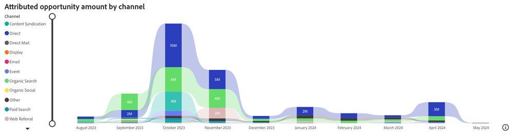
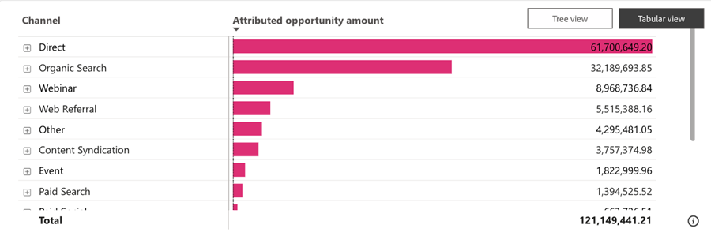
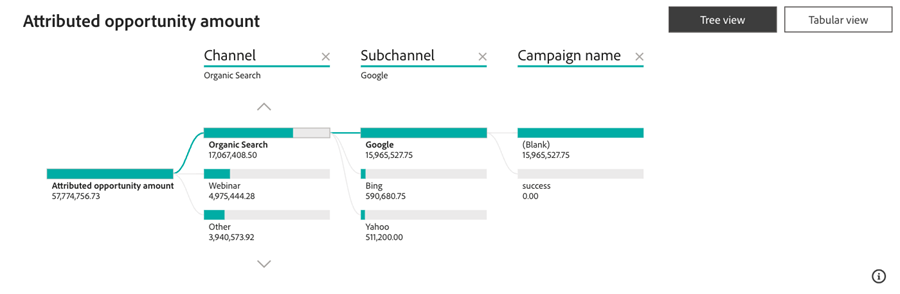

# 起因する商談ダッシュボード {#attributed-opportunity-dashboard}

「帰属付き商談」ダッシュボードでは、マーケティング活動が、新規および成熟したパイプライン機会の両方にどのように貢献しているかを包括的に把握できます。 戦略に起因するあらゆるオープンおよびクローズしたオポチュニティの詳細を確認し、オポチュニティステージで柔軟にフィルタリングして、成約案件を超えたマーケティングの影響力全体を把握できます。

**ダッシュボードに質問**:

* 商談への貢献度が最も高いチャネル、サブチャネル、施策を選択してください。
* 割り当てられた商談の合計金額と、割り当てられたオープン商談とクローズ商談の数を教えてください。

## ダッシュボードコンポーネント {#dashboard-components}

### KPI タイル {#kpi-tiles}

* **属性付き商談金額**：選択したアトリビューションモデルに基づき、フィルタリングされた期間内に作成された顧客接点を含む、クローズ済み商談とオープン商談からの収益貢献度の合計。
* **属性付き商談**：顧客接点を持つクローズ済み商談とオープン済み商談の数。

### チャネル別の属性付き商談金額の推移チャート {#attributed-opportunity-amount-by-channel-over-time-chart}

月/四半期/年ごとに、チャネル別にセグメント化された合計帰属商談金額を表示する積み重ね棒グラフ。

* ドリルダウン機能とアップ機能を利用して、月、四半期、年ごとにデータを分類できます。
* バーセグメントまたはバー間のスペースにカーソルを合わせると、詳細な情報が表示されます。

**グラフの回答に関する質問**:

* 四半期ごとに最も貢献度の高い商談額を生み出したチャネルは？
* チャネル別の貢献度の内訳を教えてください。

### 帰属商談金額テーブル {#attributed-opportunity-amount-table}

チャネル、サブチャネル、およびキャンペーン別にセグメント化された、合計貢献度商談の金額（表形式とツリー形式の両方で表示）。 右上隅のボタンをクリックして、ビューを切り替えます。

**掲示板の回答**&#x200B;に対する質問：

* チャネル内の異なるサブチャネルごとに、帰属する機会量の分布はどのように異なりますか？
* 特定のサブチャネルの下で、最も貢献度の高い商談額をもたらしているキャンペーンは？

#### 表形式表示 {#tabular-view}

表形式のビューでは、商談に起因する金額の分布について、明確で整理されたインサイトを獲得できます。 オーディエンスは、データをチャネル、サブチャネル、キャンペーンに分類することで、パフォーマンスパターンをすばやく特定し、効果の高いマーケティング戦略を特定できます。

各チャネルの横にある&#x200B;**+** アイコンをクリックすると、サブチャネルとキャンペーンの内訳が表示されます。

#### ツリー表示 {#tree-view}

ツリービューでは、よりインタラクティブで詳細なデータ探索が可能であり、マーケターはマーケティング活動における傾向、異常値、卓越したパフォーマンスなどを特定することができます。

ブランチをクリックすると、その後の階層レイヤーをより深く掘り下げることができます。

### フィルターパネル

このダッシュボードには、次の設定とフィルターが用意されています。

* 日付（商談作成日に基づく）
* アトリビューションモデル
   * オープンな商談の場合、「フルパス」アトリビューションモデルと「カスタム」アトリビューションモデルは特定の時点でのビューを提供し、最終的なアトリビューション結果を表すものではありません。
* 商談ステージ（現在のステージに基づく）
* チャネル、サブチャネル
* キャンペーン
* セグメント
