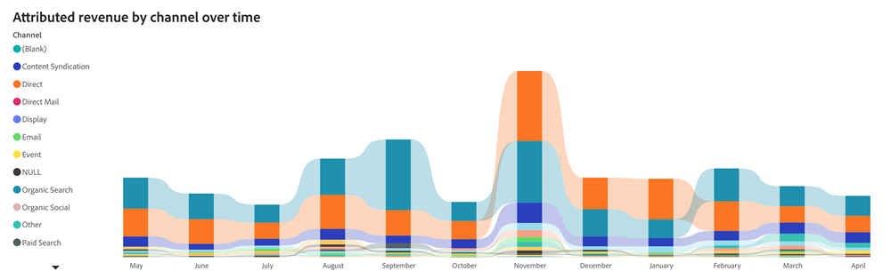
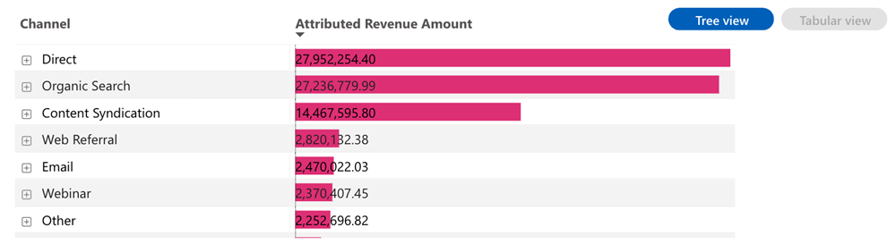
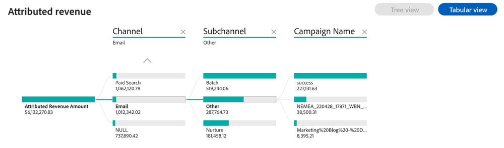

# 起因する収益ダッシュボード {#attributed-revenue-dashboard}

「売上への貢献度」ダッシュボードでは、マーケティング活動に直接関連する売上に焦点を当てることができます。 マーケティング戦略が契約締結にどのように役立ったのかをご確認ください。

>[!NOTE]
>
>このダッシュボードはBetaにあります。 移行フェーズでは、現在のダッシュボードと新しいダッシュボードの両方にアクセスできるようになります。 現在のダッシュボードは、完全に移行し、最適な機能を確保した後に非推奨になります。

**掲示板の回答**&#x200B;に対する質問：

* 売上への貢献度が最も高いチャネル、サブチャネル、キャンペーンは何か？
* 帰属する売上の合計金額と、帰属する成約件数の合計を教えてください。

## ダッシュボードコンポーネント {#dashboard-components}

### KPI タイル {#kpi-tiles}

* **属性収益**：選択した属性モデルに基づく、顧客接点を持つ商談からの総収益貢献度。
* **Attributed Deals**：顧客接点を持つ「成約した商談」の数。

### チャネル別のアトリビューション売上高の推移チャート {#attributed-revenue-by-channel-over-time-chart}

月/四半期/年ごとのチャネル別の総帰属収益を示す積み重ね棒グラフ。

* ドリルダウン機能とアップ機能を使用して、月、四半期、年ごとにデータを分類します。
* バーセグメントまたはバー間のスペースにカーソルを合わせると、詳細な情報が表示されます。

**グラフの回答に関する質問**:

* 四半期ごとに最も売上に貢献したチャネルは？
* チャネル別の売上の内訳を教えてください。

### 帰属収益表 {#attributed-revenue-table}

チャネル、サブチャネル、キャンペーンごとにセグメント化された総収益（表形式とツリー形式の両方で表示）。 右上隅のボタンをクリックして、ビューを切り替えます。

**掲示板の回答**&#x200B;に対する質問：

* チャネル内の様々なサブチャネルごとに、帰属する収益分布はどのように異なりますか？
* 特定のサブチャネルの下で、最も売上への貢献度が高い施策を特定しましょう。

**表形式表示**

* 表形式のビューでは、売上への貢献度に関する明確で整理されたインサイトを獲得できます。 オーディエンスは、データをチャネル、サブチャネル、キャンペーンに分類することで、パフォーマンスパターンをすばやく特定し、効果の高いマーケティング戦略を特定できます。
* 各チャネルの横にある「+」アイコンをクリックして、サブチャネルとキャンペーンの分類を表示します。

**ツリービュー**

* ツリービューでは、よりインタラクティブで詳細なデータ探索が可能であり、マーケターはマーケティング活動における傾向、異常値、卓越したパフォーマンスなどを特定することができます。
* 分岐をクリックして、後続の階層レイヤーをより深く掘り下げます。

## フィルターパネル {#filter-pane}

このダッシュボードには、次の設定とフィルターが用意されています。

* 日付（クローズ日に基づく）
* アトリビューションモデル
* チャネル、サブチャネル
* キャンペーン
* セグメント

>[!MORELIKETHIS]
>
>* [Discover ダッシュボードの基本](/help/marketo-measure-discover-ui/dashboards/discover-dashboard-basics.md){target="_blank"}
>* [ ダッシュボードデータの可視化ポリシー](/help/marketo-measure-discover-ui/dashboards/dashboard-data-visibility-policy.md){target="_blank"}

