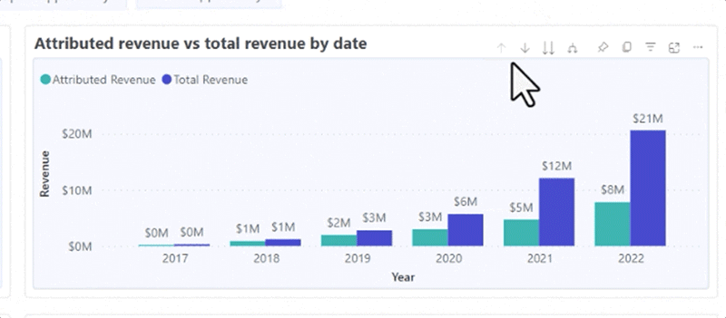

# Discover ダッシュボードの基本 {#discover-dashboard-basics}

この記事では、再設計されたインターフェイスの基本的な機能を説明し、データに容易にアクセスし、解釈できるようにします。 フィルタ・ペインの動的な詳細を調べ、ドリル機能、クロス・フィルタ、ツールチップなど、強化されたレポート機能の複雑さを明らかにします。

## フィルターウィンドウ {#filter-pane}

各ダッシュボードには様々なフィルターがあり、シームレスなナビゲーションとカスタマイズのための次のコントロールが付属しています。

<table style="table-layout:auto"> 
 <tbody> 
  <tr> 
   <th>名前</th> 
   <th>アイコン</th>
   <th>説明</th>
  </tr> 
  <tr> 
   <td>ハンバーガーボタン</td> 
   <td></td>
   <td>フィルターパネルを開くか閉じるかを切り替えます。</td>
  </tr>
  <tr> 
   <td>リセット</td> 
   <td></td>
   <td>フィルターをデフォルト設定に戻します。</td>
  </tr>
   <tr> 
   <td>ビジュアルに対するフィルター</td> 
   <td></td>
   <td>ビジュアルの右上隅にマウスポインターを置き、ボタンをクリックすると、アクティブなフィルターが表示されます。</td>
  </tr>
 </tbody> 
</table>

## レポートの機能 {#report-capabilities}

### ドリルダウンして上へ {#drill-down-and-up}

* ビジュアルの上にマウスポインターを置くと、そのビジュアルに階層があるかどうかが識別されます。アクションバーにドリルコントロールオプションが表示されている場合は、それが示されます。

* 灰色の背景でハイライト表示された下向き矢印を 1 つクリックして、ドリルダウンを有効にします。 元に戻すには、ドリルアップアイコンを使用します。

一度に 1 つのフィールドをドリルダウンするには、ドリルダウンアイコンをオンにして、バーなどのビジュアル要素を選択します。

二重矢印のドリルダウンアイコンを使用して、次の階層レベルに進みます。

分岐のようなアイコンを使用して、現在のビューに階層レベルを追加します。

### ドリルスルー {#drill-through}

* ビジュアルの背後にあるデータを参照するには、ビジュアル要素を右クリックし、「ドリルスルー」オプションを選択します。

* 基になるデータをエクスポートするには、ドリルスルーページの右上隅にマウスポインターを置き、「その他のオプション」ボタンをクリックして、「データをエクスポート」を選択します。

* 特定のビジュアルまたはタイルにズームインするには、右上隅の上にマウスポインターを置いて、「フォーカス」ボタンを選択します。

### クロスフィルター {#cross-filtering}

デフォルトでは、あるビジュアライゼーションで値または軸のラベルを選択すると、レポートページ上の他のビジュアルをクロスフィルターし、関連するフィルターされたデータのみが表示されるようになります。

### ツールチップ {#tooltips}

ツールチップには、表示されたデータに関する補足的な詳細が表示されます。 ビジュアル要素の上にマウスポインターを置くと、コンテキストツールチップがポップアップ表示され、その特定のデータポイントに関連するインサイトや説明が表示されます。

